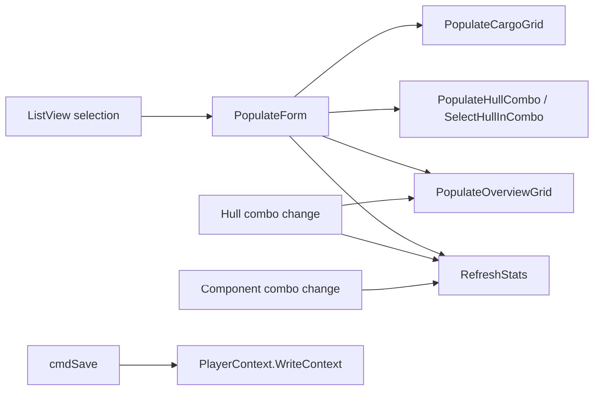

# Design Document: Ship Form Overhaul

## Overview

This design covers the overhaul of `FormShipInstance` to align its layout, controls, and interaction patterns with `FormShipTemplate`. The changes are confined to two files — `FormShipInstance.Designer.cs` (control declarations and layout) and `FormShipInstance.cs` (code-behind logic). No new classes, models, or services are introduced; the work reuses existing controls (`FilteredTextComboSet`, `DataGridViewFilteredComboBoxColumn`) and patterns (parallel UUID list, `SlotInfo` tag) already proven in `FormShipTemplate`.

The overhaul addresses five areas:
1. Relocate buttons from the search panel to the detail panel
2. Add a hull `FilteredTextComboSet` with parallel UUID resolution
3. Change `cmdNew` to create a blank ship (manual hull selection) instead of routing through the template picker
4. Replace the read-only text component column with `DataGridViewFilteredComboBoxColumn` for inline filtered selection
5. Add a `colSlotIndex` column and remove the `cmdSwapComponent` button

## Architecture

No architectural changes. The form remains an MDI child using the left-list / right-detail pattern with `FlowLayoutPanel`-based responsive layout. The data flow stays the same:



The key architectural pattern being adopted from `FormShipTemplate` is the **parallel UUID list** pattern: display names are shown in combo controls, while a parallel `List<string>` of UUIDs (stored either as a class field `_hullUUIDs` or per-row via `SlotInfo.UUIDByIndex` on the row Tag) maps the selected index back to the actual blueprint UUID.

## Components and Interfaces

### Designer.cs Changes

#### Controls to Add

| Control | Type | Parent | Purpose |
|---------|------|--------|---------|
| `flpHull` | `FlowLayoutPanel` | `flpDetail` | Row container for hull label + combo |
| `lblHull` | `Label` | `flpHull` | "Hull:" label |
| `cmbHull` | `FilteredTextComboSet` | `flpHull` | Hull blueprint picker with inline filtering |
| `colSlotIndex` | `DataGridViewTextBoxColumn` | `dgvComponents` | Slot index column (read-only, between SlotType and Component) |
| `colComponent` | `DataGridViewFilteredComboBoxColumn` | `dgvComponents` | Replaces `colComponentName` — inline filtered combo for component selection |

#### Controls to Remove

| Control | Reason |
|---------|--------|
| `colComponentName` | Replaced by `colComponent` (`DataGridViewFilteredComboBoxColumn`) |
| `cmdSwapComponent` | Component selection now happens inline via the filtered combo column |
| `cmdSave` (standalone between location and tab) | Moves into `flpCommands` |

#### Controls to Relocate

| Control | From | To | Notes |
|---------|------|----|-------|
| `flpCommands` | `flpSearchList` (child #3) | `flpDetail` (last child, after `tabControl`) | Matches template form button placement |
| `cmdSave` | Standalone in `flpDetail` between `flpLocation` and `tabControl` | Inside `flpCommands` (second button) | Joins New, Delete, From Template |

#### flpDetail Child Order (After)

```
flpDetail.Controls:
  1. flpName        (Name: [...])
  2. flpHull        (Hull: [FilteredTextComboSet])   ← NEW
  3. flpLocation    (Location: [type] [uuid])
  4. tabControl     (Overview | Cargo)
  5. flpCommands    (New | Save | Delete | From Template)  ← MOVED from flpSearchList
```

#### flpSearchList Child Order (After)

```
flpSearchList.Controls:
  1. flpFilter      (Filter: [...])
  2. lvwShips       (ship list)
```

No `flpCommands` — it moves to `flpDetail`.

#### flpCommands Button Order

```
flpCommands.Controls:
  1. cmdNew
  2. cmdSave         ← moved into flpCommands
  3. cmdDelete
  4. cmdFromTemplate
```

#### dgvComponents Column Order (After)

```
dgvComponents.Columns:
  1. colSlotType     (DataGridViewTextBoxColumn, read-only, "Slot Type", width 120)
  2. colSlotIndex    (DataGridViewTextBoxColumn, read-only, "#", width 40)       ← NEW
  3. colComponent    (DataGridViewFilteredComboBoxColumn, "Component", width 300) ← REPLACES colComponentName
  4. colCondition    (DataGridViewTextBoxColumn, editable, "Condition", width 90)
  5. colMaxRepair    (DataGridViewTextBoxColumn, editable, "Max Repair %", width 90)
```

#### dgvComponents Property Changes

| Property | Old Value | New Value |
|----------|-----------|-----------|
| `SelectionMode` | `FullRowSelect` | `CellSelect` |
| `EditMode` | (default) | `EditOnEnter` |


### Code-Behind Changes (FormShipInstance.cs)

#### New Fields

| Field | Type | Purpose |
|-------|------|---------|
| `_hullUUIDs` | `List<string>` | Parallel UUID list for `cmbHull`, indexed in sync with the combo's display names |

#### New Methods

| Method | Signature | Purpose |
|--------|-----------|---------|
| `PopulateHullCombo` | `private void PopulateHullCombo()` | Queries all blueprints where `BluePrintType == "Hull"`, populates `cmbHull` display names and `_hullUUIDs`. Called from constructor and `OnCurrentPlayerChanged`. |
| `SelectHullInCombo` | `private void SelectHullInCombo(string hullUUID)` | Finds `hullUUID` in `_hullUUIDs`, sets `cmbHull` selection to the matching display name. Called from `PopulateForm`. |
| `cmbHull_SelectedItemChanged` | `private void cmbHull_SelectedItemChanged(object sender, EventArgs e)` | Reads `cmbHull.SelectedFullIndex`, resolves UUID from `_hullUUIDs`, sets `_selectedShip.HullBlueprintUUID`, clears components, calls `PopulateOverviewGrid` + `RefreshStats`. |
| `GetSlotDefinitions` | `private List<SlotDefinition> GetSlotDefinitions(Blueprint hullBp)` | Copied from `FormShipTemplate`. Reads hull properties via `SlotTypes.HullPropertyToSlotType`, builds list of `SlotDefinition` (SlotType, MaxCount, BlueprintTypes). |
| `dgvComponents_CurrentCellDirtyStateChanged` | `private void dgvComponents_CurrentCellDirtyStateChanged(object sender, EventArgs e)` | Commits edit immediately when dirty, matching template form pattern. |
| `dgvComponents_CellValueChanged` | `private void dgvComponents_CellValueChanged(object sender, DataGridViewCellEventArgs e)` | Handles component combo selection: resolves UUID from `SlotInfo.UUIDByIndex`, updates or removes the component slot, calls `RefreshStats`. |
| `dgvComponents_DataError` | `private void dgvComponents_DataError(object sender, DataGridViewDataErrorEventArgs e)` | Logs error, sets `ThrowException = false`. |
| `dgvComponents_CellClick` | `private void dgvComponents_CellClick(object sender, DataGridViewCellEventArgs e)` | Begins edit when component column is clicked. |

#### Modified Methods

| Method | Changes |
|--------|---------|
| `FormShipInstance()` (constructor) | Add: `cmbHull.SelectedItemChanged` subscription, `dgvComponents.CellValueChanged` / `CurrentCellDirtyStateChanged` / `DataError` / `CellClick` subscriptions, `PopulateHullCombo()` call. Remove: `cmdSwapComponent.Click` subscription. Add `cmdSave` to `flpCommands` wiring. |
| `PopulateForm` | Add: `SelectHullInCombo(_selectedShip.HullBlueprintUUID)` call. |
| `ClearForm` | Add: `cmbHull.SetItems(cmbHull.Items, null)` to clear hull selection. |
| `SetDetailEnabled` | Add: `cmbHull.Enabled = enabled`. |
| `PopulateOverviewGrid` | Complete rewrite. Uses `GetSlotDefinitions` to enumerate hull slots. For each slot, creates a row with `SlotInfo` tag containing `UUIDByIndex`. Sets `DataGridViewFilteredComboBoxCell.Items` per-cell with eligible blueprints. Hull row uses read-only component cell. Populates `colSlotIndex` with slot index (empty for hull row). |
| `dgvComponents_CellEndEdit` | Retained for Condition/MaxRepair edits. Component column edits now handled by `dgvComponents_CellValueChanged`. |
| `cmdNew_Click` | Rewritten: creates a blank `Ship` with `Name = "New Ship"`, generated UUID, current player owner. No longer routes through `cmdFromTemplate_Click`. |
| `OnCurrentPlayerChanged` | Add: `PopulateHullCombo()` call. |
| `flpSearchList_Layout` | Remove `flpCommands.Height` from height calculation (commands no longer in search panel). |
| `flpDetail_Layout` | Add `flpHull.Height` and `flpCommands.Height` to height calculation for `tabControl` sizing. Remove standalone `cmdSave.Height`. |

#### Removed Methods

| Method | Reason |
|--------|--------|
| `cmdSwapComponent_Click` | Component selection now inline via filtered combo column |

#### New Inner Classes

| Class | Fields | Purpose |
|-------|--------|---------|
| `SlotInfo` | `string SlotType`, `int SlotIndex`, `List<string> UUIDByIndex` | Per-row tag on `dgvComponents` rows, stores parallel UUID list for component resolution. Copied from `FormShipTemplate`. |
| `SlotDefinition` | `string SlotType`, `int MaxCount`, `List<string> BlueprintTypes` | Describes available slots from hull properties. Copied from `FormShipTemplate`. |

### Hull Combo Integration

The hull combo follows the exact pattern from `FormShipTemplate`:

1. `PopulateHullCombo()` queries `playerContext.GetAllBlueprints()` filtered to `BluePrintType == "Hull"`, sorted by `ExtendedName`.
2. Display names go into `cmbHull` via `SetItems()`. UUIDs go into `_hullUUIDs` at matching indices.
3. `SelectHullInCombo(uuid)` finds the index in `_hullUUIDs` and sets the combo selection.
4. `cmbHull_SelectedItemChanged` reads `cmbHull.SelectedFullIndex`, looks up `_hullUUIDs[idx]`, and writes to `_selectedShip.HullBlueprintUUID`.
5. On hull change: clears `_selectedShip.Components`, calls `PopulateOverviewGrid()` + `RefreshStats()`.

### Component Grid Upgrade

The component grid upgrade replaces the read-only text column with `DataGridViewFilteredComboBoxColumn` and adds the slot index column:

1. `PopulateOverviewGrid()` reads the hull blueprint, calls `GetSlotDefinitions()` to get slot types and counts.
2. For each slot definition and index, it creates a row. The `colComponent` cell (`DataGridViewFilteredComboBoxCell`) gets a per-cell item list of eligible blueprints (filtered by slot type and hull class), plus `"(empty)"` as the first entry.
3. Each row's `Tag` is a `SlotInfo` with `UUIDByIndex` — a parallel list mapping combo index to blueprint UUID (index 0 = `""` for empty).
4. The hull row is first, with component cell set to the hull's `ExtendedName` and marked read-only.
5. `dgvComponents_CellValueChanged` handles combo selection: reads the selected display name, finds its index in `SlotInfo.UUIDByIndex`, and updates or removes the component slot. New slots default to `CurrentHP = 100` and `MaxRepairPercent = 100`. The grid cells are updated to reflect these defaults.
6. `dgvComponents_CellEndEdit` continues to handle Condition and MaxRepair edits for all rows.

### Layout Changes

The `flpDetail_Layout` handler changes to account for the new hull row and relocated command panel:

```csharp
private void flpDetail_Layout(object sender, LayoutEventArgs e)
{
    int w2 = flpDetail.ClientSize.Width;
    int h = flpDetail.ClientSize.Height;
    int tabHeight = h - flpName.Height - flpHull.Height - flpLocation.Height - flpCommands.Height - 30;
    if (tabHeight < 100) tabHeight = 100;
    tabControl.Size = new System.Drawing.Size(w2 - 6, tabHeight);
}
```

The `flpSearchList_Layout` handler simplifies since commands are no longer there:

```csharp
private void flpSearchList_Layout(object sender, LayoutEventArgs e)
{
    int w2 = flpSearchList.ClientSize.Width;
    int h = flpSearchList.ClientSize.Height;
    int listHeight = h - flpFilter.Height - 12;
    if (listHeight < 50) listHeight = 50;
    lvwShips.Size = new System.Drawing.Size(w2 - 6, listHeight);
}
```

## Data Models

No data model changes. The existing `Ship` model already has all required fields:

- `HullBlueprintUUID` — hull selection (used by new hull combo)
- `Components` (`List<ShipComponentSlot>`) — component slots (used by upgraded grid)
- `HullCurrentHP`, `HullMaxRepairPercent` — hull condition (used by Condition/MaxRepair columns)

Each `ShipComponentSlot` already has:
- `SlotType`, `SlotIndex`, `BlueprintUUID` — slot identity and component reference
- `CurrentHP`, `MaxRepairPercent` — condition tracking

The `SlotInfo` and `SlotDefinition` inner classes are UI-only helpers (not persisted), copied from `FormShipTemplate`.

