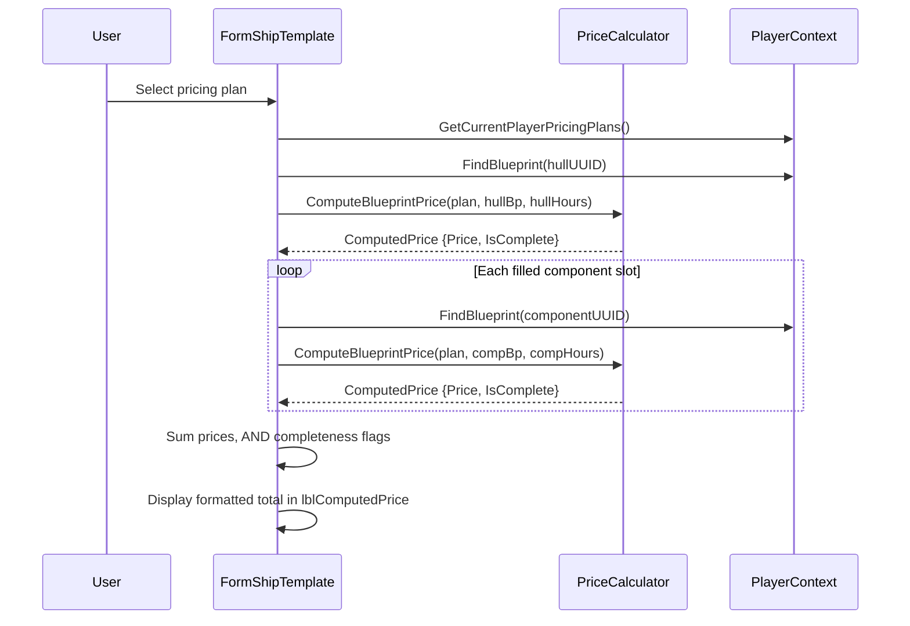

# Design Document: Ship Template Pricing

## Overview

This feature adds a pricing plan selector and aggregate cost display to the Ship Template form (`FormShipTemplate`). It mirrors the existing pricing integration on `FormBlueprintV2`, extending it to compute the total cost of an entire ship design by summing individual blueprint prices across the hull and all filled component slots.

The implementation follows the established pattern:
- A `FlowLayoutPanel` (flpPricing) containing a label, `FilteredTextComboSet` dropdown, and price label
- A parallel UUID list for plan lookups
- Delegation to `PriceCalculator.ComputeBlueprintPrice` for each blueprint
- Event-driven recalculation on plan change, hull change, slot change, and external data changes

## Architecture

The feature integrates into the existing layered architecture:

```
PlayerContext (PricingDataChanged event)
    ↓
FormShipTemplate (UI layer)
    ├── PopulatePricingPlanCombo() → FilteredTextComboSet + parallel UUID list
    ├── UpdateTemplatePrice() → iterates hull + components
    │       ↓
    │   PriceCalculator.ComputeBlueprintPrice(plan, blueprint, mfgHours)
    │       ↓
    │   ComputedPrice { Price, IsComplete }
    └── Display formatted result in lblComputedPrice
```

No new services are needed. The form directly uses:
- `PriceCalculator.ComputeBlueprintPrice` (static, stateless)
- `EvolutionChainService.ParseTimeToSeconds` (static, stateless)
- `PlayerContext.GetCurrentPlayerPricingPlans()` (data access)
- `PlayerContext.FindBlueprint(uuid)` (data access)

## Components and Interfaces

### Modified Files

| File | Change |
|------|--------|
| `Forms/ShipTemplate/FormShipTemplate.Designer.cs` | Add flpPricing panel with lblPricingPlan, cmbPricingPlan, lblComputedPrice |
| `Forms/ShipTemplate/FormShipTemplate.cs` | Add pricing methods, event subscriptions, recalculation triggers |

### New UI Controls (in Designer.cs)

| Control | Type | Purpose |
|---------|------|---------|
| `flpPricing` | FlowLayoutPanel | Container row, LeftToRight, AutoSize=true |
| `lblPricingPlan` | Label | "Pricing Plan:" caption |
| `cmbPricingPlan` | FilteredTextComboSet | Plan selector dropdown |
| `lblComputedPrice` | Label | Displays computed aggregate price |

### New Fields (in FormShipTemplate.cs)

| Field | Type | Purpose |
|-------|------|---------|
| `_pricingPlanUUIDs` | `List<string>` | Parallel UUID list indexed to match cmbPricingPlan items |

### New Methods (in FormShipTemplate.cs)

| Method | Responsibility |
|--------|---------------|
| `PopulatePricingPlanCombo()` | Loads current player's plans into dropdown with "(none)" default |
| `UpdateTemplatePrice()` | Computes aggregate price and updates lblComputedPrice |
| `RefreshPricing()` | Calls PopulatePricingPlanCombo + UpdateTemplatePrice (for external events) |
| `CmbPricingPlan_SelectedItemChanged(sender, e)` | Handler for plan selection change |
| `OnPricingDataChanged(sender, e)` | Handler for PlayerContext.PricingDataChanged |


### Method Specifications

#### PopulatePricingPlanCombo()

```csharp
private void PopulatePricingPlanCombo()
{
    // PERF timed
    // ProgrammaticUpdateGuard
    // 1. Capture current selection name
    // 2. Get plans via playerContext.GetCurrentPlayerPricingPlans()
    // 3. Sort via CollectionSortHelper.OrderPricingPlans()
    // 4. Build name list: ["(none)", plan1.Name, plan2.Name, ...]
    // 5. Build UUID list: ["", plan1.UUID, plan2.UUID, ...]
    // 6. cmbPricingPlan.SetItems(names, previousSelection ?? "(none)")
}
```

#### UpdateTemplatePrice()

```csharp
private void UpdateTemplatePrice()
{
    // PERF timed
    // 1. If no template loaded or no hull selected → clear label, return
    // 2. Get selected plan UUID from _pricingPlanUUIDs[cmbPricingPlan.SelectedFullIndex]
    // 3. If plan UUID is empty (i.e. "(none)") → clear label, return
    // 4. Find PricingPlan from PlayerContext.PricingPlanList
    // 5. If plan not found → clear label, return
    // 6. Resolve hull blueprint via playerContext.FindBlueprint(hullUUID)
    // 7. If hull not found → clear label, return
    // 8. Initialize aggregatePrice = 0m, isComplete = true
    // 9. Compute hull price:
    //    a. Parse ManufactureRunTime → seconds → hours (default 0 if missing)
    //    b. Call PriceCalculator.ComputeBlueprintPrice(plan, hullBp, mfgHours)
    //    c. Add result.Price to aggregate; AND isComplete with result.IsComplete
    // 10. For each filled component slot in _viewModel.Components:
    //    a. Resolve blueprint via playerContext.FindBlueprint(componentUUID)
    //    b. If not found → isComplete = false, continue (contributes 0)
    //    c. Parse ManufactureRunTime → seconds → hours (default 0 if missing)
    //    d. Call PriceCalculator.ComputeBlueprintPrice(plan, compBp, mfgHours)
    //    e. Add result.Price to aggregate; AND isComplete with result.IsComplete
    // 11. Format: aggregatePrice.ToString("N2")
    // 12. If !isComplete → append " *"
    // 13. Set lblComputedPrice.Text
}
```

### Event Wiring Changes

In the constructor, after existing event subscriptions:
```csharp
cmbPricingPlan.SelectedItemChanged += CmbPricingPlan_SelectedItemChanged;
playerContext.PricingDataChanged += OnPricingDataChanged;
```

In `OnFormClosed`:
```csharp
playerContext.PricingDataChanged -= OnPricingDataChanged;
```

### Recalculation Trigger Points

| Trigger | Action |
|---------|--------|
| `CmbPricingPlan_SelectedItemChanged` | Call `UpdateTemplatePrice()` |
| `CmbHull_SelectedItemChanged` (existing) | Add call to `UpdateTemplatePrice()` |
| `DgvSlots_CellValueChanged` (existing) | Add call to `UpdateTemplatePrice()` after `RefreshStats()` |
| `OnPricingDataChanged` | Call `RefreshPricing()` (repopulate + recompute) |
| `OnCurrentPlayerChanged` (existing) | Add `PopulatePricingPlanCombo()` call; price clears via `ClearForm()` |

### ClearForm() Changes

Add to existing `ClearForm()`:
```csharp
lblComputedPrice.Text = string.Empty;
```

Note: `cmbPricingPlan` selection is NOT cleared in `ClearForm()` — per Requirement 7.5, the pricing plan selection persists across New template creation.

### SetDetailEnabled() Changes

Add to existing `SetDetailEnabled(bool enabled)`:
```csharp
cmbPricingPlan.Enabled = enabled;
```

### FlpDetail_Layout() Changes

Update the grid height calculation to account for the new flpPricing row:
```csharp
int gridHeight = h - flpName.Height - flpHull.Height - flpPricing.Height - cmdSave.Height - statsHeight - 36;
```


## Data Models

No new data models are required. The feature uses existing models:

| Model | Role |
|-------|------|
| `PricingPlan` | Contains ResourcePrices, FixedCostPerItem, HourlyCostRate |
| `ReadOnlyBlueprint` | Blueprint with Resources dictionary and Properties (ManufactureRunTime) |
| `ComputedPrice` | Result of PriceCalculator: `{ Price: decimal, IsComplete: bool }` |
| `ShipComponentSlot` | Component slot in template: `{ SlotType, SlotIndex, BlueprintUUID }` |

### Price Computation Flow



## Correctness Properties

*A property is a characteristic or behavior that should hold true across all valid executions of a system — essentially, a formal statement about what the system should do. Properties serve as the bridge between human-readable specifications and machine-verifiable correctness guarantees.*

### Property 1: Template price equals sum of individual blueprint prices

*For any* ship template with a valid pricing plan, hull blueprint, and zero or more filled component slots, the computed Template_Price SHALL equal the sum of `PriceCalculator.ComputeBlueprintPrice(plan, bp, ParseTimeToSeconds(bp.ManufactureRunTime) / 3600)` called individually for the hull and each resolvable component blueprint.

**Validates: Requirements 2.1, 2.2, 2.3, 2.5**

### Property 2: Incomplete flag propagation

*For any* ship template where at least one individual blueprint price computation returns `IsComplete = false`, the aggregate Template_Price SHALL have `IsComplete = false`. Conversely, if all individual computations return `IsComplete = true`, the aggregate SHALL have `IsComplete = true`.

**Validates: Requirements 2.6**

### Property 3: Pricing plan dropdown ordering

*For any* set of pricing plans owned by the current player, the pricing plan dropdown SHALL contain "(none)" as the first item, followed by all plan names sorted alphabetically (ordinal, case-insensitive), with a parallel UUID list where index 0 is empty string and subsequent indices match the corresponding plan's UUID.

**Validates: Requirements 1.2**

### Property 4: Price display formatting

*For any* computed Template_Price with `Price >= 0` and a boolean `IsComplete` flag, the displayed label text SHALL equal `Price.ToString("N2")` when `IsComplete` is true, and `Price.ToString("N2") + " *"` when `IsComplete` is false.

**Validates: Requirements 3.1, 3.2**


## Error Handling

| Scenario | Handling |
|----------|----------|
| Hull blueprint not found (deleted) | Clear price label, log warning |
| Component blueprint not found (deleted) | Contribute 0 to price, set IsComplete=false, continue |
| Pricing plan not found (deleted between selection and computation) | Clear price label |
| ManufactureRunTime property missing | Default to 0 hours (no time cost contribution) |
| ManufactureRunTime unparseable | ParseTimeToSeconds returns 0, so 0 hours |
| PricingDataChanged fires after form disposed | IsDisposed check at handler entry |
| PricingDataChanged fires on background thread | InvokeRequired + BeginInvoke pattern |
| No pricing plans for current player | Dropdown shows only "(none)", price label empty |
| Selected plan deleted externally | PopulatePricingPlanCombo restores to "(none)" if previous selection not found |

## Testing Strategy

### Property-Based Tests (NUnit + FsCheck)

The project uses FsCheck with NUnit for property-based testing. Each property test runs a minimum of 100 iterations.

| Test | Property | Library |
|------|----------|---------|
| `TemplatePriceAggregation_EqualsSum` | Property 1 | FsCheck |
| `IncompleteFlagPropagation_AnyIncomplete_AggregateIncomplete` | Property 2 | FsCheck |
| `PricingPlanDropdownOrdering_AlwaysSorted` | Property 3 | FsCheck |
| `PriceDisplayFormatting_MatchesN2WithIndicator` | Property 4 | FsCheck |

**Tag format:** `Feature: ship-template-pricing, Property N: <property text>`

**Generator strategy:**
- Generate random `PricingPlan` with random ResourcePrices, FixedCostPerItem, HourlyCostRate
- Generate random `ReadOnlyBlueprint` instances with random Resources dictionaries and ManufactureRunTime properties (including missing/empty)
- Generate random template configurations: 1 hull + 0-8 component slots (some filled, some empty, some with unresolvable UUIDs)

### Unit Tests (Example-Based)

| Test | Validates |
|------|-----------|
| `UpdateTemplatePrice_NoHull_ClearsLabel` | Req 3.3 |
| `UpdateTemplatePrice_NoPlan_ClearsLabel` | Req 3.4 |
| `UpdateTemplatePrice_HullOnly_ShowsHullPrice` | Req 7.4 |
| `UpdateTemplatePrice_UnresolvableComponent_FlagsIncomplete` | Req 7.3 |
| `ClearForm_PreservesPricingPlanSelection` | Req 7.5 |
| `OnPricingDataChanged_PlanDeleted_RevertsToNone` | Req 7.2 |
| `SetDetailEnabled_False_DisablesPricingCombo` | Req 1.6 |

### Integration Points

The feature integrates with existing audit checks:
- **control-wiring.js**: Verifies PricingDataChanged subscription/unsubscription
- **mockup-controls.js**: Verifies flpPricing, cmbPricingPlan, lblPricingPlan, lblComputedPrice exist
- **perf-check.js**: Verifies PopulatePricingPlanCombo and UpdateTemplatePrice have PERF timing

### Design Decisions

1. **No new service class**: The computation is a simple loop calling the existing static `PriceCalculator.ComputeBlueprintPrice`. A dedicated service would add indirection without value. If future requirements add caching or batch pricing, a service can be extracted then.

2. **Pricing plan selection preserved on New**: Unlike other form fields that clear on New, the pricing plan persists so users can immediately see cost estimates as they build a new template. This matches the user's mental model of "I'm evaluating designs under this pricing plan."

3. **Per-blueprint FixedCostPerItem**: The pricing plan's FixedCostPerItem is applied per blueprint (hull + each component), not once for the whole template. This matches the game's manufacturing model where each blueprint is manufactured separately.

4. **Parallel UUID list pattern**: Reuses the same pattern as FormBlueprintV2 rather than introducing a new approach. The FilteredTextComboSet's `SelectedFullIndex` maps directly to the UUID list index.
