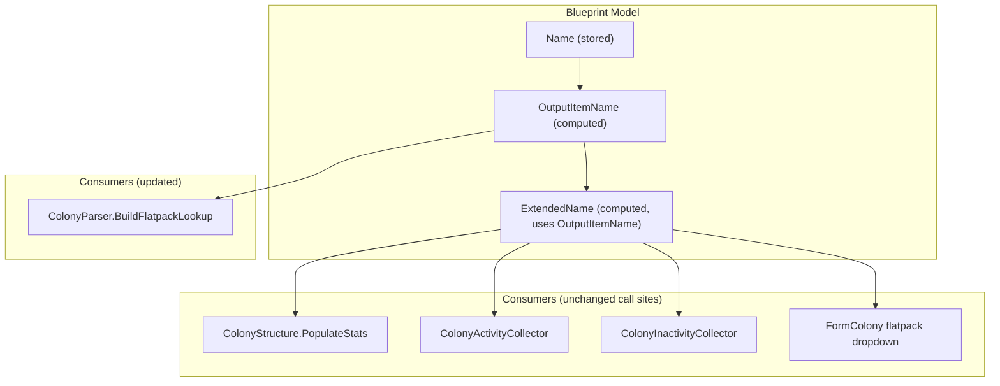

# Design Document: Structure Name Normalization

## Overview

Blueprint names imported from the game market carry a " Flatpack" suffix (e.g. "Mining Rig Flatpack") because that is how they appear as purchasable items. Once built on a colony, the game refers to structures by their base name ("Mining Rig"). Currently the app stores the full market name and displays it everywhere, creating a mismatch with the game UI.

This design introduces one new computed property and modifies one existing property on `Blueprint`:

- `OutputItemName` — returns the base structure name by stripping the " Flatpack" suffix for flatpack blueprints, or `Name` unchanged for non-flatpack blueprints. Follows the existing `OutputItemType` naming convention on `BlueprintType`.
- `ExtendedName` (modified) — now uses `OutputItemName` instead of `Name` when formatting the display string (class, evolution, name, tech level, nickname).

`OutputItemName` is a `[JsonIgnore]` computed property in this phase, with a clear upgrade path to serialized `[JsonProperty]` in the future. By changing `ExtendedName` to use `OutputItemName`, all existing consumers automatically get the correct structure name with zero code changes at the call sites. The only code changes are adding the new `OutputItemName` property and updating the `ExtendedName` getter.

## Architecture

The change is localized to the `Blueprint` model class and its consumers. No new classes, services, or persistence changes are needed.



The data flow is one-directional: `Name` → `OutputItemName` → `ExtendedName`. No stored data is modified. Since `ExtendedName` now uses `OutputItemName`, all existing consumers of `ExtendedName` (colony structure UI, activity collectors, inactivity collectors, delivery plans, blueprint forms) automatically get the normalized name. Non-flatpack blueprints are unaffected because `OutputItemName` returns `Name` unchanged for them.

### Design Decisions

1. **Computed vs. serialized**: `OutputItemName` is `[JsonIgnore]` now because it's purely derived from `Name`. This avoids data migration. The future upgrade to `[JsonProperty]` with a default-to-Name fallback requires zero consumer changes — only the attribute and a backing field change on `Blueprint`.

2. **Case-insensitive suffix check**: The " Flatpack" suffix comparison uses `StringComparison.OrdinalIgnoreCase` to handle any casing variations in imported data, matching the existing `BuildFlatpackLookup` behavior.

3. **ExtendedName uses OutputItemName directly**: Rather than creating a separate `OutputExtendedName` property, `ExtendedName` itself is updated to use `OutputItemName`. After reviewing all production code usages of `ExtendedName`, there is no consumer that needs the " Flatpack" suffix in the extended display name. Even `ColonyStatusCalculator` (which creates flatpack warehouse items) should use the stripped name because the game shows flatpacks in the warehouse without "Flatpack" in the name. Only the blueprint market listing uses the full name, and that uses `Name` directly, not `ExtendedName`. This eliminates the need for any consumer-site code changes.

4. **FormColony dropdown uses ExtendedName**: The dropdown currently binds to `Name` directly. Since all flatpacks are currently ev0, universal (no class), and have no tech level, `ExtendedName` produces the same output as `OutputItemName` for flatpacks. Using `ExtendedName` means no consumer-site code change is needed for the dropdown, and it's future-proof if flatpacks ever gain class/evolution/tech attributes.

## Components and Interfaces

### Blueprint.OutputItemName

```csharp
[JsonIgnore]
public string OutputItemName
{
    get
    {
        if (string.IsNullOrEmpty(Name))
            return string.Empty;

        if (!string.IsNullOrEmpty(BluePrintType) &&
            BluePrintType.IsFlatpack() &&
            Name.EndsWith(" Flatpack", StringComparison.OrdinalIgnoreCase))
        {
            return Name.Substring(0, Name.Length - " Flatpack".Length);
        }

        return Name;
    }
}
```

Key behaviors:
- Returns empty string for null/empty `Name`
- Only strips suffix when `BluePrintType.IsFlatpack()` is true AND `Name` ends with " Flatpack"
- Non-flatpack blueprints return `Name` unchanged
- Flatpack blueprints whose name doesn't end with " Flatpack" return `Name` unchanged

### Blueprint.ExtendedName (modified)

```csharp
[JsonIgnore]
public override string ExtendedName
{
    get
    {
        if (UUID == null)
            return string.Empty;

        string extendedName = "";
        if (Class > 0)
            extendedName += $"C{Class} ";
        if (Evolution > 0)
            extendedName += "Ev(" + Evolution + ") ";
        extendedName += OutputItemName + " ";
        if (TechLevel != null)
            extendedName += "(" + TechLevel + ") ";
        if (!string.IsNullOrEmpty(NickName))
            extendedName += "[" + NickName + "] ";
        return extendedName.Trim();
    }
}
```

The only change from the current implementation is replacing `Name` with `OutputItemName` on the name line. All existing consumers of `ExtendedName` automatically get the normalized structure name.

### Consumer Changes

| Consumer | Current | After |
|---|---|---|
| `Blueprint.ExtendedName` | uses `Name` | uses `OutputItemName` (the only code change in Blueprint) |
| `ColonyParser.BuildFlatpackLookup` | inline suffix stripping | `bp.OutputItemName` |

### Unchanged Consumer Call Sites

These continue using `ExtendedName` as before — no code changes needed since `ExtendedName` now uses `OutputItemName`:
- `ColonyStructure.PopulateStats` — uses `ExtendedName`, automatically gets structure name
- `ColonyActivityCollector.CollectStructureActivities` — uses `ExtendedName`, automatically gets structure name
- `ColonyInactivityCollector.BuildSourceName` / `CollectIdleStructures` — uses `ExtendedName`, automatically gets structure name
- `FormColony.UpdateFlatpackListBase` — flatpack dropdown uses `ExtendedName`, automatically gets structure name (all flatpacks are ev0, universal, no tech level so `ExtendedName` == `OutputItemName`)
- `FormColonyDailyBuild` — shows staged flatpack names in build order context
- `DeliveryPlanViewModel` — shows blueprint names in delivery context
- `Item.ExtendedName` (base class) — generic item display (not overridden for non-Blueprint items)
- Warehouse grids, blueprint forms

## Data Models

### Blueprint (modified)

```
Blueprint : Item
├── Name: string              (stored, unchanged — market name with " Flatpack" suffix)
├── BluePrintType: string     (stored, unchanged — e.g. "Flatpacks/MiningRig")
├── OutputItemName: string    [JsonIgnore] (NEW — computed from Name, strips " Flatpack" for flatpacks)
├── ExtendedName: string      [JsonIgnore] (MODIFIED — now uses OutputItemName instead of Name)
├── Class: int
├── Evolution: int
├── TechLevel: string
├── NickName: string
└── ... (other fields unchanged)
```

### Serialization Impact

- `OutputItemName` is `[JsonIgnore]` — it does not appear in JSON output
- `ExtendedName` is `[JsonIgnore]` (unchanged) — it does not appear in JSON output
- `Name` is unchanged in serialized form — no data migration needed
- `DefaultValueHandling.Ignore` in `JsonSettings` is irrelevant since these properties are not serialized
- Round-trip: `serialize(deserialize(json))` produces identical JSON — no new fields leak

### Future Upgrade Path

To make `OutputItemName` a serialized property:
1. Change `[JsonIgnore]` to `[JsonProperty]`
2. Add a backing field with a setter that stores the explicit value
3. Getter falls back to computed value when backing field is null/empty
4. Existing JSON files without the field will deserialize with null backing field → computed behavior preserved
5. No consumer changes needed


## Correctness Properties

*A property is a characteristic or behavior that should hold true across all valid executions of a system — essentially, a formal statement about what the system should do. Properties serve as the bridge between human-readable specifications and machine-verifiable correctness guarantees.*

### Property 1: Suffix stripping round-trip

*For any* Blueprint with a flatpack `BluePrintType` (starts with "Flatpacks/") whose `Name` ends with " Flatpack" (case-insensitive), `OutputItemName` concatenated with the original suffix from `Name` shall equal the original `Name`. For non-flatpack blueprints or flatpack blueprints whose name does not end with " Flatpack", `OutputItemName` shall equal `Name`. For null/empty `Name`, `OutputItemName` shall return empty string.

**Validates: Requirements 1.1, 1.2, 1.3, 1.4, 5.3**

### Property 2: ExtendedName uses OutputItemName

*For any* Blueprint with a non-null UUID and a flatpack `BluePrintType` whose `Name` ends with " Flatpack", `ExtendedName` shall contain `OutputItemName` (the stripped name) and shall not contain the original `Name` with the " Flatpack" suffix. For non-flatpack blueprints, `ExtendedName` shall contain `Name` (since `OutputItemName` equals `Name`).

**Validates: Requirements 2.1**

### Property 3: BuildFlatpackLookup behavioral equivalence

*For any* set of flatpack Blueprints in an EmpireContext, the dictionary produced by the refactored `BuildFlatpackLookup` (using `OutputItemName`) shall contain the same key-value pairs as the current implementation (using inline suffix stripping).

**Validates: Requirements 4.1, 4.2, 4.3**

### Property 4: Serialization round-trip preserves Name

*For any* Blueprint, serializing to JSON and deserializing back shall produce a Blueprint with the same `Name` value. The serialized JSON string shall not contain the key "OutputItemName".

**Validates: Requirements 1.5, 5.1, 5.2**

### Property 5: Read-only invariant

*For any* Blueprint, accessing `OutputItemName` and `ExtendedName` shall not modify `Name`, `BluePrintType`, `Class`, `Evolution`, `TechLevel`, `NickName`, or `UUID`.

**Validates: Requirements 5.1**

## Error Handling

The new property is a pure computed getter with no external dependencies, I/O, or exceptions:

- **Null/empty Name**: `OutputItemName` returns `string.Empty`. `ExtendedName` returns `string.Empty` when UUID is null, or includes the empty OutputItemName in the format string otherwise.
- **Null BluePrintType**: `IsFlatpack()` returns false for null/empty strings, so `OutputItemName` falls through to returning `Name` unchanged. No special handling needed.
- **Unexpected Name format**: If a flatpack blueprint's name doesn't end with " Flatpack" (e.g. data corruption or a new naming convention), `OutputItemName` returns `Name` unchanged. This is safe — the worst case is the UI shows the full name.

No new exception types, error codes, or logging are introduced.

## Testing Strategy

### Property-Based Tests (FsCheck)

The project already uses FsCheck 2.16.6 with FsCheck.NUnit. Each correctness property maps to a single `[FsCheck.NUnit.Property(MaxTest = 100)]` test method.

Test file: `OE2EmpireTracker.Tests/Models/BlueprintOutputNameTests.cs`

**Generators needed:**
- Random `Blueprint` with varied `Name` values (with/without " Flatpack" suffix, mixed casing, null, empty)
- Random `BluePrintType` values (flatpack types like "Flatpacks/MiningRig", non-flatpack types, null)
- Random `Class`, `Evolution`, `TechLevel`, `NickName`, `UUID` values

Each test must be tagged with a comment referencing the design property:
- `// Feature: structure-name-normalization, Property 1: Suffix stripping round-trip`
- `// Feature: structure-name-normalization, Property 2: ExtendedName uses OutputItemName`
- `// Feature: structure-name-normalization, Property 3: BuildFlatpackLookup behavioral equivalence`
- `// Feature: structure-name-normalization, Property 4: Serialization round-trip preserves Name`
- `// Feature: structure-name-normalization, Property 5: Read-only invariant`

### Unit Tests

Unit tests complement property tests for specific examples and edge cases:

- Specific flatpack names: "Mining Rig Flatpack" → "Mining Rig", "Habitation Block Flatpack" → "Habitation Block"
- Non-flatpack blueprint: Name returned unchanged
- Edge case: Name is exactly " Flatpack" (stripping leaves empty string)
- Edge case: Name is "Flatpack" without leading space (should NOT be stripped)
- Edge case: null Name, empty Name
- ExtendedName for flatpack blueprint contains stripped name, not full market name
- Integration: `ColonyActivityCollector` SourceName uses `ExtendedName` (which now contains `OutputItemName`)
- Integration: `ColonyInactivityCollector` SourceName uses `ExtendedName` (which now contains `OutputItemName`)

Test file: `OE2EmpireTracker.Tests/Models/BlueprintOutputNameTests.cs` (unit tests in same file)

### Test Configuration

- Property tests: minimum 100 iterations each (`MaxTest = 100`)
- FsCheck custom `Arbitrary<Blueprint>` generator registered via `[SetUp]` or static constructor
- No new test dependencies needed — FsCheck and NUnit already in the project
