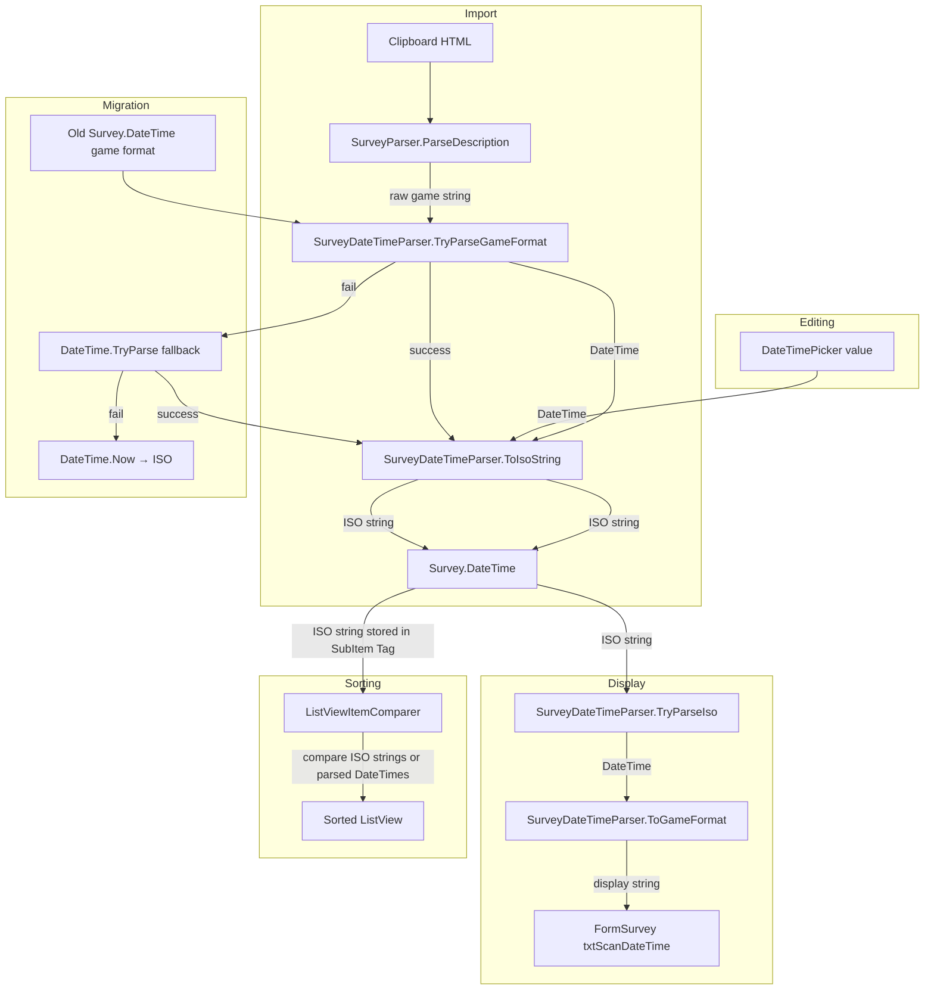

# Design Document: Survey DateTime Normalization

## Overview

This feature normalizes survey scan date/time values from the game's non-standard format (`"27JUL24-11:44p"`) into ISO 8601 (`"2024-07-27T23:44:00"`) for internal storage, while continuing to display the game format in the UI. The change touches six areas: a new parsing/formatting utility, the import pipeline, the view model display layer, the list view sort comparer, the survey edit form, and a data migration for existing saved surveys.

All date/time conversion logic is centralized in a single static utility class `SurveyDateTimeParser` in `Services/`. The `Survey.DateTime` property remains a `string` for JSON compatibility — only the string's content changes from game format to ISO format.

## Architecture



### Data Flow Summary

| Path | Input | Transform | Output |
|------|-------|-----------|--------|
| Import | `"27JUL24-11:44p"` | `TryParseGameFormat` → `ToIsoString` | `"2024-07-27T23:44:00"` |
| Display | `"2024-07-27T23:44:00"` | `TryParseIso` → `ToGameFormat` | `"27JUL24-11:44p"` |
| Edit | `DateTimePicker.Value` | `ToIsoString` | `"2024-07-27T23:44:00"` |
| Sort | ISO string in SubItem Tag | string compare (ISO sorts lexicographically) | correct chronological order |
| Migration | any old format | `TryParseGameFormat` → fallback chain → `ToIsoString` | ISO string |

## Components and Interfaces

### 1. SurveyDateTimeParser (new — `Services/SurveyDateTimeParser.cs`)

Static utility class. All parsing and formatting in one place.

```csharp
public static class SurveyDateTimeParser
{
    // Format constants
    public const string GameDateTimeFormat = "ddMMMyy-hh:mmt"; // e.g. "27JUL24-11:44p"
    public const string IsoFormat = "yyyy-MM-ddTHH:mm:ss";

    // Parsing
    public static bool TryParseGameFormat(string input, out DateTime result);
    public static bool TryParseIso(string input, out DateTime result);

    // Formatting
    public static string ToIsoString(DateTime dt);
    public static string ToGameFormat(DateTime dt);

    // Display helper: ISO string → game format string, passthrough on failure
    public static string FormatForDisplay(string isoString);

    // Convenience: attempt game format, then ISO, then DateTime.TryParse
    public static bool TryParseAny(string input, out DateTime result);
}
```

`TryParseGameFormat` implementation notes:
- Regex pattern: `^(\d{2})([A-Z]{3})(\d{2})-(\d{1,2}):(\d{2})([ap])$`
- Month lookup dictionary: `"JAN"→1, "FEB"→2, … "DEC"→12`
- 12-hour to 24-hour conversion: `12a`→`0`, `12p`→`12`, other `p`→`+12`
- Two-digit year: add `2000` (game launched 2024, no pre-2000 dates)
- Returns `false` on any mismatch — never throws

`ToGameFormat` implementation notes:
- Day: `dt.Day.ToString("D2")`
- Month: reverse lookup from month number to uppercase abbreviation
- Year: `dt.Year % 100` formatted as two digits
- Hour: 12-hour with `a`/`p` suffix, `12:xxp` for noon, `12:xxa` for midnight
- Minute: zero-padded two digits

### 2. SurveyParser changes (`Parsers/SurveyParser.cs`)

In `ParseDescription`, after extracting the raw date string via regex, call `SurveyDateTimeParser.TryParseGameFormat` and if successful, store the ISO string:

```csharp
// existing: survey.DateTime = match.Groups[1].Value.Trim();
string rawDate = match.Groups[1].Value.Trim();
if (SurveyDateTimeParser.TryParseGameFormat(rawDate, out DateTime parsed))
    survey.DateTime = SurveyDateTimeParser.ToIsoString(parsed);
else
    survey.DateTime = rawDate; // preserve unparseable values
```

### 3. SurveyViewModel changes (`ViewModels/SurveyViewModel.cs`)

The `DateTime` property getter/setter needs to mediate between ISO storage and game-format display:

```csharp
// Display: ISO → game format
public string DisplayDateTime => SurveyDateTimeParser.FormatForDisplay(_survey.DateTime);

// The existing DateTime property continues to read/write the raw ISO string on the model.
// FormSurvey will use DisplayDateTime for the text box and write ISO via the DateTimePicker.
```

### 4. ListViewItemComparer changes (`Controls/ListViewItemComparer.cs`)

Add date-aware comparison for the DateTime column (index 4 in FormSurvey's ListView):

- When populating the ListView, store the ISO string in the SubItem's `Tag` property for the DateTime column.
- In `Compare`, when the column is the DateTime column, retrieve the `Tag` values and compare them. Since ISO 8601 strings sort lexicographically in chronological order, a simple `string.Compare` on the Tag values is sufficient. Fall back to display-text comparison if Tags are null.

The comparer needs to know which column index is the "date" column. The simplest approach: store the ISO value in the `Tag` of the DateTime SubItem, and in `Compare`, check if both SubItems have non-null Tags — if so, compare Tags instead of display text. This avoids hardcoding column indices in the comparer.

### 5. FormSurvey changes (`Forms/Survey/FormSurvey.cs` + `.Designer.cs`)

- Add a `DateTimePicker` control (`dtpScanDateTime`) next to `txtScanDateTime`.
- Make `txtScanDateTime` read-only.
- Wire `dtpScanDateTime.ValueChanged`: convert picker value to ISO via `SurveyDateTimeParser.ToIsoString`, store on viewModel, update text box with game format via `SurveyDateTimeParser.ToGameFormat`.
- In `PopulateFormFromViewModel`: parse the ISO string to set the DateTimePicker value; set text box to `viewModel.DisplayDateTime`.
- In `ClearForm`: set DateTimePicker to `DateTime.Now`, text box to current time in game format.
- Remove the `txtScanDateTime.TextChanged` write-through handler (editing now goes through the picker).
- In `PopulateListView`: store the ISO string in `item.SubItems[4].Tag` for sorting.

### 6. Migration003_SurveyDateTimeNormalization (new — `Services/Migration/Migrations/`)

Registered in `MigrationRunner` at version 3 (`CurrentVersion` bumped to 3).

```csharp
public static class Migration003_SurveyDateTimeNormalization
{
    public static void Run(EmpireContext ec, PlayerContext pc)
    {
        foreach (var survey in pc.SurveyList)
        {
            string original = survey.DateTime;

            // Already ISO?
            if (SurveyDateTimeParser.TryParseIso(original, out _)) continue;

            // Try game format
            if (SurveyDateTimeParser.TryParseGameFormat(original, out DateTime parsed))
            {
                survey.DateTime = SurveyDateTimeParser.ToIsoString(parsed);
                continue;
            }

            // Try common .NET formats
            if (DateTime.TryParse(original, out DateTime fallback))
            {
                survey.DateTime = SurveyDateTimeParser.ToIsoString(fallback);
                continue;
            }

            // Unparseable or null/empty — replace with now, log warning
            Log.Warn("Survey '{0}': replacing unparseable DateTime '{1}' with current time",
                survey.PlanetName ?? "(unknown)", original ?? "(null)");
            survey.DateTime = SurveyDateTimeParser.ToIsoString(DateTime.Now);
        }
    }
}
```

## Data Models

### Survey.DateTime (unchanged type, changed content)

| Aspect | Before | After |
|--------|--------|-------|
| C# type | `string` | `string` (no change) |
| JSON field | `"DateTime"` | `"DateTime"` (no change) |
| Stored value | `"27JUL24-11:44p"` | `"2024-07-27T23:44:00"` |
| Display value | raw stored string | formatted via `SurveyDateTimeParser.ToGameFormat` |

No model class changes are required. The `Survey` class, `SurveyImportHelper`, and JSON serialization all continue to work with `string`.

### ListViewItem DateTime SubItem

| Property | Usage |
|----------|-------|
| `SubItems[4].Text` | Display format: `"27JUL24-11:44p"` |
| `SubItems[4].Tag` | ISO string: `"2024-07-27T23:44:00"` (used for sorting) |

### MigrationRunner.CurrentVersion

Bumped from `2` to `3`. New entry in `Migrations` dictionary:

```csharp
{ 3, Migration003_SurveyDateTimeNormalization.Run },
```


## Correctness Properties

*A property is a characteristic or behavior that should hold true across all valid executions of a system — essentially, a formal statement about what the system should do. Properties serve as the bridge between human-readable specifications and machine-verifiable correctness guarantees.*

### Property 1: Game format round-trip

*For any* valid game-format date/time string (matching `ddMMMyy-hh:mmt`), parsing it to a `System.DateTime` via `TryParseGameFormat`, formatting to ISO via `ToIsoString`, then parsing the ISO string back via `TryParseIso` shall produce a `DateTime` value equal to the first parsed value.

This is the core round-trip property. If it holds, then AM/PM interpretation (1.2, 1.3), two-digit year mapping (1.6), month abbreviation support (1.7), and ISO storage correctness (2.1) are all implicitly validated. Edge cases for 12a (midnight) and 12p (noon) are covered by the generator producing hour=12 with both suffixes.

**Validates: Requirements 1.1, 1.2, 1.3, 1.4, 1.5, 1.6, 1.7, 2.1, 5.1, 7.1**

### Property 2: ISO round-trip through display format

*For any* valid ISO-format date/time string, parsing it to `DateTime` via `TryParseIso`, formatting to game display format via `ToGameFormat`, then parsing the game format back via `TryParseGameFormat` shall produce a `DateTime` value equal to the first parsed value.

This validates that the display layer does not lose information — any ISO value can be displayed and recovered.

**Validates: Requirements 3.1, 7.2**

### Property 3: DateTime format path consistency

*For any* valid `System.DateTime` value (with minute-level precision), formatting to game display format via `ToGameFormat` then parsing back via `TryParseGameFormat` then formatting to ISO via `ToIsoString` shall produce the same ISO string as formatting the original `DateTime` directly via `ToIsoString`.

This ensures the two formatting paths (direct-to-ISO vs through-game-format) are consistent.

**Validates: Requirements 6.3, 7.3**

### Property 4: Invalid game format returns false without throwing

*For any* string that does not match the game date/time regex pattern, `TryParseGameFormat` shall return `false` and shall not throw an exception.

**Validates: Requirements 1.8**

### Property 5: Unparseable ISO passthrough in display

*For any* string that cannot be parsed as ISO 8601 by `TryParseIso`, `FormatForDisplay` shall return the original string unchanged.

**Validates: Requirements 3.3**

### Property 6: ISO strings sort chronologically via string comparison

*For any* two `DateTime` values `a` and `b`, the lexicographic ordering of `ToIsoString(a)` vs `ToIsoString(b)` shall match the chronological ordering of `a` vs `b`.

This validates that storing ISO strings in the ListViewItem Tag and comparing them as strings produces correct chronological sort order.

**Validates: Requirements 4.1**

### Property 7: Migration is idempotent on ISO values

*For any* valid ISO-format string, running the migration conversion logic (the same `TryParseIso` → skip path used in `Migration003`) shall leave the value unchanged.

**Validates: Requirements 2.2, 5.6**

### Property 8: Migration produces valid ISO for unparseable input

*For any* string that fails `TryParseGameFormat`, `TryParseIso`, and `DateTime.TryParse` (including null and empty), the migration fallback shall produce a string that is a valid ISO-format date/time (parseable by `TryParseIso`).

**Validates: Requirements 5.4, 5.5**

### Property 9: Migration common-format fallback produces valid ISO

*For any* `DateTime` value formatted using a standard .NET format string (e.g. `"G"`, `"s"`, `"u"`, `"o"`), the migration's `DateTime.TryParse` fallback shall successfully parse it and produce a valid ISO-format string.

**Validates: Requirements 5.2, 5.3**

## Error Handling

| Scenario | Behavior |
|----------|----------|
| `TryParseGameFormat` receives non-matching string | Returns `false`, `out` parameter is `default(DateTime)`. No exception. |
| `TryParseGameFormat` receives null or empty | Returns `false`. No exception. |
| `TryParseIso` receives non-ISO string | Returns `false`. No exception. |
| `FormatForDisplay` receives unparseable string | Returns the input string unchanged (passthrough). |
| Migration encounters unparseable DateTime | Replaces with `DateTime.Now` in ISO format. Logs warning with planet name and original value. |
| Migration encounters null/empty DateTime | Same as unparseable — replaces with `DateTime.Now` in ISO format. Logs warning. |
| DateTimePicker value is out of range | Not expected — WinForms DateTimePicker constrains to valid dates. No special handling needed. |
| ListViewItemComparer encounters null Tag | Falls back to display-text lexicographic comparison (existing behavior). |

## Testing Strategy

### Property-Based Testing

Use **FsCheck** (NuGet package `FsCheck` + `FsCheck.NUnit`) as the property-based testing library. FsCheck integrates with NUnit and supports custom generators for domain-specific types.

Each property test must:
- Run a minimum of 100 iterations
- Reference the design property in a comment tag: `// Feature: survey-datetime-normalization, Property {N}: {title}`
- Use custom `Arbitrary` instances to generate valid game-format strings and valid ISO strings

Custom generators needed:
- **ValidGameFormatString**: generates strings like `"27JUL24-11:44p"` with random valid day (01-28 to avoid month-length issues, or use valid day-for-month), month (JAN-DEC), year (00-99), hour (1-12), minute (00-59), suffix (a/p)
- **ValidIsoString**: generates strings like `"2024-07-27T23:44:00"` from random `DateTime` values
- **ValidDateTime**: generates `DateTime` values with second precision set to 0 (since game format has minute precision only)
- **InvalidGameFormatString**: generates strings that don't match the game format regex (random strings, partial matches, wrong case months, etc.)

### Unit Tests

Unit tests complement property tests for specific examples and edge cases:

- **12a → midnight (00:00)**: `TryParseGameFormat("01JAN24-12:00a", ...)` → hour=0
- **12p → noon (12:00)**: `TryParseGameFormat("01JAN24-12:00p", ...)` → hour=12
- **All 12 months**: iterate JAN through DEC, verify each parses to the correct month number
- **Known game strings**: `"27JUL24-11:44p"` → `"2024-07-27T23:44:00"`, `"19FEB26-08:41p"` → `"2026-02-19T20:41:00"`
- **Migration idempotence**: run migration on already-ISO data, verify no changes
- **Migration fallback**: run migration on garbage string, verify result is valid ISO
- **ListViewItemComparer**: create items with ISO Tags, verify sort order is chronological
- **FormatForDisplay passthrough**: pass a non-ISO string, verify it comes back unchanged
- **Existing SurveyParser tests**: update expected `DateTime` values from game format to ISO format (e.g. `"27JUL24-11:44p"` → `"2024-07-27T23:44:00"`)

### Test Organization

| Test Class | Location | Covers |
|------------|----------|--------|
| `SurveyDateTimeParserTests` | `OE2EmpireTracker.Tests/Services/SurveyDateTimeParserTests.cs` | Properties 1-6, unit tests for edge cases |
| `SurveyDateTimeParserPropertyTests` | `OE2EmpireTracker.Tests/Services/SurveyDateTimeParserPropertyTests.cs` | FsCheck property tests for Properties 1-9 |
| `Migration003Tests` | `OE2EmpireTracker.Tests/Services/Migration003Tests.cs` | Properties 7-9, migration unit tests |
| `ListViewItemComparerTests` | `OE2EmpireTracker.Tests/Controls/ListViewItemComparerTests.cs` | Property 6, sorting unit tests |
| `SurveyParserTests` (updated) | `OE2EmpireTracker.Tests/Parsers/SurveyParserTests.cs` | Updated expected values for ISO output |
