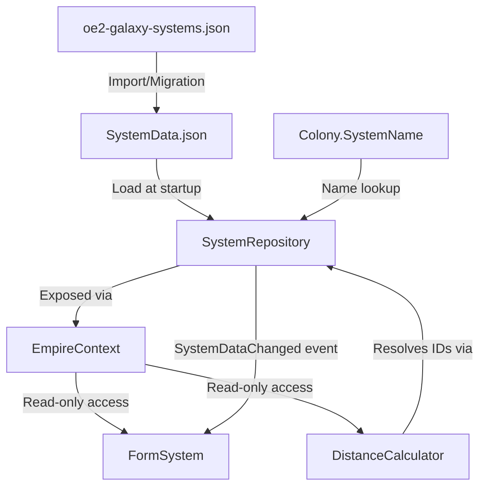

# Design Document — Systems Model (BL-019)

## Overview

The Systems Model introduces star system coordinate data into the OE2 Empire Tracker, enabling distance calculations between systems, colony location resolution, and infrastructure/faction queries across the 23,631-system galaxy. This is a foundational data layer that future features (route optimization, fuel planning) will build upon.

The design follows existing project patterns:
- Model in `OE2EmpireTracker.Common/Models/` (shared across projects)
- Repository service as a singleton loaded by `EmpireContext`
- Separate `SystemData.json` file to avoid bloating `BaselineData.json`
- Dictionary-based caches for O(1) lookups
- ReadOnly wrapper for immutable UI access
- Static utility class for distance calculations
- Event-based change notification for UI refresh

## Architecture



### Layer Responsibilities

| Layer | Component | Responsibility |
|-------|-----------|----------------|
| Model | `StarSystem` | POCO with JSON attributes for compact serialization |
| Model | `ReadOnlyStarSystem` | Immutable wrapper for UI consumption |
| Service | `SystemRepository` | In-memory store with indexed lookups, persistence, events |
| Service | `SystemImporter` | One-time import from galaxy extract to SystemData.json |
| Utility | `DistanceCalculator` | Static Euclidean distance computation |
| Context | `EmpireContext` | Owns and exposes `SystemRepository` instance |
| UI | `FormSystem` | MDI child for viewing/editing system data |
| ViewModel | `SystemViewModel` | Wraps StarSystem for form data binding |

### Data Flow

1. **Startup**: `EmpireContext` constructor calls `SystemRepository.Load("SystemData.json")`
2. **Import**: `SystemImporter.Import(sourcePath, outputPath)` reads galaxy extract, maps fields, writes SystemData.json
3. **Lookup**: Services/forms call `SystemRepository.FindById(id)` or `FindByName(name)` for O(1) access
4. **Distance**: `DistanceCalculator.Calculate(system1, system2)` returns Euclidean distance
5. **Mutation**: `SystemRepository.UpdateSystem(id, changes)` updates mutable fields, persists, fires event
6. **Colony resolution**: `SystemRepository.FindByName(colony.SystemName)` resolves colony location at runtime


## Components and Interfaces

### StarSystem (Model)

**Location**: `OE2EmpireTracker.Common/Models/StarSystem.cs`

```csharp
namespace OE2EmpireTracker.Models
{
    public class StarSystem
    {
        // Immutable properties (set at import, never changed)
        [JsonProperty("id")]
        public int Id { get; set; }

        [JsonProperty("n")]
        public string Name { get; set; } = string.Empty;

        [JsonProperty("x")]
        public decimal X { get; set; }

        [JsonProperty("y")]
        public decimal Y { get; set; }

        [JsonProperty("q")]
        public int Quadrant { get; set; }

        [JsonProperty("s")]
        public int Sector { get; set; }

        [JsonProperty("r")]
        public int Region { get; set; }

        [JsonProperty("l")]
        public int Locality { get; set; }

        [JsonProperty("st")]
        public string SpectralClass { get; set; } = string.Empty;

        // Mutable properties (editable by user)
        [JsonProperty("fid"), DefaultValue(0)]
        public int FactionId { get; set; }

        [JsonProperty("fn"), DefaultValue("")]
        public string FactionName { get; set; } = string.Empty;

        [JsonProperty("fc"), DefaultValue("")]
        public string FactionColor { get; set; } = string.Empty;

        [JsonProperty("o"), DefaultValue(false)]
        public bool HasOrbital { get; set; }

        [JsonProperty("sp"), DefaultValue(false)]
        public bool HasSpaceport { get; set; }

        [JsonProperty("sb"), DefaultValue(false)]
        public bool HasStarbase { get; set; }
    }
}
```

**Design Decisions**:
- Compact JSON property names (`id`, `n`, `x`, etc.) match the source format, minimizing file size for 23,631 records
- `DefaultValue` attributes enable `DefaultValueHandling.Ignore` during serialization to reduce file size
- `decimal` for X/Y preserves precision (at least 6 decimal places) without floating-point drift
- Boolean flags for infrastructure (not int) for type safety in C#; import converts 0/1 to bool


### ReadOnlyStarSystem (Model)

**Location**: `OE2EmpireTracker.Common/Models/ReadOnlyStarSystem.cs`

Follows the existing `ReadOnlyBlueprint` / `ReadOnlyCommodity` pattern — wraps a mutable `StarSystem` and exposes only getters.

```csharp
namespace OE2EmpireTracker.Models
{
    public class ReadOnlyStarSystem
    {
        private readonly StarSystem _system;

        public ReadOnlyStarSystem(StarSystem system) { _system = system; }

        public int Id => _system.Id;
        public string Name => _system.Name;
        public decimal X => _system.X;
        public decimal Y => _system.Y;
        public int Quadrant => _system.Quadrant;
        public int Sector => _system.Sector;
        public int Region => _system.Region;
        public int Locality => _system.Locality;
        public string SpectralClass => _system.SpectralClass;
        public int FactionId => _system.FactionId;
        public string FactionName => _system.FactionName;
        public string FactionColor => _system.FactionColor;
        public bool HasOrbital => _system.HasOrbital;
        public bool HasSpaceport => _system.HasSpaceport;
        public bool HasStarbase => _system.HasStarbase;
    }
}
```

### SystemRepository (Service)

**Location**: `OE2EmpireTracker/Services/SystemRepository.cs`

```csharp
namespace OE2EmpireTracker.Services
{
    public class SystemRepository
    {
        private static readonly Logger Log = LogManager.GetCurrentClassLogger();

        private List<StarSystem> _systems;
        private Dictionary<int, StarSystem> _idIndex;
        private Dictionary<string, StarSystem> _nameIndex; // case-insensitive

        public event EventHandler SystemDataChanged;

        public static string FilePath { get; set; } = "SystemData.json";

        public int Count => _systems?.Count ?? 0;

        public IReadOnlyList<StarSystem> Systems => _systems;

        // O(1) lookups
        public StarSystem FindById(int id);
        public StarSystem FindByName(string name);

        // Filtered queries (return IEnumerable for memory efficiency)
        public IEnumerable<StarSystem> FindByGrid(int? quadrant, int? sector, int? region, int? locality);
        public IEnumerable<StarSystem> SearchByName(string partial);
        public IEnumerable<StarSystem> FindWithSpaceport();
        public IEnumerable<StarSystem> FindWithStarbase();
        public IEnumerable<StarSystem> FindWithInfrastructure();
        public IEnumerable<StarSystem> FindByFaction(int factionId);

        // Faction summary
        public IEnumerable<(int FactionId, string Name, string Color, int Count)> GetFactionSummary();

        // Mutation
        public void UpdateSystem(int id, Action<StarSystem> mutator);
        public void ReplaceAll(List<StarSystem> systems);

        // Persistence
        public void Load(string filePath);
        public void Save();

        // Index management
        private void RebuildIndexes();
    }
}
```


**Design Decisions**:
- Single class (not a separate singleton) — owned and managed by `EmpireContext`
- `_nameIndex` uses `StringComparer.OrdinalIgnoreCase` for case-insensitive name lookup
- Duplicate names: first-wins in the name index, warning logged at load time (Req 3.7)
- `IEnumerable<T>` return for filtered queries avoids materializing 23K-element lists (Req 6.4)
- `UpdateSystem` takes an `Action<StarSystem>` mutator to enforce controlled mutation, then persists and fires event
- `ReplaceAll` supports bulk re-import (Req 12.5)

### DistanceCalculator (Utility)

**Location**: `OE2EmpireTracker/Services/DistanceCalculator.cs`

```csharp
namespace OE2EmpireTracker.Services
{
    public static class DistanceCalculator
    {
        // Core: distance between two systems
        public static decimal Calculate(StarSystem a, StarSystem b);

        // Convenience: resolve by ID via repository
        public static decimal Calculate(int idA, int idB, SystemRepository repo);

        // Route: sum of consecutive leg distances
        public static decimal CalculateRoute(IList<int> systemIds, SystemRepository repo);
    }
}
```

**Design Decisions**:
- Static class — no state, pure computation (Req 4.5)
- Returns `decimal` for precision consistency with coordinate type
- Returns -1 when a system cannot be resolved (Req 4.4)
- Route calculation skips unresolvable legs and logs warnings (Req 4.7)
- Formula: `sqrt((x2-x1)² + (y2-y1)²)` using `(decimal)Math.Sqrt((double)(...))` for the square root

### SystemImporter (Service)

**Location**: `OE2EmpireTracker/Services/SystemImporter.cs`

```csharp
namespace OE2EmpireTracker.Services
{
    public static class SystemImporter
    {
        // Reads source file, maps fields, writes SystemData.json
        public static int Import(string sourcePath, string outputPath);
    }
}
```

**Design Decisions**:
- Static utility — stateless, called once during import or migration
- Returns count of imported systems for logging
- Maps source fields: `id`→Id, `n`→Name, `x`→X, `y`→Y, `q`→Quadrant, `s`→Sector, `r`→Region, `l`→Locality, `st`→SpectralClass, `fid`→FactionId, `fn`→FactionName, `fc`→FactionColor
- Converts `o`/`sp`/`sb` integer flags (0/1) to boolean
- Ignores `xdb`/`ydb` fields (raw DB coordinates not needed)
- Idempotent — overwrites output file completely (Req 8.6)
- Uses `SafeFileWriter.WriteAllText` for atomic persistence


### EmpireContext Integration

**Changes to**: `OE2EmpireTracker/Services/EmpireContext.cs`

```csharp
// New field
private SystemRepository _systemRepository;

// New property
public SystemRepository SystemRepository => _systemRepository;

// In constructor (after existing Init* calls):
_systemRepository = new SystemRepository();
_systemRepository.Load(SystemRepository.FilePath);
```

**Design Decisions**:
- `SystemRepository` is loaded after baseline data but does not block if file is missing
- Not included in `WriteContext()` — systems have their own persistence via `SystemRepository.Save()`
- Not included in `Reset()` initially — will add if tests require it

### FormSystem (UI)

**Location**: `OE2EmpireTracker/Forms/System/FormSystem.cs`

- MDI child window accessible from Manage menu
- Left panel: searchable DataGridView with system list (partial name filter, grid location filter)
- Right panel: detail view showing all properties
- Read-only fields: Id, Name, X, Y, Quadrant, Sector, Region, Locality, SpectralClass
- Editable fields: FactionId (combo), FactionName, FactionColor, HasOrbital (checkbox), HasSpaceport (checkbox), HasStarbase (checkbox)
- Toolbar: Save button, Re-import button (with confirmation dialog)
- Subscribes to `SystemRepository.SystemDataChanged` for refresh

### SystemViewModel

**Location**: `OE2EmpireTracker/ViewModels/SystemViewModel.cs`

Wraps a `ReadOnlyStarSystem` for display binding. Exposes formatted grid location string (e.g. "Q1-S2-R3-L4") and computed properties for UI display.

## Data Models

### StarSystem Entity

| Property | Type | JSON Key | Mutable | Default | Notes |
|----------|------|----------|---------|---------|-------|
| Id | int | `id` | No | 0 | Game database identifier |
| Name | string | `n` | No | "" | Display name |
| X | decimal | `x` | No | 0 | Normalized X coordinate |
| Y | decimal | `y` | No | 0 | Normalized Y coordinate |
| Quadrant | int | `q` | No | 0 | Grid hierarchy (1-4) |
| Sector | int | `s` | No | 0 | Grid hierarchy (1-4) |
| Region | int | `r` | No | 0 | Grid hierarchy (1-4) |
| Locality | int | `l` | No | 0 | Grid hierarchy (1-4) |
| SpectralClass | string | `st` | No | "" | Star type (M,K,G,F,W,X) |
| FactionId | int | `fid` | Yes | 0 | 0 = unclaimed |
| FactionName | string | `fn` | Yes | "" | Empty when unclaimed |
| FactionColor | string | `fc` | Yes | "" | Hex color code |
| HasOrbital | bool | `o` | Yes | false | Infrastructure flag |
| HasSpaceport | bool | `sp` | Yes | false | Infrastructure flag |
| HasStarbase | bool | `sb` | Yes | false | Infrastructure flag |


### SystemData.json Format

```json
[
  {
    "id": 19393,
    "n": "Solarisax K2514",
    "x": 682.141359486,
    "y": 421.3807018242,
    "q": 1,
    "s": 1,
    "r": 2,
    "l": 1,
    "st": "M",
    "fid": 5,
    "fn": "Galactic Corp",
    "fc": "#FF0000",
    "o": true,
    "sp": true,
    "sb": false
  }
]
```

Notes:
- Default-value properties are omitted via `DefaultValueHandling.Ignore` (e.g. `fid: 0`, `fn: ""`, `o: false` are not written)
- This significantly reduces file size for the majority of unclaimed systems with no infrastructure

### Serialization Settings

```csharp
private static readonly JsonSerializerSettings SystemJsonSettings = new JsonSerializerSettings
{
    DefaultValueHandling = DefaultValueHandling.Ignore,
    Formatting = Formatting.None, // Single line per system for compact file
    NullValueHandling = NullValueHandling.Ignore
};
```

**Rationale**: With 23,631 systems, compact serialization matters. Omitting defaults and using no indentation keeps the file manageable (~2-3 MB vs ~8-10 MB with full formatting).

### Index Structures

| Index | Key Type | Comparer | Purpose |
|-------|----------|----------|---------|
| `_idIndex` | `Dictionary<int, StarSystem>` | Default int | O(1) lookup by game ID |
| `_nameIndex` | `Dictionary<string, StarSystem>` | `OrdinalIgnoreCase` | O(1) lookup by name |

Both indexes are rebuilt on `Load()` and `ReplaceAll()`. The `_nameIndex` logs warnings for duplicate names (first-wins).


## Correctness Properties

*A property is a characteristic or behavior that should hold true across all valid executions of a system — essentially, a formal statement about what the system should do. Properties serve as the bridge between human-readable specifications and machine-verifiable correctness guarantees.*

### Property 1: Serialization round-trip

*For any* valid StarSystem object with arbitrary field values, serializing to JSON with the system's JsonSerializerSettings and then deserializing back SHALL produce an object with equivalent property values (Id, Name, X, Y, Quadrant, Sector, Region, Locality, SpectralClass, FactionId, FactionName, FactionColor, HasOrbital, HasSpaceport, HasStarbase).

**Validates: Requirements 9.1, 1.10**

### Property 2: Serialization omits default values

*For any* StarSystem where FactionId is 0, FactionName is empty, FactionColor is empty, and all infrastructure flags are false, the serialized JSON string SHALL NOT contain the keys "fid", "fn", "fc", "o", "sp", or "sb".

**Validates: Requirements 9.4**

### Property 3: ID lookup correctness

*For any* set of StarSystem objects loaded into the SystemRepository, and *for any* system in that set, calling FindById with that system's Id SHALL return that exact system.

**Validates: Requirements 3.1**

### Property 4: Name lookup is case-insensitive

*For any* set of StarSystem objects with unique names loaded into the SystemRepository, and *for any* system in that set, calling FindByName with that system's Name in any case variation (upper, lower, mixed) SHALL return that system.

**Validates: Requirements 3.2, 5.1**


### Property 5: Count equals loaded systems

*For any* list of N StarSystem objects loaded into the SystemRepository, the Count property SHALL equal N.

**Validates: Requirements 3.3**

### Property 6: Grid filter returns only matching systems

*For any* SystemRepository with loaded systems and *for any* grid filter (quadrant, sector, region, locality where each specified value is 1-4), all systems returned by FindByGrid SHALL have matching values for every specified filter parameter, and no system matching the filter SHALL be excluded from the results.

**Validates: Requirements 3.4**

### Property 7: Partial name search returns only containing matches

*For any* SystemRepository with loaded systems and *for any* non-empty search string, all systems returned by SearchByName SHALL contain that string in their Name (case-insensitive), and no system whose name contains the string SHALL be excluded.

**Validates: Requirements 3.5**

### Property 8: Distance is symmetric, non-negative, and zero for identical points

*For any* two StarSystem objects A and B:
- Calculate(A, B) SHALL equal Calculate(B, A) (symmetry)
- Calculate(A, B) SHALL be >= 0 (non-negativity)
- Calculate(A, A) SHALL equal 0 (identity)

**Validates: Requirements 4.1**

### Property 9: Route distance equals sum of consecutive leg distances

*For any* ordered list of 2+ valid system IDs where all IDs are resolvable, CalculateRoute SHALL return a value equal to the sum of Calculate(systems[i], systems[i+1]) for all consecutive pairs.

**Validates: Requirements 4.6**

### Property 10: Infrastructure filters return exactly matching systems

*For any* SystemRepository with loaded systems:
- FindWithSpaceport SHALL return exactly those systems where HasSpaceport is true
- FindWithStarbase SHALL return exactly those systems where HasStarbase is true
- FindWithInfrastructure SHALL return exactly those systems where HasOrbital OR HasSpaceport OR HasStarbase is true

**Validates: Requirements 6.1, 6.2, 6.3**


### Property 11: Faction query returns correct systems and summary

*For any* SystemRepository with loaded systems and *for any* FactionId > 0 present in the dataset:
- FindByFaction(factionId) SHALL return exactly those systems where FactionId equals the given value
- GetFactionSummary SHALL include an entry for every distinct non-zero FactionId, and the count for each SHALL equal the number of systems with that FactionId

**Validates: Requirements 7.1, 7.2, 7.3**

### Property 12: Import field mapping preserves all source data

*For any* valid source record (with id, n, x, y, q, s, r, l, st, fid, fn, fc as strings/numbers and o, sp, sb as 0 or 1), the import mapping SHALL produce a StarSystem where: Id equals source id, Name equals source n, X equals source x (to 6+ decimal places), Y equals source y (to 6+ decimal places), Quadrant equals source q, Sector equals source s, Region equals source r, Locality equals source l, SpectralClass equals source st, FactionId equals source fid, FactionName equals source fn, FactionColor equals source fc, HasOrbital equals (source o != 0), HasSpaceport equals (source sp != 0), HasStarbase equals (source sb != 0).

**Validates: Requirements 8.2, 8.3**

### Property 13: Import is idempotent

*For any* valid source file, running the import twice SHALL produce byte-identical SystemData.json output.

**Validates: Requirements 8.6**

### Property 14: Mutation updates values and fires event

*For any* StarSystem in the repository and *for any* valid new values for mutable properties (FactionId, FactionName, FactionColor, HasOrbital, HasSpaceport, HasStarbase), calling UpdateSystem with a mutator that sets those values SHALL result in the system reflecting the new values, and the SystemDataChanged event SHALL have fired exactly once.

**Validates: Requirements 12.1, 12.3**


## Error Handling

### SystemRepository.Load

| Condition | Behavior |
|-----------|----------|
| File missing | Log warning, initialize with empty list (0 systems) |
| File empty | Log warning, initialize with empty list |
| Malformed JSON | Log error with exception details, initialize with empty list |
| Duplicate names | Log warning per duplicate, first-wins in name index |
| Valid file | Load all systems, build indexes, log count |

### DistanceCalculator

| Condition | Behavior |
|-----------|----------|
| System ID not found | Return -1 (single calc) or skip leg (route calc) + log warning |
| Null system object | Return -1 |
| Empty route list | Return 0 |
| Single-system route | Return 0 |
| All IDs unresolvable in route | Return 0 + log warnings for each |

### SystemImporter

| Condition | Behavior |
|-----------|----------|
| Source file missing | Log warning, return 0 (no systems imported) |
| Source file malformed | Log error with exception, return 0 |
| Source file valid | Map all records, write SystemData.json, return count |

### SystemRepository.UpdateSystem

| Condition | Behavior |
|-----------|----------|
| System ID not found | Log warning, no-op (no event fired) |
| Valid mutation | Apply mutator, persist file, fire SystemDataChanged |

### General Principles

- All errors are logged via NLog (never silently swallowed)
- No exceptions propagate to the UI — all are caught and logged at the service boundary
- Graceful degradation: missing/corrupt data results in empty repository, not crashes
- `SafeFileWriter` ensures atomic persistence (no partial writes on crash)


## Testing Strategy

### Dual Testing Approach

This feature uses both unit tests (specific examples, edge cases) and property-based tests (universal properties across generated inputs).

### Property-Based Testing

**Library**: FsCheck 2.16+ with FsCheck.NUnit integration (compatible with .NET Framework 4.8.1 and NUnit 4.x)

**Configuration**:
- Minimum 100 iterations per property test
- Each property test references its design document property number
- Tag format: `Feature: systems-model, Property {N}: {title}`

**Properties to implement** (14 total — see Correctness Properties section):
1. Serialization round-trip
2. Serialization omits defaults
3. ID lookup correctness
4. Name lookup case-insensitive
5. Count equals loaded systems
6. Grid filter returns only matching systems
7. Partial name search returns only containing matches
8. Distance symmetry, non-negativity, identity
9. Route distance equals sum of legs
10. Infrastructure filters return exactly matching systems
11. Faction query correctness
12. Import field mapping preserves source data
13. Import idempotence
14. Mutation updates values and fires event

### Unit Tests (Example-Based)

| Test Area | What to Test |
|-----------|-------------|
| Load — missing file | Verify 0 systems, warning logged |
| Load — empty file | Verify 0 systems, warning logged |
| Load — malformed JSON | Verify 0 systems, error logged |
| Load — duplicate names | Verify first-wins, warning logged |
| Distance — unresolvable ID | Verify returns -1 |
| Distance — null system | Verify returns -1 |
| Route — unresolvable leg | Verify skipped, warning logged |
| Import — missing source | Verify returns 0, no crash |
| Colony resolution — unknown system | Verify returns null |
| UpdateSystem — unknown ID | Verify no-op, no event |
| Immutable fields | Verify UpdateSystem cannot change Id, Name, X, Y, etc. |
| Bulk re-import | Verify ReplaceAll replaces data and fires event |

### Test File Organization

```
OE2EmpireTracker.Tests/
├── Models/
│   └── StarSystemTests.cs          # Serialization properties
├── Services/
│   ├── SystemRepositoryTests.cs    # Lookup, filter, mutation properties
│   ├── DistanceCalculatorTests.cs  # Distance properties
│   └── SystemImporterTests.cs      # Import mapping properties
```

### Test Data Generation (FsCheck Generators)

```csharp
// Generator for valid StarSystem objects
public static Arbitrary<StarSystem> StarSystemArbitrary()
{
    return Arb.From(
        from id in Arb.Generate<PositiveInt>()
        from name in Gen.Elements("Alpha", "Beta", "Gamma")
                       .Select(prefix => $"{prefix} {id.Get}")
        from x in Gen.Choose(-1000000, 1000000)
                    .Select(v => v / 1000m)
        from y in Gen.Choose(-1000000, 1000000)
                    .Select(v => v / 1000m)
        from q in Gen.Choose(1, 4)
        from s in Gen.Choose(1, 4)
        from r in Gen.Choose(1, 4)
        from l in Gen.Choose(1, 4)
        from spectral in Gen.Elements("M", "K", "G", "F", "W", "X")
        from fid in Gen.Choose(0, 100)
        from hasOrbital in Arb.Generate<bool>()
        from hasSpaceport in Arb.Generate<bool>()
        from hasStarbase in Arb.Generate<bool>()
        select new StarSystem
        {
            Id = id.Get,
            Name = name,
            X = x, Y = y,
            Quadrant = q, Sector = s, Region = r, Locality = l,
            SpectralClass = spectral,
            FactionId = fid,
            FactionName = fid > 0 ? $"Faction{fid}" : "",
            FactionColor = fid > 0 ? "#FF0000" : "",
            HasOrbital = hasOrbital,
            HasSpaceport = hasSpaceport,
            HasStarbase = hasStarbase
        });
}
```

