# Design Document: Test Performance Optimization

## Overview

The test suite (OE2EmpireTracker.Tests, 1940 tests) takes 84 seconds to run. Two root causes account for the majority of that time:

1. **Excessive property-test iterations** — FsCheck tests use MaxTest = 100 or 200, and hand-rolled loops iterate 100 times. The logic under test is deterministic; 25 iterations provides equivalent confidence.
2. **Repeated disk I/O and JSON deserialization** — ~60 test fixtures call EmpireContext.Reset() + EmpireContext.GetInstance() in [SetUp], each time reading BaselineData.json (856 KB) and PlayerData.json (249 KB) from disk and deserializing via Newtonsoft.Json.

The optimization adds internal constructors to PlayerContext and EmpireContext that accept pre-parsed root objects, a caching layer in TestHelper that deserializes JSON once and provides deep copies, and reduces iteration counts across all property tests.

**Target**: reduce total suite time from 84s to ~30-35s.

## Architecture

The optimization is purely in the test infrastructure layer. No production code behavior changes — only new internal constructors are added to the two context singletons.

```mermaid
graph TD
    subgraph "Current Flow (per test)"
        A[Test SetUp] --> B[EmpireContext.Reset]
        B --> C[File.ReadAllText BaselineData.json]
        C --> D[JsonConvert.Deserialize BaselineRoot]
        D --> E[File.ReadAllText PlayerData.json]
        E --> F[JsonConvert.Deserialize PlayerRoot]
        F --> G[Init all collections]
    end

    subgraph "Optimized Flow (per test)"
        H[Test SetUp] --> I[TestHelper.ResetWithCachedData]
        I --> J{Cache populated?}
        J -->|No| K[Read + Deserialize once]
        K --> L[Store in static fields]
        J -->|Yes| M[Deep copy cached roots]
        L --> M
        M --> N[EmpireContext internal ctor]
        N --> O[Init all collections from memory]
    end
```



### Design Decisions

1. **JSON round-trip for deep copy** — Serialize the cached root to JSON, then deserialize a fresh copy. This reuses the existing Newtonsoft.Json infrastructure, guarantees all nested objects are independent copies, and requires zero per-model cloning code. The cost (~2-5ms per round-trip for ~1 MB) is negligible compared to the ~15ms saved by avoiding disk I/O per fixture.

2. **Internal constructors (not public)** — The new constructors are internal so they're accessible to the test project via the existing [InternalsVisibleTo("OE2EmpireTracker.Tests")] attribute but not to external consumers. This preserves the singleton pattern for production code.

3. **Iteration reduction ratios** — MaxTest = 100 → 25 (4x reduction), MaxTest = 200 → 50 (4x reduction), hand-rolled loops 100 → 25 (4x reduction). The 4x factor was chosen because the tests exercise deterministic logic where edge cases are found in the first few iterations; 25 iterations still provides meaningful randomized coverage.

## Components and Interfaces

### PlayerContext — Internal Constructor

```csharp
// New internal constructor accepting pre-parsed PlayerRoot
internal PlayerContext(PlayerRoot playerRoot) : base()
{
    _instance = this;

    InitPlayerProfiles(playerRoot);
    InitBlueprints(playerRoot);
    InitSurveys(playerRoot);
    InitColonies(playerRoot);
    InitDeliveryRoutes(playerRoot);
    InitDeliveryPlans(playerRoot);
    InitPricingPlans(playerRoot);
    InitBuildPlans(playerRoot);
    InitShipTemplates(playerRoot);
    InitShips(playerRoot);
    InitStations(playerRoot);
    InitMarketListings(playerRoot);
    InitMarketTransactions(playerRoot);
    InitStockPlans(playerRoot);
    InitStockProfiles(playerRoot);
    InitSupplyChains(playerRoot);
    InitWarehouseOverflowRules(playerRoot);
    InitFactions(playerRoot);
    InitExternalCharacters(playerRoot);
    InitAsteroids(playerRoot);
    DataVersion = playerRoot.DataVersion;

    MigrateOwnerUUIDs();
    CleanupOrphanedData();
    RestoreCurrentPlayer(playerRoot.CurrentPlayerUUID);
}
```

The internal constructor mirrors the private parameterless constructor exactly, except it skips File.ReadAllText and JsonConvert.DeserializeObject. All Init methods and post-init steps (MigrateOwnerUUIDs, CleanupOrphanedData, RestoreCurrentPlayer) are called identically.

### EmpireContext — Internal Constructor

```csharp
// New internal constructor accepting pre-parsed roots
internal EmpireContext(BaselineRoot baselineRoot, PlayerRoot playerRoot) : base()
{
    _instance = this;

    // Create PlayerContext from pre-parsed PlayerRoot
    PlayerContext = new PlayerContext(playerRoot);

    DataVersion = baselineRoot.DataVersion;
    GameConstants = baselineRoot.GameConstants ?? new BaselineGameConstants();

    InitBlueprintTypes(baselineRoot);
    InitShipClasses(baselineRoot);
    InitTechLevels(baselineRoot);
    InitEvolutions(baselineRoot);
    InitResources(baselineRoot);
    InitResourceGroups(baselineRoot);
    InitResourcePurities(baselineRoot);
    InitCommodities(baselineRoot);
    InitRefiningRecipes(baselineRoot);
    InitResearchTimes(baselineRoot);
    InitGlobalBlueprints(baselineRoot);

    // Run migrations same as private constructor
    int prevBaselineVersion = DataVersion;
    int prevPlayerVersion = PlayerContext.DataVersion;
    MigrationRunner.Run(this, PlayerContext);
    if (DataVersion != prevBaselineVersion)
    {
        WriteContext();
    }
    if (PlayerContext.DataVersion != prevPlayerVersion)
    {
        PlayerContext.WriteContext();
    }
}
```

### TestHelper — Caching and Deep Copy

```csharp
public static class TestHelper
{
    // Cached root objects — deserialized once, reused via deep copy
    private static BaselineRoot _cachedBaselineRoot;
    private static PlayerRoot _cachedPlayerRoot;
    private static string _cachedBaselineJson;
    private static string _cachedPlayerJson;

    /// <summary>
    /// Deserializes and caches the test JSON files on first call.
    /// Subsequent calls return immediately.
    /// </summary>
    private static void EnsureCachePopulated()
    {
        if (_cachedBaselineRoot == null)
        {
            string baselinePath = TestDataPath("BaselineData.json");
            _cachedBaselineJson = File.ReadAllText(baselinePath);
            _cachedBaselineRoot = JsonConvert.DeserializeObject<BaselineRoot>(
                _cachedBaselineJson);
        }
        if (_cachedPlayerRoot == null)
        {
            string playerPath = TestDataPath("PlayerData.json");
            _cachedPlayerJson = File.ReadAllText(playerPath);
            _cachedPlayerRoot = JsonConvert.DeserializeObject<PlayerRoot>(
                _cachedPlayerJson);
        }
    }

    /// <summary>
    /// Returns a deep copy of the cached BaselineRoot via JSON round-trip.
    /// </summary>
    private static BaselineRoot DeepCopyBaseline()
    {
        return JsonConvert.DeserializeObject<BaselineRoot>(_cachedBaselineJson);
    }

    /// <summary>
    /// Returns a deep copy of the cached PlayerRoot via JSON round-trip.
    /// </summary>
    private static PlayerRoot DeepCopyPlayer()
    {
        return JsonConvert.DeserializeObject<PlayerRoot>(_cachedPlayerJson);
    }

    /// <summary>
    /// Resets both singletons and initializes them from cached, deep-copied
    /// root objects. Replaces the Reset() + SetAllFilePaths() + GetInstance()
    /// pattern with zero disk I/O.
    /// </summary>
    public static void ResetWithCachedData()
    {
        MigrationRunner.SuppressUI = true;
        EnsureCachePopulated();

        EmpireContext.Reset();
        var baselineCopy = DeepCopyBaseline();
        var playerCopy = DeepCopyPlayer();
        new EmpireContext(baselineCopy, playerCopy);
    }
}
```

**Key design choice**: The deep copy deserializes from the cached JSON *string* rather than re-serializing the cached object. This avoids any risk of the cached object being mutated between cache population and copy creation, and it's faster (skip serialization, only deserialize).

### Iteration Count Reduction

All FsCheck property tests and hand-rolled iteration loops are updated mechanically:

| Pattern | Before | After |
|---------|--------|-------|
| [FsCheck.NUnit.Property(MaxTest = 100)] | 100 | 25 |
| [FsCheck.NUnit.Property(MaxTest = 200)] | 200 | 50 |
| or (int i = 0; i < 100; i++) | 100 | 25 |

Files affected by hand-rolled loop changes:
- MainMenuOverhaulTests.cs (5 loops)
- ColonyActivityCollectorTests.cs (6 loops)
- ColonyInactivityCollectorTests.cs (3 loops)

## Data Models

No new data models are introduced. The existing BaselineRoot and PlayerRoot classes serve as the cached data structures. Their definitions remain unchanged:

**BaselineRoot** (in EmpireContext.cs):
- DataVersion (int)
- GameConstants (BaselineGameConstants)
- ShipClass[], BlueprintType[], Blueprint[], TechLevel[]
- Commodity[], RefiningRecipe[], ResearchTime[]

**PlayerRoot** (in PlayerContext.cs):
- DataVersion (int), CurrentPlayerUUID (string)
- PlayerProfile[], Blueprint[], Survey[], Colony[]
- DeliveryRoute[], DeliveryPlan[], PricingPlan[], BuildPlan[]
- ShipTemplate[], Ship[], Station[]
- MarketListing[], MarketTransaction[]
- StockPlan[], StockProfile[], SupplyChain[]
- WarehouseOverflowRule[], Faction[], ExternalCharacter[], Asteroid[]

## Correctness Properties

*A property is a characteristic or behavior that should hold true across all valid executions of a system — essentially, a formal statement about what the system should do. Properties serve as the bridge between human-readable specifications and machine-verifiable correctness guarantees.*

### Property 1: Deep Copy Round-Trip Fidelity

*For any* cached JSON string representing a valid PlayerRoot or BaselineRoot, deserializing it to produce a deep copy and then re-serializing that copy SHALL produce JSON equivalent to the original cached string (modulo key ordering handled by SortedDictionaryContractResolver).

**Validates: Requirements 7.2**

### Property 2: Deep Copy Mutation Isolation

*For any* deep copy of a cached root object, mutating the copy's collections (adding, removing, or modifying elements) SHALL leave the cached original's collections unchanged in count and content.

**Validates: Requirements 5.3, 7.1, 7.3**

### Property 3: In-Memory vs Disk Behavioral Equivalence

*For any* test data file pair (BaselineData.json, PlayerData.json), constructing EmpireContext and PlayerContext via the internal constructors with pre-parsed root objects SHALL produce singletons with identical collection counts, DataVersion values, and GameConstants as constructing them via the disk-based path (Reset + SetAllFilePaths + GetInstance).

**Validates: Requirements 3.2, 3.4, 4.2, 4.6, 5.5, 8.3**

## Error Handling

This optimization is confined to test infrastructure. Error handling is minimal:

1. **Missing test data files** — EnsureCachePopulated() reads from TestDataPath(). If files are missing, File.ReadAllText throws FileNotFoundException, which NUnit reports as a test setup failure. This matches the current behavior.

2. **Deserialization failures** — If the cached JSON is malformed, JsonConvert.DeserializeObject throws JsonSerializationException. Again, this surfaces as a test setup failure, same as today.

3. **Migration failures** — MigrationRunner.Run is called in the internal constructor just as in the private constructor. If migration fails, MigrationRunner.MigrationFailed is set and WriteContext is blocked. No change in behavior.

4. **Null root objects** — The internal constructors do not add null checks beyond what the Init methods already handle (they use ?? new T[0] patterns). This matches the existing constructor behavior.

## Testing Strategy

### Approach

The testing strategy uses a combination of property-based tests for the core correctness properties and integration verification via full suite runs.

**Property-based tests** (using FsCheck):
- Each correctness property is implemented as a single FsCheck property test with MaxTest = 100
- Tests are tagged with the property they validate

**Example-based tests**:
- Verify the internal constructors exist and can be called
- Verify ResetWithCachedData() produces initialized singletons
- Verify specific collection counts match between disk and in-memory paths

**Integration verification**:
- Full suite run before and after changes to confirm zero regressions
- Timing comparison to confirm performance target is met

### Property Test Configuration

- Library: FsCheck 2.16.6 with FsCheck.NUnit (already in the test project)
- Minimum iterations: 100 per property test
- Tag format: Feature: test-performance-optimization, Property {N}: {description}

### Smoke Verification

After the mechanical changes (iteration reduction, fixture migration):
- Grep for MaxTest = 100 and MaxTest = 200 to confirm none remain
- Grep for < 100 loop bounds in the three hand-rolled test files to confirm none remain
- Grep for the old EmpireContext.Reset() + SetAllFilePaths() + GetInstance() pattern to confirm migration is complete (excluding intentional disk-based tests)
- Compare test count before and after to confirm no tests were removed