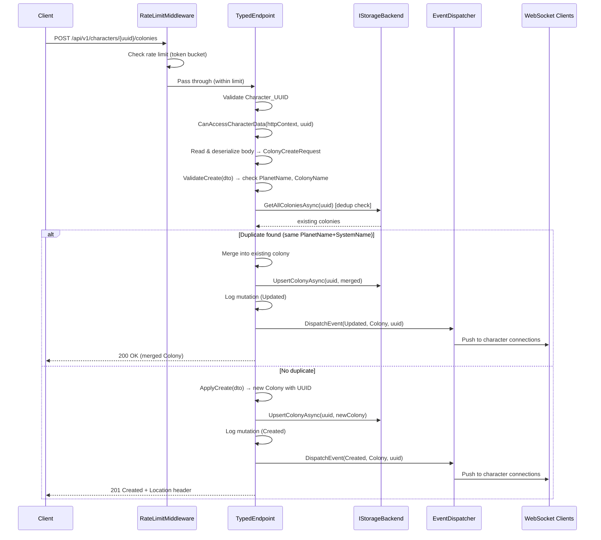
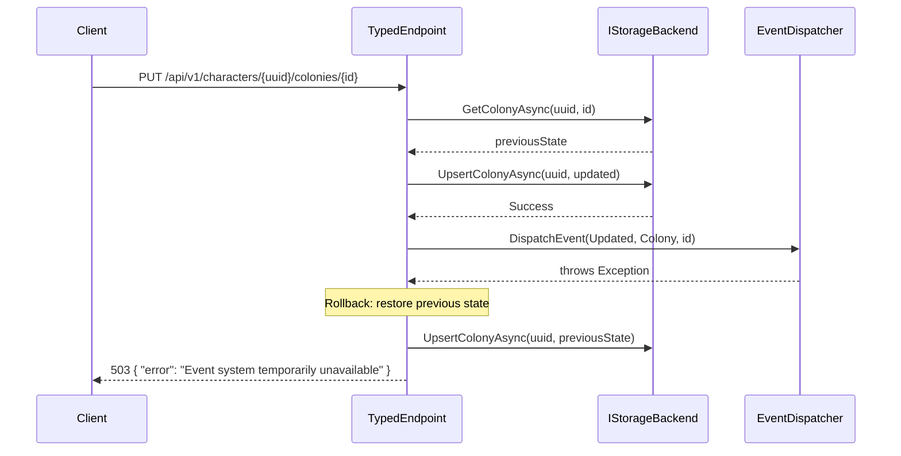
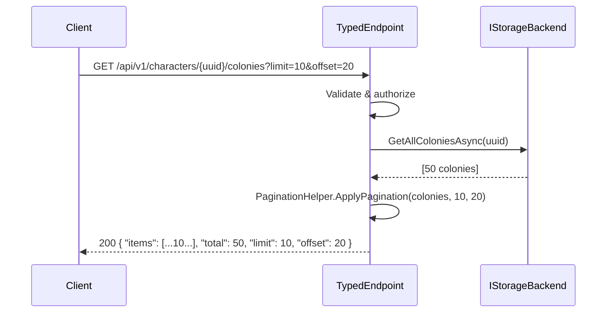

# Typed Data Service Endpoints — Design

## Overview

This design replaces the raw JSON proxy endpoints (`/api/v1/characters/{uuid}/data/{dataType}`) with strongly-typed CRUD endpoints for each of the 19 domain entity types. The architecture uses a generic endpoint handler pattern to avoid duplicating boilerplate across entity types, while allowing entity-specific logic (validation, dedup, sub-resources) to be injected per type.

## Architecture

### System Layers

```
┌─────────────────────────────────────────────────────────────────┐
│  Clients (Desktop App, Web Frontend, Server Admin)              │
└──────────────────────────────┬──────────────────────────────────┘
                               │ HTTP/JSON
                               ▼
┌─────────────────────────────────────────────────────────────────┐
│  ASP.NET Core Minimal API (OE2EmpireTracker.Server)             │
│  ┌───────────────────────────────────────────────────────────┐  │
│  │  RateLimitMiddleware (sliding window, per-token)          │  │
│  ├───────────────────────────────────────────────────────────┤  │
│  │  Authorization (CanAccessCharacterData)                    │  │
│  ├───────────────────────────────────────────────────────────┤  │
│  │  Typed Endpoint Classes (one per entity type)             │  │
│  │  ┌─────────────┐ ┌─────────────┐ ┌─────────────┐        │  │
│  │  │ColonyEndpts │ │BlueprintEnd│ │SurveyEndpts │ ...     │  │
│  │  └─────────────┘ └─────────────┘ └─────────────┘        │  │
│  ├───────────────────────────────────────────────────────────┤  │
│  │  TypedEndpointBase<TEntity, TCreate, TUpdate>             │  │
│  │  (shared CRUD logic, validation, event dispatch, logging) │  │
│  ├───────────────────────────────────────────────────────────┤  │
│  │  IStorageBackend (typed methods per entity)               │  │
│  └───────────────────────────────────────────────────────────┘  │
└──────────────────────────────┬──────────────────────────────────┘
                               │
                               ▼
┌─────────────────────────────────────────────────────────────────┐
│  Storage Backends                                                │
│  JsonFileBackend │ SqliteBackend │ PostgresBackend │ DynamoBackend│
└─────────────────────────────────────────────────────────────────┘
```

### Request Pipeline

Each typed endpoint handler follows this exact sequence:

```
1. RateLimitMiddleware checks token bucket (429 if exceeded)
2. Validate Character_UUID (non-empty) → 400
3. Authorize via CanAccessCharacterData → 403
4. Validate Entity_UUID if applicable (non-empty) → 400
5. Read + validate request body (POST/PUT only) → 400/415
6. Call entity-specific validation → 400
7. Execute storage operation → 404/501
8. Log mutation (POST/PUT/DELETE only) → 500 on failure
9. Dispatch event (POST/PUT/DELETE only) → 503 on failure
10. Return typed response with appropriate status code
```


## Components and Interfaces

### TypedEndpointBase (Abstract Base Class)

```csharp
public abstract class TypedEndpointBase<TEntity, TCreate, TUpdate>
    where TEntity : class
    where TCreate : class
    where TUpdate : class
{
    // Abstract members — subclasses must provide
    protected abstract string EntityTypeName { get; }        // e.g. "Colony"
    protected abstract string RoutePrefix { get; }           // e.g. "colonies"
    protected abstract string? ValidateCreate(TCreate dto);  // null = valid, string = error
    protected abstract string? ValidateUpdate(TUpdate dto);  // null = valid, string = error
    protected abstract TEntity ApplyCreate(TCreate dto);     // Create entity from DTO, assign UUID
    protected abstract TEntity ApplyUpdate(TEntity existing, TUpdate dto); // Merge update into existing

    // Virtual — override for custom behavior
    protected virtual Task<IResult?> HandleCreateDedup(
        string characterUUID, TCreate dto, IStorageBackend storage) => Task.FromResult<IResult?>(null);

    // Shared handler implementations
    protected async Task<IResult> HandleGetAll(string uuid, int? limit, int? offset, HttpContext ctx, IStorageBackend storage);
    protected async Task<IResult> HandleGetOne(string uuid, string entityUuid, HttpContext ctx, IStorageBackend storage);
    protected async Task<IResult> HandleCreate(string uuid, HttpContext ctx, IStorageBackend storage, EventDispatcher dispatcher);
    protected async Task<IResult> HandleUpdate(string uuid, string entityUuid, HttpContext ctx, IStorageBackend storage, EventDispatcher dispatcher);
    protected async Task<IResult> HandleDelete(string uuid, string entityUuid, HttpContext ctx, IStorageBackend storage, EventDispatcher dispatcher);
}
```

### IStorageBackend Extension (Typed Methods)

For each of the 19 entity types, four methods are added to `IStorageBackend`:

```csharp
// Colony (representative pattern — repeated for all 19 types)
Task<IReadOnlyList<Colony>> GetAllColoniesAsync(string characterUUID);
Task<Colony?> GetColonyAsync(string characterUUID, string entityUUID);
Task UpsertColonyAsync(string characterUUID, Colony entity);
Task DeleteColonyAsync(string characterUUID, string entityUUID);

// Blueprint
Task<IReadOnlyList<Blueprint>> GetAllBlueprintsAsync(string characterUUID);
Task<Blueprint?> GetBlueprintAsync(string characterUUID, string entityUUID);
Task UpsertBlueprintAsync(string characterUUID, Blueprint entity);
Task DeleteBlueprintAsync(string characterUUID, string entityUUID);

// Survey
Task<IReadOnlyList<Survey>> GetAllSurveysAsync(string characterUUID);
Task<Survey?> GetSurveyAsync(string characterUUID, string entityUUID);
Task UpsertSurveyAsync(string characterUUID, Survey entity);
Task DeleteSurveyAsync(string characterUUID, string entityUUID);

// PlayerProfile
Task<IReadOnlyList<PlayerProfile>> GetAllPlayerProfilesAsync(string characterUUID);
Task<PlayerProfile?> GetPlayerProfileAsync(string characterUUID, string entityUUID);
Task UpsertPlayerProfileAsync(string characterUUID, PlayerProfile entity);
Task DeletePlayerProfileAsync(string characterUUID, string entityUUID);

// DeliveryRoute
Task<IReadOnlyList<DeliveryRoute>> GetAllDeliveryRoutesAsync(string characterUUID);
Task<DeliveryRoute?> GetDeliveryRouteAsync(string characterUUID, string entityUUID);
Task UpsertDeliveryRouteAsync(string characterUUID, DeliveryRoute entity);
Task DeleteDeliveryRouteAsync(string characterUUID, string entityUUID);

// DeliveryPlan
Task<IReadOnlyList<DeliveryPlan>> GetAllDeliveryPlansAsync(string characterUUID);
Task<DeliveryPlan?> GetDeliveryPlanAsync(string characterUUID, string entityUUID);
Task UpsertDeliveryPlanAsync(string characterUUID, DeliveryPlan entity);
Task DeleteDeliveryPlanAsync(string characterUUID, string entityUUID);

// Ship
Task<IReadOnlyList<Ship>> GetAllShipsAsync(string characterUUID);
Task<Ship?> GetShipAsync(string characterUUID, string entityUUID);
Task UpsertShipAsync(string characterUUID, Ship entity);
Task DeleteShipAsync(string characterUUID, string entityUUID);

// ShipTemplate
Task<IReadOnlyList<ShipTemplate>> GetAllShipTemplatesAsync(string characterUUID);
Task<ShipTemplate?> GetShipTemplateAsync(string characterUUID, string entityUUID);
Task UpsertShipTemplateAsync(string characterUUID, ShipTemplate entity);
Task DeleteShipTemplateAsync(string characterUUID, string entityUUID);

// MarketListing
Task<IReadOnlyList<MarketListing>> GetAllMarketListingsAsync(string characterUUID);
Task<MarketListing?> GetMarketListingAsync(string characterUUID, string entityUUID);
Task UpsertMarketListingAsync(string characterUUID, MarketListing entity);
Task DeleteMarketListingAsync(string characterUUID, string entityUUID);

// MarketTransaction
Task<IReadOnlyList<MarketTransaction>> GetAllMarketTransactionsAsync(string characterUUID);
Task<MarketTransaction?> GetMarketTransactionAsync(string characterUUID, string entityUUID);
Task UpsertMarketTransactionAsync(string characterUUID, MarketTransaction entity);
Task DeleteMarketTransactionAsync(string characterUUID, string entityUUID);

// PricingPlan
Task<IReadOnlyList<PricingPlan>> GetAllPricingPlansAsync(string characterUUID);
Task<PricingPlan?> GetPricingPlanAsync(string characterUUID, string entityUUID);
Task UpsertPricingPlanAsync(string characterUUID, PricingPlan entity);
Task DeletePricingPlanAsync(string characterUUID, string entityUUID);

// StockPlan
Task<IReadOnlyList<StockPlan>> GetAllStockPlansAsync(string characterUUID);
Task<StockPlan?> GetStockPlanAsync(string characterUUID, string entityUUID);
Task UpsertStockPlanAsync(string characterUUID, StockPlan entity);
Task DeleteStockPlanAsync(string characterUUID, string entityUUID);

// StockProfile
Task<IReadOnlyList<StockProfile>> GetAllStockProfilesAsync(string characterUUID);
Task<StockProfile?> GetStockProfileAsync(string characterUUID, string entityUUID);
Task UpsertStockProfileAsync(string characterUUID, StockProfile entity);
Task DeleteStockProfileAsync(string characterUUID, string entityUUID);

// BuildPlan
Task<IReadOnlyList<BuildPlan>> GetAllBuildPlansAsync(string characterUUID);
Task<BuildPlan?> GetBuildPlanAsync(string characterUUID, string entityUUID);
Task UpsertBuildPlanAsync(string characterUUID, BuildPlan entity);
Task DeleteBuildPlanAsync(string characterUUID, string entityUUID);

// SupplyChain
Task<IReadOnlyList<SupplyChain>> GetAllSupplyChainsAsync(string characterUUID);
Task<SupplyChain?> GetSupplyChainAsync(string characterUUID, string entityUUID);
Task UpsertSupplyChainAsync(string characterUUID, SupplyChain entity);
Task DeleteSupplyChainAsync(string characterUUID, string entityUUID);

// Asteroid
Task<IReadOnlyList<Asteroid>> GetAllAsteroidsAsync(string characterUUID);
Task<Asteroid?> GetAsteroidAsync(string characterUUID, string entityUUID);
Task UpsertAsteroidAsync(string characterUUID, Asteroid entity);
Task DeleteAsteroidAsync(string characterUUID, string entityUUID);

// Station
Task<IReadOnlyList<Station>> GetAllStationsAsync(string characterUUID);
Task<Station?> GetStationAsync(string characterUUID, string entityUUID);
Task UpsertStationAsync(string characterUUID, Station entity);
Task DeleteStationAsync(string characterUUID, string entityUUID);

// Faction (contacts domain)
Task<IReadOnlyList<Faction>> GetAllFactionsForCharacterAsync(string characterUUID);
Task<Faction?> GetFactionForCharacterAsync(string characterUUID, string entityUUID);
Task UpsertFactionForCharacterAsync(string characterUUID, Faction entity);
Task DeleteFactionForCharacterAsync(string characterUUID, string entityUUID);

// ExternalCharacter
Task<IReadOnlyList<ExternalCharacter>> GetAllExternalCharactersAsync(string characterUUID);
Task<ExternalCharacter?> GetExternalCharacterAsync(string characterUUID, string entityUUID);
Task UpsertExternalCharacterAsync(string characterUUID, ExternalCharacter entity);
Task DeleteExternalCharacterAsync(string characterUUID, string entityUUID);
```

### PaginationHelper

```csharp
public static class PaginationHelper
{
    public const int MaxLimit = 500;

    public static IResult ApplyPagination<T>(
        IReadOnlyList<T> allItems, int? limit, int? offset)
    {
        if (limit == null && offset == null)
            return Results.Ok(allItems);  // backward compat: raw array

        int actualOffset = offset ?? 0;
        int actualLimit = Math.Min(limit ?? MaxLimit, MaxLimit);

        if (actualOffset < 0 || actualLimit < 0)
            return Results.BadRequest(new { error = "Invalid pagination parameters" });

        var page = allItems.Skip(actualOffset).Take(actualLimit).ToList();
        return Results.Ok(new PaginatedResponse<T>
        {
            Items = page,
            Total = allItems.Count,
            Limit = actualLimit,
            Offset = actualOffset
        });
    }
}
```

### Endpoint Registration Pattern

Each entity type exposes a static extension method:

```csharp
public static class ColonyEndpoints
{
    public static void MapColonyEndpoints(this WebApplication app)
    {
        var group = app.MapGroup("/api/v1/characters/{uuid}/colonies")
            .RequireAuthorization("Authenticated");

        group.MapGet("/", GetAll);
        group.MapGet("/{entityUuid}", GetOne);
        group.MapPost("/", Create);
        group.MapPut("/{entityUuid}", Update);
        group.MapDelete("/{entityUuid}", Delete);

        // Sub-resources
        group.MapPost("/{colonyUuid}/structures", AddStructure);
        group.MapDelete("/{colonyUuid}/structures/{structureUuid}", RemoveStructure);
        group.MapPost("/{colonyUuid}/items", AddItem);
        group.MapDelete("/{colonyUuid}/items/{itemUuid}", RemoveItem);
        group.MapPut("/{colonyUuid}/items/{itemUuid}", UpdateItem);
        group.MapPost("/{colonyUuid}/commodity-requests", AddCommodityRequest);
        group.MapDelete("/{colonyUuid}/commodity-requests/{commodityName}", RemoveCommodityRequest);
        group.MapPut("/{colonyUuid}/commodity-requests/{commodityName}", UpdateCommodityRequest);
    }
}
```

All endpoint groups registered in `Program.cs`:

```csharp
app.MapColonyEndpoints();
app.MapBlueprintEndpoints();
app.MapSurveyEndpoints();
app.MapPlayerProfileEndpoints();
app.MapDeliveryRouteEndpoints();
app.MapDeliveryPlanEndpoints();
app.MapShipEndpoints();
app.MapShipTemplateEndpoints();
app.MapMarketListingEndpoints();
app.MapMarketTransactionEndpoints();
app.MapPricingPlanEndpoints();
app.MapStockPlanEndpoints();
app.MapStockProfileEndpoints();
app.MapBuildPlanEndpoints();
app.MapSupplyChainEndpoints();
app.MapAsteroidEndpoints();
app.MapStationEndpoints();
app.MapFactionContactEndpoints();
app.MapExternalCharacterEndpoints();
```


## Data Models

### PaginatedResponse (New — Common_Library)

```csharp
public class PaginatedResponse<T>
{
    [JsonPropertyName("items")]
    public List<T> Items { get; set; } = new();

    [JsonPropertyName("total")]
    public int Total { get; set; }

    [JsonPropertyName("limit")]
    public int Limit { get; set; }

    [JsonPropertyName("offset")]
    public int Offset { get; set; }
}
```

### Existing DTOs (Already in Common_Library)

All Create/Update request DTOs already exist in `OE2EmpireTracker.Common/Models/`:

| Entity | CreateRequest DTO | UpdateRequest DTO | Domain Model |
|--------|------------------|------------------|--------------|
| Colony | ColonyCreateRequest | ColonyUpdateRequest | Colony |
| Blueprint | BlueprintCreateRequest | BlueprintUpdateRequest | Blueprint |
| Survey | SurveyCreateRequest | SurveyUpdateRequest | Survey |
| PlayerProfile | PlayerProfileCreateRequest | PlayerProfileUpdateRequest | PlayerProfile |
| DeliveryRoute | DeliveryRouteCreateRequest | DeliveryRouteUpdateRequest | DeliveryRoute |
| DeliveryPlan | (inline JSON) | DeliveryPlanUpdateRequest | DeliveryPlan |
| Ship | ShipCreateRequest | ShipUpdateRequest | Ship |
| ShipTemplate | ShipTemplateCreateRequest | ShipTemplateUpdateRequest | ShipTemplate |
| MarketListing | MarketListingCreateRequest | MarketListingUpdateRequest | MarketListing |
| MarketTransaction | (via record-sale/purchase) | — | MarketTransaction |
| PricingPlan | PricingPlanCreateRequest | PricingPlanUpdateRequest | PricingPlan |
| StockPlan | StockPlanCreateRequest | StockPlanUpdateRequest | StockPlan |
| StockProfile | StockProfileCreateRequest | StockProfileUpdateRequest | StockProfile |
| BuildPlan | BuildPlanCreateRequest | BuildPlanUpdateRequest | BuildPlan |
| SupplyChain | SupplyChainCreateRequest | SupplyChainUpdateRequest | SupplyChain |
| Asteroid | AsteroidCreateRequest | AsteroidUpdateRequest | Asteroid |
| Station | StationCreateRequest | StationUpdateRequest | Station |
| Faction | FactionCreateRequest | FactionUpdateRequest | Faction |
| ExternalCharacter | ExternalCharacterCreateRequest | ExternalCharacterUpdateRequest | ExternalCharacter |

### ProfitLossSummary (Existing — Common_Library)

Already defined in `OE2EmpireTracker.Common/Models/ProfitLossSummary.cs`. Used as the response type for the profit-loss endpoint.

### JSON Serialization Configuration

Server-side System.Text.Json options:

```csharp
var jsonOptions = new JsonSerializerOptions
{
    PropertyNamingPolicy = JsonNamingPolicy.CamelCase,
    PropertyNameCaseInsensitive = true,
    DefaultIgnoreCondition = JsonIgnoreCondition.WhenWritingNull,
    Converters = { new JsonStringEnumConverter(JsonNamingPolicy.CamelCase) }
};
```

Common_Library models carry dual annotations for cross-framework compatibility:

```csharp
[JsonProperty("planetName")]           // Newtonsoft (desktop app)
[JsonPropertyName("planetName")]       // System.Text.Json (server)
public string PlanetName { get; set; }
```

### File Structure

```
OE2EmpireTracker.Server/
  Endpoints/
    Typed/
      TypedEndpointBase.cs
      ColonyEndpoints.cs
      BlueprintEndpoints.cs
      SurveyEndpoints.cs
      PlayerProfileEndpoints.cs
      DeliveryRouteEndpoints.cs
      DeliveryPlanEndpoints.cs
      ShipEndpoints.cs
      ShipTemplateEndpoints.cs
      MarketListingEndpoints.cs
      MarketTransactionEndpoints.cs
      PricingPlanEndpoints.cs
      StockPlanEndpoints.cs
      StockProfileEndpoints.cs
      BuildPlanEndpoints.cs
      SupplyChainEndpoints.cs
      AsteroidEndpoints.cs
      StationEndpoints.cs
      FactionContactEndpoints.cs
      ExternalCharacterEndpoints.cs
      PaginationHelper.cs

OE2EmpireTracker.Common/
  Models/
    PaginatedResponse.cs              (new)
```


## Error Handling

### HTTP Status Code Matrix

| Condition | Status Code | Response Body |
|-----------|-------------|---------------|
| Success (GET collection) | 200 | Array or PaginatedResponse |
| Success (GET single) | 200 | Entity object |
| Success (POST create) | 201 | Created entity + Location header |
| Success (POST merge/dedup) | 200 | Merged entity |
| Success (PUT update) | 200 | Updated entity |
| Success (DELETE) | 204 | Empty |
| Missing/empty body | 400 | `{ "error": "Request body is required" }` |
| Invalid JSON body | 400 | `{ "error": "Invalid request body" }` |
| Missing required field | 400 | `{ "error": "{FieldName} is required" }` |
| Invalid character UUID | 400 | `{ "error": "Invalid character UUID" }` |
| Invalid entity UUID | 400 | `{ "error": "Invalid entity UUID" }` |
| Invalid pagination params | 400 | `{ "error": "Invalid pagination parameters" }` |
| Invalid date format | 400 | `{ "error": "Invalid date format" }` |
| Unauthorized (no token) | 401 | Framework default |
| Access denied (wrong character) | 403 | `{ "error": "Access denied" }` |
| Entity not found | 404 | `{ "error": "{EntityType} not found" }` |
| Wrong Content-Type | 415 | `{ "error": "Unsupported media type" }` |
| Business validation failed | 422 | `{ "error": "{specific message}" }` |
| Rate limit exceeded | 429 | `{ "error": "Rate limit exceeded", "retryAfterSeconds": N }` |
| Logging failure | 500 | `{ "error": "Internal server error" }` |
| Backend not implemented | 501 | `{ "error": "Storage backend does not support this operation" }` |
| Event dispatch failure | 503 | `{ "error": "Event system temporarily unavailable" }` |

### Rollback Strategy

For mutations (POST/PUT/DELETE), the operation sequence is:

1. Execute storage operation (persist the change)
2. Log the mutation
3. Dispatch the event

If step 2 fails: rollback the storage operation (restore previous state), return 500.
If step 3 fails: rollback the storage operation (restore previous state), return 503.

Rollback for Upsert: re-upsert the previous entity state (fetched before mutation).
Rollback for Delete: re-upsert the deleted entity (fetched before deletion).
Rollback for Create: delete the newly created entity.


## Testing Strategy

### Unit Tests (per endpoint class)

Each typed endpoint class gets a corresponding test class that verifies:
- Authorization enforcement (403 for wrong character, pass for Owner)
- Input validation (400 for missing fields, empty body, wrong content-type)
- CRUD operations (create returns 201, update returns 200, delete returns 204)
- Not-found handling (404 for missing entities)
- Entity-specific logic (dedup, import, sub-resources)

### Integration Tests (storage backend)

Verify that typed storage methods correctly read/write entities:
- Round-trip: upsert then get returns equivalent entity
- GetAll returns all entities for a character
- Delete removes the entity
- Get returns null for non-existent entity

### Property-Based Tests

- **Round-trip serialization:** For all 19 entity types, generate random instances and verify `Deserialize(Serialize(x)) == x`
- **Pagination correctness:** For any collection and any valid limit/offset, verify `total == collection.Count`, `items.length <= limit`, `offset + items.length <= total`
- **Authorization isolation:** For any two distinct character UUIDs, verify that token A cannot access token B's data (unless Owner)

### Rate Limit Tests

- Verify that 5 requests within 1 second succeed, 6th returns 429
- Verify Retry-After header is present and positive
- Verify Owner tokens are exempt


## Sequence Diagrams

### Standard Create Flow



### Event Dispatch Failure with Rollback



### Pagination




## Design Decisions

### Decision 1: Generic Base Class for Endpoint Handlers

**Decision:** Use an abstract `TypedEndpointBase<TEntity, TCreate, TUpdate>` class that provides the standard CRUD handler methods. Entity-specific endpoints inherit and override only what differs.

**Rationale:** 19 entity types share identical CRUD patterns. Duplicating authorization, validation, event dispatch, and logging 19 times would be unmaintainable. The base class encodes the pipeline once.

**Alternative considered:** A single generic endpoint class parameterized at registration time (no inheritance). Rejected because entities like Colony (sub-resources), Blueprint (import/move), and DeliveryPlan (mark-delivered, split-trips) have significant custom logic.

### Decision 2: One Endpoint File Per Entity Type

**Decision:** Each entity type gets its own endpoint class file in `Endpoints/Typed/`.

**Rationale:** Keeps files focused and navigable. Matches the existing pattern (FactionCapabilityEndpoints, CharacterGroupEndpoints, etc.).

### Decision 3: Storage Interface Extension — Typed Methods

**Decision:** Extend `IStorageBackend` with typed methods per entity that use Common_Library domain models directly.

**Rationale:** The existing `GetCharacterEntityAsync` returns raw JSON strings. Typed methods push deserialization into the storage layer and enable compile-time type safety. Existing raw JSON methods remain for the Bulk_Endpoint.

### Decision 4: Pagination via Wrapper Object

**Decision:** When `limit`/`offset` query params are present, return `PaginatedResponse<T>`. When omitted, return raw array.

**Rationale:** Backward compatibility with existing clients that expect arrays. New clients opt into pagination by providing params.

### Decision 5: Last-Write-Wins Concurrency

**Decision:** No ETags or optimistic concurrency. The server's existing `SemaphoreSlim` per character prevents file corruption.

**Rationale:** Single-user-per-character in practice. ETags would complicate every client for a rare scenario.

### Decision 6: Event Dispatch Failure = Mutation Rejection

**Decision:** If `EventDispatcher.DispatchEvent` throws, rollback the mutation and return HTTP 503.

**Rationale:** Silent event loss would cause WebSocket clients to show stale data indefinitely. 503 gives clients a clear retry signal.

### Decision 7: Rate Limit — 5 TPS via Existing Middleware

**Decision:** Use the existing `RateLimitMiddleware` with token rate set to 300 requests/minute (5/sec). Owner tokens exempt.

**Rationale:** Middleware already in pipeline. Only configuration change needed.

### Decision 8: Common Library as Single Source of Truth

**Decision:** All DTOs live in `OE2EmpireTracker.Common/Models/`. No server-side duplicates.

**Rationale:** Three consumers share the same types. Common_Library (netstandard2.0) is already referenced by all projects.

### Decision 9: System.Text.Json with Dual Annotations

**Decision:** Server uses STJ. Common_Library models carry both `[JsonProperty]` (Newtonsoft) and `[JsonPropertyName]` (STJ) during transition.

**Rationale:** ASP.NET Core's native serializer is STJ. Dual annotations allow both serializers to work with the same models.


## Correctness Properties

### Property 1: Authorization Isolation

**Validates: Requirements 2.3, 2.4, 2.6, 2.7**

For any typed endpoint request where the authenticated token's Character_UUID ≠ URL Character_UUID and the token role ≠ Owner, the response status code SHALL be 403 and the response body SHALL NOT contain any entity data.

### Property 2: Validation Completeness

**Validates: Requirements 3.1, 3.2, 3.3, 3.4**

For any POST request where a required field (as defined per entity type) is null, empty, or whitespace-only, the response status code SHALL be 400 and no entity SHALL be persisted to storage.

### Property 3: Event Consistency

**Validates: Requirements 25.1, 25.2, 25.3, 25.4, 25.5**

For any successful mutation (POST returning 201/200, PUT returning 200, DELETE returning 204), exactly one ServerEvent SHALL have been dispatched with the correct EventType, EntityType, EntityUUID, and OwnerCharacterUUID.

### Property 4: Pagination Correctness

**Validates: Requirements 29.1, 29.2, 29.3, 29.4, 29.5, 29.6**

For any collection GET with valid limit/offset parameters: `response.total == fullCollection.Count` AND `response.items.length <= response.limit` AND `response.offset + response.items.length <= response.total`.

### Property 5: Round-Trip Serialization Integrity

**Validates: Requirements 33.1, 33.3, 33.4**

For all 19 domain model types, serializing an instance to JSON using the server's STJ configuration and deserializing it back SHALL produce an object with equivalent field values.

### Property 6: Rate Limit Fairness

**Validates: Requirements 1.1, 1.2, 1.3, 1.6**

Token A exceeding its rate limit SHALL NOT affect the request processing of Token B. Each token's sliding window is independent.

### Property 7: Backward Compatibility

**Validates: Requirements 24.1, 24.2, 24.3, 24.4, 24.5**

The existing Bulk_Endpoint (`GET/PUT /api/v1/characters/{uuid}/data`) SHALL continue to function identically. Data written via typed endpoints SHALL be visible via the Bulk_Endpoint on subsequent reads, and vice versa.

### Property 8: Storage Agnosticism

**Validates: Requirements 23.1, 23.4, 23.5, 23.6**

Given the same sequence of API calls, all IStorageBackend implementations that have completed typed method implementation SHALL produce identical HTTP responses (status codes and response body structure).
