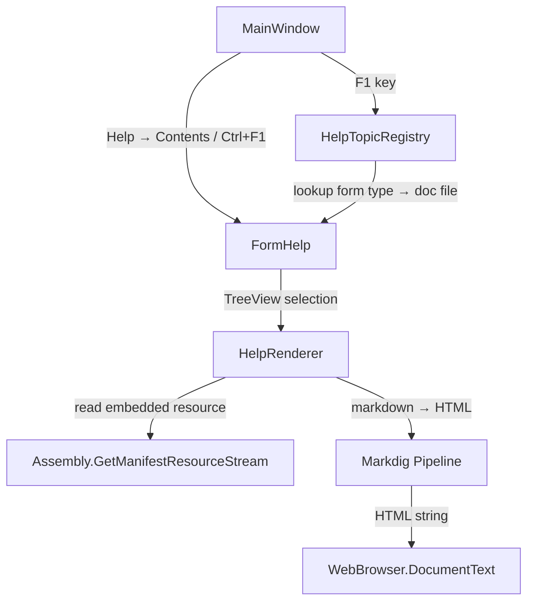

# Design Document: User Help Documentation

## Overview

This design adds an in-app help system to OE2 Empire Tracker. Markdown documentation files live in `docs/` at the repo root (readable on GitHub) and are embedded into the assembly at build time. A new `FormHelp` dialog renders them as HTML via Markdig, with a TreeView for navigation and a WebBrowser panel for display. Users access help through Help → Contents (Ctrl+F1) or F1 context-sensitive help that opens the page for the currently active MDI child form.

### Key Design Decisions

1. **Markdig for markdown-to-HTML** — lightweight, well-maintained, supports tables/code blocks/pipe tables out of the box. Added as a NuGet package via `packages.config`.
2. **Embedded resources with `<Link>`** — the `docs/` folder is outside the project directory, so each `.md` file uses `<EmbeddedResource Include="..\docs\{file}" /><Link>docs\{file}</Link>` in the csproj. This gives a predictable resource namespace of `OE2EmpireTracker.docs.{filename}`.
3. **WebBrowser control** — uses the built-in IE11 engine (WinForms default). Good enough for static HTML with inline CSS. No external dependencies.
4. **Non-MDI dialog** — `FormHelp` opens as a standalone dialog (`ShowDialog`), not an MDI child, so it floats above the workspace without interfering with the MDI layout.
5. **Static topic registry** — a simple `Dictionary<string, string>` mapping form type names to doc filenames. Easy to extend, no reflection magic.

## Architecture



The help system is self-contained with no dependencies on existing services or models. It reads only from embedded resources and renders to a local WebBrowser control.

## Components and Interfaces

### 1. HelpTopicRegistry (static class)

Location: `OE2EmpireTracker/Services/HelpTopicRegistry.cs`

Responsibilities:
- Maps form type names (strings) to documentation resource filenames
- Provides a method to get the doc filename for a given form type, falling back to `README.md`
- Provides an ordered list of all topics for TreeView population

```csharp
public static class HelpTopicRegistry
{
    // Returns the doc filename (e.g. "colonies.md") for a form type name,
    // or "README.md" if no mapping exists.
    public static string GetTopicForForm(string formTypeName);

    // Returns all topics in display order as (displayName, resourceFileName) tuples.
    public static IReadOnlyList<(string DisplayName, string FileName)> GetAllTopics();
}
```

### 2. HelpRenderer (static class)

Location: `OE2EmpireTracker/Services/HelpRenderer.cs`

Responsibilities:
- Loads markdown content from embedded resources
- Converts markdown to a complete HTML document using Markdig
- Wraps output in `<html><head><style>...</style></head><body>...</body></html>`

```csharp
public static class HelpRenderer
{
    // Loads the embedded resource and converts to a full HTML document string.
    // Returns null if the resource is not found.
    public static string RenderTopic(string resourceFileName);

    // Converts raw markdown text to a full HTML document string.
    public static string RenderMarkdown(string markdownContent);
}
```

### 3. FormHelp (Form)

Location: `OE2EmpireTracker/Forms/FormHelp.cs` + `FormHelp.Designer.cs`

Responsibilities:
- Displays a SplitContainer with TreeView (left) and WebBrowser (right)
- Populates TreeView from `HelpTopicRegistry.GetAllTopics()`
- On TreeView node selection, calls `HelpRenderer.RenderTopic()` and sets `WebBrowser.DocumentText`
- Intercepts WebBrowser navigation events to handle internal `.md` links
- Accepts an optional initial topic filename in its constructor

```csharp
public partial class FormHelp : Form
{
    public FormHelp(string initialTopic = null);
}
```

### 4. MainWindow Changes

- Add `contentsToolStripMenuItem` to the Help menu (above About), with `ShortcutKeys = Keys.Control | Keys.F1`
- Add click handler that opens `new FormHelp().ShowDialog(this)`
- Override `ProcessCmdKey` to handle F1: look up `ActiveMdiChild` type in `HelpTopicRegistry`, open `FormHelp` with that topic

### 5. Markdown Documentation Files

Location: `docs/` at repo root

Files:
| File | Topic |
|------|-------|
| `README.md` | Table of Contents |
| `getting-started.md` | Initial setup and workflow |
| `colonies.md` | Colony management |
| `blueprints.md` | Blueprint management |
| `surveys.md` | Survey management |
| `delivery-routes.md` | Delivery routes and execution |
| `player-profiles.md` | Player profile management |
| `background-processing.md` | Timer processing and status bar |
| `window-state.md` | Window position persistence |

## Data Models

This feature introduces no new data models or persistence changes. All data is static (embedded markdown resources and a hardcoded topic registry).

### Embedded Resource Naming Convention

For old-style csproj with `<EmbeddedResource Include="..\docs\README.md"><Link>docs\README.md</Link></EmbeddedResource>`, the resource name follows the pattern:

`{RootNamespace}.docs.{filename}` → e.g. `OE2EmpireTracker.docs.README.md`

Filenames with hyphens: the resource name preserves hyphens (unlike folder separators which become dots). So `delivery-routes.md` becomes `OE2EmpireTracker.docs.delivery-routes.md`.

### HelpTopicRegistry Mapping Data

```
FormColony           → colonies.md
FormBlueprint        → blueprints.md
FormSurvey           → surveys.md
FormDeliveryRoute    → delivery-routes.md
FormDeliveryExecution → delivery-routes.md
FormAutoFill         → delivery-routes.md
FormPlayerProfile    → player-profiles.md
FormColonyActivity   → colonies.md
FormColonyDailyBuild → colonies.md
```


## Correctness Properties

*A property is a characteristic or behavior that should hold true across all valid executions of a system — essentially, a formal statement about what the system should do. Properties serve as the bridge between human-readable specifications and machine-verifiable correctness guarantees.*

### Property 1: Rendered HTML has complete document structure

*For any* non-null markdown string, calling `HelpRenderer.RenderMarkdown()` should produce an HTML string that contains `<html>`, `<head>`, `<style`, and `<body>` elements.

**Validates: Requirements 2.3, 7.1, 7.2**

### Property 2: Topic registry returns correct mapping or fallback

*For any* string input to `HelpTopicRegistry.GetTopicForForm()`, the result should be the mapped documentation filename if the input matches a registered form type name, or `"README.md"` otherwise. Specifically, for all 9 registered form type names the correct filename is returned, and for any other string the result is `"README.md"`.

**Validates: Requirements 6.3, 6.4**

### Property 3: All registered topics render successfully

*For any* topic entry returned by `HelpTopicRegistry.GetAllTopics()`, calling `HelpRenderer.RenderTopic()` with that filename should return a non-null, non-empty HTML string.

**Validates: Requirements 3.3, 4.5**

### Property 4: Markdown rendering preserves content

*For any* markdown string containing a plain-text word, the rendered HTML output from `HelpRenderer.RenderMarkdown()` should contain that same word in the output. Content is not lost during conversion.

**Validates: Requirements 2.3, 7.4**

## Help Content Rebuild Process

The markdown files in `docs/` are the source of truth. They are embedded into the assembly at build time via `<EmbeddedResource>` entries in the csproj. Because the csproj entries are static (one per file), the embedded resources update automatically on every build — no special rebuild step is needed for content changes to existing files.

A manual step is only required when **adding or removing** a doc file. Here is the complete process:

### When editing existing docs (no csproj change needed)

1. Edit the markdown file(s) in `docs/`
2. Build the solution normally — the updated content is embedded automatically
3. Commit the changed markdown files

### When adding a new doc file

1. Create the new `.md` file in `docs/`
2. Add an `<EmbeddedResource>` entry to `OE2EmpireTracker/OE2EmpireTracker.csproj`:
   ```xml
   <EmbeddedResource Include="..\docs\new-topic.md">
     <Link>docs\new-topic.md</Link>
   </EmbeddedResource>
   ```
3. Add the topic to `HelpTopicRegistry.GetAllTopics()` with a display name
4. If the topic maps to a form, add the mapping in `HelpTopicRegistry.GetTopicForForm()`
5. Add a link to the new page in `docs/README.md` (table of contents)
6. Build and verify the topic appears in the help form's TreeView
7. Commit all changes together

### When removing a doc file

1. Remove the `<EmbeddedResource>` entry from the csproj
2. Remove the topic from `HelpTopicRegistry`
3. Remove the link from `docs/README.md`
4. Delete the `.md` file from `docs/`
5. Build and verify
6. Commit all changes together

### Verification

After any doc change, run the `HelpRendererTests.RenderTopic_AllRegisteredTopics_ReturnNonNull` test to confirm all registered topics have matching embedded resources. This test will fail if a topic is registered but its file is missing or not embedded.

## Error Handling

| Scenario | Behavior |
|----------|----------|
| Embedded resource not found for a topic | `HelpRenderer.RenderTopic()` returns `null`. `FormHelp` displays a "Topic not available" message in the WebBrowser panel. |
| Malformed markdown content | Markdig handles gracefully — produces best-effort HTML. No crash. |
| WebBrowser navigation to external URL | `Navigating` event handler cancels navigation for any URL that isn't `about:blank`. Internal `.md` links are intercepted and loaded from embedded resources. |
| F1 pressed with no MDI children | Falls through to `README.md` (Table of Contents). |
| F1 pressed with unmapped form type | `HelpTopicRegistry.GetTopicForForm()` returns `README.md`. |

All errors are logged via NLog (`Log.Warn` or `Log.Error`) before displaying user-facing fallback content.

## Testing Strategy

### Property-Based Tests (FsCheck + FsCheck.NUnit)

The test project already uses FsCheck 2.16.6 with FsCheck.NUnit. Each property test runs a minimum of 100 iterations.

| Test | Property | Description |
|------|----------|-------------|
| `HelpRendererPropertyTests.RenderMarkdown_AlwaysProducesCompleteHtmlStructure` | Property 1 | Generate random non-null strings, verify output contains required HTML elements |
| `HelpTopicRegistryPropertyTests.GetTopicForForm_ReturnsCorrectMappingOrFallback` | Property 2 | Generate random strings, verify mapped types return correct file, others return README.md |
| `HelpRendererPropertyTests.RenderMarkdown_PreservesPlainTextContent` | Property 4 | Generate random alphanumeric words, embed in markdown, verify word appears in HTML output |

Each test is tagged with: `// Feature: user-help-docs, Property {N}: {title}`

### Unit Tests (NUnit)

| Test | Validates | Description |
|------|-----------|-------------|
| `HelpRendererTests.RenderTopic_AllRegisteredTopics_ReturnNonNull` | Property 3 | Iterate all topics from registry, verify each renders |
| `HelpRendererTests.RenderTopic_UnknownResource_ReturnsNull` | Req 3.4 | Pass a non-existent filename, verify null return |
| `HelpRendererTests.RenderMarkdown_Headings_ProducesHTag` | Req 7.4 | `# Heading` → contains `<h1>` |
| `HelpRendererTests.RenderMarkdown_Bold_ProducesStrongTag` | Req 7.4 | `**bold**` → contains `<strong>` |
| `HelpRendererTests.RenderMarkdown_CodeBlock_ProducesPreTag` | Req 7.4 | Fenced code block → contains `<pre>` |
| `HelpRendererTests.RenderMarkdown_Table_ProducesTableTag` | Req 7.4 | Pipe table → contains `<table>` |
| `HelpRendererTests.RenderMarkdown_List_ProducesListTags` | Req 7.4 | `- item` → contains `<ul>` and `<li>` |
| `HelpTopicRegistryTests.GetAllTopics_Returns9Topics` | Req 1.3 | Verify count and filenames |
| `HelpTopicRegistryTests.GetTopicForForm_EachMappedType_ReturnsCorrectFile` | Req 6.3 | Verify each of the 9 specific mappings |

### Test Configuration

- Property tests: minimum 100 iterations via `[Property(MaxTest = 100)]`
- Unit tests: standard NUnit `[Test]` attributes
- Test file locations:
  - `OE2EmpireTracker.Tests/Services/HelpRendererTests.cs`
  - `OE2EmpireTracker.Tests/Services/HelpRendererPropertyTests.cs`
  - `OE2EmpireTracker.Tests/Services/HelpTopicRegistryTests.cs`
  - `OE2EmpireTracker.Tests/Services/HelpTopicRegistryPropertyTests.cs`
