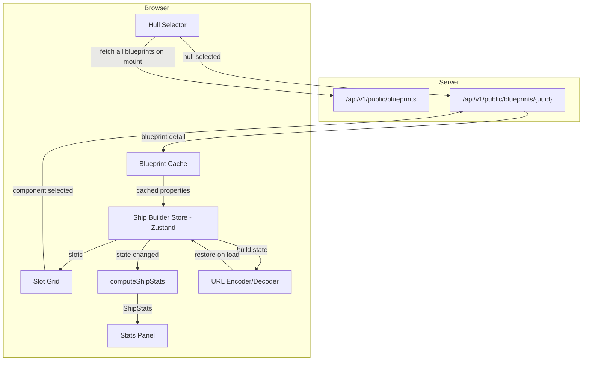
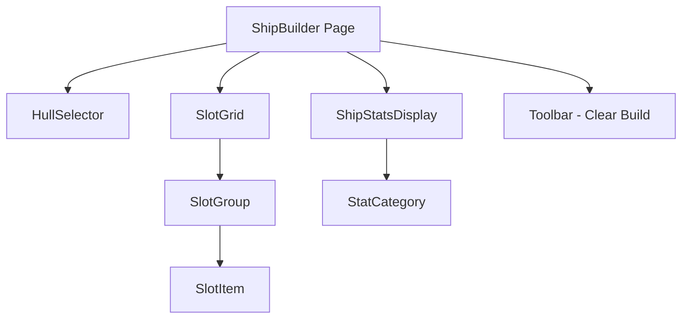

# Design Document: Web Ship Template Builder

## Overview

The Web Ship Template Builder is a public (no authentication) page at `/ship-builder` that allows visitors to design ship loadouts by selecting a hull and filling component slots, with live-computed stats displayed as components are added or changed. It ports the core `ShipBuildService.ComputeStats` algorithm to client-side TypeScript and follows the same architectural pattern as the Colony Planner (`/planner`): Zustand store, public API data fetching, React components, and blueprint property caching.

Key design decisions:
1. **Client-side computation** — After fetching blueprint data from the public API, all stats calculations happen in-browser. No server round-trips for stat updates.
2. **Blueprint detail caching** — Fetched blueprint details are cached in the Zustand store to avoid redundant API calls when the same component is installed in multiple slots.
3. **Slot generation from hull properties** — Slot types and counts are derived from the hull's blueprint properties using the `SlotTypes.HullPropertyToSlotType` mapping.
4. **No persistence** — Builds exist only in client-side state. URL sharing encodes the build compactly for link sharing.
5. **Pure computation function** — Stats computation is a pure function (`computeShipStats`) that can be property-tested independently.

## Architecture

### High-Level Data Flow



### Component Architecture



### Design Decisions

| Decision | Choice | Rationale |
|----------|--------|-----------|
| Computation location | Client-side (TypeScript) | Eliminates server round-trips; algorithm is arithmetic only |
| State management | Zustand store | Consistent with Colony Planner pattern; lightweight, good TS inference |
| Blueprint list fetch | Single fetch on mount (page=1, pageSize=10000) | All blueprints needed for filtering; list is stable |
| Blueprint detail fetch | Imperative fetch + Zustand cache | Details fetched on-demand; cached to avoid re-fetching |
| Slot dropdowns | FilteredDropdown (existing component) | Reuses existing searchable dropdown; consistent UX |
| Stats computation | Pure function (no side effects) | Enables property-based testing; called synchronously on store change |
| URL sharing | Hash fragment with compact encoding | No page reload; compact representation for sharing |
| Slot type mapping | Static TypeScript constants mirroring C# SlotTypes | Single source of truth; easy to verify against server |


## Components and Interfaces

### New/Modified Files

```
OE2EmpireTracker.Web/src/
├── pages/ship-builder/
│   ├── ShipBuilder.tsx              # NEW — main page component
│   ├── HullSelector.tsx             # NEW — searchable hull dropdown with class display
│   ├── SlotGrid.tsx                 # NEW — grouped slot display with dropdowns
│   ├── SlotGroup.tsx                # NEW — single group of slots (e.g. "Core", "Defence")
│   ├── SlotItem.tsx                 # NEW — individual slot with FilteredDropdown
│   ├── ShipStatsDisplay.tsx         # NEW — computed stats panel with categories
│   ├── shipBuilderStore.ts          # NEW — Zustand store for build state
│   ├── computeShipStats.ts          # NEW — pure function for stats computation
│   ├── slotTypes.ts                 # NEW — slot type constants and mappings
│   ├── urlCodec.ts                  # NEW — URL encode/decode for build sharing
│   ├── computeShipStats.test.ts     # NEW — unit tests
│   ├── computeShipStats.property.test.ts  # NEW — property-based tests
│   ├── shipBuilderStore.test.ts     # NEW — store tests
│   ├── urlCodec.test.ts             # NEW — URL codec tests
│   └── slotTypes.test.ts            # NEW — slot mapping tests
├── components/layout/
│   └── Sidebar.tsx                  # MODIFIED — add "Ship Builder" to publicNavItems
├── App.tsx                          # MODIFIED — add /ship-builder route
└── utils/
    └── blueprintHelpers.ts          # MODIFIED — add parsePropertyValue reuse (already exists)
```

### Key Interfaces

#### Ship Builder Store (`shipBuilderStore.ts`)

```typescript
import { create } from 'zustand';

export interface ComponentSlot {
  slotType: string;          // e.g. "Reactor", "WeaponSmall"
  slotIndex: number;         // 0-based within type
  blueprintUUID: string | null;  // installed component UUID or null
}

export interface BlueprintSummary {
  uuid: string;
  name: string;              // extendedName from API
  bluePrintType: string;     // e.g. "Reactor", "Beamer/Small"
  class: number;             // ship class (2-8)
}

export interface BlueprintDetail {
  uuid: string;
  name: string;
  bluePrintType: string;
  class: number;
  properties: Record<string, string>;  // raw property key-value pairs
}

export interface ShipBuilderState {
  // Blueprint data
  blueprintList: BlueprintSummary[];
  blueprintCache: Record<string, BlueprintDetail>;  // UUID → detail
  blueprintListLoading: boolean;
  blueprintListError: string | null;

  // Build state
  selectedHullUUID: string | null;
  hullDetail: BlueprintDetail | null;
  slots: ComponentSlot[];
  stats: ShipStats | null;

  // Loading/error per-slot
  loadingUUIDs: Set<string>;  // UUIDs currently being fetched
  slotErrors: Record<string, string>;  // slotKey → error message

  // Actions
  loadBlueprintList: () => Promise<void>;
  selectHull: (uuid: string) => Promise<void>;
  installComponent: (slotType: string, slotIndex: number, uuid: string | null) => Promise<void>;
  clearBuild: () => void;
  restoreFromURL: (encoded: string) => Promise<void>;
}
```

#### Stats Computation (`computeShipStats.ts`)

```typescript
export interface ShipStats {
  // Core
  totalMass: number;
  powerGenerated: number;
  powerConsumed: number;
  powerBalance: number;
  engCapacityUsed: number;
  engCapacityAvailable: number;

  // Capacity
  cargoCapacity: number;
  fuelCapacity: number;
  hopperCapacity: number;

  // Defence
  totalHealth: number;
  energyDefence: number;
  kineticDefence: number;
  missileDefence: number;
  shieldHitpoints: number;
  shieldRegen: number;

  // Propulsion (raw + derived)
  acceleration: number;
  rotationalThrust: number;
  accelerationFactor: number;
  turnRate: number;

  // Jump (raw + derived)
  maxJumpDistance: number;
  fuelPerJump: number;
  jumpFuelPerJAS: number;
  jumpFuelRange: number;
  jumpChargeTime: number;

  // Power model
  powerProvided: number;
  powerRegenRate: number;
  shieldPowerDraw: number;
  shieldUptime: number;        // -1 means infinite
  totalWeaponPowerDraw: number;
  weaponSustainTime: number;   // -1 means infinite

  // Per-type sustainability
  weaponSustainByType: WeaponSustainEntry[];
  miningSustainByType: MiningSustainEntry[];

  // Mining
  miningYield: number;
  miningCycleTime: number;

  // Scanning
  scanLevel: number;

  // Weapons installed count
  smallWeaponsInstalled: number;
  mediumWeaponsInstalled: number;
  largeWeaponsInstalled: number;
}

export interface WeaponSustainEntry {
  weaponType: string;
  powerDrawPerSecond: number;
  count: number;
  sustainableCount: number;
}

export interface MiningSustainEntry {
  laserType: string;
  powerDrawPerSecond: number;
  count: number;
  sustainableCount: number;
}

/**
 * Pure function: computes ship stats from hull properties and installed component properties.
 * Mirrors ShipBuildService.ComputeStats algorithm.
 *
 * @param hullDetail - The hull blueprint detail (properties + type info)
 * @param componentDetails - Array of installed component blueprint details (may contain nulls for empty slots)
 * @returns Computed ShipStats
 */
export function computeShipStats(
  hullDetail: BlueprintDetail,
  componentDetails: (BlueprintDetail | null)[]
): ShipStats;
```


#### Slot Types (`slotTypes.ts`)

```typescript
/** Maps hull blueprint property names to slot type identifiers */
export const HULL_PROPERTY_TO_SLOT_TYPE: Record<string, string> = {
  'Reactor Slots': 'Reactor',
  'Main Drive Slots': 'MainDrive',
  'Thruster Slots': 'Thruster',
  'Jump Drive Slots': 'JumpDrive',
  'Nav Comp Slots': 'NavComp',
  'Scanner Slots': 'Scanner',
  'Shield Slots': 'Shield',
  'Cargo Pod Slots': 'CargoPod',
  'Fuel Tank Slots': 'FuelTank',
  'Coupler Slots': 'Coupler',
  'GERTY Slots': 'GERTY',
  'Small Weapon Mounts': 'WeaponSmall',
  'Medium Weapon Mounts': 'WeaponMedium',
  'Large Weapon Mounts': 'WeaponLarge',
  'Max Hull Plating': 'HullPlating',
  'Max Hull Reinforcement': 'HullReinforcement',
  'Max Hull Sealant Units': 'HullSealant',
  'Max Mining Lasers': 'MiningLaser',
  'Max Mining Grapples': 'MiningGrapple',
  'Max Ore Hoppers': 'OreHopper',
};

/** Maps blueprint type strings to their compatible slot type */
export const BLUEPRINT_TYPE_TO_SLOT_TYPE: Record<string, string> = {
  'Reactor': 'Reactor',
  'MainDrive': 'MainDrive',
  'Thruster': 'Thruster',
  'JumpDrive': 'JumpDrive',
  'NavComp': 'NavComp',
  'SystemObjectScanner': 'Scanner',
  'Shield': 'Shield',
  'CargoPod': 'CargoPod',
  'FuelTank': 'FuelTank',
  'UniversalCoupler': 'Coupler',
  'GERTYDroneRack': 'GERTY',
  'HullPlating': 'HullPlating',
  'HullReinforcement': 'HullReinforcement',
  'HullSealantInjectionUnit': 'HullSealant',
  'MiningLaser': 'MiningLaser',
  'AsteroidGrapple': 'MiningGrapple',
  'OreHopper': 'OreHopper',
  // Weapons — size suffix determines slot type
  'Beamer/Small': 'WeaponSmall',
  'Railgun/Small': 'WeaponSmall',
  'CoilGun/Small': 'WeaponSmall',
  'MissileLauncher/Small': 'WeaponSmall',
  'TorpedoLauncher/Small': 'WeaponSmall',
  'Beamer/Medium': 'WeaponMedium',
  'Railgun/Medium': 'WeaponMedium',
  'CoilGun/Medium': 'WeaponMedium',
  'MissileLauncher/Medium': 'WeaponMedium',
  'TorpedoLauncher/Medium': 'WeaponMedium',
  'Beamer/Large': 'WeaponLarge',
  'Railgun/Large': 'WeaponLarge',
  'CoilGun/Large': 'WeaponLarge',
  'MissileLauncher/Large': 'WeaponLarge',
  'TorpedoLauncher/Large': 'WeaponLarge',
};

/** Display names for slot types */
export const SLOT_TYPE_DISPLAY_NAMES: Record<string, string> = {
  'Reactor': 'Reactor',
  'MainDrive': 'Main Drive',
  'Thruster': 'Thruster',
  'JumpDrive': 'Jump Drive',
  'NavComp': 'Nav Comp',
  'Scanner': 'Scanner',
  'Shield': 'Shield',
  'CargoPod': 'Cargo Pod',
  'FuelTank': 'Fuel Tank',
  'Coupler': 'Coupler',
  'GERTY': 'GERTY',
  'HullPlating': 'Hull Plating',
  'HullReinforcement': 'Hull Reinforcement',
  'HullSealant': 'Hull Sealant',
  'MiningLaser': 'Mining Laser',
  'MiningGrapple': 'Mining Grapple',
  'OreHopper': 'Ore Hopper',
  'WeaponSmall': 'Small Weapon',
  'WeaponMedium': 'Medium Weapon',
  'WeaponLarge': 'Large Weapon',
};

/** Slot group definitions for display ordering */
export const SLOT_GROUPS: { label: string; slotTypes: string[] }[] = [
  { label: 'Core', slotTypes: ['Reactor', 'MainDrive', 'Thruster', 'JumpDrive', 'NavComp', 'Scanner'] },
  { label: 'Defence', slotTypes: ['Shield', 'HullPlating', 'HullReinforcement', 'HullSealant'] },
  { label: 'Capacity', slotTypes: ['CargoPod', 'FuelTank', 'OreHopper', 'Coupler', 'GERTY'] },
  { label: 'Weapons', slotTypes: ['WeaponSmall', 'WeaponMedium', 'WeaponLarge'] },
  { label: 'Mining', slotTypes: ['MiningLaser', 'MiningGrapple'] },
];

/** Get compatible blueprint types for a given slot type */
export function getCompatibleBlueprintTypes(slotType: string): string[] {
  return Object.entries(BLUEPRINT_TYPE_TO_SLOT_TYPE)
    .filter(([, st]) => st === slotType)
    .map(([bpType]) => bpType);
}

/** Generate slots from hull properties */
export function generateSlotsFromHull(properties: Record<string, string>): ComponentSlot[] {
  const slots: ComponentSlot[] = [];
  for (const [propKey, slotType] of Object.entries(HULL_PROPERTY_TO_SLOT_TYPE)) {
    const count = Math.floor(Number(properties[propKey] ?? '0'));
    if (count > 0) {
      for (let i = 0; i < count; i++) {
        slots.push({ slotType, slotIndex: i, blueprintUUID: null });
      }
    }
  }
  return slots;
}
```


#### URL Codec (`urlCodec.ts`)

```typescript
/**
 * Encodes build state into a compact URL hash fragment.
 * Format: #build=<hullUUID>:<comp0UUID>,<comp1UUID>,...
 * Empty slots are encoded as empty string between commas.
 * Example: #build=abc-123:def-456,,ghi-789
 */
export function encodeBuild(hullUUID: string, slots: ComponentSlot[]): string;

/**
 * Decodes a URL hash fragment into build state.
 * Returns null if the hash is empty or doesn't contain build data.
 * Returns an error result if the format is invalid.
 */
export function decodeBuild(hash: string): DecodedBuild | null;

export interface DecodedBuild {
  hullUUID: string;
  componentUUIDs: (string | null)[];  // positional, null = empty slot
}

export interface DecodeError {
  type: 'malformed' | 'invalid-uuid';
  message: string;
}
```


## Data Models

### Blueprint List Response (from `/api/v1/public/blueprints`)

The public blueprints endpoint returns a paginated list. Each item includes (wire format, camelCase):

```typescript
interface BlueprintListItem {
  uuid: string;
  name: string;              // short name
  extendedName: string;      // human-readable full name
  bluePrintType: string;     // e.g. "Hull", "Reactor", "Beamer/Small"
  class: number;             // ship class (2-8)
  techLevel?: string;
  evolution?: string;
}
```

### Blueprint Detail Response (from `/api/v1/public/blueprints/{uuid}`)

```typescript
interface BlueprintDetailResponse {
  uuid: string;
  name: string;
  extendedName: string;
  bluePrintType: string;
  class: number;
  properties: Record<string, string>;  // key-value pairs as strings
}
```

### Relevant Property Keys (matching C# `BlueprintPropertyKeys`)

| Property Key | Type | Used For |
|-------------|------|----------|
| `"Mass"` | decimal | Additive — total mass |
| `"Power Generated"` | decimal | Additive — total power generated |
| `"Power Consumed"` | decimal | Additive — total power consumed |
| `"Cargo Capacity"` | decimal | Additive — cargo space |
| `"Fuel Capacity"` | decimal | Additive — fuel tank size |
| `"Raw Material Capacity"` | decimal | Additive — ore hopper |
| `"Health"` | decimal | Additive — hull HP |
| `"Energy Defence"` | decimal | Additive |
| `"Kinetic Defence"` | decimal | Additive |
| `"Missile Defence"` | decimal | Additive |
| `"Shield Hitpoints"` | decimal | Additive |
| `"Shield Regen"` | decimal | Additive |
| `"Acceleration"` | decimal | Additive |
| `"Rotational Thrust"` | decimal | Additive |
| `"Jump Distance"` | decimal | Additive |
| `"Fuel Per Jump"` | decimal | Additive |
| `"Mining Yield"` | decimal | Additive |
| `"Mining Cycle Time"` | decimal | Additive |
| `"Scan Level"` | integer | Maximum (not sum) |
| `"Eng Capacity Required"` | decimal | Component only — additive |
| `"Eng Capacity Available"` | decimal | Hull only — read once |
| `"Power Provided"` | decimal | Reactor only — additive |
| `"Power Regeneration Rate"` | decimal | Reactor only — additive |
| `"Power Draw Per Second"` | decimal | Shield/Weapon/Mining — type-specific |
| `"Jump Charge Time"` | decimal | NavComp — last wins |
| `"Fuel Used / JAS / Mass"` | decimal | JumpDrive — last wins |

### Stats Computation Algorithm

The TypeScript `computeShipStats` function mirrors `ShipBuildService.ComputeStats`:

**Phase 1: Accumulate raw stats**
1. Sum additive properties across hull + all installed components (Mass, PowerGenerated, PowerConsumed, CargoCapacity, FuelCapacity, RawMaterialCapacity, Health, EnergyDefence, KineticDefence, MissileDefence, ShieldHitpoints, ShieldRegen, Acceleration, RotationalThrust, JumpDistance, FuelPerJump, MiningYield, MiningCycleTime)
2. Take maximum for ScanLevel (not sum)
3. Read EngCapacityAvailable from hull only
4. Sum EngCapacityRequired from components only (hull excluded)
5. Sum PowerProvided and PowerRegenRate from Reactor components
6. Sum ShieldPowerDraw from Shield components (PowerDrawPerSecond)
7. Sum TotalWeaponPowerDraw from weapon components (PowerDrawPerSecond); track per-type draws
8. Track MiningLaser PowerDrawPerSecond per-type
9. Use last JumpChargeTime from NavComp components
10. Use last FuelPerJASPerMass from JumpDrive components

**Phase 2: Compute derived stats**
- `AccelerationFactor = Acceleration / TotalMass` (0 when TotalMass is 0)
- `TurnRate = RotationalThrust / TotalMass` (0 when TotalMass is 0)
- `JumpFuelPerJAS = FuelPerJASPerMass × TotalMass`
- `JumpFuelRange = FuelCapacity / JumpFuelPerJAS` (0 when JumpFuelPerJAS is 0)
- `ShieldUptime = PowerProvided / (ShieldPowerDraw - PowerRegenRate)` when ShieldPowerDraw > PowerRegenRate; -1 (infinite) when ShieldPowerDraw ≤ PowerRegenRate
- `WeaponSustainTime = PowerProvided / (TotalWeaponPowerDraw - PowerRegenRate)` when TotalWeaponPowerDraw > PowerRegenRate; -1 (infinite) when TotalWeaponPowerDraw ≤ PowerRegenRate
- Per-type `SustainableCount = PowerRegenRate / PowerDrawPerSecond` (0 when draw is 0)
- `PowerBalance = PowerGenerated - PowerConsumed`

**Weapon type identification:** A blueprint type is a weapon if it starts with: `Beamer`, `CoilGun`, `Railgun`, `MissileLauncher`, or `TorpedoLauncher`.


## Correctness Properties

### Property 1: Stats computation is a pure function of inputs

*For any* valid hull detail and component detail array, calling `computeShipStats(hull, components)` with the same inputs SHALL always produce the same `ShipStats` output, regardless of call order, timing, or prior invocations.

**Validates: Requirements 9.1**

### Property 2: Additive properties are commutative

*For any* permutation of the component details array, `computeShipStats` SHALL produce identical results. The order in which components are processed does not affect additive sums.

**Validates: Requirements 9.2**

### Property 3: ScanLevel uses maximum, not sum

*For any* set of blueprints where multiple define ScanLevel, the resulting `stats.scanLevel` SHALL equal the maximum ScanLevel value across all blueprints (hull + components), not the sum.

**Validates: Requirements 9.3**

### Property 4: Engineering capacity separates hull from components

*For any* build, `engCapacityAvailable` SHALL come exclusively from the hull's "Eng Capacity Available" property, and `engCapacityUsed` SHALL be the sum of "Eng Capacity Required" from components only (hull excluded).

**Validates: Requirements 9.4**

### Property 5: Derived stats are consistent with raw stats

*For any* build where TotalMass > 0, `accelerationFactor × totalMass` SHALL equal `acceleration` (within floating-point tolerance). Similarly, `turnRate × totalMass` SHALL equal `rotationalThrust`.

**Validates: Requirements 5.4, 9.7**

### Property 6: Shield uptime infinite when draw ≤ regen

*For any* build where `shieldPowerDraw ≤ powerRegenRate`, `shieldUptime` SHALL be -1 (representing infinite). When `shieldPowerDraw > powerRegenRate`, `shieldUptime` SHALL be `powerProvided / (shieldPowerDraw - powerRegenRate)`.

**Validates: Requirements 5.4**

### Property 7: Weapon sustain time infinite when draw ≤ regen

*For any* build where `totalWeaponPowerDraw ≤ powerRegenRate`, `weaponSustainTime` SHALL be -1 (representing infinite). When `totalWeaponPowerDraw > powerRegenRate`, `weaponSustainTime` SHALL be `powerProvided / (totalWeaponPowerDraw - powerRegenRate)`.

**Validates: Requirements 5.4**

### Property 8: Blueprint cache prevents redundant fetches

*For any* blueprint UUID that has been previously fetched and cached, installing that blueprint in another slot SHALL NOT trigger an additional API call.

**Validates: Requirements 6.2, 6.3**

### Property 9: Slot generation matches hull properties

*For any* hull with property "X Slots": N (where N > 0), `generateSlotsFromHull` SHALL produce exactly N slots of the corresponding type. Properties with value 0 or missing SHALL produce no slots.

**Validates: Requirements 2.4**

### Property 10: Component filtering respects slot type AND class

*For any* slot of type T on a hull of class C, the compatible blueprints shown SHALL include only those where `BLUEPRINT_TYPE_TO_SLOT_TYPE[bluePrintType] === T` AND `blueprint.class === C`.

**Validates: Requirements 4.2, 4.3**

### Property 11: URL encode/decode round-trip

*For any* valid build state (hull UUID + slot component UUIDs), encoding then decoding SHALL produce the original state. `decodeBuild(encodeBuild(hull, slots))` SHALL equal the original hull and component UUIDs.

**Validates: Requirements 11.1, 11.2, 11.3, 11.4**

### Property 12: Missing properties default to zero

*For any* blueprint detail where one or more property keys are missing or non-numeric, only the missing/invalid properties SHALL default to 0. All other valid properties SHALL retain their parsed numeric values.

**Validates: Requirements 9.2**


## Error Handling

### Error Handling Strategy

The ship builder uses a simplified error handling approach since it has no authentication and minimal server interaction.

#### Blueprint List Fetch Errors

| Scenario | Behavior |
|----------|----------|
| Network error on initial load | Show error message with retry button; hull selector disabled |
| Server 5xx | Same as network error |
| Successful fetch after error | Hide error, enable hull selector |

#### Blueprint Detail Fetch Errors (Hull)

| Scenario | Behavior |
|----------|----------|
| Network error fetching hull detail | Show error on hull selector; do not generate slots |
| Server 404 | Show "Hull not found" error |
| Successful fetch | Clear error, generate slots, compute stats |

#### Blueprint Detail Fetch Errors (Component)

| Scenario | Behavior |
|----------|----------|
| Network error fetching component detail | Show error indicator on affected slot; slot remains changeable |
| Server 404 | Show "Component not found" on slot |
| Successful fetch | Clear slot error, install component, recompute stats |

#### URL Restore Errors

| Scenario | Behavior |
|----------|----------|
| Hull UUID not in blueprint list | Show error "Hull not found in shared link"; start empty |
| Component UUID not in blueprint list | Skip that slot, restore others; show warning |
| Malformed URL encoding | Ignore URL state; start empty; show error |

#### Duplicate Request Prevention

The store tracks `loadingUUIDs` (a Set of blueprint UUIDs currently being fetched). Before initiating a fetch, check if the UUID is already in this set. If so, skip the fetch and wait for the existing request to complete.

### TanStack Query is NOT used

Unlike the Colony Planner which uses TanStack Query for the flatpack list, the Ship Builder fetches the full blueprint list imperatively in the store's `loadBlueprintList` action. This is because:
1. The list is needed immediately and completely (all blueprints for filtering)
2. No pagination or filtering is done server-side
3. The store already manages loading/error state
4. Simpler mental model — all state in one Zustand store


## Testing Strategy

### Testing Approach

The ship builder uses a combination of unit tests and property-based tests, all running in Vitest with fast-check.

### Unit Tests

| Test File | Coverage |
|-----------|----------|
| `computeShipStats.test.ts` | All computation rules: additive sums, ScanLevel max, derived stats, edge cases (zero mass, no components, infinite sustain) |
| `slotTypes.test.ts` | `generateSlotsFromHull` with various hull properties, `getCompatibleBlueprintTypes` for each slot type, display name completeness |
| `shipBuilderStore.test.ts` | Store actions: loadBlueprintList, selectHull, installComponent, clearBuild, blueprint cache behavior, error states |
| `urlCodec.test.ts` | Encode/decode round-trip, empty slots, malformed input, invalid UUIDs, missing hull |
| `ShipBuilder.test.tsx` | Integration: select hull → slots appear, install component → stats update, clear build → reset |

### Property-Based Tests (fast-check)

```typescript
// computeShipStats.property.test.ts
import fc from 'fast-check';
import { computeShipStats } from './computeShipStats';

const arbProperties = fc.dictionary(
  fc.constantFrom('Mass', 'Power Generated', 'Cargo Capacity', 'Health',
    'Acceleration', 'Rotational Thrust', 'Scan Level'),
  fc.nat({ max: 10000 }).map(String)
);

const arbBlueprintDetail = fc.record({
  uuid: fc.uuid(),
  name: fc.string({ minLength: 1, maxLength: 30 }),
  bluePrintType: fc.constantFrom('Reactor', 'Shield', 'CargoPod', 'MainDrive',
    'Beamer/Small', 'CoilGun/Medium', 'MiningLaser', 'NavComp', 'JumpDrive'),
  class: fc.integer({ min: 2, max: 8 }),
  properties: arbProperties,
});

// Property 1: Pure function (deterministic)
it('produces identical output for identical input', () => {
  fc.assert(fc.property(
    arbBlueprintDetail,
    fc.array(arbBlueprintDetail, { maxLength: 20 }),
    (hull, components) => {
      const result1 = computeShipStats(hull, components);
      const result2 = computeShipStats(hull, components);
      expect(result1).toEqual(result2);
    }
  ), { numRuns: 100 });
});

// Property 2: Additive properties are commutative
it('component order does not affect additive stats', () => {
  fc.assert(fc.property(
    arbBlueprintDetail,
    fc.array(arbBlueprintDetail, { minLength: 2, maxLength: 10 }),
    (hull, components) => {
      const result1 = computeShipStats(hull, components);
      const shuffled = [...components].reverse();
      const result2 = computeShipStats(hull, shuffled);
      expect(result1.totalMass).toBeCloseTo(result2.totalMass);
      expect(result1.cargoCapacity).toBeCloseTo(result2.cargoCapacity);
      expect(result1.totalHealth).toBeCloseTo(result2.totalHealth);
    }
  ), { numRuns: 100 });
});

// Property 5: Derived stats consistency
it('accelerationFactor * totalMass equals acceleration', () => {
  fc.assert(fc.property(
    arbBlueprintDetail,
    fc.array(arbBlueprintDetail, { maxLength: 10 }),
    (hull, components) => {
      const stats = computeShipStats(hull, components);
      if (stats.totalMass > 0) {
        expect(stats.accelerationFactor * stats.totalMass)
          .toBeCloseTo(stats.acceleration, 5);
      } else {
        expect(stats.accelerationFactor).toBe(0);
      }
    }
  ), { numRuns: 100 });
});

// Property 11: URL round-trip
it('encode then decode produces original state', () => {
  fc.assert(fc.property(
    fc.uuid(),
    fc.array(fc.option(fc.uuid(), { nil: null }), { maxLength: 30 }),
    (hullUUID, componentUUIDs) => {
      const slots = componentUUIDs.map((uuid, i) => ({
        slotType: 'Reactor', slotIndex: i, blueprintUUID: uuid,
      }));
      const encoded = encodeBuild(hullUUID, slots);
      const decoded = decodeBuild(encoded);
      expect(decoded).not.toBeNull();
      expect(decoded!.hullUUID).toBe(hullUUID);
      expect(decoded!.componentUUIDs).toEqual(componentUUIDs);
    }
  ), { numRuns: 100 });
});
```

### Test Execution

```bash
# Run all ship builder tests
npx vitest run src/pages/ship-builder/

# Run property tests specifically
npx vitest run src/pages/ship-builder/*.property.test.ts

# Full frontend verification
npm run build
```
