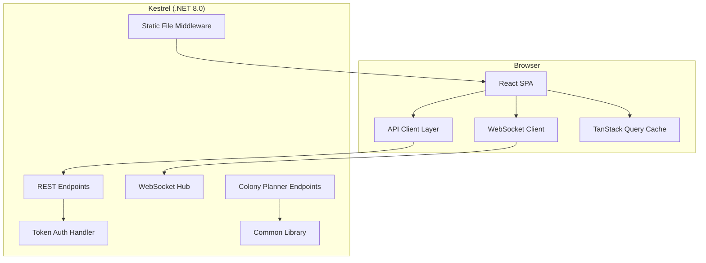
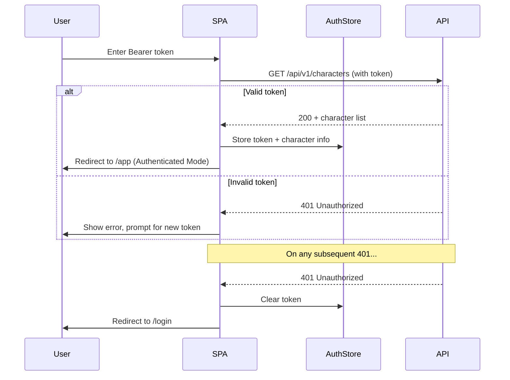
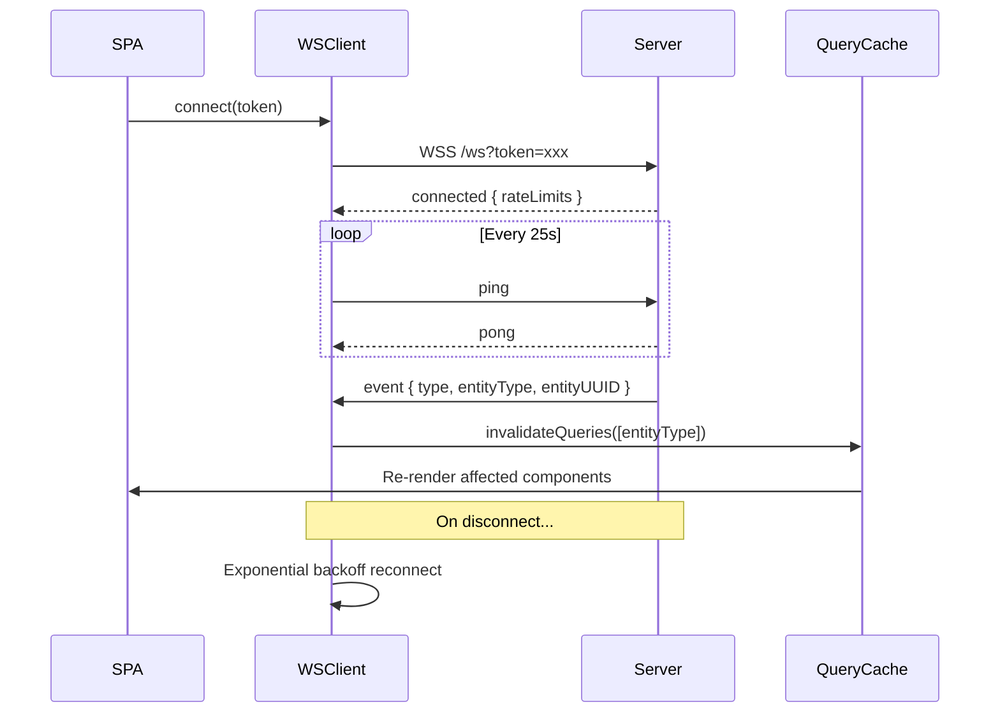
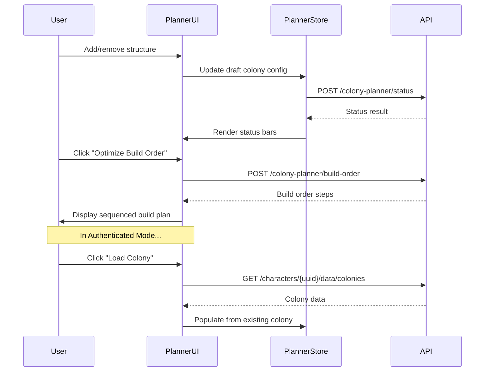

# Design Document: Web UI Frontend

## Overview

The OE2 Empire Tracker Web UI is a React + TypeScript single-page application built with Vite, served as static files from the existing .NET 8.0 Kestrel server. It provides two access modes:

1. **Public Mode** — unauthenticated, view-only access to publicly shared blueprints, surveys, and the colony planner
2. **Authenticated Mode** — full CRUD access to character data, faction views, real-time WebSocket updates, and sharing management

The frontend lives in `OE2EmpireTracker.Web/` at the solution root. Production builds output to `OE2EmpireTracker.Server/wwwroot/` so that `dotnet publish` produces a single deployment artifact containing both API and UI.

Colony planning computations remain server-side — the frontend sends colony configurations to new `/api/v1/colony-planner/` endpoints that invoke the existing Common library services (ColonyStatusCalculator, BuildOrderOptimizer, ColonyBuildEligibility).

## Architecture

### High-Level Architecture



### Technology Stack Decisions

| Concern | Choice | Rationale |
|---------|--------|-----------|
| Framework | React 19 | Mature ecosystem, hooks-based, large community |
| Build Tool | Vite 6 | Fast HMR, native ESM, simple config, excellent TypeScript support |
| Language | TypeScript (strict mode) | Type safety, generated types from C# models |
| Routing | React Router v7 | De facto standard, supports lazy loading, path-based routing |
| State/Data | TanStack Query v5 | Server-state caching, automatic refetch, mutation support, WebSocket invalidation |
| Local State | Zustand | Lightweight, no boilerplate, good TypeScript support for UI-only state (auth, sidebar) |
| Component Library | Radix UI + Tailwind CSS | Unstyled accessible primitives + utility-first CSS. No heavy component library lock-in |
| HTTP Client | ky (fetch wrapper) | Tiny, typed, supports hooks/interceptors, built on fetch API |
| Type Generation | NSwag (via CLI) | Generates TypeScript interfaces from .NET assemblies, handles enums/nullables/DateTime |
| Linting | ESLint + typescript-eslint | Standard React/TS linting |
| Testing | Vitest + Testing Library | Fast, Vite-native, good React integration |

### Design Decisions

1. **TanStack Query over Redux/MobX**: The app is primarily server-state driven. TanStack Query handles caching, background refetch, optimistic updates, and stale-while-revalidate out of the box. No need for a general-purpose state manager for server data.

2. **Zustand for UI state**: Auth tokens, sidebar collapse state, active character selection — these are client-only concerns that don't need the overhead of TanStack Query. Zustand is ~1KB and has excellent TypeScript inference.

3. **Radix + Tailwind over MUI/Ant Design**: The app needs accessible components without opinionated styling. Radix provides unstyled primitives (dialogs, dropdowns, tabs) that we style with Tailwind. This avoids fighting a component library's design system.

4. **ky over axios**: ky is smaller (~3KB vs ~13KB), built on native fetch, and provides the interceptor pattern we need for auth token injection and 401 handling.

5. **NSwag for type generation**: The server is .NET 8.0 with well-defined models in Common and Server projects. NSwag can generate TypeScript interfaces directly from the compiled assemblies, handling C# enums, nullable types, and DateTime → string conversion.

6. **Server-side colony planning**: The Common library already has ColonyStatusCalculator, BuildOrderOptimizer, and ColonyBuildEligibility. Duplicating this logic in TypeScript would be error-prone and create a maintenance burden. The frontend sends colony state to the server and displays results.


## Components and Interfaces

### Project Structure

```
OE2EmpireTracker.Web/
├── index.html
├── package.json
├── tsconfig.json
├── vite.config.ts
├── tailwind.config.ts
├── eslint.config.js
├── public/
│   └── config.json              # Runtime configuration (API base URL, version)
├── src/
│   ├── main.tsx                 # Entry point, providers
│   ├── App.tsx                  # Root component, router setup
│   ├── api/
│   │   ├── client.ts            # ky instance with auth interceptor
│   │   ├── types/               # Auto-generated TypeScript interfaces (NSwag output)
│   │   │   └── generated.ts
│   │   ├── endpoints/
│   │   │   ├── characters.ts    # Character API methods
│   │   │   ├── factions.ts      # Faction API methods
│   │   │   ├── data.ts          # Character data CRUD
│   │   │   ├── sharing.ts       # Sharing rules API
│   │   │   ├── colony-planner.ts # Colony planner API
│   │   │   ├── public.ts        # Public data endpoints
│   │   │   └── global.ts        # Global/baseline data
│   │   └── hooks/
│   │       ├── useCharacters.ts
│   │       ├── useBlueprints.ts
│   │       ├── useSurveys.ts
│   │       ├── useColonies.ts
│   │       ├── useColonyPlanner.ts
│   │       ├── useFaction.ts
│   │       └── useSharing.ts
│   ├── auth/
│   │   ├── store.ts             # Zustand auth store (token, character, role)
│   │   ├── AuthGuard.tsx        # Route protection component
│   │   └── LoginPage.tsx
│   ├── ws/
│   │   ├── WebSocketClient.ts   # WebSocket connection manager
│   │   └── useWebSocket.ts      # Hook for WS lifecycle
│   ├── components/
│   │   ├── layout/
│   │   │   ├── AppShell.tsx     # Sidebar + header + content area
│   │   │   ├── Sidebar.tsx
│   │   │   ├── Header.tsx
│   │   │   └── Footer.tsx
│   │   ├── common/
│   │   │   ├── LoadingSpinner.tsx
│   │   │   ├── ErrorBoundary.tsx
│   │   │   ├── RetryableError.tsx
│   │   │   ├── EmptyState.tsx
│   │   │   ├── DataTable.tsx
│   │   │   └── FilterBar.tsx
│   │   └── domain/
│   │       ├── BlueprintCard.tsx
│   │       ├── SurveyCard.tsx
│   │       ├── ColonyStatusBar.tsx
│   │       └── BuildOrderList.tsx
│   ├── pages/
│   │   ├── public/
│   │   │   ├── BlueprintBrowser.tsx
│   │   │   ├── BlueprintDetail.tsx
│   │   │   ├── SurveyBrowser.tsx
│   │   │   └── SurveyDetail.tsx
│   │   ├── planner/
│   │   │   ├── ColonyPlanner.tsx
│   │   │   ├── StructurePanel.tsx
│   │   │   ├── StatusDisplay.tsx
│   │   │   └── BuildOrderView.tsx
│   │   ├── authenticated/
│   │   │   ├── Dashboard.tsx
│   │   │   ├── ColonyManager.tsx
│   │   │   ├── BlueprintManager.tsx
│   │   │   ├── SurveyManager.tsx
│   │   │   ├── ProfileEditor.tsx
│   │   │   ├── FactionView.tsx
│   │   │   └── SharingConfig.tsx
│   │   └── NotFound.tsx
│   ├── hooks/
│   │   └── useRuntimeConfig.ts  # Reads public/config.json
│   └── utils/
│       ├── formatters.ts        # Date, number, resource formatting
│       └── constants.ts         # Client-side constants
└── scripts/
    └── generate-types.ts        # NSwag type generation script
```


### Key Interfaces

#### API Client (`src/api/client.ts`)

```typescript
import ky from 'ky';
import { useAuthStore } from '../auth/store';

const getApiBaseUrl = (): string => {
  // Read from runtime config (public/config.json)
  return window.__OE2_CONFIG__?.apiBaseUrl ?? '';
};

export const apiClient = ky.create({
  prefixUrl: getApiBaseUrl(),
  hooks: {
    beforeRequest: [
      (request) => {
        const token = useAuthStore.getState().token;
        if (token) {
          request.headers.set('Authorization', `Bearer ${token}`);
        }
      },
    ],
    afterResponse: [
      (_request, _options, response) => {
        if (response.status === 401) {
          useAuthStore.getState().logout();
        }
      },
    ],
  },
});
```

#### Auth Store (`src/auth/store.ts`)

```typescript
import { create } from 'zustand';
import { persist } from 'zustand/middleware';

interface AuthState {
  token: string | null;
  characterName: string | null;
  characterUUID: string | null;
  role: string | null;
  isAuthenticated: boolean;
  login: (token: string) => Promise<void>;
  logout: () => void;
  switchCharacter: (uuid: string) => void;
}

export const useAuthStore = create<AuthState>()(
  persist(
    (set, get) => ({
      token: null,
      characterName: null,
      characterUUID: null,
      role: null,
      isAuthenticated: false,
      login: async (token: string) => {
        // Validate token by calling /health or /api/v1/characters
        // Store on success, clear on failure
        set({ token, isAuthenticated: true });
      },
      logout: () => {
        set({ token: null, characterName: null, characterUUID: null, role: null, isAuthenticated: false });
      },
      switchCharacter: (uuid: string) => {
        set({ characterUUID: uuid });
      },
    }),
    { name: 'oe2-auth' }
  )
);
```

#### WebSocket Client (`src/ws/WebSocketClient.ts`)

```typescript
export class WebSocketClient {
  private ws: WebSocket | null = null;
  private reconnectAttempts = 0;
  private maxReconnectAttempts = 10;
  private pingInterval: ReturnType<typeof setInterval> | null = null;
  private onEvent: (event: ServerPushEvent) => void;

  constructor(onEvent: (event: ServerPushEvent) => void) {
    this.onEvent = onEvent;
  }

  connect(token: string): void {
    const baseUrl = window.__OE2_CONFIG__?.apiBaseUrl ?? '';
    const wsUrl = baseUrl.replace(/^http/, 'ws') + `/ws?token=${token}`;
    this.ws = new WebSocket(wsUrl);
    this.ws.onopen = () => this.onOpen();
    this.ws.onmessage = (e) => this.onMessage(e);
    this.ws.onclose = () => this.onClose();
  }

  disconnect(): void { /* clean close + clear ping interval */ }

  private onOpen(): void {
    this.reconnectAttempts = 0;
    this.startPing();
  }

  private onMessage(event: MessageEvent): void {
    const data = JSON.parse(event.data);
    if (data.type === 'pong') return;
    this.onEvent(data);
  }

  private onClose(): void {
    this.stopPing();
    this.reconnectWithBackoff();
  }

  private startPing(): void {
    this.pingInterval = setInterval(() => {
      this.ws?.send('ping');
    }, 25_000); // 25s, within server's 60s heartbeat timeout
  }

  private reconnectWithBackoff(): void {
    if (this.reconnectAttempts >= this.maxReconnectAttempts) return;
    const delay = Math.min(1000 * 2 ** this.reconnectAttempts, 30_000);
    this.reconnectAttempts++;
    setTimeout(() => this.connect(/* stored token */), delay);
  }
}
```

#### Colony Planner API (`src/api/endpoints/colony-planner.ts`)

```typescript
import { apiClient } from '../client';
import type { ColonyPlannerRequest, ColonyStatusResult, BuildOrderResult, EligibilityResult } from '../types/generated';

export const colonyPlannerApi = {
  computeStatus: (request: ColonyPlannerRequest) =>
    apiClient.post('api/v1/colony-planner/status', { json: request }).json<ColonyStatusResult>(),

  optimizeBuildOrder: (request: ColonyPlannerRequest) =>
    apiClient.post('api/v1/colony-planner/build-order', { json: request }).json<BuildOrderResult>(),

  checkEligibility: (request: ColonyPlannerRequest) =>
    apiClient.post('api/v1/colony-planner/eligibility', { json: request }).json<EligibilityResult>(),
};
```


### Build Pipeline Integration

#### Vite Configuration (`vite.config.ts`)

```typescript
import { defineConfig } from 'vite';
import react from '@vitejs/plugin-react';
import path from 'path';

export default defineConfig({
  plugins: [react()],
  build: {
    outDir: path.resolve(__dirname, '../OE2EmpireTracker.Server/wwwroot'),
    emptyOutDir: true,
    rollupOptions: {
      output: {
        // Content-hashed filenames for cache busting
        entryFileNames: 'assets/[name]-[hash].js',
        chunkFileNames: 'assets/[name]-[hash].js',
        assetFileNames: 'assets/[name]-[hash].[ext]',
      },
    },
  },
  server: {
    port: 3000,
    proxy: {
      '/api': {
        target: 'https://localhost:5443',
        changeOrigin: true,
        secure: false, // Self-signed cert in dev
      },
      '/ws': {
        target: 'wss://localhost:5443',
        ws: true,
        secure: false,
      },
      '/health': {
        target: 'https://localhost:5443',
        secure: false,
      },
    },
  },
});
```

#### Package Scripts (`package.json`)

```json
{
  "scripts": {
    "dev": "vite",
    "build": "npm run generate-types && tsc --noEmit && vite build",
    "preview": "vite preview",
    "typecheck": "tsc --noEmit",
    "lint": "eslint src/",
    "generate-types": "npx ts-node scripts/generate-types.ts"
  }
}
```

#### Server Integration

The server's `Program.cs` needs these additions for SPA serving:

```csharp
// After all API endpoint mappings:
app.UseStaticFiles(new StaticFileOptions
{
    OnPrepareResponse = ctx =>
    {
        // Long cache for hashed assets, no-cache for index.html
        if (ctx.File.Name == "index.html")
        {
            ctx.Context.Response.Headers.CacheControl = "no-cache, no-store, must-revalidate";
        }
        else
        {
            ctx.Context.Response.Headers.CacheControl = "public, max-age=31536000, immutable";
        }
    }
});

// SPA fallback — return index.html for unmatched routes
app.MapFallbackToFile("index.html");
```

### Routing Design

```typescript
// src/App.tsx — Route structure
const router = createBrowserRouter([
  {
    path: '/',
    element: <AppShell />,
    errorElement: <NotFound />,
    children: [
      // Public routes (no auth required)
      { index: true, element: <Navigate to="/blueprints" /> },
      { path: 'blueprints', element: <BlueprintBrowser /> },
      { path: 'blueprints/:id', element: <BlueprintDetail /> },
      { path: 'surveys', element: <SurveyBrowser /> },
      { path: 'surveys/:id', element: <SurveyDetail /> },
      { path: 'planner', element: <ColonyPlanner /> },
      { path: 'login', element: <LoginPage /> },

      // Authenticated routes (wrapped in AuthGuard)
      {
        path: 'app',
        element: <AuthGuard />,
        children: [
          { index: true, element: <Dashboard /> },
          { path: 'colonies', element: <ColonyManager /> },
          { path: 'blueprints', element: <BlueprintManager /> },
          { path: 'surveys', element: <SurveyManager /> },
          { path: 'profile', element: <ProfileEditor /> },
          { path: 'faction', element: <FactionView /> },
          { path: 'sharing', element: <SharingConfig /> },
        ],
      },
    ],
  },
]);
```

### Authentication Flow



### WebSocket Integration



When a WebSocket event arrives, the client invalidates the relevant TanStack Query cache keys, triggering automatic refetch of affected data. This keeps the UI in sync without manual refresh.


### State Management Strategy

The application uses a **two-layer state model**:

1. **Server State (TanStack Query)** — All data fetched from the API. Cached, automatically refetched on window focus, invalidated by WebSocket events. This covers: characters, colonies, blueprints, surveys, factions, sharing rules, colony planner results.

2. **Client State (Zustand)** — UI-only state that doesn't come from the server. This covers: auth token, active character selection, sidebar collapsed state, planner draft state (before submission to API).

#### Query Key Convention

```typescript
// Query keys follow a hierarchical pattern for targeted invalidation
const queryKeys = {
  characters: ['characters'] as const,
  character: (uuid: string) => ['characters', uuid] as const,
  characterData: (uuid: string, dataType: string) => ['characters', uuid, 'data', dataType] as const,
  factions: ['factions'] as const,
  faction: (uuid: string) => ['factions', uuid] as const,
  factionShared: (uuid: string, dataType: string) => ['factions', uuid, 'shared', dataType] as const,
  publicBlueprints: (filters?: BlueprintFilters) => ['public', 'blueprints', filters] as const,
  publicSurveys: (filters?: SurveyFilters) => ['public', 'surveys', filters] as const,
  colonyPlannerStatus: (config: ColonyConfig) => ['planner', 'status', config] as const,
  colonyPlannerBuildOrder: (config: ColonyConfig) => ['planner', 'build-order', config] as const,
};
```

#### WebSocket → Query Invalidation Mapping

```typescript
// When a WebSocket event arrives, invalidate the matching query keys
function handleServerEvent(event: ServerPushEvent) {
  const { entityType, entityUUID, ownerCharacterUUID } = event;

  switch (entityType) {
    case 'colony':
      queryClient.invalidateQueries({ queryKey: ['characters', ownerCharacterUUID, 'data', 'colonies'] });
      break;
    case 'blueprint':
      queryClient.invalidateQueries({ queryKey: ['characters', ownerCharacterUUID, 'data', 'blueprints'] });
      queryClient.invalidateQueries({ queryKey: ['public', 'blueprints'] });
      break;
    case 'survey':
      queryClient.invalidateQueries({ queryKey: ['characters', ownerCharacterUUID, 'data', 'surveys'] });
      queryClient.invalidateQueries({ queryKey: ['public', 'surveys'] });
      break;
    case 'faction':
      queryClient.invalidateQueries({ queryKey: ['factions'] });
      break;
  }
}
```

### Type Generation Approach

NSwag CLI generates TypeScript interfaces from the compiled .NET assemblies:

```typescript
// scripts/generate-types.ts
// Invokes NSwag CLI to:
// 1. Load OE2EmpireTracker.Common.dll and OE2EmpireTracker.Server.dll
// 2. Extract all public model classes (Models/ namespace)
// 3. Extract all request/response DTOs (*Request, *Result types)
// 4. Generate TypeScript interfaces with:
//    - C# enums → TypeScript string literal unions
//    - DateTime → string (ISO 8601)
//    - Nullable<T> → T | null
//    - List<T> → T[]
//    - Dictionary<K,V> → Record<K, V>
// 5. Output to src/api/types/generated.ts with header comment
```

The `npm run generate-types` script:
1. Builds the .NET solution (ensures assemblies are current)
2. Runs NSwag with a configuration file pointing to the built DLLs
3. Outputs `src/api/types/generated.ts`

Generated types include a header:
```typescript
// This file is auto-generated by NSwag. Do not edit manually.
// Regenerate with: npm run generate-types
// Source: OE2EmpireTracker.Common + OE2EmpireTracker.Server assemblies
```


### Colony Planner Architecture

The colony planner is the most complex frontend feature. It uses server-side computation with a responsive frontend interface.

#### Server-Side Endpoints (New)

```
POST /api/v1/colony-planner/status
  Body: { structures: [...], items: {...} }
  Response: { powerProvided, powerRequired, habitationProvision, habitationRequired, ... }

POST /api/v1/colony-planner/build-order
  Body: { structures: [...], targetStructures: [...], items: {...} }
  Response: { steps: [{ sequence, structureName, resourcesRequired, timeEstimate }] }

POST /api/v1/colony-planner/eligibility
  Body: { structures: [...], items: {...} }
  Response: { eligible: boolean, stagedCount, buildingCount, firstStaged: {...} }
```

These endpoints are stateless — they accept colony state as input, invoke Common library services, and return computed results. No authentication required (public access).

#### Frontend Planner Flow



The planner maintains a local draft state (Zustand) that represents the colony configuration being designed. On each change, it debounces a call to the status endpoint (300ms) to avoid excessive API calls during rapid editing.

## Data Models

### Runtime Configuration (`public/config.json`)

```typescript
interface RuntimeConfig {
  apiBaseUrl: string;       // e.g., "" (same origin) or "https://server.example.com:5443"
  version: string;          // Build-time injected version string
  pathPrefix?: string;      // For reverse proxy path prefix support
}
```

### Auth State

```typescript
interface AuthState {
  token: string | null;
  characterName: string | null;
  characterUUID: string | null;
  role: 'Owner' | 'FactionLeader' | 'Character' | null;
  isAuthenticated: boolean;
}
```

### WebSocket Event

```typescript
interface ServerPushEvent {
  type: string;             // "created" | "updated" | "deleted" | "timerTick" | ...
  entityType: string;       // "colony" | "blueprint" | "survey" | "faction" | ...
  entityUUID: string;
  timestamp: string;        // ISO 8601
  ownerCharacterUUID?: string;
}
```

### Colony Planner Models

```typescript
interface ColonyPlannerRequest {
  structures: PlannerStructure[];
  items?: PlannerItemBag;
  playerSkills?: PlannerSkills;
}

interface PlannerStructure {
  flatpackBlueprintUUID: string;
  isBuilt: boolean;
  isStaged: boolean;
  isOnline: boolean;
  buildQueueSequence: number;
  assignedWorkers?: Record<string, boolean>;
}

interface ColonyStatusResult {
  powerProvided: number;
  powerRequired: number;
  habitationProvision: number;
  habitationRequired: number;
  foodProvision: number;
  foodRequired: number;
  entertainmentProvided: number;
  entertainmentRequired: number;
  warehouseCapacity: number;
  warehouseRequired: number;
}

interface BuildOrderResult {
  steps: BuildOrderStep[];
  totalTimeEstimate: string;
}

interface BuildOrderStep {
  sequence: number;
  structureName: string;
  blueprintType: string;
  resourcesRequired: ResourceRequirement[];
  timeEstimate: string;
}

interface EligibilityResult {
  eligible: boolean;
  stagedCount: number;
  buildingCount: number;
  firstStagedStructure?: PlannerStructure;
}
```

### API Error Response

```typescript
interface ApiError {
  status: number;
  error: string;
  details?: Record<string, string[]>;  // Validation errors by field
}
```


## Correctness Properties

*A property is a characteristic or behavior that should hold true across all valid executions of a system — essentially, a formal statement about what the system should do. Properties serve as the bridge between human-readable specifications and machine-verifiable correctness guarantees.*

### Property 1: Authenticated requests include Bearer token

*For any* API request made while the auth store contains a non-null token, the request's Authorization header SHALL equal `Bearer {token}`.

**Validates: Requirements 4.1, 13.2**

### Property 2: 401 responses clear authentication state

*For any* API response with HTTP status 401, the auth store SHALL be cleared (token set to null, isAuthenticated set to false) regardless of which endpoint was called.

**Validates: Requirements 4.3**

### Property 3: Public mode hides mutation controls

*For any* page component rendered while `isAuthenticated` is false, the rendered output SHALL contain zero elements with mutation actions (create, edit, delete, save buttons/links).

**Validates: Requirements 5.3**

### Property 4: Blueprint filter correctness

*For any* set of blueprint filter criteria (type, tech level, ship class) applied to a list of blueprints, every blueprint in the filtered result SHALL match ALL active filter criteria simultaneously.

**Validates: Requirements 6.2**

### Property 5: Survey filter correctness

*For any* set of survey filter criteria (system, resource type, purity level) applied to a list of surveys, every survey in the filtered result SHALL match ALL active filter criteria simultaneously.

**Validates: Requirements 7.2**

### Property 6: WebSocket event triggers correct cache invalidation

*For any* server push event with a given `entityType`, the WebSocket event handler SHALL invalidate exactly the query keys that correspond to that entity type (and no others).

**Validates: Requirements 12.2**

### Property 7: Reconnection uses exponential backoff

*For any* sequence of N consecutive WebSocket disconnections (where N < maxReconnectAttempts), the delay before reconnection attempt N SHALL equal `min(1000 * 2^N, 30000)` milliseconds.

**Validates: Requirements 12.3**

### Property 8: API errors produce structured error objects

*For any* HTTP response with status >= 400, the API client SHALL return a structured error object containing at minimum the HTTP status code and an error message string.

**Validates: Requirements 13.3, 15.4**


## Error Handling

### Error Handling Strategy

The application uses a layered error handling approach:

#### Layer 1: API Client (centralized)

The `ky` instance handles all HTTP errors uniformly:
- **401 Unauthorized** → Clear auth store, redirect to login (Property 2)
- **429 Rate Limited** → Extract `Retry-After` header, show rate limit message
- **Network errors** → Throw with `isNetworkError: true` flag for retry UI
- **4xx errors** → Parse response body for structured error details
- **5xx errors** → Wrap in generic server error with retry option

```typescript
// Error types returned by the API client
type ApiResult<T> = 
  | { ok: true; data: T }
  | { ok: false; error: ApiError };

interface ApiError {
  status: number;
  message: string;
  isNetworkError: boolean;
  isRetryable: boolean;
  validationErrors?: Record<string, string[]>;
}
```

#### Layer 2: TanStack Query (per-query)

Each query/mutation hook configures:
- `retry: 3` for network errors and 5xx responses
- `retry: 0` for 4xx responses (client errors won't self-resolve)
- `staleTime` appropriate to the data type (30s for colony status, 5min for blueprints)

#### Layer 3: UI Components

Components use the query state to render appropriate feedback:
- `isLoading` → `<LoadingSpinner />`
- `isError && error.isNetworkError` → `<RetryableError onRetry={refetch} />`
- `isError && error.isRetryable` → `<RetryableError />`
- `isError && error.validationErrors` → Inline field-level error messages
- `data === undefined && !isLoading` → `<EmptyState />`

#### Layer 4: Error Boundary (catastrophic)

A React Error Boundary at the route level catches unhandled exceptions:
- Renders a "Something went wrong" page with a "Reload" button
- Logs the error for debugging
- Does NOT catch API errors (those are handled by layers 1-3)

### WebSocket Error Handling

- **Connection failure** → Exponential backoff reconnection (Property 7)
- **Message parse error** → Log and ignore malformed messages
- **Max reconnect attempts exceeded** → Show "Connection lost" banner with manual reconnect button
- **Token invalidated while connected** → Server closes with code 4001, client clears auth

## Testing Strategy

### Testing Approach

The frontend uses a dual testing strategy:

1. **Unit tests (Vitest + Testing Library)** — Component rendering, hook behavior, utility functions
2. **Property-based tests (fast-check)** — Universal properties of the API client, filter logic, and event handling

### Property-Based Testing Configuration

- Library: **fast-check** (TypeScript-native PBT library)
- Minimum iterations: **100 per property**
- Each test references its design document property via tag comment

```typescript
// Example property test structure
import fc from 'fast-check';
import { describe, it, expect } from 'vitest';

describe('API Client Properties', () => {
  // Feature: web-ui-frontend, Property 1: Authenticated requests include Bearer token
  it('attaches Bearer token to all authenticated requests', () => {
    fc.assert(
      fc.property(
        fc.string({ minLength: 1 }), // arbitrary token
        fc.string({ minLength: 1 }), // arbitrary endpoint path
        (token, path) => {
          // Setup auth store with token
          // Make request
          // Assert Authorization header === `Bearer ${token}`
        }
      ),
      { numRuns: 100 }
    );
  });
});
```

### Unit Test Coverage

Unit tests focus on:
- Component rendering in different states (loading, error, empty, populated)
- Auth flow (login, logout, token validation)
- WebSocket lifecycle (connect, disconnect, reconnect)
- Colony planner UI interactions
- Route protection (AuthGuard behavior)

### Integration Tests

Integration tests (using MSW for API mocking) cover:
- Full authentication flow end-to-end
- Colony planner: configure → submit → display results
- WebSocket event → UI update cycle
- Public mode navigation and data display

### Test File Organization

```
src/
├── api/__tests__/
│   ├── client.test.ts           # API client properties (PBT)
│   ├── client.unit.test.ts      # Specific error scenarios
│   └── endpoints.test.ts        # Endpoint method tests
├── auth/__tests__/
│   ├── store.test.ts            # Auth store behavior
│   └── AuthGuard.test.tsx       # Route protection
├── ws/__tests__/
│   ├── WebSocketClient.test.ts  # WS properties (PBT)
│   └── reconnect.test.ts       # Backoff algorithm (PBT)
├── components/__tests__/
│   ├── FilterBar.test.tsx       # Filter properties (PBT)
│   └── ...
└── pages/__tests__/
    ├── BlueprintBrowser.test.tsx
    ├── ColonyPlanner.test.tsx
    └── ...
```

