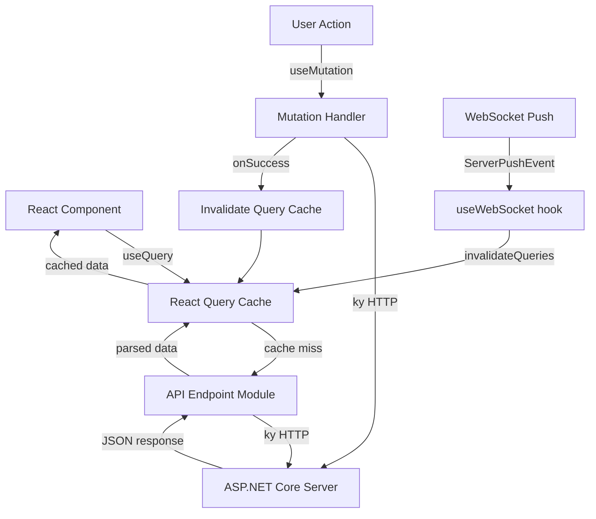

# Design Document: Web UI Forms Parity

## Overview

This design brings the OE2EmpireTracker web UI (React/TypeScript/Vite) to feature parity with the desktop WinForms application. The current web UI has basic CRUD list pages with inline text editing. The target state is rich, interactive forms with master-detail layouts, tabbed content, editable grids, filtered dropdowns, live timers, supply chain management, stock targets, pricing plans, and shared data viewing — matching the desktop app's capabilities.

The implementation builds on the existing foundation:
- **React 19** with **React Router 7** for routing
- **TanStack React Query 5** for server state management
- **Zustand 5** for client-side UI state
- **Tailwind CSS 4** for styling
- **ky** as the HTTP client
- **Radix UI** for accessible primitives (collapsible sections)
- **Vitest 4** + **fast-check 4** for testing

All data flows through the existing typed API endpoints (`/api/v1/characters/{uuid}/{entityType}`) and real-time updates arrive via the existing WebSocket connection.

## Architecture

### Component Hierarchy

```
App
├── AppShell (layout: Header + Sidebar + main content)
│   ├── Sidebar (navigation links to all form pages)
│   └── Routes
│       ├── /app/colonies → ColonyForm (master-detail)
│       ├── /app/blueprints → BlueprintForm (master-detail)
│       ├── /app/surveys → SurveyForm (master-detail)
│       ├── /app/profiles → ProfileForm (master-detail)
│       ├── /app/routes → RouteForm (master-detail + plan tab)
│       ├── /app/delivery → ExecutionForm (step-by-step)
│       ├── /app/ships → ShipTemplateForm (master-detail)
│       ├── /app/market → MarketForm (tabbed: Listings/Transactions/Summary)
│       ├── /app/supply-chains → SupplyChainForm (master-detail)
│       ├── /app/stock-targets → StockTargetForm (master-detail)
│       ├── /app/pricing-plans → PricingPlanForm (master-detail)
│       ├── /app/shared → SharedDataView (read-only multi-tab)
│       ├── /app/activity → ColonyActivityPage (grouped timers)
│       ├── /app/daily-build → DailyBuildPage (colony selector + build order)
│       ├── /app/build-planner → BuildPlannerForm (master-detail)
│       ├── /app/contacts → ContactsForm (master-detail)
│       ├── /app/stations → StationsForm (master-detail)
│       └── /app/asteroids → AsteroidsForm (master-detail)
└── WebSocket listener (invalidates React Query cache on push events)
```

### Data Flow



### State Management Strategy

| State Type | Tool | Example |
|-----------|------|---------|
| Server entities | React Query | Colony list, blueprint details |
| Selected entity | URL params or Zustand | Currently selected colony UUID |
| Form dirty state | Local component state | Unsaved changes flag |
| Filter values | Zustand (per-page store) | Text search, dropdown selections |
| UI transient state | useState | Active tab, expanded sections |
| Baseline data | React Query (staleTime: Infinity) | Ship classes, tech levels, commodities |

### Responsive Layout Strategy

The UI adapts to three breakpoint tiers:

| Breakpoint | Width | Layout |
|-----------|-------|--------|
| Desktop | ≥1024px | Side-by-side master-detail (list + detail panel) |
| Tablet | 768–1023px | Narrower list panel, detail panel fills remaining space |
| Mobile | <768px | Single-panel: list view collapses, detail panel takes full width; back button returns to list |

The `MasterDetailLayout` component handles responsive collapse internally using Tailwind responsive classes. On mobile, selecting an entity navigates to the detail view; a back button returns to the list.


## Components and Interfaces

### Shared Components

#### MasterDetailLayout

A reusable layout component that provides the standard two-panel pattern used by most forms. Handles responsive collapse to single-panel on mobile.

```typescript
interface MasterDetailLayoutProps {
  listPanel: ReactNode;       // Left panel: filterable entity list
  detailPanel: ReactNode;     // Right panel: selected entity details
  listWidth?: string;         // Default: 'w-1/3'
  selectedId?: string | null; // Controls mobile panel visibility
  onBack?: () => void;        // Mobile: return to list view
}
```

#### EditableGrid

A reusable editable table component for inline data entry (resources, properties, warehouse items). Cells are edited in place — click to activate, changes committed on blur or Enter.

```typescript
interface EditableGridProps<T> {
  columns: GridColumn<T>[];
  rows: T[];
  onRowChange: (index: number, row: T) => void;
  onRowAdd: () => void;
  onRowRemove: (index: number) => void;
  keyExtractor: (row: T) => string;
}

interface GridColumn<T> {
  key: string;
  header: string;
  type: 'text' | 'number' | 'select' | 'readonly';
  options?: { value: string; label: string }[];  // for select type
  render?: (row: T) => ReactNode;
}
```

#### FilteredDropdown

A searchable dropdown component for selecting from large lists (blueprints, colonies, commodities).

```typescript
interface FilteredDropdownProps {
  options: { value: string; label: string }[];
  value: string;
  onChange: (value: string) => void;
  placeholder?: string;
  filterFn?: (option: { value: string; label: string }, query: string) => boolean;
}
```

#### UnsavedChangesGuard

A component/hook that detects pending edits and blocks navigation. Always active — if detection becomes unavailable (component error), navigation is blocked entirely until restored.

```typescript
function useUnsavedChanges(isDirty: boolean): void;
// Uses react-router's useBlocker to prevent navigation when isDirty is true
// If the hook itself errors, defaults to blocking (fail-closed)
```

#### CountdownTimer

A component that displays a live-decrementing timer computed client-side from a known end time. Handles backgrounded tabs by recalculating on `visibilitychange` events.

```typescript
interface CountdownTimerProps {
  targetTime: string;  // ISO 8601 end timestamp
  onComplete?: () => void;
  className?: string;
  keepZero?: boolean;  // If true, stays at 00:00:00 after completion instead of hiding
}
```

#### InfiniteScrollList

A virtualized list component that loads additional pages as the user scrolls. Initial page size is 50 items.

```typescript
interface InfiniteScrollListProps<T> {
  queryKey: QueryKey;
  fetchPage: (pageParam: number) => Promise<T[]>;
  renderItem: (item: T) => ReactNode;
  keyExtractor: (item: T) => string;
  pageSize?: number;  // Default: 50
  filterValue?: string;
}
```


### Form Page Components

Each form page follows a consistent internal structure:

```typescript
// Example: ColonyForm
function ColonyForm() {
  // 1. Auth context
  const { characterUUID } = useAuthStore();
  
  // 2. Server state (React Query)
  const { data: colonies, isLoading } = useColonies(characterUUID);
  const { data: baseline } = useBaseline();
  
  // 3. Local UI state
  const [selectedId, setSelectedId] = useState<string | null>(null);
  const [activeTab, setActiveTab] = useState('structures');
  const [isDirty, setIsDirty] = useState(false);
  
  // 4. Mutations
  const { save, remove } = useColonyMutations();
  
  // 5. Unsaved changes guard (always active, fail-closed)
  useUnsavedChanges(isDirty);
  
  // 6. Render: MasterDetailLayout with list + detail
  return <MasterDetailLayout ... />;
}
```


### API Hook Layer

Each form page gets a dedicated React Query hook module:

| Hook Module | Entities | Endpoints Used |
|-------------|----------|----------------|
| `useColonies` (extend) | Colony, structures, items, requests | `/colonies`, sub-resources |
| `useBlueprints` (extend) | Blueprint | `/blueprints` |
| `useSurveys` (extend) | Survey | `/surveys` |
| `useProfiles` (new) | PlayerProfile | `/profiles` |
| `useDeliveryRoutes` (new) | DeliveryRoute | `/delivery-routes` |
| `useDeliveryPlans` (new) | DeliveryPlan | `/delivery-plans` |
| `useShipTemplates` (new) | ShipTemplate | `/ship-templates` |
| `useMarketListings` (new) | MarketListing | `/market-listings` |
| `useMarketTransactions` (new) | MarketTransaction | `/market-transactions` |
| `useBuildPlans` (new) | BuildPlan | `/build-plans` |
| `useBaseline` (new) | Baseline data | `/global/baseline` |
| `useContacts` (new) | ExternalCharacter | `/external-characters` |
| `useStations` (new) | Station | `/stations` |
| `useAsteroids` (new) | Asteroid | `/asteroids` |
| `useSupplyChains` (new) | SupplyChain | `/supply-chains` |
| `useStockProfiles` (new) | StockProfile | `/stock-profiles` |
| `useStockPlans` (new) | StockPlan (targets) | `/stock-plans` |
| `usePricingPlans` (new) | PricingPlan | `/pricing-plans` |
| `useSharedData` (new) | SharedDataSummary | `/shared-data` |

Each hook module exports:
- A `useXxx(charUUID)` query hook for the list
- A `useXxxDetail(charUUID, entityUUID)` query hook for a single entity
- A `useXxxMutations()` hook returning `{ save, remove }` mutation objects

### WebSocket Event Handling

The existing `useWebSocket` hook's `handleServerEvent` function invalidates queries for all entity types. Handles backgrounded tabs via the `visibilitychange` event — when the tab regains focus, all active timers recalculate their remaining time from the known end timestamp (compensating for throttled `setInterval` in background tabs).

```typescript
// handleServerEvent switch cases:
case 'colony':
case 'blueprint':
case 'survey':
case 'deliveryRoute':
case 'deliveryPlan':
case 'shipTemplate':
case 'marketListing':
case 'marketTransaction':
case 'buildPlan':
case 'playerProfile':
case 'station':
case 'asteroid':
case 'externalCharacter':
case 'supplyChain':
case 'stockProfile':
case 'stockPlan':
case 'pricingPlan':
  if (ownerCharacterUUID) {
    invalidate(queryKeys.characterData(ownerCharacterUUID, entityTypeToDataType(entityType)));
  }
  break;
```

#### Backgrounded Tab Handling

```typescript
// In useWebSocket or a dedicated useVisibilityRecovery hook:
useEffect(() => {
  const handleVisibility = () => {
    if (document.visibilityState === 'visible') {
      // Recalculate all active countdown timers from their known end times
      // (browser throttles setInterval to 1/sec or less when backgrounded)
      queryClient.invalidateQueries({ queryKey: ['timers'] });
    }
  };
  document.addEventListener('visibilitychange', handleVisibility);
  return () => document.removeEventListener('visibilitychange', handleVisibility);
}, []);
```

#### Connection Loss Handling

When the WebSocket connection drops:
1. Display a non-blocking "Reconnecting..." banner in the header
2. Attempt reconnection with exponential backoff (1s, 2s, 4s, 8s, max 30s)
3. On reconnection, invalidate all active queries to resync state
4. If disconnected for >60s, show a persistent "Connection lost" banner with manual retry


## Data Models

### Client-Side TypeScript Interfaces

These interfaces extend the auto-generated types to provide full domain model coverage for the web UI. They mirror the server-side Common_Library models.

```typescript
// Colony domain
interface Colony {
  uuid: string;
  colonyName: string;
  planetName: string;
  systemName: string;
  structures: ColonyStructure[];
  items: WarehouseItem[];
  commodityRequests: CommodityRequest[];
  lastImportUtc?: string;
}

interface ColonyStructure {
  uuid: string;
  flatpackBlueprintUUID: string;
  blueprintType: string;
  status: 'staged' | 'building' | 'built' | 'online';
  buildQueueSequence: number;
  assignedWorkers: Record<string, boolean>;
  processingEndUtc?: string;
}

interface WarehouseItem {
  uuid: string;
  name: string;
  itemType: string;
  purity?: string;
  quantity: number;
}

interface CommodityRequest {
  commodityName: string;
  quantity: number;
  needByDate?: string;
  isFulfilled: boolean;
}

// Blueprint domain
interface Blueprint {
  uuid: string;
  name: string;
  blueprintType: string;
  shipClass?: string;
  techLevel: number;
  evolution: number;
  nickName?: string;
  isGlobal: boolean;
  properties: Record<string, number>;
  resources: BlueprintResource[];
}

interface BlueprintResource {
  resourceName: string;
  quantity: number;
  purity?: string;
}

// Survey domain
interface Survey {
  uuid: string;
  planetName: string;
  systemName: string;
  surveyType: 'Planet' | 'Asteroid';
  nickName?: string;
  scannedBy?: string;
  scanDate?: string;
  sensorAbundance?: number;
  purityModifier?: number;
  scanLevel?: number;
  scannerBlueprint?: string;
  resources: SurveyResource[];
  assignedRigCount?: number;  // Used to disable delete when > 0
}

interface SurveyResource {
  resourceName: string;
  purity: string;
  amount: number;
  maxReserve?: number;
}

// Player Profile domain
interface PlayerProfile {
  uuid: string;
  name: string;
  faction?: string;
  totalCredits: number;
  skillPoints: number;
  ranks: ProfileRanks;
  skillGroups: SkillGroup[];
}

interface ProfileRanks {
  public: RankInfo;
  private: RankInfo;
  military: RankInfo;
}

interface RankInfo {
  level: number;
  currentXP: number;
  xpToNext: number;
}

interface SkillGroup {
  name: string;
  enabled: boolean;
  skills: Skill[];
}

interface Skill {
  name: string;
  level: number;
  isTraining: boolean;
}

// Delivery domain
interface DeliveryRoute {
  uuid: string;
  name: string;
  stops: RouteStop[];
}

interface RouteStop {
  uuid: string;
  colonyUUID: string;
  colonyName: string;
  planetName: string;
  systemName: string;
  sequence: number;
}

interface DeliveryPlan {
  uuid: string;
  routeUUID: string;
  name: string;
  isCompleted: boolean;
  stopItems: Record<string, StopItemSet>;  // keyed by stop UUID
}

interface StopItemSet {
  dropOff: DeliveryItem[];
  pickUp: DeliveryItem[];
}

interface DeliveryItem {
  uuid: string;
  itemType: string;
  name: string;
  purity?: string;
  quantity: number;
  isChecked: boolean;
}

// Ship Template domain
interface ShipTemplate {
  uuid: string;
  name: string;
  hullShipClass: string;
  slots: TemplateSlot[];
}

interface TemplateSlot {
  slotType: string;
  slotIndex: number;
  blueprintUUID?: string;
}

// Market domain
interface MarketListing {
  uuid: string;
  stationName: string;
  itemName: string;
  quantity: number;
  price: number;
  condition?: number;
  maxRepair?: number;
}

interface MarketTransaction {
  uuid: string;
  type: 'Buy' | 'Sell';
  itemName: string;
  quantity: number;
  price: number;
  stationName: string;
  counterparty?: string;
  faction?: string;
  transactionDate: string;
}

// Build Plan domain
interface BuildPlan {
  uuid: string;
  name: string;
  items: BuildPlanItem[];
}

interface BuildPlanItem {
  uuid: string;
  blueprintUUID: string;
  blueprintName: string;
  quantity: number;
  status: 'pending' | 'allocated' | 'complete';
  assignedColonyUUID?: string;
}

// Supply Chain domain
interface SupplyChain {
  uuid: string;
  name: string;
  sourceColonyUUID: string;
  sourceColonyName: string;
  destinationColonyUUID: string;
  destinationColonyName: string;
  steps: SupplyChainStep[];
}

interface SupplyChainStep {
  uuid: string;
  resourceOrCommodity: string;
  quantity: number;
  processingType: string;
  sequence: number;
}

// Stock Target domain
interface StockProfile {
  uuid: string;
  name: string;
  assignedColonyUUID?: string;
  assignedColonyName?: string;
  items: StockTargetItem[];
}

interface StockTargetItem {
  uuid: string;
  itemType: string;
  name: string;
  purity?: string;
  targetQuantity: number;
  currentQuantity?: number;
}

// Pricing Plan domain
interface PricingPlan {
  uuid: string;
  name: string;
  items: PricingPlanItem[];
}

interface PricingPlanItem {
  uuid: string;
  itemName: string;
  itemType: string;
  unitPrice: number;
}

// Shared Data domain
interface SharedDataSummary {
  characterUUID: string;
  characterName: string;
  faction: string;
  sharedTypes: ('blueprints' | 'surveys' | 'colonies')[];
}

// Supporting entities
interface ExternalCharacter {
  uuid: string;
  name: string;
  faction?: string;
  notes?: string;
}

interface Station {
  uuid: string;
  name: string;
  systemName: string;
  stationType?: string;
}

interface Asteroid {
  uuid: string;
  name: string;
  systemName: string;
  linkedSurveyUUID?: string;
}

// Baseline data (reference data from server)
interface BaselineData {
  blueprintTypes: string[];
  shipClasses: ShipClassDef[];
  techLevels: TechLevelDef[];
  commodities: CommodityDef[];
  resources: string[];
  purities: string[];
}

interface ShipClassDef {
  name: string;
  slots: SlotDefinition[];
}

interface SlotDefinition {
  slotType: string;
  count: number;
}

interface TechLevelDef {
  level: number;
  name: string;
}

interface CommodityDef {
  name: string;
  category: string;
}
```


### File Structure (New/Modified)

```
OE2EmpireTracker.Web/src/
├── api/
│   ├── endpoints/
│   │   ├── colonies.ts          (extend: sub-resource methods, bootstrap)
│   │   ├── blueprints.ts        (extend: typed responses)
│   │   ├── surveys.ts           (extend: typed responses)
│   │   ├── profiles.ts          (exists)
│   │   ├── delivery-routes.ts   (exists)
│   │   ├── delivery-plans.ts    (exists)
│   │   ├── ship-templates.ts    (exists)
│   │   ├── market-listings.ts   (exists)
│   │   ├── market-transactions.ts (exists)
│   │   ├── build-plans.ts       (exists)
│   │   ├── stations.ts          (exists)
│   │   ├── asteroids.ts         (exists)
│   │   ├── supply-chains.ts     (new)
│   │   ├── stock-profiles.ts    (new)
│   │   ├── stock-plans.ts       (new)
│   │   ├── pricing-plans.ts     (exists)
│   │   ├── shared-data.ts       (new)
│   │   └── global.ts            (extend: baseline endpoint)
│   ├── hooks/
│   │   ├── useColonies.ts       (extend: detail query, sub-resource mutations)
│   │   ├── useBlueprints.ts     (extend: detail query, mutations)
│   │   ├── useSurveys.ts        (extend: detail query, mutations)
│   │   ├── useProfiles.ts       (new)
│   │   ├── useDeliveryRoutes.ts (new)
│   │   ├── useDeliveryPlans.ts  (new)
│   │   ├── useShipTemplates.ts  (new)
│   │   ├── useMarketListings.ts (new)
│   │   ├── useMarketTransactions.ts (new)
│   │   ├── useBuildPlans.ts     (new)
│   │   ├── useBaseline.ts       (new)
│   │   ├── useContacts.ts       (new)
│   │   ├── useStations.ts       (new)
│   │   ├── useAsteroids.ts      (new)
│   │   ├── useSupplyChains.ts   (new)
│   │   ├── useStockProfiles.ts  (new)
│   │   ├── useStockPlans.ts     (new)
│   │   ├── usePricingPlans.ts   (new)
│   │   ├── useSharedData.ts     (new)
│   │   └── queryKeys.ts         (extend: new entity keys)
│   └── types/
│       ├── generated.ts         (existing auto-generated)
│       └── domain.ts            (new: domain interfaces above)
├── components/
│   ├── common/
│   │   ├── DataTable.tsx        (existing)
│   │   ├── FilterBar.tsx        (existing, extend with checkbox type)
│   │   ├── EditableGrid.tsx     (new)
│   │   ├── FilteredDropdown.tsx (new)
│   │   ├── CountdownTimer.tsx   (new)
│   │   ├── InfiniteScrollList.tsx (new)
│   │   ├── TabBar.tsx           (new)
│   │   ├── ConfirmDialog.tsx    (new)
│   │   └── MasterDetailLayout.tsx (new)
│   ├── domain/
│   │   ├── ColonyStatusBar.tsx  (existing, extend)
│   │   ├── EvolutionChart.tsx   (new: line chart for blueprint evolution)
│   │   ├── ShipStatsPanel.tsx   (new: live ship stats display)
│   │   ├── TimerGroup.tsx       (new: grouped countdown timers)
│   │   └── ConnectionBanner.tsx (new: WebSocket connection status)
│   └── layout/
│       └── Sidebar.tsx          (extend: add all nav links)
├── hooks/
│   ├── useUnsavedChanges.ts     (new)
│   ├── useVisibilityRecovery.ts (new: recalculate timers on tab focus)
│   └── useRuntimeConfig.ts      (existing)
├── pages/
│   └── authenticated/
│       ├── ColonyForm.tsx        (new, replaces ColonyManager)
│       ├── BlueprintForm.tsx     (new, replaces BlueprintManager)
│       ├── SurveyForm.tsx        (new, replaces SurveyManager)
│       ├── ProfileForm.tsx       (new, replaces ProfileEditor)
│       ├── RouteForm.tsx         (new)
│       ├── ExecutionForm.tsx     (new)
│       ├── ShipTemplateForm.tsx  (new)
│       ├── MarketForm.tsx        (new)
│       ├── SupplyChainForm.tsx   (new)
│       ├── StockTargetForm.tsx   (new)
│       ├── PricingPlanForm.tsx   (new)
│       ├── SharedDataView.tsx    (new)
│       ├── ColonyActivityPage.tsx (new)
│       ├── DailyBuildPage.tsx    (new)
│       ├── BuildPlannerForm.tsx  (new)
│       ├── ContactsForm.tsx     (new)
│       ├── StationsForm.tsx     (new)
│       └── AsteroidsForm.tsx    (new)
└── utils/
    ├── constants.ts             (existing, extend)
    ├── formatters.ts            (existing, extend)
    ├── timerUtils.ts            (new: countdown calculation helpers)
    └── filterUtils.ts           (new: client-side filter logic)
```


## Error Handling

### API Error Strategy

All API calls use a centralized error handler via the ky `beforeError` hook:

| HTTP Status | Behavior |
|-------------|----------|
| 401 | Redirect to login, clear auth state |
| 403 | Display "Access denied" toast, no retry |
| 404 | Display "Not found" message in detail panel |
| 409 | Conflict — refetch entity, show merge prompt |
| 422 | Validation error — display field-level messages |
| 429 | Rate limited — automatic retry with backoff (ky built-in) |
| 5xx | Display generic error toast with retry button |

### React Query Error Boundaries

Each form page wraps its content in an `ErrorBoundary` that catches render errors and displays a fallback UI with a retry button. Query errors are handled via React Query's `onError` callbacks and displayed inline.

### Optimistic Updates

Mutations that modify entity state (save, delete, reorder) use optimistic updates:
1. Immediately update the React Query cache with the expected result
2. If the mutation fails, roll back to the previous cache state
3. Display an error toast explaining what went wrong

### WebSocket Disconnection

When the WebSocket connection drops:
1. Display a non-blocking "Reconnecting..." indicator in the header via `ConnectionBanner`
2. Attempt reconnection with exponential backoff (1s, 2s, 4s, 8s, max 30s)
3. On reconnection, invalidate all active queries to resync state
4. If disconnected for >60s, show a persistent "Connection lost" banner with manual retry
5. Continue showing cached data throughout — the UI remains usable with stale data

### Colony-Specific Error Cases

- Bootstrap endpoint failure (POST /api/v1/characters/{uuid}/colonies/{colonyUuid}/bootstrap): display error toast, no rollback needed (server-side operation)
- Optimize endpoint failure (POST /api/v1/colony-planner/build-order): display error toast, structures remain in original order
- Survey delete when assigned to rigs: button is disabled with tooltip — no error state needed


## Correctness Properties

*A property is a characteristic or behavior that should hold true across all valid executions of a system — essentially, a formal statement about what the system should do. Properties serve as the bridge between human-readable specifications and machine-verifiable correctness guarantees.*

### Property 1: Filter Determinism

*For any* entity list (colonies, blueprints, surveys, routes, supply chains) and *for any* combination of filter parameters (text search, dropdown selections, checkbox states), applying the filter produces the same output regardless of application order or timing, and every item in the output matches all active filter criteria.

**Validates: Requirements 1.1, 2.1, 2.2, 3.1, 3.2, 5.1, 10.3, 14.1**

### Property 2: Reorder Invariant

*For any* ordered list of items (route stops, supply chain steps) and *for any* sequence of up/down move operations, the resulting list is a valid permutation of the original items with correct sequential numbering (no gaps, no duplicates, all original items present).

**Validates: Requirements 5.4, 14.5**

### Property 3: Unsaved Changes Detection

*For any* form state where `isDirty === true`, navigation away from that form is blocked until the user explicitly confirms discard or saves. If the unsaved-changes hook itself becomes unavailable, all navigation is blocked (fail-closed).

**Validates: Requirements 10.7**

### Property 4: Timer Computation Accuracy

*For any* known end timestamp and *for any* current wall-clock time, the countdown display equals `max(0, endTime - currentTime)` in seconds. After a tab is backgrounded and refocused, the displayed value recalculates from the end timestamp (not from the last displayed value), producing the correct remaining time regardless of how long the tab was hidden.

**Validates: Requirements 11.2, 18.3, 18.4**

### Property 5: Shared Data Read-Only Invariant

*For any* entity displayed in the Shared Data view, no edit, save, or delete controls are rendered. The rendered output contains only read-only display elements regardless of the entity type or content.

**Validates: Requirements 17.4**

### Property 6: WebSocket Event Completeness

*For any* entity type that can be modified on the server (colony, blueprint, survey, deliveryRoute, deliveryPlan, shipTemplate, marketListing, marketTransaction, buildPlan, playerProfile, station, asteroid, externalCharacter, supplyChain, stockProfile, stockPlan, pricingPlan), the WebSocket event handler invalidates the correct React Query cache key.

**Validates: Requirements 18.1, 18.2**

### Property 7: Optimistic Update Rollback

*For any* entity state S and *for any* failed mutation M, after optimistic cache update followed by rollback, the cache state is identical to the pre-mutation state S.

**Validates: Requirements 10.5**

### Property 8: Import Staleness Classification

*For any* non-negative number of days since last import, the staleness indicator color is deterministically classified: 0–4 days → no color, 5–6 days → yellow, >6 days → red.

**Validates: Requirements 1.10**


## Testing Strategy

### Unit Tests (Vitest + fast-check)

| Layer | What to Test | Approach |
|-------|-------------|----------|
| Utility functions | `timerUtils`, `filterUtils`, `formatters` | Property-based tests with fast-check for edge cases (zero values, empty strings, boundary dates) |
| API hooks | Query/mutation behavior | Mock ky responses, verify cache invalidation patterns |
| Components | Render output, user interactions | React Testing Library with mock data |

### Property-Based Tests (fast-check)

Property-based testing library: **fast-check 4** (already in project dependencies).

Configuration: minimum 100 iterations per property test.

Tag format: `Feature: webui-forms-parity, Property {number}: {property_text}`

Key correctness properties to verify:

1. **Filter determinism** (Property 1): Generate random entity lists and filter parameter combinations. Verify output is deterministic and all items match criteria.
2. **Reorder invariant** (Property 2): Generate random ordered lists and move sequences. Verify result is valid permutation with correct sequence numbers.
3. **Unsaved changes detection** (Property 3): Generate random edit sequences. Verify dirty flag set on any mutation, navigation blocked when dirty.
4. **Timer computation** (Property 4): Generate random end timestamps and current times. Verify countdown equals max(0, end - now). Simulate background periods and verify recalculation.
5. **Shared data read-only** (Property 5): Generate random shared entities. Render and verify no mutation controls present.
6. **WebSocket event completeness** (Property 6): Enumerate all entity types. Verify each has a handler that invalidates the correct cache key.
7. **Optimistic rollback** (Property 7): Generate random entity states and failed mutations. Verify rollback restores original state.
8. **Import staleness classification** (Property 8): Generate random day counts. Verify correct color classification.

### Integration Tests

- Full form render with mocked API responses verifying the complete user flow (select entity → edit → save)
- WebSocket event simulation verifying cache invalidation triggers re-render
- Navigation guard tests verifying unsaved changes prompt appears
- Responsive layout tests at mobile/tablet/desktop breakpoints
- Infinite scroll tests verifying page loading on scroll
- Connection loss banner display on WebSocket disconnect/reconnect
- Colony bootstrap and optimize API call sequences
- Delivery execution step-by-step flow with Complete Stop button gating visual completion

### Test File Locations

```
OE2EmpireTracker.Web/src/
├── api/hooks/__tests__/
│   ├── useColonies.test.ts
│   ├── useBlueprints.test.ts
│   ├── useSupplyChains.test.ts
│   ├── useStockProfiles.test.ts
│   ├── usePricingPlans.test.ts
│   ├── useSharedData.test.ts
│   └── ... (one per hook module)
├── components/common/__tests__/
│   ├── EditableGrid.test.tsx
│   ├── FilteredDropdown.test.tsx
│   ├── CountdownTimer.test.tsx
│   ├── InfiniteScrollList.test.tsx
│   └── MasterDetailLayout.test.tsx
├── pages/authenticated/__tests__/
│   ├── ColonyForm.test.tsx
│   ├── BlueprintForm.test.tsx
│   ├── SupplyChainForm.test.tsx
│   ├── StockTargetForm.test.tsx
│   ├── PricingPlanForm.test.tsx
│   ├── SharedDataView.test.tsx
│   └── ... (one per form page)
└── utils/__tests__/
    ├── timerUtils.test.ts
    ├── filterUtils.test.ts
    ├── timerUtils.property.test.ts  (fast-check)
    ├── filterUtils.property.test.ts (fast-check)
    └── reorderUtils.property.test.ts (fast-check)
```
