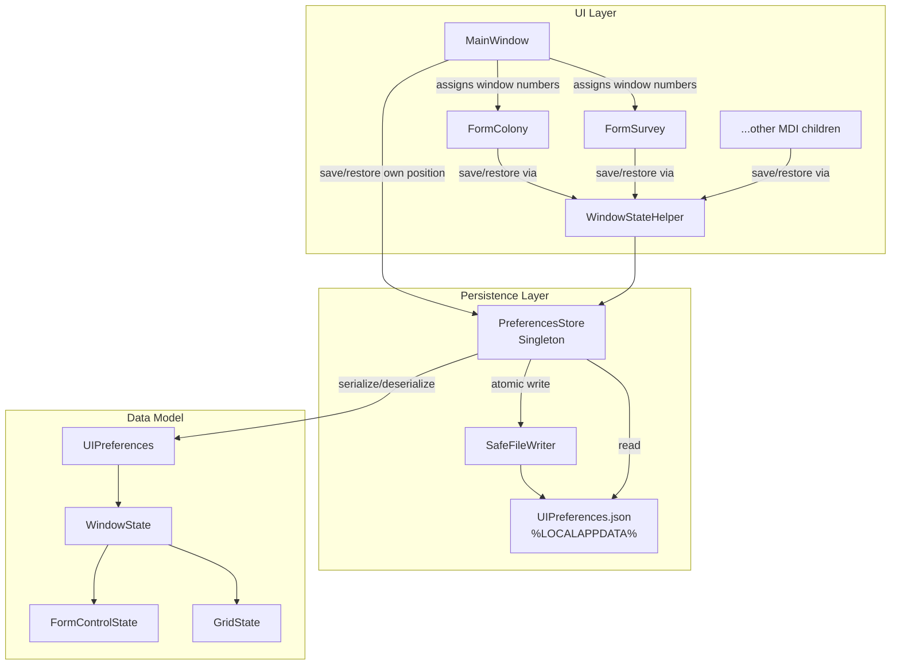

# Design Document: Window State Persistence

## Overview

This feature adds UI state persistence to OE2EmpireTracker so that window positions, sizes, grid layouts, filter text, and combo selections survive application restarts. All preferences are stored in a single JSON file (`%LOCALAPPDATA%\OE2EmpireTracker\UIPreferences.json`) separate from game data.

The design introduces three new components:
1. **Data model classes** (`UIPreferences`, `WindowState`, `GridState`, etc.) representing the JSON structure
2. **`PreferencesStore`** — a singleton service that loads, saves, and provides access to the preferences file
3. **Integration points** in `MainWindow` (window numbering, save/restore main position) and a helper class `WindowStateHelper` that MDI child forms call to save/restore their full state

The approach is non-invasive: existing forms opt in by adding a few lines in their constructor and `OnFormClosed` override. No base class change is required.

## Architecture



### Key Design Decisions

1. **Singleton `PreferencesStore`** — mirrors the existing `PlayerContext` / `EmpireContext` singleton pattern. Loaded once at startup, written on each form close event.
2. **Static helper class `WindowStateHelper`** — keeps form integration code minimal. Forms call `WindowStateHelper.RestoreState(form, formTypeKey, windowNumber)` and `WindowStateHelper.SaveState(form, formTypeKey, windowNumber)`. The helper walks the control tree to find DataGridViews, TextBoxes, and ComboBoxes automatically.
3. **No base class** — the project's forms already implement `IProgrammaticUpdateSource` individually. Adding a base class would require Designer file changes. Instead, a static helper keeps the opt-in pattern consistent with existing conventions.
4. **Window numbering in MainWindow** — `MainWindow` maintains a `Dictionary<string, int>` of per-form-type counters. Each menu click handler calls a new `OpenMdiChild<T>()` helper that assigns the number and sets the title prefix.
5. **Bounds validation as a pure function** — `BoundsValidator` is a static utility class with no UI dependencies, making it easy to unit test and property test.
6. **Save on close, not on timer** — each MDI child saves its state in `OnFormClosed`. MainWindow saves its own state in `OnFormClosing`. This avoids unnecessary disk writes and matches the user's mental model.

## Components and Interfaces

### PreferencesStore (Singleton)

Location: `OE2EmpireTracker/Baseline/PreferencesStore.cs`

```csharp
public class PreferencesStore
{
    private static PreferencesStore Instance;
    private static readonly Logger Log = LogManager.GetCurrentClassLogger();

    private UIPreferences _preferences;
    private readonly string _filePath;

    public static PreferencesStore getInstance();
    public static void Reset(); // For testing

    // Get or create a WindowState for a given form type + window number
    public WindowState GetWindowState(string formTypeKey, int windowNumber);

    // Save the entire preferences file atomically
    public void Save();

    // Load from disk (called once in constructor)
    private void Load();
}
```

### WindowStateHelper (Static)

Location: `OE2EmpireTracker/Baseline/WindowStateHelper.cs`

```csharp
public static class WindowStateHelper
{
    // Save all state for an MDI child: position, size, grids, filters, combos
    public static void SaveState(Form form, string formTypeKey, int windowNumber);

    // Restore all state for an MDI child
    public static void RestoreState(Form form, string formTypeKey, int windowNumber);

    // Save MainWindow position/size only
    public static void SaveMainWindowState(Form mainWindow);

    // Restore MainWindow position/size only
    public static void RestoreMainWindowState(Form mainWindow);
}
```

### BoundsValidator (Static)

Location: `OE2EmpireTracker/Baseline/BoundsValidator.cs`

```csharp
public static class BoundsValidator
{
    public const int MinWidth = 320;
    public const int MinHeight = 200;
    public const int ScreenEdgeMargin = 100;

    // Validate and adjust bounds for a top-level window against screen working areas
    public static Rectangle ValidateMainWindowBounds(Rectangle savedBounds);

    // Validate and adjust bounds for an MDI child against parent client area
    public static Rectangle ValidateMdiChildBounds(Rectangle savedBounds, Rectangle parentClientArea);
}
```

### Window Numbering in MainWindow

MainWindow gains:
```csharp
// Per-form-type window number counters
private readonly Dictionary<string, int> _windowNumberCounters = new Dictionary<string, int>();

// Generic helper to open an MDI child with window numbering
private T OpenMdiChild<T>() where T : Form, new();
```

Each existing menu click handler changes from:
```csharp
Form colony = new FormColony();
colony.MdiParent = this;
colony.Show();
```
to:
```csharp
OpenMdiChild<FormColony>();
```

`OpenMdiChild<T>` does:
1. Increments the counter for `typeof(T).Name`
2. Creates the form, sets `MdiParent`
3. Sets `form.Tag` to the window number (for later retrieval)
4. Prepends `"#N - "` to the form's `Text`
5. Calls `WindowStateHelper.RestoreState(form, typeof(T).Name, windowNumber)`
6. Calls `form.Show()`

### Form Integration Pattern

Each MDI child form adds to its `OnFormClosed`:
```csharp
protected override void OnFormClosed(FormClosedEventArgs e)
{
    WindowStateHelper.SaveState(this, this.GetType().Name, (int)this.Tag);
    // ... existing cleanup ...
    base.OnFormClosed(e);
}
```

That's it. The `WindowStateHelper.RestoreState` call happens in `MainWindow.OpenMdiChild<T>()`, so the child form doesn't need constructor changes.

## Data Models

Location: `OE2EmpireTracker/Baseline/UIPreferences.cs`

### UIPreferences (Root)

```csharp
public class UIPreferences
{
    // MainWindow position/size
    public WindowPosition MainWindow { get; set; }

    // Keyed by Form_Type_Key (e.g. "FormColony")
    // Each value is keyed by window number as string (e.g. "1", "2")
    public Dictionary<string, Dictionary<string, WindowState>> Forms { get; set; }
        = new Dictionary<string, Dictionary<string, WindowState>>();
}
```

### WindowPosition

```csharp
public class WindowPosition
{
    public int Left { get; set; }
    public int Top { get; set; }
    public int Width { get; set; }
    public int Height { get; set; }
}
```

### WindowState

```csharp
public class WindowState
{
    public WindowPosition Position { get; set; }
    public FormControlState FormState { get; set; }
}
```

### FormControlState

```csharp
public class FormControlState
{
    // Keyed by control name → saved text
    public Dictionary<string, string> FilterTexts { get; set; }
        = new Dictionary<string, string>();

    // Keyed by control name → saved selected value (as string)
    public Dictionary<string, ComboState> ComboSelections { get; set; }
        = new Dictionary<string, ComboState>();

    // Keyed by grid name → grid state
    public Dictionary<string, GridState> Grids { get; set; }
        = new Dictionary<string, GridState>();
}
```

### ComboState

```csharp
public class ComboState
{
    public string SelectedValue { get; set; }
    public int SelectedIndex { get; set; }
}
```

### GridState

```csharp
public class GridState
{
    // Keyed by column name
    public Dictionary<string, GridColumnState> Columns { get; set; }
        = new Dictionary<string, GridColumnState>();

    public string SortColumnName { get; set; }
    public string SortDirection { get; set; } // "Ascending" or "Descending"
}
```

### GridColumnState

```csharp
public class GridColumnState
{
    public int Width { get; set; }
    public int DisplayIndex { get; set; }
}
```

### Example JSON Structure

```json
{
  "MainWindow": {
    "Left": 100,
    "Top": 50,
    "Width": 1200,
    "Height": 800
  },
  "Forms": {
    "FormColony": {
      "1": {
        "Position": { "Left": 10, "Top": 10, "Width": 800, "Height": 600 },
        "FormState": {
          "FilterTexts": {
            "txtColonyListFilter": "Earth"
          },
          "ComboSelections": {
            "cmbFlatpacks": { "SelectedValue": "some-uuid", "SelectedIndex": 2 }
          },
          "Grids": {
            "dgvResources": {
              "Columns": {
                "Resource": { "Width": 150, "DisplayIndex": 0 },
                "Purity": { "Width": 80, "DisplayIndex": 1 }
              },
              "SortColumnName": "Resource",
              "SortDirection": "Ascending"
            }
          }
        }
      }
    }
  }
}
```

