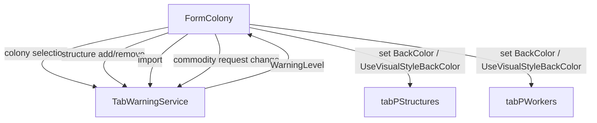

# Design Document: Worker Tab Due Warning

## Overview

This feature adds background color warnings to two tab selectors in the colony form (`FormColony`):

1. **Structures tab** (`tabPStructures`): Yellow at 60+ structures, red at 66+ (game cap is 65).
2. **Worker tab** (`tabPWorkers`): Yellow when any unfulfilled commodity request is due within 2 days, red when due within 1 day or overdue.

Both tabs share a common evaluation pattern encapsulated in a `TabWarningService` — a pure, static service class in `OE2EmpireTracker/Services/` that takes colony state and returns a warning level enum. The form calls this service at each relevant data-change point and applies the resulting color to the tab page.

The service is intentionally stateless and side-effect-free: it receives data, returns a result. The form owns all UI mutation. This keeps the warning logic unit-testable without WinForms dependencies.

## Architecture



The flow is:

1. A data-change event fires in `FormColony` (colony selected, structure added/removed, import completed, commodity request edited).
2. `FormColony` calls `TabWarningService.EvaluateStructureWarning(structureCount)` and/or `TabWarningService.EvaluateWorkerWarning(commodities, now)`.
3. The service returns a `TabWarningLevel` enum value (`None`, `Yellow`, `Red`).
4. `FormColony` applies the color to the tab page via a small helper method `ApplyTabWarning(TabPage tab, TabWarningLevel level)`.

## Components and Interfaces

### TabWarningLevel Enum

Location: `OE2EmpireTracker/Services/TabWarningService.cs` (nested or same file)

```csharp
public enum TabWarningLevel
{
    None,
    Yellow,
    Red
}
```

### TabWarningService (Static Class)

Location: `OE2EmpireTracker/Services/TabWarningService.cs`

```csharp
public static class TabWarningService
{
    // Structure tab thresholds
    public const int StructureYellowThreshold = 60;
    public const int StructureRedThreshold = 66;

    // Worker tab thresholds
    public static readonly TimeSpan WorkerYellowWindow = TimeSpan.FromDays(2);
    public static readonly TimeSpan WorkerRedWindow = TimeSpan.FromDays(1);

    public static TabWarningLevel EvaluateStructureWarning(int structureCount);
    public static TabWarningLevel EvaluateWorkerWarning(
        IEnumerable<CommodityRequested> commodities, DateTime now);
}
```

**EvaluateStructureWarning**: Pure function. Returns `Red` if count >= 66, `Yellow` if count >= 60, else `None`.

**EvaluateWorkerWarning**: Filters to unfulfilled requests with `NeedBy != DateTime.MinValue`. For each, computes `NeedBy - now`. If any is <= 0 (overdue) or <= 1 day, returns `Red`. If any is <= 2 days, returns `Yellow`. Otherwise `None`. Red takes priority over Yellow.

The `now` parameter is injected rather than using `DateTime.Now` internally, making the method deterministic and testable.

### FormColony Integration

A private helper method in `FormColony`:

```csharp
private void ApplyTabWarning(TabPage tab, TabWarningLevel level)
{
    switch (level)
    {
        case TabWarningLevel.Red:
            tab.UseVisualStyleBackColor = false;
            tab.BackColor = Color.LightCoral;
            break;
        case TabWarningLevel.Yellow:
            tab.UseVisualStyleBackColor = false;
            tab.BackColor = Color.Yellow;
            break;
        default:
            tab.UseVisualStyleBackColor = true;
            tab.BackColor = SystemColors.Control;
            break;
    }
}
```

A private method `UpdateTabWarnings()` calls both evaluation methods and applies results:

```csharp
private void UpdateTabWarnings()
{
    int structureCount = selectedColony?.Structures?.Count ?? 0;
    ApplyTabWarning(tabPStructures,
        TabWarningService.EvaluateStructureWarning(structureCount));

    var commodities = selectedColony?.Commodities;
    ApplyTabWarning(tabPWorkers,
        TabWarningService.EvaluateWorkerWarning(
            commodities ?? Enumerable.Empty<CommodityRequested>(), DateTime.Now));
}
```

### Call Sites in FormColony

`UpdateTabWarnings()` is called from:

| Trigger | Location in FormColony | Covers |
|---|---|---|
| Colony selected | `PopulateForm()` — after populating structures and commodities | Req 10.1, 5.1 |
| Structure added | `cmdAddFlatpack_Click()` — after adding structure | Req 10.2 |
| Structure data changed | `structures_ColonyStructureDataChanged()` — after recalculating status | Req 10.2 |
| Colony imported | `cmdImportColony_Click()` — after `PopulateForm()` (already covered) | Req 10.3 |
| Commodity request added | `cmdAddCommodityRequest_Click()` — after adding request | Req 5.4 |
| Commodity request edited (NeedBy, Fulfilled) | `dgvCommodityRequests_CellValueChanged()` — after updating request | Req 5.2, 5.3 |
| Commodity request deleted | `dgvCommodityRequests_KeyDown()` — after removing request | Req 5.4 |

### GameConstants Additions

Add structure warning thresholds to `GameConstants.cs` for discoverability, though `TabWarningService` defines its own constants:

```csharp
/// <summary>Maximum structures per colony (game cap).</summary>
public const int StructureCap = 65;
```

This is informational — the warning thresholds (60, 66) live in `TabWarningService` since they are UI-specific policy, not game rules.

## Data Models

No new data models are required. The feature reads existing data:

- `Colony.Structures` (`List<ColonyStructure>`) — `.Count` for structure warnings
- `Colony.Commodities` (`List<CommodityRequested>`) — iterated for worker warnings
- `CommodityRequested.Fulfilled` (`bool`) — filter out fulfilled requests
- `CommodityRequested.NeedBy` (`DateTime`) — compute due window
- `DateTime.MinValue` — sentinel for "no due date set"

The `TabWarningLevel` enum is the only new type, and it's a simple value type in the service layer.


## Correctness Properties

*A property is a characteristic or behavior that should hold true across all valid executions of a system — essentially, a formal statement about what the system should do. Properties serve as the bridge between human-readable specifications and machine-verifiable correctness guarantees.*

### Property 1: Structure warning level is determined by count thresholds

*For any* non-negative integer `structureCount`, `EvaluateStructureWarning(structureCount)` returns `Red` if `structureCount >= 66`, `Yellow` if `structureCount >= 60`, and `None` otherwise.

**Validates: Requirements 7.1, 7.2, 8.1, 8.2, 9.1**

### Property 2: Worker warning level is the most urgent unfulfilled due window

*For any* list of `CommodityRequested` objects and any reference `DateTime now`, `EvaluateWorkerWarning(commodities, now)` returns `Red` if any unfulfilled request (with `NeedBy != DateTime.MinValue`) has `NeedBy - now <= 1 day` (including overdue/negative), returns `Yellow` if any unfulfilled request has `NeedBy - now <= 2 days` (but none <= 1 day), and returns `None` otherwise.

**Validates: Requirements 1.1, 1.2, 2.1, 2.2, 3.1, 4.1, 6.1**

### Property 3: Fulfilled requests are excluded from worker warning evaluation

*For any* list of `CommodityRequested` objects where every request has `Fulfilled == true`, `EvaluateWorkerWarning` returns `None` regardless of the `NeedBy` dates.

**Validates: Requirements 1.3**

## Error Handling

The service methods handle edge cases gracefully:

- **Null or empty commodity list**: `EvaluateWorkerWarning` returns `None` for null/empty input. The form passes `Enumerable.Empty<CommodityRequested>()` when `selectedColony.Commodities` is null.
- **Negative structure count**: Not expected in practice, but `EvaluateStructureWarning` treats any count < 60 as `None`.
- **DateTime.MinValue sentinel**: Requests with `NeedBy == DateTime.MinValue` are explicitly excluded from due-date evaluation (they represent "no due date set").
- **Null colony**: `UpdateTabWarnings()` defaults to 0 structures and empty commodities when `selectedColony` is null, resulting in `None` for both tabs.

No exceptions are thrown by the service. All inputs produce a valid `TabWarningLevel`.

## Testing Strategy

### Property-Based Tests

Use **FsCheck** (NuGet: `FsCheck` + `FsCheck.NUnit`) as the property-based testing library. FsCheck integrates with NUnit and generates random inputs automatically.

Each property test runs a minimum of 100 iterations. Each test is tagged with a comment referencing the design property.

Test file: `OE2EmpireTracker.Tests/Services/TabWarningServiceTests.cs`

**Property 1 test**: Generate random non-negative integers (0–200 range is sufficient). Assert the return value matches the expected threshold logic.
- Tag: `Feature: worker-tab-due-warning, Property 1: Structure warning level is determined by count thresholds`

**Property 2 test**: Generate random lists of `CommodityRequested` with random `Fulfilled` flags, random `NeedBy` dates (including `DateTime.MinValue`, past dates, near-future dates, far-future dates), and a random `now` reference time. Compute the expected result by finding the minimum due window among unfulfilled non-MinValue requests, then assert the service returns the correct level.
- Tag: `Feature: worker-tab-due-warning, Property 2: Worker warning level is the most urgent unfulfilled due window`

**Property 3 test**: Generate random lists of `CommodityRequested` where every item has `Fulfilled = true`, with arbitrary `NeedBy` dates (including overdue). Assert the service always returns `None`.
- Tag: `Feature: worker-tab-due-warning, Property 3: Fulfilled requests are excluded from worker warning evaluation`

### Unit Tests

Unit tests cover specific examples and edge cases:

- Empty structure list → `None`
- Exactly 59 structures → `None`
- Exactly 60 structures → `Yellow`
- Exactly 65 structures → `Yellow`
- Exactly 66 structures → `Red`
- No commodity requests → `None`
- All requests fulfilled (even with urgent dates) → `None`
- Single unfulfilled request due in 3 days → `None`
- Single unfulfilled request due in 1.5 days → `Yellow`
- Single unfulfilled request due in 12 hours → `Red`
- Single unfulfilled request overdue → `Red`
- Request with `NeedBy == DateTime.MinValue` → excluded (treated as no deadline)
- Mix of red and yellow conditions → `Red` wins

### Test Configuration

- Property-based testing library: FsCheck 2.16.6 + FsCheck.NUnit (via NuGet `packages.config`)
- Minimum iterations: 100 per property test
- Each property test MUST be implemented as a single `[FsCheck.NUnit.Property]` attributed method
- Each property test MUST reference its design document property in a comment
