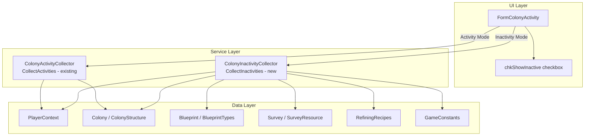

# Design Document: Activity / Inactivity Mode

## Overview

This feature extends the Colony Activity form (`FormColonyActivity`) with an Inactivity Mode that surfaces idle and underutilized production structures across all colonies. A "Show Inactive" checkbox toggles between the existing Activity Mode (structures with running timers) and the new Inactivity Mode (structures that are idle or underutilized). The two modes are mutually exclusive.

Inactivity Mode covers five production structure types: Mining, Refining, Research, Manufacturing, and CommodityManufacturing. Building structures have no inactivity concept. The most complex detection is underutilized refiners, which compares total mining output to total refining consumption per resource per colony, with a warehouse stockpile exemption.

The feature reuses the existing `ActivityRow` data class and grid columns (minus CountDown) so the UI remains consistent between modes.

## Architecture



The design introduces a single new static class `ColonyInactivityCollector` in the Services layer, following the same pattern as the existing `ColonyActivityCollector`. The form toggles between calling one collector or the other based on checkbox state.

### Design Decisions

1. **Separate collector class** rather than adding to `ColonyActivityCollector`: The inactivity logic is fundamentally different (scanning for absence of work rather than presence of timers). Keeping them separate avoids bloating the existing class and makes each independently testable.

2. **Reuse `ActivityRow`**: Inactivity rows use the same `ActivityRow` class with `CountDown = null`. This avoids a parallel data class and lets the grid population code stay largely the same.

3. **Built + Online check via PropertyBag**: A structure is only considered for inactivity if `Properties["Built"] == "True"` AND `Properties["Online"] == "True"`. This matches the game's concept of operational structures.

4. **One miner per resource per colony**: The underutilized refiner calculation sums the single miner's output rate per resource and compares it to the total refining consumption for that resource across all active refiners in the colony.

## Components and Interfaces

### New: `ColonyInactivityCollector` (static class)

Location: `OE2EmpireTracker/Services/ColonyInactivityCollector.cs`

```csharp
public static class ColonyInactivityCollector
{
    /// <summary>
    /// Scans all provided colonies and returns ActivityRow instances for every
    /// idle or underutilized production structure.
    /// </summary>
    public static List<ActivityRow> CollectInactivities(
        IEnumerable<Colony> colonies, PlayerContext playerContext);
}
```

Internal helper methods:

- `IsBuiltAndOnline(ColonyStructure structure)` — checks PropertyBag for Built=True and Online=True
- `HasActiveProcess(ColonyStructure structure)` — checks ProcessCompletionTime != null && TimeRemaining > 0
- `CollectIdleStructures(Colony colony, PlayerContext playerContext, List<ActivityRow> rows)` — scans for idle miners, refiners, research labs, manufactories, commodity factories
- `CollectUnderutilizedRefiners(Colony colony, PlayerContext playerContext, List<ActivityRow> rows)` — computes mining output vs refining consumption per resource, flags excess refiners
- `GetMiningOutputRate(ColonyStructure miner, PlayerContext playerContext, Colony colony)` — returns the hourly mining rate for a miner including ExtractionFocus bonus
- `GetRefiningConsumptionRate(ColonyStructure refiner)` — returns per-hour consumption rate (25 for normal, recipe.ConsumeRate for synthetic)
- `GetWarehouseStockpile(Colony colony, string resource, string purity)` — returns quantity of raw resource in colony ItemBag
- `BuildSourceName(ColonyStructure structure, PlayerContext playerContext)` — formats "#{gameSequence} {blueprint.ExtendedName}"

### Modified: `FormColonyActivity`

Changes to the existing form:

- Add `chkShowInactive` checkbox to `flpFilters` (Designer file)
- Add `CheckedChanged` handler that calls `RefreshData()`
- Modify `RefreshData()` to branch on `chkShowInactive.Checked`:
  - Unchecked: call `ColonyActivityCollector.CollectActivities()` (existing)
  - Checked: call `ColonyInactivityCollector.CollectInactivities()`
- Modify `ApplyFiltersAndPopulate()` to:
  - Hide `chkCommodityRequest` and `colCountDown` when in Inactivity Mode
  - Show them when in Activity Mode
  - Skip `CommodityRequest` from filter set in Inactivity Mode
- Modify `timerRefresh_Tick` to skip countdown updates when in Inactivity Mode (no countdowns to update)

### Existing: `ActivityRow` (no changes)

Inactivity rows set `CountDown = null` and `NeedBy = DateTime.MinValue`. The `ProcessDetails` field carries the inactivity reason string.

### Existing: `ActivityType` enum (no changes)

Inactivity rows reuse the existing `ActivityType` values (Mining, Refining, Research, Manufacturing, CommodityManufacturing). No new enum values needed.

## Data Models

### ActivityRow usage for Inactivity Mode

| Field | Value in Inactivity Mode |
|-------|-------------------------|
| Type | ActivityType matching the structure's BluePrintType |
| SystemName | Colony.SystemName |
| ColonyName | Colony.ColonyName |
| SourceName | `"#{gameSequence} {blueprint.ExtendedName}"` |
| ProcessDetails | Idle reason string (see below) |
| CountDown | `null` |
| NeedBy | `DateTime.MinValue` |

### ProcessDetails strings by scenario

| Scenario | ProcessDetails |
|----------|---------------|
| Miner: no survey assigned | `"No survey assigned"` |
| Miner: survey assigned, no timer | `"Idle"` |
| Refiner: no resource assigned | `"No resource assigned"` |
| Refiner: resource assigned, no timer | `"Idle"` |
| Refiner: underutilized | `"Underutilized: {available}/{consumeRate} per cycle"` |
| Research lab: no blueprint assigned | `"No blueprint assigned"` |
| Research lab: blueprint assigned, no timer | `"Idle"` |
| Manufactory: no blueprint assigned | `"No blueprint assigned"` |
| Manufactory: blueprint assigned, no timer | `"Idle"` |
| Commodity factory: no commodity assigned | `"No commodity assigned"` |
| Commodity factory: commodity assigned, no timer | `"Idle"` |

### Underutilized Refiner Calculation

Per colony, per resource+purity combination:

1. **Mining output rate**: Sum of `double.Parse(surveyResource.Amount) * (1.0 + extractionFocusLevel * 0.01)` across all active miners for that resource+purity. (One miner per resource type per colony, but the algorithm generalizes.)

2. **Refining consumption rate**: Sum of per-refiner rates across all active refiners for that resource+purity:
   - Normal refining: `GameConstants.RefiningBaseRate` (25) per cycle
   - Synthetic refining: `RefiningRecipe.ConsumeRate` per cycle

3. **Excess detection**: If total refining consumption > total mining output, the difference is excess capacity. Refiners are flagged as underutilized starting from the highest `gameSequence` (last built).

4. **Warehouse exemption**: Before flagging a refiner, check if `colony.Items.FindResource(resource, purity)` has quantity >= the refiner's per-cycle consumption rate. If so, skip that refiner.

5. **Utilization display**: For a flagged refiner, the numerator is the remaining mining supply available to it (after higher-priority refiners have consumed their share), and the denominator is the refiner's per-cycle rate.


## Correctness Properties

*A property is a characteristic or behavior that should hold true across all valid executions of a system — essentially, a formal statement about what the system should do. Properties serve as the bridge between human-readable specifications and machine-verifiable correctness guarantees.*

### Property 1: Idle structure detection

*For any* colony and *for any* built+online production structure (MiningRig, Refinery, ResearchLaboratory, Manufactory, CommodityFactory), the structure appears in the inactivity collector output if and only if it either has no work item assigned (no survey/resource/blueprint/commodity) or has no active ProcessCompletionTime with TimeRemaining > 0. Structures that are not built, not online, or are actively processing must not appear.

**Validates: Requirements 3.1, 3.2, 4.1, 4.2, 6.1, 6.2, 7.1, 7.2, 8.1, 8.2**

### Property 2: Idle structure ProcessDetails correctness

*For any* idle production structure in the inactivity collector output, the ProcessDetails field must be: the "No {item} assigned" string when the structure has no work item assigned, or "Idle" when the structure has a work item assigned but no active timer. The specific "No X assigned" string must match the structure type (e.g., "No survey assigned" for miners, "No resource assigned" for refiners, "No blueprint assigned" for research labs and manufactories, "No commodity assigned" for commodity factories).

**Validates: Requirements 3.3, 3.4, 4.3, 4.4, 6.3, 6.4, 7.3, 7.4, 8.3, 8.4**

### Property 3: Inactivity row metadata format

*For any* ActivityRow produced by the inactivity collector, the Type field must map correctly to the structure's BluePrintType, the SystemName and ColonyName must match the parent colony, the SourceName must follow the format "#{gameSequence} {blueprint.ExtendedName}", and CountDown must be null.

**Validates: Requirements 9.1, 9.2, 9.3, 9.4**

### Property 4: Underutilized refiner detection

*For any* colony where the total refining consumption rate for a resource+purity exceeds the total mining output rate (computed as `SurveyResource.Amount * (1 + ExtractionFocus * 0.01)`), the excess refiners must be flagged as underutilized starting from the highest gameSequence. Each flagged refiner's ProcessDetails must show "Underutilized: {available}/{consumeRate} per cycle" where available is the remaining mining supply after higher-priority refiners consume their share, and consumeRate is 25 for normal refining or RefiningRecipe.ConsumeRate for synthetic.

**Validates: Requirements 5.1, 5.2, 5.3, 5.5**

### Property 5: Warehouse stockpile exemption

*For any* refiner that would otherwise be flagged as underutilized, if the colony warehouse contains at least one cycle's worth of the refiner's input resource at the matching purity (>= 25 units for normal, >= RefiningRecipe.ConsumeRate for synthetic), then that refiner must not appear in the inactivity collector output.

**Validates: Requirements 5.4**

### Property 6: Inactivity mode filtering

*For any* set of inactivity rows and *for any* combination of activity type filter checkboxes (excluding CommodityRequest) and text filter string, the rows displayed in the grid must be exactly those whose Type matches a checked filter and whose fields contain the text filter substring (case-insensitive).

**Validates: Requirements 9.5**

## Error Handling

| Scenario | Handling |
|----------|----------|
| `FindBlueprint()` returns null for a structure's `FlatpackBlueprintUUID` | Skip the structure silently (same as existing `ColonyActivityCollector` behavior) |
| `FindSurvey()` returns null for a miner's `MiningSurvey` | Treat as "No survey assigned" — the miner is idle |
| `SurveyResource.Amount` is empty or unparseable | Treat mining output as 0 for that miner; refiner may be flagged as underutilized |
| Colony has no structures | Return empty list for that colony |
| `PropertyBag` missing "Built" or "Online" keys | `getBoolean` returns `false` by default — structure is not considered |
| `RefiningRecipes.FindByInput()` returns null for a refiner | Use normal refining rate (GameConstants.RefiningBaseRate = 25) |
| Division/overflow in utilization calculation | Use `Math.Max(0, ...)` to clamp negative values; integer arithmetic avoids floating-point issues |

## Testing Strategy

### Property-Based Testing

Library: **FsCheck** (via FsCheck NUnit integration, compatible with .NET Framework 4.8.1 and NUnit 4.x)

Each correctness property maps to a single property-based test with minimum 100 iterations. Tests generate random colony configurations with varying numbers of structures, survey assignments, timer states, and warehouse stockpiles.

Test tag format: `Feature: activity-inactivity-mode, Property {N}: {title}`

Key generators needed:
- Random `ColonyStructure` with configurable BluePrintType, Built/Online state, timer state, and work assignment
- Random `Colony` with a mix of structure types and warehouse items
- Random `Survey` with `SurveyResource` entries (Amount as parseable numeric string, Purity from {Low, Medium, High})
- Random `PlayerProfile` with ExtractionFocus skill level 0–5

### Unit Tests

Unit tests complement property tests for specific examples and edge cases:

- **Idle detection examples**: One test per structure type with a concrete colony setup verifying the exact output rows
- **Underutilized refiner example**: Colony with 1 miner (10/h Low) and 2 refiners (25/cycle each) — second refiner should be flagged as "Underutilized: 0/25 per cycle" (assuming no warehouse stock)
- **Warehouse exemption example**: Same setup but with 25+ units in warehouse — no underutilized flag
- **Synthetic refiner underutilization**: Colony with S1 refiner consuming 1250/cycle from refined Lanthanides — verify correct rate comparison
- **Mixed active/idle**: Colony with some structures active and some idle — verify only idle ones appear
- **Empty colony**: Colony with no structures returns empty list
- **Non-production structures**: Structures with BluePrintTypes not in the 5 production types are ignored

### Test Configuration

- Property tests: 100 iterations minimum per property
- All tests in `OE2EmpireTracker.Tests/Services/ColonyInactivityCollectorTests.cs`
- Test setup: `PlayerContext.Reset()` and `EmpireContext.Reset()` in `[SetUp]` for clean state
- FsCheck NuGet package added to `OE2EmpireTracker.Tests/packages.config`
- FsCheck reference added to test project `.csproj` (old-style requires explicit `<Compile Include>` and `<Reference>`)
