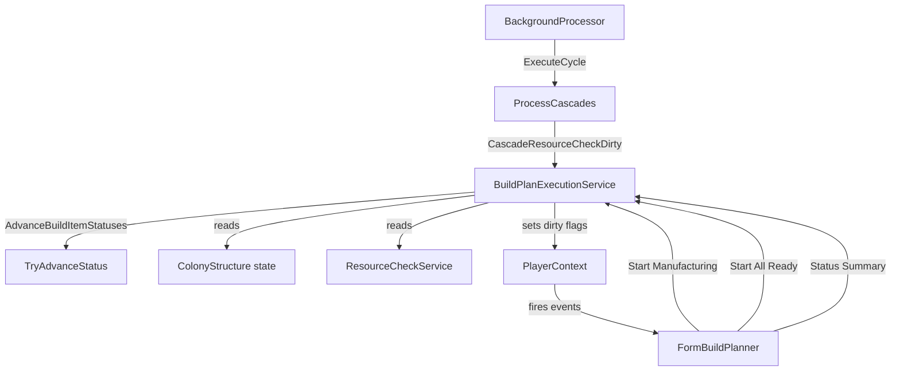
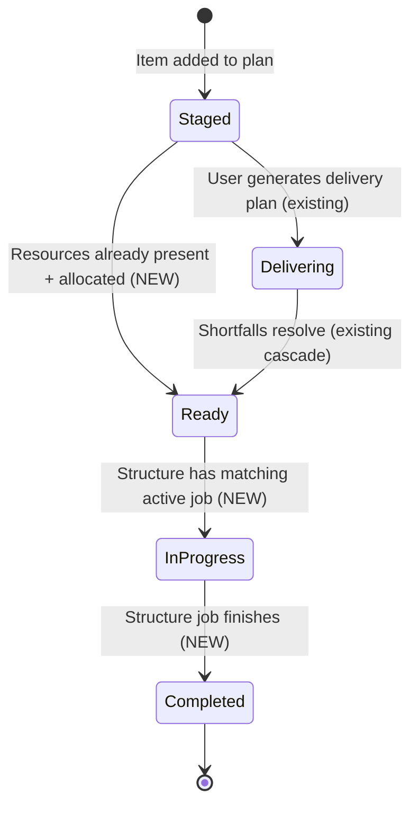

# Design Document: Build Plan Execution

## Overview

This feature extends the Build Planner from a resource-delivery tracker into a full manufacturing lifecycle tracker. Currently, the background processor handles Delivering to Ready transitions when resource shortfalls resolve, but the lifecycle stalls at Ready. This design adds:

1. **Automated status detection** -- The background processor detects manufacturing start (Ready to InProgress) and completion (InProgress to Completed) by inspecting ColonyStructure state during cascade cycles.
2. **Pre-configure manufacturing** -- A "Start Manufacturing" action in the Build Planner configures the tracker data model (sets blueprint/commodity, quantity, and timer on the ColonyStructure) so the tool can track progress. The user then starts the matching job in-game.
3. **Progress visibility** -- Status summary, busy indicators, and dependency/sequence awareness in the UI.

**Key constraint:** The tool never initiates manufacturing in-game. It only detects and tracks. "Start Manufacturing" pre-configures the tracker; the user must start the actual job in the game UI.

**Scope boundary:** Stops at Completed (manufacturing done, output exists in colony warehouse). Flatpack delivery, staging, and building are separate workflows.

## Architecture

The feature follows the existing layered architecture: a new stateless service (`BuildPlanExecutionService`) contains all detection and pre-configuration logic, the `BackgroundProcessor` calls it during cascade cycles, and `FormBuildPlanner` adds UI actions.



### Integration Points

- **BackgroundProcessor.ProcessCascades()** -- After the existing resource-check cascade (Delivering to Ready), a new call to `BuildPlanExecutionService.AdvanceBuildItemStatuses()` handles Staged to Ready (when resources present), Ready to InProgress (when manufacturing detected), and InProgress to Completed (when manufacturing finished).
- **FormBuildPlanner** -- New context menu items ("Start Manufacturing", "Start All Ready"), status summary label, and busy indicators via cell formatting.
- **PlayerContext** -- Existing `OnBuildPlanDataChanged()` event fires for each modified plan, triggering UI refresh.

### Cascade Execution Order

Within `ProcessCascades()`, the new build-plan-execution step runs **after** the existing resource-check cascade. This ordering is critical because:

1. The resource-check cascade advances Delivering items to Ready (existing behavior).
2. The execution cascade then checks newly-Ready items for manufacturing start conditions.
3. This means a single cascade cycle can chain: Delivering to Ready to InProgress (if the structure already has a matching active job).

```
ProcessCascades():
  1. CascadeResourceCheckDirty (existing)
     - Recompute shortfalls for active plans
     - Advance Delivering items to Ready when shortfalls resolve
  2. CascadeBuildPlanExecution (NEW)
     - Advance Staged+allocated items to Ready when resources present
     - Advance Ready items to InProgress when structure has matching active job
     - Advance InProgress items to Completed when structure job finishes
     - Set dirty flags for next cycle if any changes made
  3. CascadeStockTargetsDirty (existing)
     - Replenishment item generation
```

## Components and Interfaces

### BuildPlanExecutionService (new static class)

Location: `OE2EmpireTracker/Services/BuildPlanExecutionService.cs`

A stateless service following the same pattern as `ResourceCheckService` and `BuildPlanService`. All methods are static with dependencies passed as parameters (delegates for colony/blueprint lookup).

```csharp
public static class BuildPlanExecutionService
{
    /// Advances build item statuses for a single plan based on structure state.
    /// Returns true if any item status changed.
    /// Handles: Staged+allocated to Ready, Ready to InProgress, InProgress to Completed.
    public static bool AdvanceBuildItemStatuses(
        BuildPlan plan,
        Func<string, Colony> colonyFinder,
        Func<string, Blueprint> blueprintFinder,
        Func<string, Ship> shipFinder,
        Func<string, Station> stationFinder,
        string currentPlayerUUID);

    /// Checks if a build item can start manufacturing.
    /// Returns true if: item is Ready, has valid StructureUUID, structure exists
    /// and is built+online, structure has no active ProcessCompletionTime,
    /// item is lowest sequence on structure among Ready items,
    /// and dependency (if any) is Completed.
    public static bool CanStartManufacturing(
        BuildItem item,
        BuildPlan plan,
        Func<string, Colony> colonyFinder,
        Func<string, Blueprint> blueprintFinder);

    /// Pre-configures a ColonyStructure for manufacturing based on the build item.
    /// Sets blueprint/commodity, quantity, and ProcessCompletionTime on the structure.
    /// Advances item to InProgress. Returns a result indicating success or failure reason.
    public static StartManufacturingResult StartManufacturing(
        BuildItem item,
        BuildPlan plan,
        Func<string, Colony> colonyFinder,
        Func<string, Blueprint> blueprintFinder);

    /// Batch-starts manufacturing on all eligible Ready items in a plan.
    /// Returns a summary of started and skipped counts.
    public static BatchStartResult StartAllReady(
        BuildPlan plan,
        Func<string, Colony> colonyFinder,
        Func<string, Blueprint> blueprintFinder);

    /// Computes a status summary for a build plan.
    /// Returns counts per BuildItemStatus.
    public static Dictionary<BuildItemStatus, int> ComputeStatusSummary(BuildPlan plan);

    /// Checks if a plan is fully complete (all items Completed).
    public static bool IsPlanComplete(BuildPlan plan);

    /// Detects cross-plan contention: finds items from other plans
    /// assigned to the same structure.
    public static List<ContentionInfo> DetectContention(
        BuildItem item,
        IEnumerable<BuildPlan> allPlans);
}
```

#### Result Types

```csharp
public class StartManufacturingResult
{
    public bool Success { get; set; }
    public string ErrorMessage { get; set; }
}

public class BatchStartResult
{
    public int StartedCount { get; set; }
    public int SkippedCount { get; set; }
    public List<string> SkippedReasons { get; set; }
}

public class ContentionInfo
{
    public string PlanName { get; set; }
    public string ItemName { get; set; }
    public string ItemUUID { get; set; }
}
```

### AdvanceBuildItemStatuses -- Detection Logic

This is the core method called by the background processor. It iterates over all items in a plan and checks three transition types:

**Phase 1: Staged+allocated to Ready (skip Delivering)**
- For each item with Status == Staged, non-empty BuildLocationUUID, and non-empty StructureUUID:
  - Call `ResourceCheckService.ComputeShortfalls()` for the item
  - If zero shortfalls, call `TryAdvanceStatus(item, Ready)`

**Phase 2: Ready to InProgress (detect manufacturing start)**
- For each item with Status == Ready and non-empty StructureUUID:
  - Resolve the ColonyStructure via colonyFinder + StructureUUID
  - Check dependency: if DependsOnUUID is set, verify the dependency item has Status == Completed. If dependency not found in plan, log warning and treat as satisfied.
  - Check sequence: verify item is the lowest SequenceInStructure among Ready items on the same structure in this plan
  - Check structure state by item type:
    - **Manufactory**: ProcessCompletionTime != null AND ManufacturingBlueprintUUID == item.BlueprintUUID
    - **Commodity**: ProcessCompletionTime != null AND ManufacturingCommodityName == item.CommodityName
    - **Research**: ProcessCompletionTime != null AND ResearchingBlueprintUUID == item.BlueprintUUID
    - **Mining**: ProcessCompletionTime != null (mining rig is active)
    - **Refining**: ProcessCompletionTime != null (refinery is active)
  - If all checks pass, call `TryAdvanceStatus(item, InProgress)`

**Phase 3: InProgress to Completed (detect manufacturing finish)**
- For each item with Status == InProgress and non-empty StructureUUID:
  - Resolve the ColonyStructure
  - Check completion by item type:
    - **Manufactory**: (ProcessCompletionTime == null AND ManufacturingBlueprintUUID is empty) OR ManufacturingCompleted >= item.Quantity
    - **Commodity**: ProcessCompletionTime == null AND ManufacturingCommodityName is empty
    - **Research**: ProcessCompletionTime == null AND ResearchingBlueprintUUID is empty
    - **Mining**: ProcessCompletionTime == null
    - **Refining**: ProcessCompletionTime == null
  - If completed, call `TryAdvanceStatus(item, Completed)`
  - Log that next item in sequence is now eligible (if one exists)

### StartManufacturing -- Pre-Configuration Logic

This method mirrors the existing `HandleManufactoryStart()` / `HandleCommodityStart()` logic in `ColonyStructureV2.cs`, but operates from the service layer without UI dependencies.

**Per item type:**

- **Manufactory**: Sets `ManufacturingBlueprintUUID`, `ManufacturingQuantity`, `ManufacturingCompleted = 0`. Computes ProcessCompletionTime by parsing the blueprint's `ManufactureRunTime` property, applying ProductionFocus skill multiplier, and calling `StartRepeating(mfgSeconds)`.
- **Commodity**: Sets `ManufacturingCommodityName`, `ManufacturingQuantity`, `ManufacturingCompleted = 0`. Uses `GameConstants.CommodityCycleSeconds` with ProductionFocus skill multiplier for the repeating interval.
- **Research**: Sets `ResearchingBlueprintUUID`. Uses `ResearchTimeLookup.GetResearchTimeSeconds()` for the one-shot timer duration.
- **Mining**: Sets `MiningSurvey`, `MiningSurveyResource` from the build item. Uses the mining interval for the repeating timer.
- **Refining**: Sets `RefiningResource`, `RefiningResourcePurity` from the build item. Uses the refining interval for the repeating timer.

After configuring the structure, calls `TryAdvanceStatus(item, InProgress)`.

### BackgroundProcessor Changes

In `ProcessCascades()`, after the existing `resourceCheckDirty` block and before `stockTargetsDirty`:

```csharp
// Build plan execution cascade (NEW)
if (!_stopping.IsSet)
{
    var plans = _playerContext.SnapshotBuildPlanList();
    var activePlans = plans.Where(p => p.IsActive).ToList();
    bool anyChanged = false;

    foreach (var plan in activePlans)
    {
        if (_stopping.IsSet) break;
        bool changed = BuildPlanExecutionService.AdvanceBuildItemStatuses(
            plan,
            uuid => _playerContext.FindColony(uuid),
            uuid => _playerContext.FindBlueprint(uuid),
            uuid => _playerContext.FindShip(uuid),
            uuid => _playerContext.FindStation(uuid),
            _playerContext.CurrentPlayerUUID);

        if (changed)
        {
            modifiedPlanUUIDs.Add(plan.UUID);
            anyChanged = true;
        }
    }

    if (anyChanged)
    {
        _playerContext.CascadeResourceCheckDirty = true;
        _playerContext.CascadeStockTargetsDirty = true;
    }
}
```

### FormBuildPlanner UI Changes

**New context menu items** on the build items grid:
- `tsmiStartManufacturing` -- "Start Manufacturing" (enabled when selected item is Ready with valid StructureUUID and passes CanStartManufacturing)
- `tsmiStartAllReady` -- "Start All Ready" (enabled when plan has any Ready items)

**Status summary label** (`lblStatusSummary`):
- Positioned below the build items grid header area
- Format: "Staged: X | Delivering: Y | Ready: Z | InProgress: W | Completed: V"
- When all items Completed: "Complete (N items)"
- Updated on PopulateBuildItemsGrid and OnBuildPlanDataChanged

**Busy indicator**:
- During `PopulateBuildItemsGrid()`, for each Ready item, check if the assigned structure has an active ProcessCompletionTime
- If busy, set the location cell's BackColor to a warning color (e.g., `Color.MistyRose`) and append " [BUSY]" to the location text
- For cross-plan contention, append the competing plan name: " [BUSY: Plan X]"

## Data Models

### Existing Models (no changes needed)

The feature operates entirely on existing data models. No new fields or model classes are required for the core detection logic.

- **BuildItem** -- Status field (BuildItemStatus enum) already has all needed values: Staged, Delivering, Ready, InProgress, Completed. Fields BlueprintUUID, CommodityName, StructureUUID, BuildLocationUUID, SequenceInStructure, DependsOnUUID, Quantity, MiningResource, MiningSurveyUUID, RefiningResource, RefiningPurity are all present.
- **BuildPlan** -- Items list, IsActive flag, UUID, Name are all present.
- **ColonyStructure** -- ProcessCompletionTime, ManufacturingBlueprintUUID, ManufacturingCommodityName, ManufacturingQuantity, ManufacturingCompleted, ResearchingBlueprintUUID, MiningSurvey, MiningSurveyResource, RefiningResource, RefiningResourcePurity, IsBuiltAndOnline are all present.
- **CountDownTime** -- StartRepeating(), TimeRemaining, TimeRemainingString, IsRepeating, IntervalsPassed are all present.
- **BuildItemStatus enum** -- Staged(0), Delivering(1), Ready(2), InProgress(3), Completed(4) with ordinal comparison for forward-only transitions.

### New Types (service result types only)

```csharp
/// Result of a single StartManufacturing operation.
public class StartManufacturingResult
{
    public bool Success { get; set; }
    public string ErrorMessage { get; set; } = string.Empty;
}

/// Result of a batch StartAllReady operation.
public class BatchStartResult
{
    public int StartedCount { get; set; }
    public int SkippedCount { get; set; }
    public List<string> SkippedReasons { get; set; } = new List<string>();
}

/// Information about a cross-plan contention on a structure.
public class ContentionInfo
{
    public string PlanName { get; set; } = string.Empty;
    public string ItemName { get; set; } = string.Empty;
    public string ItemUUID { get; set; } = string.Empty;
}
```

These types live in `OE2EmpireTracker/Services/BuildPlanExecutionService.cs` as nested classes or in the same file, following the pattern of other service result types in the project.

### Status Transition State Machine



## Correctness Properties

*A property is a characteristic or behavior that should hold true across all valid executions of a system -- essentially, a formal statement about what the system should do. Properties serve as the bridge between human-readable specifications and machine-verifiable correctness guarantees.*

### Property 1: Forward-only status transitions

*For any* BuildItem and any target BuildItemStatus, calling TryAdvanceStatus should change the item's status if and only if the target status ordinal is strictly greater than the current status ordinal. The resulting status should never decrease.

**Validates: Requirements 1.5, 2.6**

### Property 2: Ready-to-InProgress detection for matching structure state

*For any* Ready BuildItem with a valid StructureUUID, the item should advance to InProgress if and only if the assigned ColonyStructure has a non-null ProcessCompletionTime and the type-specific job field matches (ManufacturingBlueprintUUID for Manufactory, ManufacturingCommodityName for Commodity, ResearchingBlueprintUUID for Research, active timer for Mining/Refining), the item is the lowest SequenceInStructure among Ready items on that structure, and any dependency is Completed.

**Validates: Requirements 1.1, 1.2, 1.3, 1.4, 8.1**

### Property 3: InProgress-to-Completed detection for cleared structure state

*For any* InProgress BuildItem with a valid StructureUUID, the item should advance to Completed if and only if the assigned ColonyStructure indicates the job is finished (ProcessCompletionTime is null and the type-specific job field is cleared, or ManufacturingCompleted >= Quantity for Manufactory items).

**Validates: Requirements 2.1, 2.2, 2.3, 2.4, 2.5, 10.1, 10.2**

### Property 4: Staged-to-Ready skip when resources present

*For any* Staged BuildItem that has a non-empty BuildLocationUUID and StructureUUID (allocated), if the item has zero resource shortfalls at its build location, the item should advance to Ready. Unallocated items (empty BuildLocationUUID or StructureUUID) should remain Staged.

**Validates: Requirements 11.1, 11.2, 11.3**

### Property 5: Dependency blocks InProgress advancement

*For any* Ready BuildItem with a non-empty DependsOnUUID, the item should not advance to InProgress unless the referenced dependency item has Status == Completed. If the dependency item does not exist in the plan, the dependency is treated as satisfied.

**Validates: Requirements 7.1, 7.2, 7.3**

### Property 6: Sequence ordering restricts manufacturing start

*For any* structure with multiple Ready BuildItems from the same plan, only the item with the lowest SequenceInStructure should be eligible for StartManufacturing. Items with higher sequence numbers should be blocked even if all other conditions are met.

**Validates: Requirements 8.1, 8.2**

### Property 7: StartManufacturing configures structure correctly

*For any* Ready BuildItem where CanStartManufacturing returns true, calling StartManufacturing should set the correct type-specific fields on the ColonyStructure (BlueprintUUID/CommodityName/ResearchingBlueprintUUID, Quantity, ProcessCompletionTime) and advance the item to InProgress. The structure's ProcessCompletionTime should have a positive TimeRemaining.

**Validates: Requirements 3.1, 3.2, 3.3, 3.4, 3.5, 3.6**

### Property 8: StartManufacturing rejects busy structures

*For any* BuildItem whose assigned ColonyStructure has a non-null ProcessCompletionTime, calling StartManufacturing should return Success == false and should not modify the structure or the item's status.

**Validates: Requirements 3.7, 6.1**

### Property 9: Batch start processes only first-in-sequence per structure

*For any* BuildPlan, calling StartAllReady should attempt to start manufacturing only on Ready items that pass CanStartManufacturing. For each StructureUUID, only the lowest-sequence Ready item should be started. The sum of StartedCount + SkippedCount should equal the number of Ready items with valid StructureUUIDs.

**Validates: Requirements 4.1, 4.2, 4.3, 8.2**

### Property 10: Status summary counts are consistent

*For any* BuildPlan, the status summary returned by ComputeStatusSummary should have counts that sum to the total number of items in the plan. IsPlanComplete should return true if and only if all items have Status == Completed.

**Validates: Requirements 5.1, 5.3, 13.1, 13.3**

### Property 11: Cross-plan contention detection

*For any* BuildItem with a StructureUUID, DetectContention should return all items from other active plans that share the same StructureUUID. The result should not include items from the same plan.

**Validates: Requirements 14.1, 14.5**

### Property 12: Cascade dirty flags set on status changes

*For any* cascade cycle where at least one BuildItem status is advanced, CascadeResourceCheckDirty should be set to true. When any item advances to Completed, CascadeStockTargetsDirty should also be set to true.

**Validates: Requirements 9.1, 9.2, 12.3**

## Error Handling

### BuildPlanExecutionService Errors

All service methods follow the existing error handling pattern: catch exceptions per-item, log the error, and continue processing remaining items. No single item failure should abort the entire cascade cycle.

| Error Condition | Handling | Log Level |
|---|---|---|
| Colony not found for BuildLocationUUID | Skip item, continue | Warn |
| Structure not found in colony | Skip item, continue | Warn |
| Structure not built and online | Skip item, return error in StartManufacturingResult | Warn |
| Blueprint not found for BlueprintUUID | Skip item, continue | Warn |
| DependsOnUUID references non-existent item | Treat dependency as satisfied, continue | Warn |
| Structure busy (has active ProcessCompletionTime) | Skip item in batch, return error in single start | Info |
| ManufactureRunTime property missing or unparseable | Default to 1 second (matches existing ColonyStructureV2 behavior) | Warn |
| Exception during item processing | Log error, continue with next item | Error |

### BackgroundProcessor Error Isolation

The new cascade step is wrapped in a try/catch block identical to the existing cascade steps:

```csharp
try
{
    // Build plan execution cascade
}
catch (Exception ex)
{
    Log.Error(ex, "Error during build plan execution cascade");
    hadError = true;
}
```

This ensures that a failure in the execution cascade does not prevent the stock targets cascade or persistence from running.

### UI Error Handling

- **Start Manufacturing** on a single item: Shows a MessageBox with the error message from StartManufacturingResult.
- **Start All Ready**: Shows a summary dialog listing started and skipped items with reasons. Does not show individual error dialogs.
- **Structure not found**: Shows "Structure not found or not built. Please verify the colony data is up to date."
- **Cross-plan contention warning**: Shows a non-blocking warning during allocation. The user can proceed.

## Testing Strategy

### Property-Based Tests

Property-based testing is appropriate for this feature because the core logic involves pure functions (status detection, eligibility checks, summary computation) with clear input/output behavior and a large input space (many combinations of item types, statuses, structure states, sequences, and dependencies).

**Library:** NUnit with custom randomized test helpers (consistent with existing `BuildPlannerPropertyTests.cs` pattern in the project).

**Configuration:** Minimum 100 iterations per property test.

**Tag format:** `Feature: build-plan-execution, Property {number}: {property_text}`

Each correctness property from the design maps to a single property-based test:

| Property | Test Method | What Varies |
|---|---|---|
| 1: Forward-only transitions | Random status pairs, verify ordinal comparison | All BuildItemStatus combinations |
| 2: Ready-to-InProgress detection | Random Ready items with random structure states | Item types, blueprint matches, sequence positions, dependency states |
| 3: InProgress-to-Completed detection | Random InProgress items with random structure states | Item types, completion conditions, ManufacturingCompleted values |
| 4: Staged-to-Ready skip | Random Staged items with random allocation and shortfall states | Allocated vs unallocated, zero vs non-zero shortfalls |
| 5: Dependency blocks advancement | Random items with random dependency states | Dependency exists/missing, dependency status values |
| 6: Sequence ordering | Random structures with multiple Ready items at random sequences | Sequence numbers, item counts per structure |
| 7: StartManufacturing configures correctly | Random Ready items with various blueprints and quantities | Item types, blueprint properties, quantities |
| 8: StartManufacturing rejects busy | Random items with busy structures | Timer states, different job types |
| 9: Batch start first-in-sequence | Random plans with multiple items per structure | Structure groupings, sequence orderings, busy states |
| 10: Status summary consistency | Random plans with random item statuses | Status distributions, empty plans, all-completed plans |
| 11: Cross-plan contention | Random plans with overlapping structure assignments | Structure sharing patterns, plan counts |
| 12: Cascade dirty flags | Random cascade cycles with various status changes | Change types, completion vs non-completion changes |

### Unit Tests (Example-Based)

Unit tests cover specific scenarios, edge cases, and integration points:

- **Logging verification**: Verify that InProgress and Completed transitions produce log entries with item UUID, plan name, and structure UUID.
- **Empty plan handling**: Verify AdvanceBuildItemStatuses returns false for empty plans.
- **Single item lifecycle**: Walk a single item through Staged to Ready to InProgress to Completed with specific structure states.
- **Cross-plan contention UI**: Verify busy indicator text includes competing plan name.
- **Start Manufacturing error messages**: Verify specific error messages for structure-not-found, structure-not-built, structure-busy.
- **Batch start summary format**: Verify summary message format with specific started/skipped counts.
- **Mining/Refining start**: Verify StartManufacturing correctly configures mining and refining structures.

### Integration Tests

- **BackgroundProcessor cascade integration**: Verify that a full ExecuteCycle correctly chains colony processing (timer expiration) with the new execution cascade (status advancement).
- **Event firing**: Verify that BuildPlanDataChanged fires for each modified plan UUID after cascade processing.
- **Persistence**: Verify that status changes are persisted via WriteContext after the cascade cycle.

### Test Data Setup

Tests use the existing test infrastructure:
- `PlayerContext.Reset()` for clean state
- Direct model construction (BuildPlan, BuildItem, Colony, ColonyStructure)
- `SystemClock` override for deterministic timer behavior
- Mock delegates for colonyFinder/blueprintFinder (lambda functions)
