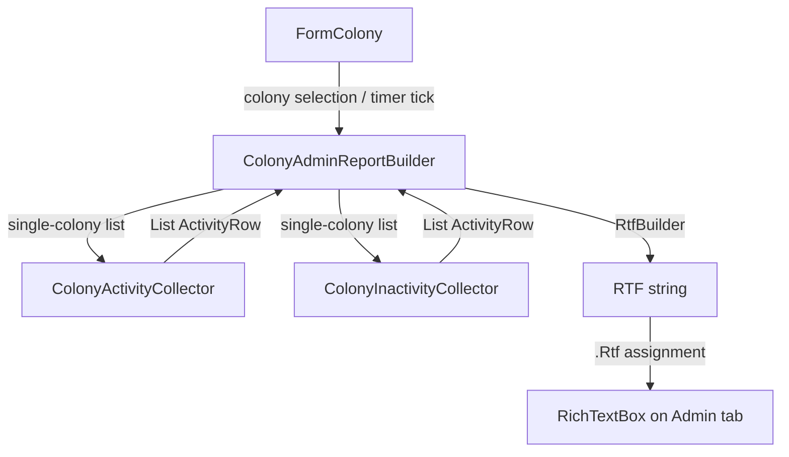

# Design Document: Colony Admin Summary

## Overview

This feature adds a per-colony status report to the Administration tab of `FormColony`. The report is a read-only `RichTextBox` rendered via `RtfBuilder` that displays building progress, inactivity warnings, and active process summaries for the selected colony. It reuses the existing `ColonyActivityCollector` and `ColonyInactivityCollector` services by passing a single-colony list to scope data collection.

A new static service class `ColonyAdminReportBuilder` owns all report-building logic. It takes a `Colony` and `PlayerContext`, collects activity/inactivity rows, aggregates mining and refining data, computes batch completion times for manufacturing, and returns an RTF string. The form assigns this string to `RichTextBox.Rtf` in one operation to avoid flicker.

The report refreshes on a 60-second `System.Windows.Forms.Timer`, on colony selection change, on `ColonyDataChanged`, and clears on `CurrentPlayerChanged`.

## Architecture



The architecture follows the existing layered pattern:
- **Service layer**: `ColonyAdminReportBuilder` (static, no state) orchestrates data collection and RTF generation.
- **UI layer**: `FormColony` owns the `RichTextBox` and `Timer`, calls the service on refresh triggers.
- **Existing services**: `ColonyActivityCollector` and `ColonyInactivityCollector` are called unchanged with a single-colony list.

## Components and Interfaces

### ColonyAdminReportBuilder (new static class)

Location: `OE2EmpireTracker/Services/ColonyAdminReportBuilder.cs`

```csharp
public static class ColonyAdminReportBuilder
{
    /// <summary>
    /// Builds the full admin report RTF string for a single colony.
    /// Returns empty string if colony is null.
    /// </summary>
    public static string BuildReport(Colony colony, PlayerContext playerContext);
}
```

Internal responsibilities:
1. Call `ColonyActivityCollector.CollectActivities(new[] { colony }, playerContext)` to get active rows.
2. Call `ColonyInactivityCollector.CollectInactivities(new[] { colony }, playerContext)` to get inactivity rows.
3. Partition activity rows into Building vs. non-Building.
4. Partition inactivity rows into their sub-groups (ColonyImportStaleness, idle Mining/Refining/Manufacturing/CommodityManufacturing/Research, underutilized Refining).
5. Aggregate mining rows: group by `(Resource, Purity)`, sum rates into one summary row per group.
6. Aggregate refining rows: group by `(InputResource, InputPurity)`, sum consume/produce rates into one summary row per group.
7. For Manufacturing/CommodityManufacturing multi-quantity rows, compute both next-item and full-batch completion times.
8. Build RTF via `RtfBuilder` in section order: Building → Commodity Requests → Inactivity → Activity.
9. Return `builder.ToRtf()`.

### Batch Completion Time Calculation

For Manufacturing and CommodityManufacturing structures with `ManufacturingQuantity > 1`:

- **Next item completion**: `CountDown.EndTime` (the current cycle's end) — already available from `ActivityRow.CountDown`.
- **Full batch completion**: `remaining_cycles × cycle_duration + current_cycle_remaining` where:
  - `remaining_cycles = ManufacturingQuantity - ManufacturingCompleted - 1` (excluding the current in-progress cycle)
  - `cycle_duration = CountDown.RepeatIntervalSeconds`
  - `current_cycle_remaining = CountDown.TimeRemaining`
  - `batch_seconds = remaining_cycles * cycle_duration + current_cycle_remaining`

The report builder needs access to the `ColonyStructure` to read `ManufacturingQuantity`, `ManufacturingCompleted`, and `ProcessCompletionTime.RepeatIntervalSeconds`. Since `ActivityRow` doesn't carry a structure reference, the report builder will do its own structure iteration for manufacturing/commodity rows rather than relying solely on the collector output.

### Mining Aggregation

Active mining rows are grouped by `(Resource, Purity)`. For each group:
- Sum the mining rate (parsed from `SurveyResource.Amount` × ExtractionFocus multiplier) across all miners on that resource+purity.
- Display: `"Resource (Purity) — {totalRate}/h"`

The report builder reuses the same rate calculation logic from `ColonyInactivityCollector.GetMiningOutputRate` (which is private). Rather than duplicating, the builder will iterate active miners directly, reading survey data and computing rates.

### Refining Aggregation

Active refining rows are grouped by `(InputResource, InputPurity)`. For each group:
- Count the number of active refiners.
- Sum consume rates and produce rates.
- For normal refining: consume = `RefiningBaseRate` per refiner, produce = `consume × purity_multiplier`.
- For synthetic refining: use `RefiningRecipe.ConsumeRate` and `ProduceRate`.
- Display: `"{count}x Resource (Purity) — {totalConsume}:{totalProduce} Resource"`

### Completion Time Formatting

All non-repeating completion times display two values:
1. **Relative countdown**: e.g. `"2h 15m 30s"` (from `CountDown.TimeRemainingString` or `ActivityRow.FormatSeconds`)
2. **Local timezone time**: `CountDown.EndTime.ToLocalTime().ToString("HH:mm ddd")` (or batch end time computed as `DateTime.UtcNow.AddSeconds(batchSeconds).ToLocalTime()`)

### FormColony Changes

1. Add a `RichTextBox rtbAdminReport` to `tabPAdministration`, below `flowLayoutPanel4` (which contains Bootstrap/Optimize buttons). The RichTextBox fills remaining space via `Dock = Fill` inside a container, or manual sizing in the Layout handler.
2. Add a `System.Windows.Forms.Timer timerAdminRefresh` with `Interval = 60000`.
3. Wire refresh logic:
   - `lvwColonies_ItemSelectionChanged` → call `RefreshAdminReport()`
   - `OnColonyDataChanged` → if selected colony matches, call `RefreshAdminReport()`
   - `OnCurrentPlayerChanged` → clear `rtbAdminReport`
   - `timerAdminRefresh.Tick` → call `RefreshAdminReport()`
4. `RefreshAdminReport()` method:
   ```csharp
   private void RefreshAdminReport()
   {
       if (selectedColony == null || string.IsNullOrEmpty(selectedColony.UUID))
       {
           rtbAdminReport.Rtf = "";
           return;
       }
       rtbAdminReport.Rtf = ColonyAdminReportBuilder.BuildReport(selectedColony, playerContext);
   }
   ```
5. Start timer in constructor, stop/dispose in `Dispose` override or `OnFormClosed`.

### Administration Tab Layout

Current hierarchy:
```
tabPAdministration
  └── flowLayoutPanel4 (contains flowLayoutPanel3 with Bootstrap + Optimize buttons)
```

New hierarchy:
```
tabPAdministration
  └── flowLayoutPanel4 (TopDown, Dock=Fill)
        ├── flowLayoutPanel3 (Bootstrap + Optimize buttons, fixed height ~29px)
        └── rtbAdminReport (ReadOnly RichTextBox, fills remaining space)
```

`flowLayoutPanel4` will be changed to `Dock = Fill` and `FlowDirection = TopDown` with `WrapContents = false`. The `rtbAdminReport` will be sized dynamically in a Layout handler to fill remaining vertical space after the button row.

## Report Examples

The following shows what the report looks like for a colony with a mix of building, idle, and active structures. Colors are described in brackets — actual rendering uses `RtfBuilder` colored text runs.

### Full Report Example

```
[HEADER] Building
  #4 Mining Rig — 1h 23m 15s (3:45 PM Wed)
  #7 Refinery — 3h 10m 42s (5:32 PM Wed)

[HEADER] Commodity Requests
  Joybots x500 — due 15APR26-3:00p
  Synthetic Textiles x200

[HEADER] Colony Import Staleness
  Colony Import — 5d 3h since last import

[HEADER] Idle Mining
  #2 Mining Rig — No survey assigned
  #5 Mining Rig — Idle

[HEADER] Idle Refining
  #8 Refinery — No resource assigned

[HEADER] Idle Manufacturing
  #12 Manufactory — No blueprint assigned

[HEADER] Underutilized Refining
  #9 Refinery — Underutilized: 10/25 per cycle

[HEADER] Manufacturing
  #10 Manufactory — (3/10) Pion P-2S Particle Beamer
    Next: 45m 12s (1:07 PM Wed)
    Batch: 5h 15m 12s (5:37 PM Wed)

[HEADER] Commodity Manufacturing
  #14 Agridome — (2/5) Joybots x10
    Next: 1h 02m 30s (1:24 PM Wed)
    Batch: 4h 10m 30s (4:32 PM Wed)

[HEADER] Research
  #11 Research Laboratory — Evo 3->4 Pion K-7M Particle Beamer
    12h 30m 15s (12:52 AM Thu)

[HEADER] Mining
  Halogen (High) — 150/h
  Calcium (Medium) — 85/h

[HEADER] Refining
  3x Halogen (High) — 75:375 Halogen
  1x Calcium (Medium) — 25:75 Calcium
```

### Building Only (no other activity)

```
[HEADER] Building
  #1 Habitation Block — 2h 05m 30s (4:27 PM Wed)
```

### Inactivity Only (everything idle)

```
[HEADER] Colony Import Staleness
  Colony Import — 8d 12h since last import

[HEADER] Idle Mining
  #2 Mining Rig — Idle
  #3 Mining Rig — Idle

[HEADER] Idle Refining
  #6 Refinery — Idle
```

### Single-Item Manufacturing (no batch line)

```
[HEADER] Manufacturing
  #10 Manufactory — (1/1) KORE-8S 10cm PD Coilgun Turret
    32m 45s (1:54 PM Wed)
```

### Last Cycle Manufacturing (no batch line)

```
[HEADER] Manufacturing
  #10 Manufactory — (10/10) Pion P-2S Particle Beamer
    12m 30s (12:34 PM Wed)
```

### Mining Summary (multiple miners on same resource)

```
[HEADER] Mining
  Halogen (High) — 150/h
```

This represents e.g. 3 miners each producing 50/h of Halogen (High), aggregated into a single row.

### Refining Summary (multiple refiners on same resource)

```
[HEADER] Refining
  3x Halogen (High) — 75:375 Halogen
```

This represents 3 refiners each consuming 25 and producing 125 Halogen per cycle.

## Data Models

No new data models are introduced. The feature uses existing types:

- **`Colony`** — the selected colony passed to the report builder.
- **`ColonyStructure`** — iterated for manufacturing batch calculations and mining/refining aggregation.
- **`ActivityRow`** — returned by collectors, used for building/research/commodity-request rows.
- **`CountDownTime`** — provides `TimeRemaining`, `EndTime`, `RepeatIntervalSeconds`, `IsRepeating`.
- **`RtfBuilder`** — builds the RTF string from colored text runs.
- **`PlayerContext`** — provides `FindBlueprint`, `FindSurvey`, colony data, and events.
- **`SurveyResource`** — provides `Resource`, `Purity`, `Amount` for mining rate calculation.
- **`RefiningRecipe`** — provides `ConsumeRate`, `ProduceRate`, `OutputResource` for synthetic refining.


## Correctness Properties

*A property is a characteristic or behavior that should hold true across all valid executions of a system — essentially, a formal statement about what the system should do. Properties serve as the bridge between human-readable specifications and machine-verifiable correctness guarantees.*

### Property 1: Report section ordering

*For any* colony that has building rows, commodity request rows, inactivity rows, and activity rows, the Building section text SHALL appear first, followed by Commodity Requests, then inactivity text, then activity section text in the generated RTF output.

**Validates: Requirements 2.1, 2a.1, 3.1, 4.1**

### Property 2: Completion time dual display

*For any* non-repeating activity row (Building, Manufacturing, CommodityManufacturing, Research) with a positive `TimeRemaining`, the formatted output for that row SHALL contain both a relative countdown string (e.g. "2h 15m") and a local timezone time string (e.g. "14:30 Wed").

**Validates: Requirements 2.2, 4.5, 4.10**

### Property 3: Building rows sorted by soonest completion

*For any* colony with two or more structures currently building, the building rows in the report output SHALL appear in ascending order of `TimeRemaining` (soonest completion first).

**Validates: Requirements 2.3**

### Property 4: Inactivity group ordering

*For any* colony with inactivity rows spanning multiple group types, the groups SHALL appear in the fixed order: Colony Import Staleness, Idle Mining, Idle Refining, Idle Manufacturing, Idle Commodity Manufacturing, Idle Research, Underutilized Refining.

**Validates: Requirements 3.2**

### Property 5: Inactivity rows contain header and details

*For any* inactivity group that has at least one row, the report output SHALL contain a group header identifying the group, and each row SHALL contain the source name and process details from the corresponding `ActivityRow`.

**Validates: Requirements 3.3, 3.4**

### Property 6: Activity section excludes building and commodity request rows

*For any* colony, the activity section of the report SHALL NOT contain any Building-type or CommodityRequest-type rows. Building rows SHALL appear exclusively in the Building section, and CommodityRequest rows SHALL appear exclusively in the Commodity Requests section.

**Validates: Requirements 4.2**

### Property 7: Non-repeating activity rows sorted by soonest completion

*For any* colony with two or more non-repeating active process rows (Manufacturing, CommodityManufacturing, Research), those rows SHALL appear in ascending order of seconds remaining.

**Validates: Requirements 4.3**

### Property 8: Multi-quantity manufacturing shows next-item and batch completion

*For any* Manufacturing or CommodityManufacturing structure with `ManufacturingQuantity > 1` and `ManufacturingCompleted < ManufacturingQuantity - 1`, the report row SHALL contain both a next-item completion time and a full-batch completion time, where the batch time equals `(remaining_cycles × RepeatIntervalSeconds) + current_cycle_remaining`.

**Validates: Requirements 4.4**

### Property 9: Mining aggregation — one row per resource+purity

*For any* colony with N active miners on the same `(Resource, Purity)` combination, the activity section SHALL contain exactly one mining summary row for that combination, and the displayed rate SHALL equal the sum of individual miner rates.

**Validates: Requirements 4.6**

### Property 10: Refining aggregation — one row per resource+purity

*For any* colony with N active refiners on the same `(InputResource, InputPurity)` combination, the activity section SHALL contain exactly one refining summary row for that combination, and the displayed consume and produce rates SHALL equal the sums of individual refiner rates.

**Validates: Requirements 4.7**

### Property 11: Commodity request rows contain name and quantity

*For any* unfulfilled commodity request on a colony, the Commodity Requests section SHALL contain a row displaying the commodity name and requested quantity.

**Validates: Requirements 2a.2**

## Error Handling

| Scenario | Handling |
|---|---|
| `colony` is null or has no UUID | `BuildReport` returns empty string; `rtbAdminReport.Rtf` is set to `""` |
| `ColonyActivityCollector` or `ColonyInactivityCollector` throws | Catch at `RefreshAdminReport` level, log via NLog, leave report unchanged |
| Blueprint not found for a structure | Skip that structure (matches existing collector behavior) |
| Survey not found for a miner | Skip that miner's rate contribution (rate = 0) |
| `ProcessCompletionTime` is null | Skip completion time display for that row |
| `ManufacturingQuantity <= ManufacturingCompleted` | Show as completed, no batch time |
| Timer tick after form disposed | Guard with `IsDisposed` check before refresh (matches existing pattern) |
| `RepeatIntervalSeconds` is 0 for a manufacturing structure | Treat as single-item, no batch calculation |

## Testing Strategy

### Unit Tests

Unit tests cover specific examples and edge cases:

- **Empty colony**: `BuildReport` with a colony that has no structures and no commodities returns empty string.
- **Building-only colony**: Colony with one structure building produces a report with only the Building section.
- **Inactivity-only colony**: Colony with idle structures but no active processes produces only the Inactivity section.
- **Section omission**: Colony with no building rows omits the Building header entirely.
- **Inactivity group omission**: Colony with only idle miners omits all other inactivity group headers.
- **Null colony**: `BuildReport(null, playerContext)` returns empty string.
- **Batch completion edge case**: Manufacturing structure with `ManufacturingQuantity = 1` shows only next-item time, no batch time.
- **Batch completion edge case**: Manufacturing structure on its last cycle (`ManufacturingCompleted = ManufacturingQuantity - 1`) shows only next-item time.

### Property-Based Tests

Property-based tests use **FsCheck** (via the FsCheck.NUnit adapter for NUnit 4.x) to verify universal properties across randomly generated inputs. Each property test runs a minimum of 100 iterations.

Each test is tagged with a comment referencing the design property:
```
// Feature: colony-admin-summary, Property {N}: {property_text}
```

Properties to implement as PBT:
1. **Section ordering** (Property 1) — generate colonies with random mixes of building/idle/active structures, verify section order in output.
2. **Completion time dual display** (Property 2) — generate random non-repeating CountDownTime values, verify output contains both countdown and local time strings.
3. **Building sort order** (Property 3) — generate colonies with multiple building structures at random times, verify ascending order.
4. **Inactivity group ordering** (Property 4) — generate colonies with random idle structure types, verify group header order.
5. **Inactivity content** (Property 5) — generate inactivity rows, verify headers and row content present.
6. **Activity excludes building** (Property 6) — generate colonies with building + active structures, verify no building text in activity section.
7. **Activity sort order** (Property 7) — generate colonies with multiple non-repeating active processes, verify ascending order.
8. **Batch completion** (Property 8) — generate manufacturing structures with random quantities/completed/intervals, verify both times present and batch math correct.
9. **Mining aggregation** (Property 9) — generate colonies with multiple miners on same resource, verify single row with summed rate.
10. **Refining aggregation** (Property 10) — generate colonies with multiple refiners on same resource+purity, verify single row with summed rates.
11. **Commodity request content** (Property 11) — generate random commodity requests, verify name and quantity in output.
