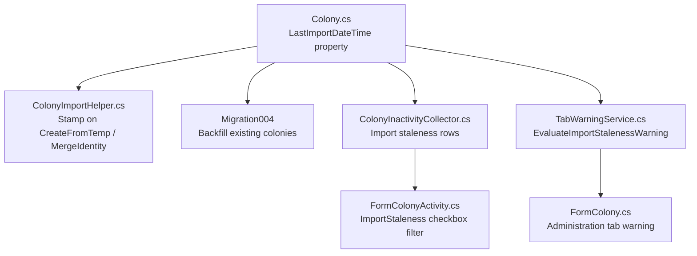

# Design Document: Colony Import Timestamp

## Overview

This feature adds a `LastImportDateTime` property to the Colony data model and surfaces it in two places: as import staleness rows on the Colony Activity form's inactivity mode, and as color-coded warnings on the Colony form's Administration tab. The timestamp is stamped automatically during colony import (both create and merge paths), and existing colonies are backfilled via migration.

This spec also retrofits `SurveyDateTimeParser` to be UTC-aware. The game operates in UTC timezone, so game-parsed datetimes are already UTC. All application-generated timestamps use `DateTime.UtcNow`. The ISO format gains a `Z` suffix. Display conversions to local time happen at the UI layer. The survey datetime code has not shipped to anyone, so this is a direct code fix with no migration.

The design follows established patterns in the codebase:
- ISO 8601 UTC string storage using `SurveyDateTimeParser.ToIsoString` / `TryParseIso` (`yyyy-MM-ddTHH:mm:ssZ`)
- Migration via `MigrationRunner` (bump `CurrentVersion` from 3 to 4, register `Migration004`)
- Inactivity rows via `ColonyInactivityCollector` (staleness is an inactivity concept)
- Tab warnings via `TabWarningService` (same pattern as structure count and worker request warnings)

## Architecture

The feature touches four layers of the application:



Data flows:
1. **Write path**: `ColonyImportHelper.CreateFromTemp` and `MergeIdentity` stamp `LastImportDateTime` using `SurveyDateTimeParser.ToIsoString(DateTime.UtcNow)`. The value persists to `PlayerData.json` via Newtonsoft.Json serialization.
2. **Migration path**: `Migration004` iterates all colonies across all player profiles, backfilling null/empty `LastImportDateTime` with `DateTime.UtcNow` in ISO format.
3. **Read path (inactivity)**: `ColonyInactivityCollector.CollectInactivities` parses `LastImportDateTime` via `SurveyDateTimeParser.TryParseIso`, computes elapsed time against `DateTime.UtcNow`, and emits `ActivityRow` instances with `ActivityType.ImportStaleness` for colonies older than 1 day.
4. **Read path (tab warning)**: `TabWarningService.EvaluateImportStalenessWarning` parses the timestamp and returns `TabWarningLevel` based on hardcoded thresholds (5 days yellow, 6 days red). Comparison uses `DateTime.UtcNow`.

## Components and Interfaces

### 1. Colony Data Model (`Colony.cs`)

Add a single string property:

```csharp
public string LastImportDateTime { get; set; }
```

- Stored as ISO 8601 UTC string (`yyyy-MM-ddTHH:mm:ssZ`), same format as `SurveyDateTimeParser.IsoFormat`.
- Serialized/deserialized by Newtonsoft.Json automatically (it's a public string property, consistent with all other Colony properties).
- Null/empty means "never imported" — no special handling needed in the constructor.

### 2. ColonyImportHelper (`ColonyImportHelper.cs`)

Two methods modified:

**`CreateFromTemp`** — Add one line after copying fields:
```csharp
colony.LastImportDateTime = SurveyDateTimeParser.ToIsoString(DateTime.UtcNow);
```

**`MergeIdentity`** — Add one line at the end:
```csharp
target.LastImportDateTime = SurveyDateTimeParser.ToIsoString(DateTime.UtcNow);
```

Both use `SurveyDateTimeParser.ToIsoString` with `DateTime.UtcNow` for consistent UTC formatting.

### 3. ActivityType Enum (`ColonyActivityCollector.cs`)

Add a new enum value:

```csharp
public enum ActivityType
{
    Building,
    Manufacturing,
    CommodityManufacturing,
    CommodityRequest,
    Research,
    Mining,
    Refining,
    ImportStaleness  // NEW
}
```

### 4. ColonyInactivityCollector (`ColonyInactivityCollector.cs`)

Add a new method `CollectImportStaleness` called from `CollectInactivities`:

```csharp
private static void CollectImportStaleness(Colony colony, List<ActivityRow> rows)
```

Logic:
- Parse `colony.LastImportDateTime` via `SurveyDateTimeParser.TryParseIso`.
- If parse fails (null/empty/invalid), treat as maximally stale — emit a row with "Unknown" details.
- Compute elapsed seconds: `(DateTime.UtcNow - parsed).TotalSeconds`.
- If elapsed > 86400 (1 day), emit an `ActivityRow`:
  - `Type = ActivityType.ImportStaleness`
  - `SystemName = colony.SystemName`
  - `ColonyName = colony.ColonyName`
  - `SourceName = "Colony Import"`
  - `ProcessDetails = "{formatted elapsed} since last import"` using `ActivityRow.FormatSeconds` + " since last import"
  - `CountDown = null`
  - `NeedBy = DateTime.MinValue`

The elapsed time formatting uses the existing `ActivityRow.FormatSeconds` method, which already produces "Xd Yh Zm Ws" format. We append " since last import" to the result.

### 5. TabWarningService (`TabWarningService.cs`)

Add constants and a new method:

```csharp
public const int ImportStalenessYellowDays = 5;
public const int ImportStalenessRedDays = 6;

public static TabWarningLevel EvaluateImportStalenessWarning(string lastImportDateTime, DateTime now)
```

Logic:
- If `lastImportDateTime` is null or empty, return `TabWarningLevel.Red`.
- Parse via `SurveyDateTimeParser.TryParseIso`. If parse fails, return `TabWarningLevel.Red`.
- Compute elapsed: `now - parsed`.
- If elapsed >= 6 days, return `Red`.
- If elapsed >= 5 days, return `Yellow`.
- Otherwise, return `None`.

### 6. FormColony (`FormColony.cs`)

Modify `UpdateTabWarnings` to add one call:

```csharp
ApplyTabWarning(tabPAdministration,
    TabWarningService.EvaluateImportStalenessWarning(
        selectedColony?.LastImportDateTime, DateTime.UtcNow));
```

This uses the existing `ApplyTabWarning` method and `tabPAdministration` tab page.

### 7. FormColonyActivity (`FormColonyActivity.cs` + Designer)

**Designer**: Add a new checkbox `chkImportStaleness` in the `flpFilters` panel, positioned after `chkRefining` and before `chkShowInactive`. Default checked.

**Code-behind**:
- Wire `chkImportStaleness.CheckedChanged` to `chkFilter_CheckedChanged`.
- Show/hide `chkImportStaleness` based on inactivity mode: visible only when `chkShowInactive.Checked` is true.
- Add `ActivityType.ImportStaleness` to `GetSelectedActivityTypes()` when `chkShowInactive.Checked && chkImportStaleness.Checked`.

### 8. Migration004 (`Migration004_ColonyImportTimestampBackfill.cs`)

New file in `OE2EmpireTracker/Services/Migration/Migrations/`:

```csharp
public static class Migration004_ColonyImportTimestampBackfill
{
    public static void Run(EmpireContext ec, PlayerContext pc)
    {
        foreach (var colony in pc.ColonyList)
        {
            if (string.IsNullOrEmpty(colony.LastImportDateTime))
                colony.LastImportDateTime = SurveyDateTimeParser.ToIsoString(DateTime.UtcNow);
        }
    }
}
```

**MigrationRunner**: Bump `CurrentVersion` from 3 to 4, add `{ 4, Migration004_ColonyImportTimestampBackfill.Run }` to the `Migrations` dictionary.

### 9. SurveyDateTimeParser UTC Retrofit (`SurveyDateTimeParser.cs`)

Direct code changes (no migration needed — survey datetime has not shipped):

- **`IsoFormat`**: Change from `"yyyy-MM-ddTHH:mm:ss"` to `"yyyy-MM-ddTHH:mm:ssZ"`.
- **`ToIsoString`**: Format with `Z` suffix. The input DateTime is assumed to be UTC.
- **`TryParseIso`**: Accept both `"yyyy-MM-ddTHH:mm:ssZ"` and `"yyyy-MM-ddTHH:mm:ss"` (for any legacy data). Use `DateTimeStyles.AdjustToUniversal | DateTimeStyles.AssumeUniversal` to produce UTC DateTime values.
- **`TryParseGameFormat`**: No change to parsing (game dates are already UTC). The returned DateTime is UTC.
- **`FormatForDisplay`**: After parsing the UTC ISO string, convert to local time via `dt.ToLocalTime()` before formatting to game format. This ensures the UI shows the user's local time.
- **`DateTime.Now` → `DateTime.UtcNow`**: Update `Migration003_SurveyDateTimeNormalization` fallback to use `DateTime.UtcNow`.
- **FormSurvey DateTimePicker**: In `PopulateFormFromViewModel`, convert parsed UTC DateTime to local via `.ToLocalTime()` before setting the picker value. In `dtpScanDateTime_ValueChanged`, convert the picker's local value to UTC via `.ToUniversalTime()` before calling `ToIsoString`.

### 10. Update Existing SurveyDateTimeParser Tests

Update all existing property tests and unit tests to account for UTC:
- Property test generators produce UTC DateTimes (`DateTimeKind.Utc`)
- Expected ISO strings include `Z` suffix
- Round-trip tests verify UTC preservation
- SurveyParser test expected values updated with `Z` suffix
- FormatForDisplay tests account for UTC→local conversion

## Data Models

### Colony (modified)

| Property | Type | Format | Default | Notes |
|---|---|---|---|---|
| LastImportDateTime | string | `yyyy-MM-ddTHH:mm:ssZ` | null | ISO 8601 UTC, same as SurveyDateTimeParser.IsoFormat |

JSON representation (within Colony object):
```json
{
  "LastImportDateTime": "2025-01-15T14:30:00Z"
}
```

Null/empty is valid — means "never imported". The migration backfills all existing colonies so this state only occurs for manually-created colonies that have never been imported.

### ActivityType Enum (modified)

| Value | Description |
|---|---|
| ImportStaleness | New. Represents a colony whose last import is older than 1 day. Used only in inactivity mode. |

### TabWarningService Constants (new)

| Constant | Value | Description |
|---|---|---|
| ImportStalenessYellowDays | 5 | Days since last import for yellow warning |
| ImportStalenessRedDays | 6 | Days since last import for red warning |

These are hardcoded for now. BL-061 (Preferences Form) will make them configurable in the future.


## Correctness Properties

*A property is a characteristic or behavior that should hold true across all valid executions of a system — essentially, a formal statement about what the system should do. Properties serve as the bridge between human-readable specifications and machine-verifiable correctness guarantees.*

### Property 1: Colony LastImportDateTime JSON round-trip

*For any* Colony with a non-null `LastImportDateTime` string in ISO 8601 format, serializing the Colony to JSON via `JsonConvert.SerializeObject` and deserializing it back via `JsonConvert.DeserializeObject<Colony>` should produce a Colony whose `LastImportDateTime` is identical to the original.

**Validates: Requirements 1.1, 1.2**

### Property 2: Import operations produce valid ISO timestamps

*For any* valid temp colony (with non-empty PlanetName) and owner UUID, calling `ColonyImportHelper.CreateFromTemp` should produce a Colony whose `LastImportDateTime` is a non-null string that successfully parses via `SurveyDateTimeParser.TryParseIso`. Likewise, *for any* target and source Colony, calling `ColonyImportHelper.MergeIdentity` should result in the target's `LastImportDateTime` being a non-null string that successfully parses via `SurveyDateTimeParser.TryParseIso`.

**Validates: Requirements 2.1, 2.2, 2.3**

### Property 3: Migration backfills empty and preserves existing

*For any* list of colonies where some have null/empty `LastImportDateTime` and others have valid ISO 8601 strings, after running `Migration004_ColonyImportTimestampBackfill.Run`, every colony should have a non-null `LastImportDateTime` that parses via `SurveyDateTimeParser.TryParseIso`, and any colony that had a valid ISO string before migration should have the same value after migration.

**Validates: Requirements 3.1, 3.2**

### Property 4: Inactivity collector produces correct ImportStaleness rows

*For any* set of colonies with various `LastImportDateTime` values (some > 1 day old, some < 1 day old, some null), `ColonyInactivityCollector.CollectInactivities` should produce exactly one `ActivityRow` with `Type == ActivityType.ImportStaleness` for each colony whose `LastImportDateTime` is older than 1 day or is null/empty. Each such row should have `ColonyName` and `SystemName` matching the source colony, `SourceName == "Colony Import"`, and `ProcessDetails` ending with " since last import".

**Validates: Requirements 4.2, 4.3, 4.5**

### Property 5: TabWarningService returns correct warning level for import staleness

*For any* valid ISO 8601 timestamp string and reference `DateTime now`, `TabWarningService.EvaluateImportStalenessWarning` should return `Red` when elapsed >= 6 days, `Yellow` when elapsed >= 5 days and < 6 days, and `None` when elapsed < 5 days. For null or empty input, it should return `Red`.

**Validates: Requirements 5.2, 5.3, 5.4, 5.5**

### Property 6: SurveyDateTimeParser stores UTC and displays local

*For any* valid UTC DateTime, `ToIsoString` should produce a string ending with `Z`. Parsing that string back via `TryParseIso` should produce a DateTime with `Kind == DateTimeKind.Utc` and the same value. `FormatForDisplay` should convert to local time before formatting, so the game-format output reflects the user's timezone.

**Validates: Requirements 7.3, 7.4, 7.5, 7.6**

## Error Handling

| Scenario | Handling |
|---|---|
| `LastImportDateTime` is null or empty on a Colony | Treated as "never imported". Migration backfills it. TabWarningService returns Red. InactivityCollector emits a staleness row. No exceptions thrown. |
| `LastImportDateTime` contains an unparseable string | `SurveyDateTimeParser.TryParseIso` returns false. TabWarningService returns Red. InactivityCollector treats as maximally stale. |
| Migration fails mid-run | `MigrationRunner.HandleFailure` sets `MigrationFailed = true`, shows error dialog, and blocks saving. Existing pattern — no new error handling needed. |
| Colony has no structures (empty colony) | Import staleness is independent of structures. The staleness row is still emitted based on `LastImportDateTime` alone. |

## Testing Strategy

### Unit Tests

Unit tests cover specific examples and edge cases:

- Colony with null `LastImportDateTime` serializes/deserializes without error (edge case from 1.3)
- `EvaluateImportStalenessWarning` with null input returns Red (edge case from 5.5)
- `EvaluateImportStalenessWarning` with empty string returns Red (edge case from 5.5)
- `ActivityType.ImportStaleness` enum value exists (example from 4.1)
- Elapsed time < 1 day formats correctly with "Xh Ym since last import" (edge case from 6.2)
- Migration on a colony that already has a valid timestamp leaves it unchanged (specific example)

### Property-Based Tests

Property-based tests verify universal properties across generated inputs. Each property test runs a minimum of 100 iterations.

The project uses **FsCheck** (NuGet package `FsCheck` + `FsCheck.NUnit`) as the property-based testing library, which integrates with the existing NUnit test framework.

Each property test must be tagged with a comment referencing the design property:
- **Feature: colony-import-timestamp, Property 1: Colony LastImportDateTime JSON round-trip**
- **Feature: colony-import-timestamp, Property 2: Import operations produce valid ISO timestamps**
- **Feature: colony-import-timestamp, Property 3: Migration backfills empty and preserves existing**
- **Feature: colony-import-timestamp, Property 4: Inactivity collector produces correct ImportStaleness rows**
- **Feature: colony-import-timestamp, Property 5: TabWarningService returns correct warning level for import staleness**

Each correctness property is implemented by a single property-based test. Property tests generate random inputs (colony names, planet names, ISO datetime strings, elapsed time values) and verify the universal property holds across all generated cases.
