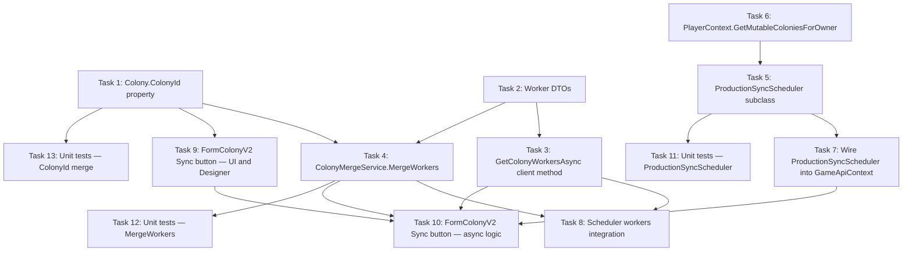

# Implementation Plan

## Overview

This plan wires the GameApiSyncScheduler's virtual methods to PlayerContext via a ProductionSyncScheduler subclass, adds a manual "Sync Colony" button to FormColonyV2, and integrates the workers API endpoint for both automatic and manual sync paths.

## Task Dependency Graph



```json
{
  "waves": [
    { "wave": 1, "tasks": [1, 2, 6] },
    { "wave": 2, "tasks": [3, 4, 5] },
    { "wave": 3, "tasks": [7, 8, 9, 13] },
    { "wave": 4, "tasks": [10, 11, 12] }
  ]
}
```

## Tasks

- [x] 1. Add ColonyId property to Colony model
  - Satisfies: Req 7, Criterion 1 ("Colony model SHALL expose a ColonyId property (int)")
  - Satisfies: Req 7, Criterion 2 ("ColonyMergeService SHALL populate ColonyId on matched colonies")
  - Inputs: `OE2EmpireTracker/Models/Colony.cs`, `OE2EmpireTracker/Services/ColonyMergeService.cs`
  - Output: Modified `Colony.cs` with ColonyId property; modified `ColonyMergeService.cs` to set ColonyId in MergeColonyList
  - Verification: getDiagnostics on both files; build solution

- [x] 2. Add Workers API response DTOs
  - Satisfies: Req 11, Criteria 1-7 (all DTO definitions)
  - Inputs: Design doc DTO section
  - Output: New file `OE2EmpireTracker/Models/GameApiColonyWorkersResponse.cs` containing GameApiColonyWorkersResponse, GameApiCommodityDemand, GameApiWorkforceOverview, GameApiColonyWorkerDetail, GameApiColonyWages, GameApiColonyModifier, GameApiColonyCapacities
  - Verification: getDiagnostics; build solution

- [x] 3. Add GetColonyWorkersAsync to GameApiClient
  - Satisfies: Req 10, Criteria 1-3 (client method, pattern, endpoint)
  - Inputs: `OE2EmpireTracker/Client/GameApiClient.cs` (existing GetColonyBuildingsAsync as pattern)
  - Output: Modified `GameApiClient.cs` with new GetColonyWorkersAsync method
  - Verification: getDiagnostics; build solution

- [x] 4. Implement ColonyMergeService.MergeWorkers
  - Satisfies: Req 12, Criteria 1-5 (commodity demand mapping and change detection)
  - Satisfies: Req 13, Criteria 1-3 (workforce overview and wages update)
  - Inputs: `OE2EmpireTracker/Services/ColonyMergeService.cs`, `OE2EmpireTracker/Models/Colony.cs` (for workforce fields)
  - Output: Modified `Colony.cs` with workforce allocation fields; modified `ColonyMergeService.cs` with MergeWorkers method
  - Verification: getDiagnostics; build solution

- [x] 5. Create ProductionSyncScheduler subclass
  - Satisfies: Req 1, Criteria 2-5 (GetPlayerProfile, GetPlayerColonies, WriteContext, RaiseColonyDataChanged)
  - Satisfies: Req 2, Criterion 2 (same constructor parameters plus PlayerContext)
  - Inputs: `OE2EmpireTracker/Services/GameApiSyncScheduler.cs` (base class)
  - Output: New file `OE2EmpireTracker/Services/ProductionSyncScheduler.cs`
  - Verification: getDiagnostics; build solution

- [x] 6. Add PlayerContext.GetMutableColoniesForOwner
  - Satisfies: Req 1, Criterion 3 (return mutable colony list filtered by OwnerUUID)
  - Inputs: `OE2EmpireTracker/Services/PlayerContext.cs`
  - Output: Modified `PlayerContext.cs` with new internal method
  - Verification: getDiagnostics; build solution

- [x] 7. Wire ProductionSyncScheduler into GameApiContext.Initialize
  - Satisfies: Req 1, Criterion 1 (Production_Scheduler instantiated instead of base)
  - Satisfies: Req 2, Criterion 1 (SyncScheduler property type unchanged)
  - Satisfies: Req 2, Criterion 3 (dispose behavior unchanged)
  - Inputs: `OE2EmpireTracker/Services/GameApiContext.cs`
  - Output: Modified `GameApiContext.cs` — replace `new GameApiSyncScheduler(...)` with `new ProductionSyncScheduler(...)`
  - Verification: getDiagnostics; build solution

- [x] 8. Add workers integration to GameApiSyncScheduler.SyncColoniesAsync
  - Satisfies: Req 14, Criteria 1-4 (automatic scheduler fetches workers, scope caching, error handling)
  - Inputs: `OE2EmpireTracker/Services/GameApiSyncScheduler.cs`
  - Output: Modified `GameApiSyncScheduler.cs` with workersScopeAvailable flag and workers fetch block
  - Verification: getDiagnostics; build solution

- [x] 9. Add Sync button to FormColonyV2 — UI controls and Designer
  - Satisfies: Req 3, Criteria 1-5 (button placement, text, tooltip, enabled/disabled states)
  - Satisfies: Req 6, Criteria 1-3 (cooldown timer)
  - Inputs: `OE2EmpireTracker/Forms/ColonyV2/FormColonyV2.Designer.cs`, `OE2EmpireTracker/Forms/ColonyV2/FormColonyV2.cs`
  - Output: Modified Designer.cs with cmdSync button and timers; modified FormColonyV2.cs with enable/disable logic, cooldown timer handler, and UpdateSyncButtonState helper
  - Verification: getDiagnostics; build solution

- [x] 10. Implement FormColonyV2 sync execution logic
  - Satisfies: Req 4, Criteria 1-7 (sync execution, token exchange, merge calls, partial success, ColonyId check)
  - Satisfies: Req 5, Criteria 1-5 (status feedback)
  - Satisfies: Req 8, Criteria 1-2 (automatic refresh after sync)
  - Satisfies: Req 9, Criteria 1-7 (error handling, partial success, background thread, ObjectDisposedException)
  - Inputs: `OE2EmpireTracker/Forms/ColonyV2/FormColonyV2.cs`
  - Output: Modified `FormColonyV2.cs` with SyncSelectedColonyAsync method, status timer handler, error handling
  - Verification: getDiagnostics; build solution

- [x] 11. Unit tests — ProductionSyncScheduler
  - Satisfies: Req 1, Criteria 2-5 (delegation correctness)
  - Inputs: `OE2EmpireTracker/Services/ProductionSyncScheduler.cs`, `OE2EmpireTracker/Services/PlayerContext.cs`
  - Output: New file `OE2EmpireTracker.Tests/Services/ProductionSyncSchedulerTests.cs`
  - Verification: Build solution; run vstest.console; trxparse.js shows all pass

- [-] 12. Unit tests — MergeWorkers
  - Satisfies: Req 12, Criteria 2-5 (commodity mapping, Delivered logic, empty list, change detection)
  - Satisfies: Req 13, Criteria 1-3 (attitude, workforce overview, wages)
  - Inputs: `OE2EmpireTracker/Services/ColonyMergeService.cs`, `OE2EmpireTracker/Models/GameApiColonyWorkersResponse.cs`
  - Output: New file `OE2EmpireTracker.Tests/Services/ColonyMergeServiceWorkersTests.cs`
  - Verification: Build solution; run vstest.console; trxparse.js shows all pass

- [~] 13. Unit tests — ColonyId merge
  - Satisfies: Req 7, Criteria 1-2 (ColonyId defaults to 0, populated on merge)
  - Inputs: `OE2EmpireTracker/Models/Colony.cs`, `OE2EmpireTracker/Services/ColonyMergeService.cs`
  - Output: New file `OE2EmpireTracker.Tests/Services/ColonyMergeServiceColonyIdTests.cs`
  - Verification: Build solution; run vstest.console; trxparse.js shows all pass

## Notes

- Tasks 1, 2, and 6 have no dependencies and can be executed in parallel (Wave 1)
- Task 10 is the largest task (sync execution logic) but is constrained to a single file (FormColonyV2.cs) with well-defined error handling branches from the design doc
- The design explicitly states property-based testing is not appropriate for this spec — example-based unit tests are the correct strategy since the code is primarily wiring and fixed-mapping delegation
- ColonyMergeService.MergeWorkers tests (Task 12) cover the most complex logic: commodity demand mapping, change detection, and workforce field updates
