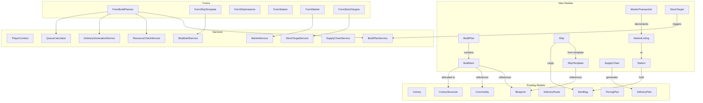
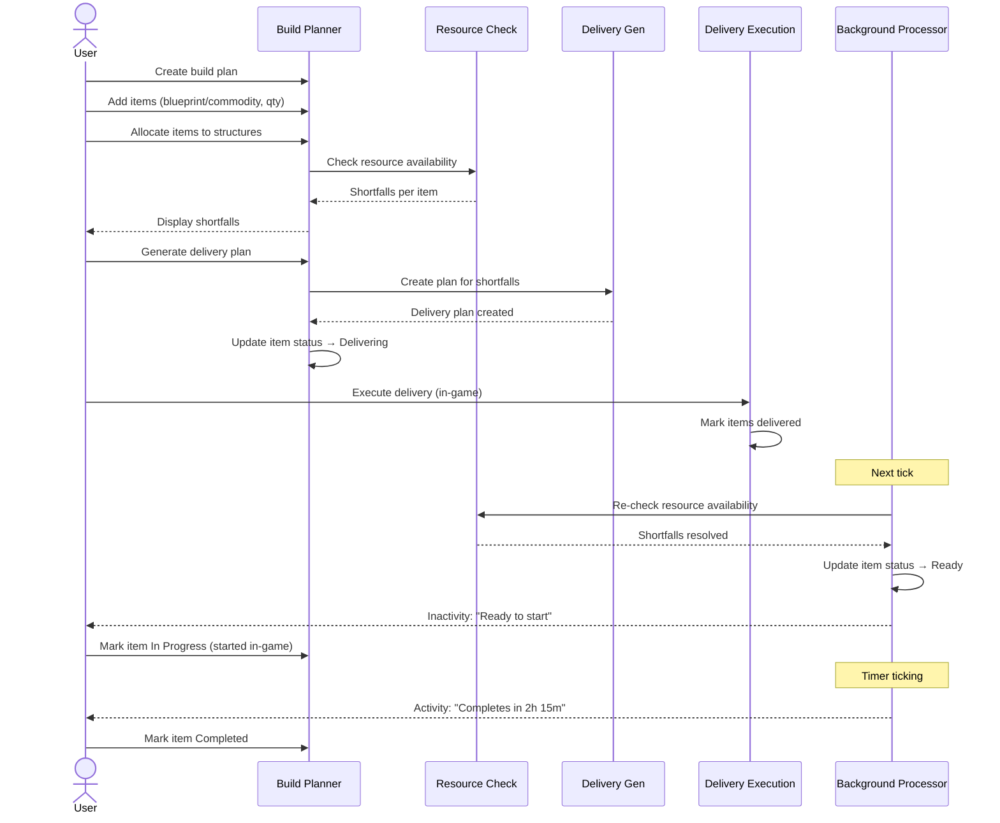
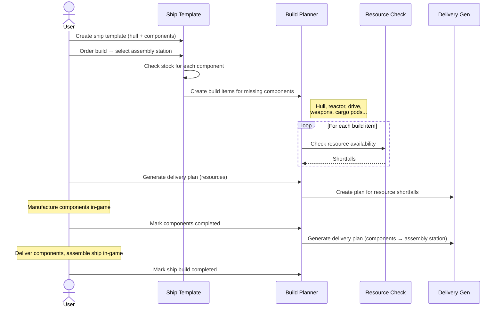
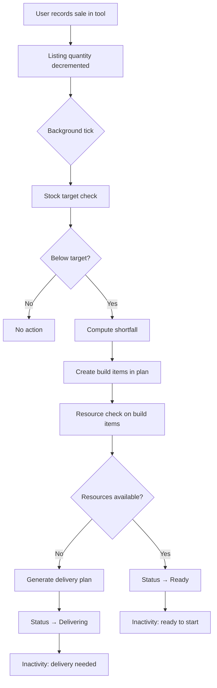
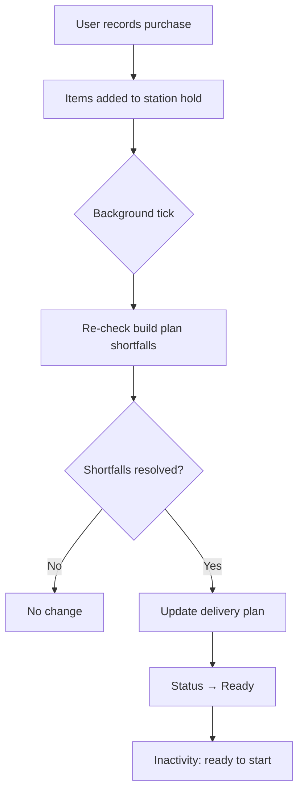
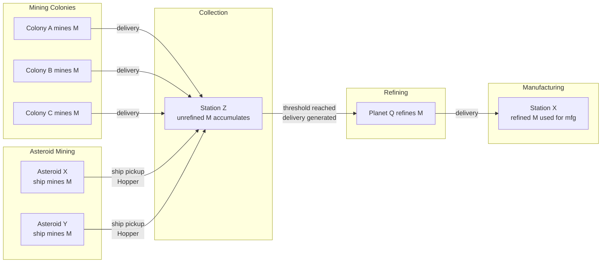
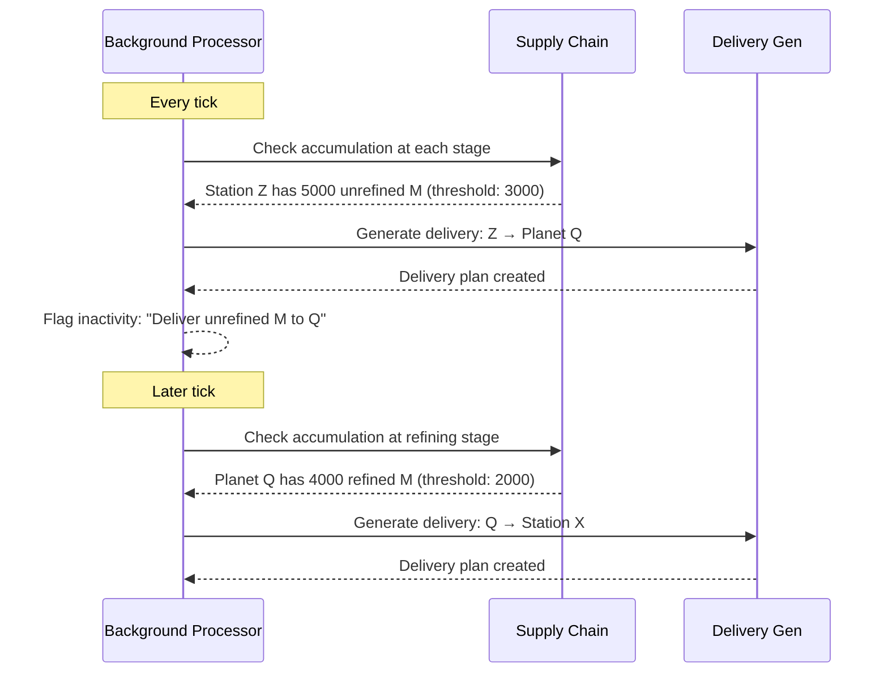
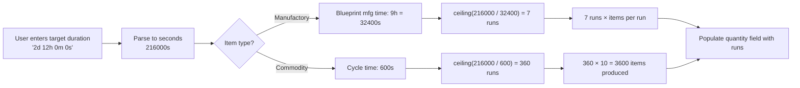
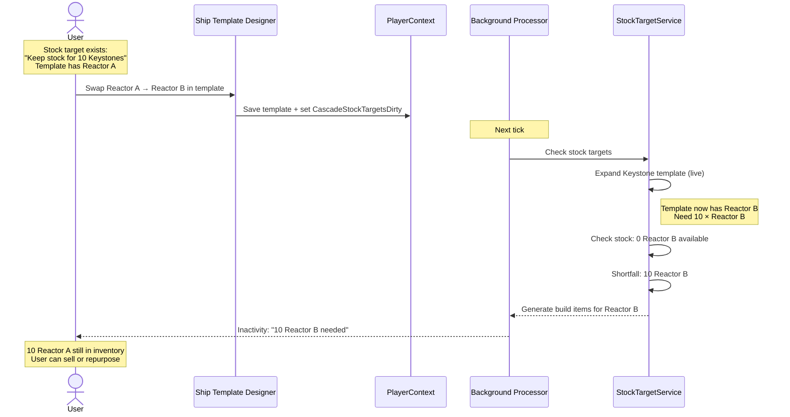

# Design Document — Empire Systems

## Overview

Empire Systems extends OE2 Empire Tracker with interconnected features for ships, stations, manufacturing planning, market tracking, supply chain management, and fill-level automation. The design prioritizes a unified data model built in Iteration 1 that supports all planned iterations without refactoring.

The architecture follows existing patterns: POCO models persisted in PlayerData.json via PlayerContext, stateless services for computation, ViewModels for UI binding, and WinForms MDI child forms.

## Architecture



## User Interaction Flows & Cascades

### Flow 1: Build Planner — Manufacturing Workflow



### Flow 2: Ship Build — Template to Assembly



### Flow 3: Market Sale — Cascade to Manufacturing



### Flow 4: Market Purchase — Resource Fulfillment



### Flow 5: Supply Chain — Mining to Manufacturing





### Flow 6: Queue Calculator



### Flow 7: Ship Template Modification — Stock Target Cascade



## Data Models

All new models follow the existing POCO pattern: public properties with defaults, Newtonsoft.Json serialization, UUID + OwnerUUID ownership, persisted as top-level arrays in PlayerRoot.

### BuildPlan

```csharp
public class BuildPlan
{
    public string UUID { get; set; }
    public string Name { get; set; } = string.Empty;
    public string OwnerUUID { get; set; } = string.Empty;
    public string Description { get; set; } = string.Empty;
    public string DeliveryPlanUUID { get; set; } = string.Empty;
    public List<BuildItem> Items { get; set; } = new List<BuildItem>();
}
```

Design decisions:
- Items are nested inside the plan (not a separate top-level array) because they have no meaning outside their plan. Simplifies CRUD — deleting a plan deletes all items automatically.
- DeliveryPlanUUID links to the generated delivery plan. Empty string means no delivery plan yet.

### BuildItem

```csharp
public enum BuildItemType
{
    Manufactory,
    Commodity,
    ShipTemplate,    // Expands into component Manufactory items
    Mining,          // Iteration 6
    Refining,        // Iteration 6
    Research         // Iteration 6
}

public enum BuildItemStatus
{
    Staged,
    Delivering,
    Ready,
    InProgress,
    Completed
}

public class BuildItem
{
    public string UUID { get; set; }

    [JsonConverter(typeof(StringEnumConverter))]
    public BuildItemType ItemType { get; set; }

    [JsonConverter(typeof(StringEnumConverter))]
    public BuildItemStatus Status { get; set; } = BuildItemStatus.Staged;

    // What to build
    public string BlueprintUUID { get; set; } = string.Empty;   // Manufactory, Research
    public string ItemName { get; set; } = string.Empty;         // Display name
    public string CommodityName { get; set; } = string.Empty;    // Commodity
    public string ShipTemplateUUID { get; set; } = string.Empty; // ShipTemplate

    // How many
    public int Quantity { get; set; } = 0;  // Always runs (mfg runs, commodity cycles, ships, etc.)

    // Where to build
    public string ColonyUUID { get; set; } = string.Empty;
    public string StructureUUID { get; set; } = string.Empty;

    // Assembly location (ShipTemplate items)
    [JsonConverter(typeof(StringEnumConverter))]
    public DestinationType AssemblyLocationType { get; set; } = DestinationType.Station;
    public string AssemblyLocationUUID { get; set; } = string.Empty;

    // Parent-child relationship (ShipTemplate → component items)
    public string ParentBuildItemUUID { get; set; } = string.Empty;

    // Metadata
    public string Recipient { get; set; } = string.Empty;
    public string Notes { get; set; } = string.Empty;
    public int SequenceInStructure { get; set; } = 0;  // For time-splitting (Iteration 6)
    public string DependsOnUUID { get; set; } = string.Empty;  // Iteration 6

    // Mining/Refining (Iteration 6)
    public string MiningResource { get; set; } = string.Empty;
    public string MiningSurveyUUID { get; set; } = string.Empty;
    public string RefiningResource { get; set; } = string.Empty;
    public string RefiningPurity { get; set; } = string.Empty;
}
```

Design decisions:
- All iteration 6 fields are present from the start with empty defaults. `DefaultValueHandling.Ignore` means they won't appear in JSON until used. No migration needed when Iteration 6 ships.
- `SequenceInStructure` supports multiple items on one structure (time-splitting). Default 0 means "only item" or "first in sequence."
- `Quantity` is always runs. The service layer computes total output using items-per-run from the blueprint (default 1, higher for munitions) or CommoditiesPerCycle for commodities. For ShipTemplate items, quantity is number of ships.
- `ShipTemplateUUID` references the template for ShipTemplate items. When expanded, child Manufactory items are created with `ParentBuildItemUUID` pointing back to the template item.
- `AssemblyLocationUUID` + `AssemblyLocationType` specify where ship components are delivered for final assembly. Only used for ShipTemplate items.
- Status is a string enum for readable JSON.

### ShipTemplate

```csharp
public class ShipTemplate
{
    public string UUID { get; set; }
    public string Name { get; set; } = string.Empty;
    public string OwnerUUID { get; set; } = string.Empty;
    public string HullBlueprintUUID { get; set; } = string.Empty;
    public List<ShipComponentSlot> Components { get; set; } = new List<ShipComponentSlot>();
}

public class ShipComponentSlot
{
    public string SlotType { get; set; } = string.Empty;  // "Reactor", "CargoPod", "FuelTank", "Weapon", etc.
    public int SlotIndex { get; set; } = 0;                // Which slot of this type (0-based)
    public string BlueprintUUID { get; set; } = string.Empty;
}
```

Design decisions:
- SlotType is a string rather than an enum because the game may add new slot types. The hull blueprint's properties define valid slot types and counts.
- SlotIndex distinguishes multiple slots of the same type (e.g. weapon slot 0, weapon slot 1).
- The template doesn't store computed stats — those are derived from the component blueprints at display time.

### Ship

```csharp
public class Ship
{
    public string UUID { get; set; }
    public string Name { get; set; } = string.Empty;
    public string OwnerUUID { get; set; } = string.Empty;
    public string TemplateUUID { get; set; } = string.Empty;  // Optional
    public string HullBlueprintUUID { get; set; } = string.Empty;
    public List<ShipComponentSlot> Components { get; set; } = new List<ShipComponentSlot>();

    // Location
    [JsonConverter(typeof(StringEnumConverter))]
    public DestinationType LocationType { get; set; } = DestinationType.Station;
    public string LocationUUID { get; set; } = string.Empty;

    // Cargo
    public ItemBag Cargo { get; set; } = new ItemBag();
    public ItemBag Hopper { get; set; } = new ItemBag();  // Mining ships only — unrefined resources (High/Medium/Low purity)
}
```

Design decisions:
- Ship duplicates HullBlueprintUUID and Components from the template because the ship is an independent entity — the template can be modified without affecting existing ships, and ships can have components replaced after being built (everything except the hull is swappable).
- Location uses the same DestinationType enum as route stops.
- Cargo is an ItemBag, same as colony warehouse. Volume enforcement is in the service layer, not the model.
- Hopper is a separate ItemBag for unrefined resources on mining ships. In-game this is called the "Hopper" (or "Ore Hopper" for the component that provides it). It can only hold resources at High, Medium, or Low purity — Refined and synthetic purities are not allowed. Capacity comes from the sum of installed Ore Hopper components' "Raw Material Capacity" property. Empty for non-mining ships. The service layer enforces the purity restriction on add operations.

### Station

```csharp
public enum StationType
{
    Outpost,
    Station,
    Starbase
}

public enum StationOwnership
{
    Government,
    PlayerOwned
}

public class Station
{
    public string UUID { get; set; }
    public string Name { get; set; } = string.Empty;

    [JsonConverter(typeof(StringEnumConverter))]
    public StationType StationType { get; set; } = Models.StationType.Station;

    [JsonConverter(typeof(StringEnumConverter))]
    public StationOwnership Ownership { get; set; } = StationOwnership.Government;

    public string OwnerUUID { get; set; } = string.Empty;  // Who owns the station (empty for government)

    // Per-player holds: key = PlayerProfile UUID, value = that player's inventory.
    // Each character has their own separate hold at this station.
    public Dictionary<string, ItemBag> Holds { get; set; } = new Dictionary<string, ItemBag>();

    // Player-owned station components (same slot model as Ship)
    public List<ShipComponentSlot> Components { get; set; } = new List<ShipComponentSlot>();
    public string StationBlueprintUUID { get; set; } = string.Empty;  // Defines slot counts

    // Munitions hold for armed stations (separate from general holds)
    public ItemBag MunitionsHold { get; set; } = new ItemBag();
}
```

Design decisions:
- UUID is deterministic from station name using DeterministicUUID with a station-specific namespace.
- UUID is the sole key — consistent with every other model. No compound key.
- OwnerUUID identifies who owns the station (empty for government). The Holds dictionary tracks per-player inventory separately.
- `Holds[playerUUID]` gives a specific character's inventory. Missing key = empty hold.
- Station metadata (Name, StationType, Ownership) lives in one place, no duplication across players.
- Hold is an ItemBag with no capacity limit.
- Player-owned stations reuse the ShipComponentSlot model for installed components (reactors, shields, weapons). StationBlueprintUUID defines available slots.
- MunitionsHold is a separate ItemBag for weapon ammunition on armed stations. Empty for government stations and unarmed player stations. DefaultValueHandling.Ignore omits it from JSON when empty.

### Asteroid

```csharp
public class Asteroid
{
    public string UUID { get; set; }
    public string Name { get; set; } = string.Empty;
    public string SystemName { get; set; } = string.Empty;

    // Reserve tracking per resource (depletes as anyone mines)
    public List<AsteroidReserve> Reserves { get; set; } = new List<AsteroidReserve>();
}

public class AsteroidReserve
{
    public string ResourceName { get; set; } = string.Empty;
    public string Purity { get; set; } = string.Empty;
    public int MaxReserve { get; set; } = 0;           // Total minable before depletion
    public int CurrentReserve { get; set; } = 0;       // Remaining (decremented on mine)
    public string ResetTimestamp { get; set; } = string.Empty;  // ISO 8601 UTC — when reserve last reset (TBD timing)
}
```

Design decisions:
- UUID is deterministic from "SystemName:AsteroidName" using DeterministicUUID with an asteroid-specific namespace. Asteroid names are unique within a solar system but not globally, so the system name is part of the seed.
- `Reserves` tracks the depletion state of each resource on the asteroid. This is a property of the asteroid itself (shared across all players/characters), not the survey.
- `MaxReserve` is the hard cap on how much can be mined from this resource before it depletes. `CurrentReserve` tracks remaining (visible in-game when mining starts). When CurrentReserve reaches 0, the resource is exhausted until it resets.
- `ResetTimestamp` records when the reserve last reset. The reset interval is TBD (game mechanic not yet confirmed). When known, a service can compute time-until-next-reset.
- Reserves are a shared pool — multiple characters mining the same asteroid all decrement the same CurrentReserve.
- Asteroids are available as delivery route stops via `DestinationType.Asteroid`. Mining at an asteroid is modeled as a pickup operation on the route — the ship arrives, mines (fills Hopper), and departs.
- No per-player holds on asteroids — mined resources go directly into the ship's Hopper.

### Asteroid Surveys (Survey Model Extension)

Asteroid surveys reuse the existing `Survey` model with a new `SurveyType` discriminator:

```csharp
public enum SurveyType
{
    Planet,     // Existing: planet surface survey (Amount = rate per hour from mining rig)
    Asteroid    // New: asteroid survey (Amount = rate per mining cycle from ship equipment)
}

// Add to existing Survey class:
[JsonConverter(typeof(StringEnumConverter))]
[DefaultValue(SurveyType.Planet)]
public SurveyType SurveyType { get; set; } = SurveyType.Planet;

public string AsteroidUUID { get; set; } = string.Empty;  // Links to Asteroid (empty for planet surveys)
```

Design decisions:
- Planet surveys and asteroid surveys share the same `Survey` model, `SurveyList`, form, and import infrastructure. The `SurveyType` discriminator distinguishes them.
- `SurveyType` defaults to `Planet` for backward compatibility — existing surveys are planet surveys without any migration needed. `DefaultValueHandling.Ignore` omits it from JSON for planet surveys.
- For asteroid surveys, `PlanetName` holds the asteroid name (for display/dedup consistency), and `AsteroidUUID` links to the `Asteroid` entity for reserve tracking.
- `SurveyResource.Amount` means "rate per hour" for planet surveys and "rate per mining cycle" for asteroid surveys. The interpretation depends on `SurveyType`.
- For asteroid surveys, the actual yield per cycle = `Amount` × equipment multiplier × skill multiplier. The service layer computes this from the ship's mining laser/grapple blueprints and the player's ExtractionFocus skill level.
- Mining cycle duration comes from the mining laser blueprint (a property on the laser). Grapple blueprints can reduce the cycle time (also a property). The service layer combines both to compute effective cycle time.
- Asteroid surveys are imported from game HTML in a similar format to planet surveys — the parser detects the asteroid context and sets `SurveyType = Asteroid` + `AsteroidUUID`. The existing SurveyParser will be extended to handle the asteroid variant.
- The Survey form can filter by SurveyType to show planet vs asteroid surveys separately.

### MarketListing

```csharp
public class MarketListing
{
    public string UUID { get; set; }
    public string OwnerUUID { get; set; } = string.Empty;
    public string StationUUID { get; set; } = string.Empty;

    // Item reference
    [JsonConverter(typeof(StringEnumConverter))]
    public ItemType.ItemTypeEnum ItemType { get; set; } = Models.ItemType.ItemTypeEnum.None;
    public string ItemReferenceID { get; set; } = string.Empty;  // Blueprint UUID or Commodity name
    public string ItemName { get; set; } = string.Empty;          // Display name

    public int Quantity { get; set; } = 0;
    public decimal PricePerUnit { get; set; } = 0m;
}
```

### MarketTransaction

```csharp
public enum TransactionType
{
    Buy,
    Sell
}

public class MarketTransaction
{
    public string UUID { get; set; }
    public string OwnerUUID { get; set; } = string.Empty;

    [JsonConverter(typeof(StringEnumConverter))]
    public TransactionType TransactionType { get; set; }

    // Item reference
    [JsonConverter(typeof(StringEnumConverter))]
    public ItemType.ItemTypeEnum ItemType { get; set; } = Models.ItemType.ItemTypeEnum.None;
    public string ItemReferenceID { get; set; } = string.Empty;
    public string ItemName { get; set; } = string.Empty;

    public int Quantity { get; set; } = 0;
    public decimal PricePerUnit { get; set; } = 0m;
    public decimal TotalPrice { get; set; } = 0m;
    public string Counterparty { get; set; } = string.Empty;
    public string StationUUID { get; set; } = string.Empty;
    public string Timestamp { get; set; } = string.Empty;  // ISO 8601 UTC
    public string Notes { get; set; } = string.Empty;
    public string ListingUUID { get; set; } = string.Empty;  // Links to the listing that was sold from
}
```

Design decisions:
- ListingUUID links a sell transaction to its source listing for automatic quantity decrement.
- ItemReferenceID is Blueprint UUID for blueprint items, commodity name for commodities. Same pattern as DeliveryItem.BaseItemTypeID.
- Timestamp is ISO 8601 UTC string, same pattern as colony import timestamps.

### StockTarget

```csharp
public enum StockTargetScope
{
    EmpireWide,
    Colony,
    Station
}

public class StockPlan
{
    public string UUID { get; set; }
    public string Name { get; set; } = string.Empty;
    public string OwnerUUID { get; set; } = string.Empty;
    public List<StockTarget> Targets { get; set; } = new List<StockTarget>();
}

public class StockTarget
{
    public string UUID { get; set; }
    public string OwnerUUID { get; set; } = string.Empty;  // Set for standalone targets
    public string StockPlanUUID { get; set; } = string.Empty;  // Set when part of a plan

    // What item (individual item OR ship template)
    [JsonConverter(typeof(StringEnumConverter))]
    public ItemType.ItemTypeEnum ItemType { get; set; } = Models.ItemType.ItemTypeEnum.None;
    public string ItemReferenceID { get; set; } = string.Empty;
    public string ItemName { get; set; } = string.Empty;
    public string ShipTemplateUUID { get; set; } = string.Empty;  // If targeting a ship template

    // Target
    public int TargetQuantity { get; set; } = 0;
    public int CriticalThreshold { get; set; } = 0;  // Red warning below this

    // Scope
    [JsonConverter(typeof(StringEnumConverter))]
    public StockTargetScope Scope { get; set; } = StockTargetScope.EmpireWide;
    public string LocationUUID { get; set; } = string.Empty;  // Colony or Station UUID when scoped
}
```

### Faction

```csharp
public class Faction
{
    public string UUID { get; set; }
    public string Name { get; set; } = string.Empty;
    public string Description { get; set; } = string.Empty;
}
```

Design decisions:
- Factions are not per-player — they're shared entities. All player profiles can reference the same faction.
- UUID is deterministic from faction name using DeterministicUUID with a faction-specific namespace. Two players who both create "The Space Pirates" get the same UUID, enabling data sharing (ship templates, pricing plans).
- No OwnerUUID. Factions are created/managed by any player and persist globally in PlayerData.

### ExternalCharacter

```csharp
public class ExternalCharacter
{
    public string UUID { get; set; }
    public string Name { get; set; } = string.Empty;
    public string FactionUUID { get; set; } = string.Empty;
}
```

Design decisions:
- Lightweight — just name and optional faction. No skills, ranks, or other profile data.
- UUID is deterministic from character name using DeterministicUUID with a character-specific namespace. Two players who both add "Captain Bob" get the same UUID, so shared data references resolve correctly.
- Used for combo box lookups. The combo data source merges PlayerProfiles + ExternalCharacters, sorted by name, with a free-text fallback.
- No OwnerUUID — external characters are shared across all managed player profiles.

### Item Changes (Crate Support)

```csharp
// Add to existing ItemType.ItemTypeEnum:
Crate   // A container that holds other items

// Add to existing Item class:
public ItemBag Contents { get; set; }  // Non-null for Crate items, null for everything else
```

Design decisions:
- Crate is an Item with ItemType = Crate and a non-null Contents ItemBag.
- Non-crate items have Contents = null (omitted from JSON via NullValueHandling.Ignore).
- No nesting: validation prevents adding a Crate item to another Crate's Contents.
- Ship cargo volume computation sums item volumes recursively one level deep: for each item, add its Volume; if it's a Crate, also add the Volume of each item in Contents.
- Crate itself may have a Volume (the box), and its contents add to the total.

### PlayerProfile Changes

```csharp
// Add to existing PlayerProfile:
public string FactionUUID { get; set; } = string.Empty;
```

### SupplyChain (Iteration 6)

```csharp
public class SupplyChain
{
    public string UUID { get; set; }
    public string Name { get; set; } = string.Empty;
    public string OwnerUUID { get; set; } = string.Empty;
    public List<SupplyChainStage> Stages { get; set; } = new List<SupplyChainStage>();
}

public enum SupplyChainStageType
{
    Mine,           // Colony-based mining (mining rig structure)
    AsteroidMine,   // Ship-based asteroid mining (laser + grapple)
    Collect,
    Refine,
    Deliver
}

public class SupplyChainStage
{
    public int Sequence { get; set; } = 0;

    [JsonConverter(typeof(StringEnumConverter))]
    public SupplyChainStageType StageType { get; set; }

    // Location
    [JsonConverter(typeof(StringEnumConverter))]
    public DestinationType LocationType { get; set; }
    public string LocationUUID { get; set; } = string.Empty;

    // Resource
    public string ResourceName { get; set; } = string.Empty;
    public string ResourcePurity { get; set; } = string.Empty;

    // Thresholds
    public int AccumulationThreshold { get; set; } = 0;  // Trigger delivery when this much accumulates
    public decimal ProductionRatePerHour { get; set; } = 0m;
}
```

### StockProfile

```csharp
public class StockProfile
{
    public string UUID { get; set; }
    public string Name { get; set; } = string.Empty;
    public string OwnerUUID { get; set; } = string.Empty;
    public List<StockProfileEntry> Entries { get; set; } = new List<StockProfileEntry>();
}

public class StockProfileEntry
{
    public string GroupID { get; set; } = string.Empty;  // Entries with same GroupID are ORed

    // Reference to either a StockPlan or a standalone StockTarget (one or the other)
    public string StockPlanUUID { get; set; } = string.Empty;
    public string StockTargetUUID { get; set; } = string.Empty;
}
```

Design decisions:
- GroupID is a string — entries with the same GroupID are ORed (max across overlapping components). Different GroupIDs are ANDed (summed).
- Each entry references either a StockPlan (by UUID) or a standalone StockTarget (by UUID), not both.
- StockPlans are reusable — the same plan UUID can appear in multiple profiles.
- Evaluation order: expand all targets/plans in each entry → OR within groups → AND across groups → sum across profiles + standalone targets.

### WarehouseOverflowRule

```csharp
public class WarehouseOverflowRule
{
    public string UUID { get; set; }
    public string OwnerUUID { get; set; } = string.Empty;
    public string ColonyUUID { get; set; } = string.Empty;       // Source colony
    public string ResourceName { get; set; } = string.Empty;
    public string ResourcePurity { get; set; } = string.Empty;
    public int TriggerThreshold { get; set; } = 0;               // Move when qty exceeds this

    // Destination
    [JsonConverter(typeof(StringEnumConverter))]
    public DestinationType DestinationType { get; set; } = DestinationType.Station;
    public string DestinationUUID { get; set; } = string.Empty;
}
```

Design decisions:
- One rule per resource per colony. Multiple resources at the same colony = multiple rules.
- TriggerThreshold is the quantity at which a delivery is generated to move the excess. The amount moved = current quantity - TriggerThreshold (leave TriggerThreshold behind, move the rest).
- Background processor checks warehouse levels each tick and generates deliveries when thresholds are exceeded.
- Colony warehouse capacity is tracked via the existing colony data model. A full warehouse is detectable when total item count/volume reaches the limit.

### RouteStop Changes

The existing `RouteStop` model needs a `DestinationType` discriminator:

```csharp
public enum DestinationType
{
    Colony,
    Station,
    Asteroid
}

public class RouteStop
{
    [JsonConverter(typeof(StringEnumConverter))]
    public DestinationType DestinationType { get; set; } = DestinationType.Colony;
    public string DestinationUUID { get; set; } = string.Empty;
    public int Sequence { get; set; }

    // Backward compatibility: ColonyUUID is kept for deserialization of existing data.
    // New code should use DestinationUUID. Migration sets DestinationUUID = ColonyUUID
    // and DestinationType = Colony for all existing stops.
    [JsonProperty(DefaultValueHandling = DefaultValueHandling.Ignore)]
    public string ColonyUUID { get; set; }
}
```

Design decisions:
- ColonyUUID is retained for backward compatibility. A migration copies ColonyUUID → DestinationUUID and sets DestinationType = Colony for existing data.
- New code uses DestinationUUID + DestinationType exclusively.

### DeliveryPlan Changes

```csharp
// Add to existing DeliveryPlan:
public string ShipUUID { get; set; } = string.Empty;  // Optional ship assignment (Iteration 3)
```

### DeliveryPlanStop Changes

```csharp
// DeliveryPlanStop gets the same DestinationType treatment as RouteStop:
[JsonConverter(typeof(StringEnumConverter))]
public DestinationType DestinationType { get; set; } = DestinationType.Colony;
public string DestinationUUID { get; set; } = string.Empty;

// ColonyUUID retained for backward compatibility
[JsonProperty(DefaultValueHandling = DefaultValueHandling.Ignore)]
public string ColonyUUID { get; set; }
```

### PlayerRoot Changes

```csharp
public class PlayerRoot
{
    // Existing
    public int DataVersion { get; set; }
    public string CurrentPlayerUUID { get; set; }
    public PlayerProfile[] PlayerProfile { get; set; }
    public Blueprint[] Blueprint { get; set; }
    public Survey[] Survey { get; set; }
    public Colony[] Colony { get; set; }
    public DeliveryRoute[] DeliveryRoute { get; set; }
    public DeliveryPlan[] DeliveryPlan { get; set; }
    public PricingPlan[] PricingPlan { get; set; }

    // New — all default to empty arrays for backward compatibility
    public BuildPlan[] BuildPlan { get; set; }
    public ShipTemplate[] ShipTemplate { get; set; }
    public Ship[] Ship { get; set; }
    public Station[] Station { get; set; }
    public MarketListing[] MarketListing { get; set; }
    public MarketTransaction[] MarketTransaction { get; set; }
    public StockTarget[] StockTarget { get; set; }
    public StockPlan[] StockPlan { get; set; }
    public StockProfile[] StockProfile { get; set; }
    public SupplyChain[] SupplyChain { get; set; }
    public WarehouseOverflowRule[] WarehouseOverflowRule { get; set; }
    public Faction[] Faction { get; set; }
    public ExternalCharacter[] ExternalCharacter { get; set; }
    public Asteroid[] Asteroid { get; set; }
}
```

All new arrays initialize to empty in the constructor. Missing arrays in JSON deserialize as null, which InitXxx methods handle with `?? new T[0]`.

## Services

### BuildPlanService (Iteration 1)

Static service in `Services/BuildPlanService.cs`.

```csharp
public static class BuildPlanService
{
    // Validate a build plan name (non-empty, non-whitespace)
    public static bool ValidatePlanName(string name);

    // Validate a build item (quantity >= 1, valid type)
    public static bool ValidateBuildItem(BuildItem item);
}
```

Thin validation layer. Most logic lives in the form and other services.

### ResourceCheckService (Iteration 1)

Static service in `Services/ResourceCheckService.cs`.

```csharp
public static class ResourceCheckService
{
    /// <summary>
    /// Computes resource shortfalls for a build item at its allocated colony.
    /// Returns a dictionary of resource name → shortfall quantity.
    /// Empty dictionary means all resources available.
    /// </summary>
    public static Dictionary<string, int> ComputeShortfalls(
        BuildItem item, Colony colony,
        Func<string, Blueprint> blueprintFinder);

    /// <summary>
    /// Computes shortfalls for all allocated items in a build plan.
    /// Returns per-item shortfall maps keyed by BuildItem UUID.
    /// </summary>
    public static Dictionary<string, Dictionary<string, int>> ComputePlanShortfalls(
        BuildPlan plan, Func<string, Colony> colonyFinder,
        Func<string, Blueprint> blueprintFinder);
}
```

Logic:
- For Manufactory items: iterate blueprint.Resources, multiply quantity × item.Quantity, subtract colony warehouse stock (Refined purity for natural resources, DeterminePurity for synthetics).
- For Commodity items: iterate commodity.ConstructionResources, multiply quantity × item.Quantity (runs), subtract warehouse stock.
- Returns only positive shortfalls (resources where need > have).

### DeliveryGenerationService (Iteration 1)

Static service in `Services/DeliveryGenerationService.cs`.

```csharp
public static class DeliveryGenerationService
{
    /// <summary>
    /// Creates or updates a delivery plan for a build plan's resource shortfalls.
    /// User provides the route to use. Returns the created/updated DeliveryPlan.
    /// </summary>
    public static DeliveryPlan GenerateDeliveryPlan(
        BuildPlan buildPlan, DeliveryRoute route,
        Dictionary<string, Dictionary<string, int>> shortfalls,
        Func<string, Colony> colonyFinder,
        PlayerContext playerContext);
}
```

Logic:
- Groups shortfalls by colony UUID.
- For each colony on the route that has shortfalls, creates/updates a DeliveryPlanStop with drop-off items for each resource shortfall.
- If buildPlan.DeliveryPlanUUID is set, finds and updates the existing plan. Otherwise creates a new one.
- Names the plan "Build: {buildPlan.Name}".
- Sets DestinationType = Colony on each stop (stations come in Iteration 4).

### QueueCalculator (Iteration 1)

Static service in `Services/QueueCalculator.cs`.

```csharp
public static class QueueCalculator
{
    /// <summary>
    /// Computes how many manufacturing runs to keep a structure busy
    /// for at least the target duration.
    /// Returns -1 if manufacturing time is unknown.
    /// </summary>
    public static int ComputeManufactoryRuns(
        Blueprint blueprint, int targetDurationSeconds);

    /// <summary>
    /// Computes how many commodity runs to keep a structure busy
    /// for at least the target duration.
    /// </summary>
    public static int ComputeCommodityRuns(int targetDurationSeconds);

    /// <summary>
    /// Returns total items produced for a given number of manufactory runs.
    /// Uses the blueprint's items-per-run property (default 1).
    /// </summary>
    public static int ManufactoryRunsToItems(Blueprint blueprint, int runs);

    /// <summary>
    /// Returns total items produced for a given number of commodity runs.
    /// </summary>
    public static int CommodityRunsToItems(int runs);
}
```

Logic:
- Manufactory: parse "Manufacture Run Time" from blueprint.Properties via EvolutionChainService.ParseTimeToSeconds. Return ceiling(targetSeconds / mfgSeconds).
- ManufactoryRunsToItems: runs × items-per-run from blueprint (munitions produce multiple per run, most produce 1).
- Commodity: ceiling(targetSeconds / CommodityCycleSeconds).
- CommodityRunsToItems: runs × CommoditiesPerCycle.

### AutoAssignService (Iteration 1)

Static service in `Services/AutoAssignService.cs`.

```csharp
public static class AutoAssignService
{
    /// <summary>
    /// Proposes structure assignments for unallocated build items,
    /// minimizing total completion time while respecting blueprint copy limits.
    /// Only considers structures at colonies on the specified delivery route.
    /// </summary>
    public static List<AssignmentProposal> ProposeAssignments(
        BuildPlan plan,
        DeliveryRoute route,
        Func<string, Colony> colonyFinder,
        Func<string, Blueprint> blueprintFinder);
}

public class AssignmentProposal
{
    public string BuildItemUUID { get; set; }
    public string ColonyUUID { get; set; }
    public string StructureUUID { get; set; }
    public int SequenceInStructure { get; set; }
    public string Reason { get; set; }  // Why this assignment was chosen
}
```

Logic:
1. Collect all idle manufactories and commodity factories at colonies on the delivery route.
2. For each unallocated Manufactory item, count how many copies of that blueprint the player owns. That's the max parallelism.
3. Distribute runs across min(available structures, blueprint copies), splitting quantity evenly. Remainder goes to the first structures.
4. If more items than structures × copies, stack on existing assignments (SequenceInStructure > 0).
5. Commodity items have no copy constraint — distribute across all available commodity factories.
6. Sort assignments to minimize the longest completion time (balance load across structures).

### ShipBuildService (Iteration 2)

Static service in `Services/ShipBuildService.cs`.

```csharp
public static class ShipBuildService
{
    /// <summary>
    /// Generates build items for a ship template — one per hull + component.
    /// Checks stock at the assembly location and only creates items for
    /// components not already available.
    /// </summary>
    public static List<BuildItem> GenerateShipBuildItems(
        ShipTemplate template,
        string assemblyLocationUUID, DestinationType assemblyLocationType,
        Func<string, Colony> colonyFinder,
        Func<string, Station> stationFinder,
        Func<string, Blueprint> blueprintFinder);

    /// <summary>
    /// Validates assembly location restrictions based on ship class.
    /// Returns null if valid, error message if invalid.
    /// </summary>
    public static string ValidateAssemblyLocation(
        int shipClass, Station station);

    /// <summary>
    /// Computes ship stats from hull + components.
    /// </summary>
    public static ShipStats ComputeStats(
        Blueprint hull, IEnumerable<ShipComponentSlot> components,
        Func<string, Blueprint> blueprintFinder);

    /// <summary>
    /// Computes station stats from station blueprint + installed components.
    /// Stations support reactors, shields, weapons, hull plating, hull reinforcement,
    /// hull sealant, GERTY drones, thrusters, and couplers.
    /// They do not have drives, cargo pods, fuel tanks, jump drives, nav comps,
    /// mining lasers, grapples, ore hoppers, or scanners.
    /// </summary>
    public static StationStats ComputeStationStats(
        Blueprint stationBlueprint, IEnumerable<ShipComponentSlot> components,
        Func<string, Blueprint> blueprintFinder);
}

public class ShipStats
{
    // Core
    public decimal TotalMass { get; set; }
    public decimal PowerGenerated { get; set; }
    public decimal PowerConsumed { get; set; }
    public decimal PowerBalance { get; set; }           // Generated - Consumed
    public decimal EngCapacityUsed { get; set; }

    // Capacity
    public decimal CargoCapacity { get; set; }          // Hull base + sum(Cargo Pod)
    public decimal FuelCapacity { get; set; }           // Hull base + sum(Fuel Tank)
    public decimal HopperCapacity { get; set; }        // sum(Ore Hopper Raw Material Capacity)
    public int CrewSupported { get; set; }              // From hull

    // Defence
    public decimal TotalHealth { get; set; }            // Hull Health × (1 + sum(Hull Reinforcement %))
    public decimal EnergyDefence { get; set; }          // Hull + sum(Hull Plating Energy Defence Rating)
    public decimal KineticDefence { get; set; }         // Hull + sum(Hull Plating Kinetic Defence Rating)
    public decimal MissileDefence { get; set; }         // Hull + sum(Hull Plating Missile Defence Rating)
    public decimal ShieldHitpoints { get; set; }        // sum(Shield)
    public decimal ShieldRegen { get; set; }            // sum(Shield)

    // Propulsion
    public decimal Acceleration { get; set; }           // sum(Main Drive)
    public decimal RotationalThrust { get; set; }       // sum(Thruster)
    public decimal MaxJumpDistance { get; set; }         // max(Jump Drive or Main Drive)
    public decimal FuelPerJump { get; set; }            // from Jump Drive / Main Drive

    // Mining (zero for non-mining ships)
    public decimal MiningYield { get; set; }            // sum(Mining Laser)
    public decimal MiningCycleTime { get; set; }        // Mining Laser base, modified by Grapple
    public decimal MiningYieldIncrease { get; set; }    // sum(Asteroid Grapple)

    // Scanning (zero for non-scanner ships)
    public int ScanLevel { get; set; }                  // max(Scanner)
    public decimal SensorAbundanceFactor { get; set; }  // from Scanner
    public decimal PurityModifier { get; set; }         // from Scanner

    // Weapons summary
    public int SmallWeaponsInstalled { get; set; }
    public int MediumWeaponsInstalled { get; set; }
    public int LargeWeaponsInstalled { get; set; }

    // Slot usage (installed / available from hull)
    public string SlotSummary { get; set; } = string.Empty;  // For display: "Reactors 1/2, Drives 1/1, ..."

    // Hull identity
    public string LicenseCareer { get; set; } = string.Empty;
    public int LicenseLevel { get; set; }
}

/// <summary>
/// Computed stats for a player-owned station. Subset of ShipStats —
/// stations have reactors, shields, weapons, hull plating, and thrusters
/// but no drives, cargo pods, fuel tanks, jump drives, mining equipment,
/// or scanners.
/// </summary>
public class StationStats
{
    // Core
    public decimal TotalMass { get; set; }
    public decimal PowerGenerated { get; set; }
    public decimal PowerConsumed { get; set; }
    public decimal PowerBalance { get; set; }
    public decimal EngCapacityUsed { get; set; }

    // Defence
    public decimal TotalHealth { get; set; }
    public decimal EnergyDefence { get; set; }
    public decimal KineticDefence { get; set; }
    public decimal MissileDefence { get; set; }
    public decimal ShieldHitpoints { get; set; }
    public decimal ShieldRegen { get; set; }

    // Weapons summary
    public int SmallWeaponsInstalled { get; set; }
    public int MediumWeaponsInstalled { get; set; }
    public int LargeWeaponsInstalled { get; set; }

    // Slot usage
    public string SlotSummary { get; set; } = string.Empty;
}
```

Design decisions:
- `ShipStats` covers every stat derivable from the hull + component blueprints in BaselineData.json. Properties that don't apply to a given ship (e.g. mining stats on a combat ship) are zero.
- `StationStats` is a separate class rather than reusing `ShipStats` because stations lack propulsion, cargo, fuel, mining, and scanning. A shared base class would have too many always-zero fields on stations and would confuse the UI. Keeping them separate makes form binding straightforward.
- `PowerBalance` is a convenience field (Generated - Consumed). Negative means the ship/station is underpowered.
- `TotalHealth` accounts for Hull Reinforcement percentage bonuses: `hullHP × (1 + sum(reinforcement %))`.
- `SlotSummary` is a pre-formatted string for display (e.g. "Reactors 1/2, Shields 1/2, Weapons 3/6"). Forms can also compute slot usage from the raw component list if they need structured data.
- Weapon stats (damage, accuracy, rate of fire, range) are per-weapon and displayed in the component grid, not aggregated into the summary. The summary only tracks mount counts.

### MarketService (Iteration 5)

Static service in `Services/MarketService.cs`.

```csharp
public static class MarketService
{
    /// <summary>
    /// Records a sell transaction and decrements the associated listing.
    /// Returns true if the listing was found and decremented.
    /// </summary>
    public static bool RecordSale(
        MarketTransaction transaction,
        List<MarketListing> listings);

    /// <summary>
    /// Records a buy transaction and adds items to the station hold.
    /// </summary>
    public static void RecordPurchase(
        MarketTransaction transaction,
        Func<string, Station> stationFinder);

    /// <summary>
    /// Computes profit/loss for a transaction against a pricing plan.
    /// </summary>
    public static decimal ComputeProfitLoss(
        MarketTransaction transaction, PricingPlan plan,
        Func<string, Blueprint> blueprintFinder);
}
```

### StockTargetService (Iteration 7)

Static service in `Services/StockTargetService.cs`.

```csharp
public static class StockTargetService
{
    /// <summary>
    /// Checks all stock targets and returns shortfalls.
    /// Dedicated targets sum requirements independently.
    /// Shared targets use max(quantity) for overlapping components.
    /// Ship template targets are expanded into component requirements.
    /// </summary>
    public static List<StockShortfall> CheckTargets(
        IEnumerable<StockTarget> targets,
        Func<string, Colony> colonyFinder,
        Func<string, Station> stationFinder,
        Func<string, ShipTemplate> templateFinder,
        Func<string, Blueprint> blueprintFinder,
        IEnumerable<Colony> allColonies,
        IEnumerable<Station> allStations);

    /// <summary>
    /// Generates build items to cover shortfalls, avoiding duplicates
    /// with existing build items.
    /// </summary>
    public static List<BuildItem> GenerateReplenishmentItems(
        List<StockShortfall> shortfalls,
        IEnumerable<BuildPlan> existingPlans);
}

public class StockShortfall
{
    public StockTarget Target { get; set; }
    public int CurrentQuantity { get; set; }
    public int ShortfallQuantity { get; set; }
    public bool IsCritical { get; set; }  // Below CriticalThreshold
}
```

## Cascade Processing

Market transactions, stock target checks, resource availability re-evaluation, and delivery plan updates are computationally expensive when they cascade (sale → stock target → build order → resource check → delivery plan). Running these synchronously on the UI thread would block the application.

Design decision: cascade operations run as part of the existing BackgroundProcessor system. The immediate user action (recording a sale, recording a purchase) performs only the direct mutation (decrement listing, add to station hold) and sets a dirty flag. The background processor picks up dirty flags on its next tick and runs the cascade:

1. Check stock targets against current inventory → generate build items if needed
2. Re-evaluate resource availability for all active build plans → update shortfall data
3. Update delivery plans if shortfalls have changed
4. Update build item statuses based on new resource availability

Forms subscribe to data change events and refresh when the background processor completes a cascade cycle. This keeps the UI responsive while ensuring cascades complete within one background tick (default 60 seconds, configurable via Preferences).

The dirty flag approach means cascades are batched — multiple transactions recorded in quick succession result in one cascade evaluation, not one per transaction.

### Thread Safety Integration

The cascade processing integrates with the existing three-tier locking model (see `.kiro/specs/data-model-thread-safety/`):

- **PlayerContext._listLock** protects all `List<T>` collections (BuildPlanList, StationList, etc.) during iteration and mutation. The BackgroundProcessor uses `SnapshotColonyList()` and equivalent snapshot methods for new lists.
- **Colony.ColonyLock** (ReaderWriterLockSlim) protects per-colony data. Cascade operations that read colony warehouse data acquire `TryEnterReadLock(1000ms)`. Operations that mutate colony data (e.g. updating build item status based on warehouse contents) acquire `TryEnterWriteLock(5000ms)`. On timeout, the cascade skips that colony and retries next tick.
- **Collection-level _syncRoot** (ItemBag, PropertyBag, LockTracking) provides fine-grained protection within each colony's data structures.

Lock ordering is always: `_listLock` → `ColonyLock` → `_syncRoot`. Events (BuildPlanDataChanged, MarketDataChanged, StationDataChanged) are fired outside all locks. WriteContext is called outside ColonyLock.

New entity lists (BuildPlanList, StationList, etc.) use `List<T>` instead of `BindingList<T>`. Access is protected by `_listLock` — snapshot under lock, iterate outside. Forms use `BeginInvoke` to marshal data-change events to the UI thread.

### Implementation

The dirty flags live on PlayerContext as runtime-only fields (not persisted, not part of any data model):

```csharp
// Runtime cascade flags — not serialized
[JsonIgnore] public bool CascadeStockTargetsDirty { get; set; } = false;
[JsonIgnore] public bool CascadeResourceCheckDirty { get; set; } = false;
```

When a form records a market transaction, updates a station hold, or modifies build plan data, it sets the appropriate flag(s). The BackgroundProcessor checks these flags on each tick:

```csharp
// In BackgroundProcessor tick:
if (playerContext.CascadeStockTargetsDirty)
{
    playerContext.CascadeStockTargetsDirty = false;
    // Run StockTargetService.CheckTargets → generate build items if needed
    // Set CascadeResourceCheckDirty if new items were created
}
if (playerContext.CascadeResourceCheckDirty)
{
    playerContext.CascadeResourceCheckDirty = false;
    // Run ResourceCheckService on all active build plans
    // Update delivery plans, item statuses
    // Fire BuildPlanDataChanged event
}
```

The flags are simple booleans — no queue, no event log. If multiple transactions set the same flag before the next tick, only one cascade evaluation runs. The background processor clears the flag before processing to avoid missing a flag set during processing.

### Startup Cascade

On application startup, the background processor runs a full cascade evaluation unconditionally (as if all flags were dirty). This handles:
- Dirty flags lost due to app exit before the next tick
- Manual JSON edits or data imports
- Any inconsistency from a crash or unexpected shutdown

The startup cascade is the same logic as the tick cascade — check stock targets, re-evaluate resource availability, update delivery plans and statuses. It runs once during initialization before the first regular tick.

## PlayerContext Changes

### Thread Safety

All new `List<T>` fields are protected by the existing `_listLock`. Access patterns:
- **Read**: acquire `lock(_listLock)`, snapshot the list (`new List<T>(list)`), release lock, iterate the snapshot.
- **Write**: acquire `lock(_listLock)`, mutate the list, release lock, then fire events and call WriteContext outside the lock.
- **WriteContext**: snapshots all lists (including new ones) under `_listLock`, serializes outside the lock.
- **Find methods**: acquire `lock(_listLock)` for cache rebuild/lookup, release before returning.

### New Fields

```csharp
// Existing entities — remain as BindingList<T> until BL-069 migration
public BindingList<DeliveryRoute> DeliveryRouteList;
public BindingList<DeliveryPlan> DeliveryPlanList;
public BindingList<PricingPlan> PricingPlanList;

// New entities use List<T> — forms build their own display lists
// from filtered queries, so BindingList change notifications aren't needed.
public List<BuildPlan> BuildPlanList;
public List<ShipTemplate> ShipTemplateList;
public List<Ship> ShipList;
public List<Station> StationList;
public List<MarketListing> MarketListingList;
public List<MarketTransaction> MarketTransactionList;
public List<StockTarget> StockTargetList;
public List<StockPlan> StockPlanList;
public List<StockProfile> StockProfileList;
public List<SupplyChain> SupplyChainList;
public List<WarehouseOverflowRule> WarehouseOverflowRuleList;
public List<Faction> FactionList;
public List<ExternalCharacter> ExternalCharacterList;
public List<Asteroid> AsteroidList;
```

### New Init Methods

Each follows the existing pattern (null-coalesce, sort by name, create List):

```csharp
public void InitBuildPlans(PlayerRoot playerRoot)
public void InitShipTemplates(PlayerRoot playerRoot)
public void InitShips(PlayerRoot playerRoot)
public void InitStations(PlayerRoot playerRoot)
public void InitMarketListings(PlayerRoot playerRoot)
public void InitMarketTransactions(PlayerRoot playerRoot)
public void InitStockTargets(PlayerRoot playerRoot)
public void InitSupplyChains(PlayerRoot playerRoot)
public void InitFactions(PlayerRoot playerRoot)
public void InitExternalCharacters(PlayerRoot playerRoot)
public void InitAsteroids(PlayerRoot playerRoot)
```

### WriteContext Changes

Add to WriteContext after existing serialization:

```csharp
playerRoot.BuildPlan = BuildPlanList.ToArray();
playerRoot.ShipTemplate = ShipTemplateList.ToArray();
playerRoot.Ship = ShipList.ToArray();
playerRoot.Station = StationList.ToArray();
playerRoot.MarketListing = MarketListingList.ToArray();
playerRoot.MarketTransaction = MarketTransactionList.ToArray();
playerRoot.StockTarget = StockTargetList.ToArray();
playerRoot.SupplyChain = SupplyChainList.ToArray();
playerRoot.Faction = FactionList.ToArray();
playerRoot.ExternalCharacter = ExternalCharacterList.ToArray();
playerRoot.Asteroid = AsteroidList.ToArray();
```

### CascadeDeletePlayer Changes

Add removal loops for all new entity types with OwnerUUID matching the deleted player. Government stations (empty OwnerUUID) are excluded.

### CleanupOrphanedData Changes

Add orphan cleanup for all new entity types, same pattern as existing.

### New Events

```csharp
public event EventHandler BuildPlanDataChanged;
public event EventHandler MarketDataChanged;
public event EventHandler StationDataChanged;
```

### New Convenience Methods

```csharp
public List<BuildPlan> GetCurrentPlayerBuildPlans()
public List<ShipTemplate> GetCurrentPlayerShipTemplates()
public List<Ship> GetCurrentPlayerShips()
public List<Station> GetCurrentPlayerStations()  // Includes government stations
public List<MarketListing> GetCurrentPlayerListings()
public List<MarketTransaction> GetCurrentPlayerTransactions()
public List<StockTarget> GetCurrentPlayerStockTargets()
public List<SupplyChain> GetCurrentPlayerSupplyChains()
```

## Migration

## UUID Strategy

Entities that represent game-world objects shared across players use deterministic UUIDs (UUID v5 via DeterministicUUID) so that two players who independently create the same entity get the same UUID. This enables data sharing — importing a ship template from another player resolves faction, character, and station references correctly.

| Entity | UUID Type | Seed |
|---|---|---|
| Station | Deterministic | Station name (station namespace) |
| Asteroid | Deterministic | SystemName:AsteroidName (asteroid namespace) |
| Faction | Deterministic | Faction name (faction namespace) |
| ExternalCharacter | Deterministic | Character name (character namespace) |
| BuildPlan | Random | Player-specific work order |
| BuildItem | Random | Nested in plan |
| ShipTemplate | Deterministic | OwnerUUID + template name (template namespace) |
| Ship | Random | Player-owned instance |
| MarketListing | Random | Player-specific record |
| MarketTransaction | Random | Player-specific record |
| StockTarget | Random | Player-specific rule |
| SupplyChain | Random | Player-specific definition |

Each deterministic entity type uses its own UUID namespace to avoid collisions (e.g. a faction named "Alpha" and a station named "Alpha" get different UUIDs).

### Migration005_EmpireSystems

A new migration that:
1. Adds empty arrays for all new entity types if missing from PlayerRoot.
2. Migrates existing RouteStop.ColonyUUID → DestinationUUID + DestinationType.Colony for all delivery routes.
3. Migrates existing DeliveryPlanStop.ColonyUUID → DestinationUUID + DestinationType.Colony for all delivery plans.
4. Increments DataVersion.

This migration is safe to run on existing data — it only adds defaults and copies existing fields.

## Pre-Iteration Remediation

These gaps in the existing codebase must be addressed before or alongside Iteration 1 to ensure the new components are built on a consistent foundation. Each item brings existing code up to the cross-cutting standards defined in this design.

### R1: Add NLog Logger to Forms Missing It

| Form | Priority | Notes |
|---|---|---|
| FormPlayerProfile | High | Data-editing form, needs mutation and selection logging |
| FormAutoFill | Medium | Dialog with computation logic, needs decision logging |
| FormPreferences | Low | Simple settings form |
| FormHelp | Low | Display-only |
| FormAbout | Low | Display-only |

Pattern: `private static readonly Logger Log = LogManager.GetCurrentClassLogger();`

### R2: Add NLog Logger to Services Missing It

| Service | Priority | Notes |
|---|---|---|
| ColonyAdminReportBuilder | High | Complex report generation, needs PERF timing |
| ColonyActivityCollector | High | Iterates all colonies/structures |
| ColonyInactivityCollector | High | Iterates all colonies/structures |
| ColonyBuildEligibility | High | Build decision logic |
| ColonyImportHelper | High | Data mutation during import |
| SurveyImportHelper | High | Data mutation during import |
| BlueprintReferenceCounter | Medium | Reference counting logic |
| ColonyReferenceCounter | Medium | Reference counting logic |
| SurveyReferenceCounter | Medium | Reference counting logic |
| BuildTimeCalculator | Medium | Computation service |
| EvolutionChainService | Medium | Graph data computation |
| TabWarningService | Low | Simple threshold check |
| SurveyDateTimeParser | Low | Pure parsing |
| HelpTopicRegistry | Low | Static lookup |

### R3: Add PERF Timing to Existing Forms

All forms with list population or grid rebuild methods need Stopwatch timing. Currently only ColonyV2 has PERF logging.

| Form | Methods to Instrument |
|---|---|
| FormBlueprintV2 | `PopulateListView`, `PopulateForm`, `PopulateGrid` |
| FormDeliveryRoute | `PopulateRouteList`, `PopulateStops`, `PopulatePlanStops` |
| FormDeliveryExecution | `BuildExecution`, `PopulateLoadList` |
| FormSurvey | `PopulateSurveyList`, `PopulateForm`, `PopulateResourceGrid` |
| FormPlayerProfile | `PopulatePlayerList`, `PopulateForm`, `PopulateSkillBlocks` |
| FormPricingPlan | `PopulatePlanList`, `PopulateForm`, `PopulateResourceGrid` |
| FormColonyActivity | `PopulateActivityGrid` |
| FormColonyDailyBuild | `PopulateForm`, `PopulateBuildGrid` |

Pattern from ColonyV2:
```csharp
var sw = System.Diagnostics.Stopwatch.StartNew();
// ... work ...
sw.Stop();
Log.Info("MethodName PERF: total={0}ms", sw.ElapsedMilliseconds);
```

### R4: Fix Cross-Thread Marshaling in FormPricingPlan

`FormPricingPlan` subscribes to `CurrentPlayerChanged` but the event handler has no `InvokeRequired` / `BeginInvoke` check. If the background processor triggers a player-related event from the timer thread, this will cause a cross-thread UI access exception.

Fix: Add the standard pattern:
```csharp
private void OnCurrentPlayerChanged(object sender, EventArgs e)
{
    if (InvokeRequired)
    {
        try { BeginInvoke(new Action(() => OnCurrentPlayerChanged(sender, e))); }
        catch (ObjectDisposedException) { }
        return;
    }
    // ... existing handler logic ...
}
```

### R5: Fix Event Unsubscribe Gap in FormColonyActivity

`FormColonyActivity` subscribes to `CurrentPlayerChanged` but does not unsubscribe in `OnFormClosed`. This can cause `ObjectDisposedException` when the event fires after the form is closed.

Fix: Add `playerContext.CurrentPlayerChanged -= OnCurrentPlayerChanged;` to `OnFormClosed`.

### R6: Add DeliveryRouteReferenceCounter

`FormDeliveryRoute` has no reference counting. DeliveryRoutes are referenced by DeliveryPlans (via RouteUUID), but routes can be deleted freely, orphaning any plans that reference them.

Fix:
1. Create `Services/DeliveryRouteReferenceCounter.cs` — counts DeliveryPlans referencing the route.
2. Add a "Refs" column to the route ListView in FormDeliveryRoute.
3. Disable Delete button with "In Use (N)" when TotalCount > 0.
4. Block delete handler with MessageBox listing referencing plans.

### R7: Expand Existing Reference Counters

The existing reference counters don't account for all reference sources. These expansions are needed before Iteration 1 because the new entities (BuildItem, ShipTemplate, etc.) will add references to existing entities.

**BlueprintReferenceCounter** — add counts for:
- `BuildItem.BlueprintUUID` (from BuildPlanList)
- `ShipTemplate.HullBlueprintUUID` and `ShipTemplate.Components[].BlueprintUUID`
- `Ship.HullBlueprintUUID` and `Ship.Components[].BlueprintUUID`
- `Station.StationBlueprintUUID` and `Station.Components[].BlueprintUUID`
- `MarketListing.ItemReferenceID` (when ItemType = Blueprint)
- `StockTarget.ItemReferenceID` (when ItemType = Blueprint)

Note: These new reference sources only exist after the new entity types are implemented. The counter expansion should be done as each iteration adds the referencing entity. Iteration 1 adds BuildItem → expand for BuildItem.BlueprintUUID. Iteration 2 adds ShipTemplate/Ship → expand for those. And so on.

**ColonyReferenceCounter** — add counts for:
- `BuildItem.ColonyUUID` (Iteration 1)
- `SupplyChainStage.LocationUUID` when Colony (Iteration 6)
- `WarehouseOverflowRule.ColonyUUID` and `.DestinationUUID` when Colony (Iteration 6)
- `StockTarget.LocationUUID` when Scope=Colony (Iteration 7)

**SurveyReferenceCounter** — add count for:
- `BuildItem.MiningSurveyUUID` (Iteration 6)

### Remediation Sequencing

| Item | When | Blocking? |
|---|---|---|
| R1 (Logger — High priority forms) | Before Iteration 1 | No, but improves debuggability |
| R2 (Logger — High priority services) | Before Iteration 1 | No, but improves debuggability |
| R3 (PERF timing) | Before Iteration 1 | No, but establishes baseline metrics |
| R4 (FormPricingPlan cross-thread) | Before Iteration 1 | Yes — potential crash |
| R5 (FormColonyActivity unsubscribe) | Before Iteration 1 | Yes — potential crash |
| R6 (DeliveryRouteReferenceCounter) | Before Iteration 1 | Yes — data integrity risk |
| R7 (Expand reference counters) | Per-iteration as new entities are added | Yes — data integrity risk |

R4, R5, and R6 are blocking — they represent crash or data integrity risks that should be fixed before adding new complexity.

## Forms

### FormBuildPlanner (Iteration 1)

MDI child form. Left-list / right-detail pattern with TableLayoutPanel base.

```
┌─────────────────────────────────────────────────────────────────────────────────────┐
│ #1 - Build Planner                                                          [_][□][X]│
├──────────────────────┬──────────────────────────────────────────────────────────────┤
│ Filter: [__________] │ Name: [Keystone Batch 3______]  Desc: [For faction order___]│
│                      │ [Save] [Auto-Assign] [Generate Delivery ▼]                  │
│ ┌──────────────────┐ │                                                             │
│ │▸ Keystone Batch 3│ │ ┌──────┬─────────────┬─────┬─────────────┬────────┬───────┐│
│ │  Munitions Run   │ │ │ Type │ Item        │ Qty │ Colony      │Structre│Status ││
│ │  Reactor Restock │ │ ├──────┼─────────────┼─────┼─────────────┼────────┼───────┤│
│ │                  │ │ │ Mfg  │ Reactor Mk3 │  10 │ Alpha Prime │MfgBay1 │ Ready ││
│ │                  │ │ │ Mfg  │ Drive Mk3   │  10 │ Alpha Prime │MfgBay2 │Staged ││
│ │                  │ │ │ Mfg  │ Hull Clipper│  10 │ Beta Colony │MfgBay1 │InProg ││
│ │                  │ │ │ Comm │ Fuel Cells  │  50 │ Gamma Out.  │CommFac1│Complt ││
│ │                  │ │ │ Ship │ Keystone×10 │  10 │             │        │Staged ││
│ │                  │ │ └──────┴─────────────┴─────┴─────────────┴────────┴───────┘│
│ │                  │ │                                                             │
│ │                  │ │ Add Item:                                                   │
│ │                  │ │ Type:[Manufactory▼] Filter:[______] Item:[Reactor Mk3   ▼] │
│ │                  │ │ Qty:[10] Target Duration:[2d 12h 0m 0s] Recipient:[______] │
│ │                  │ │ [Add Item] [Queue Calc]                                     │
│ │                  │ │                                                             │
│ │                  │ │ Resource Shortfalls (Drive Mk3):                            │
│ │                  │ │ ┌──────────────────┬─────────┬──────────┬──────────┐        │
│ │                  │ │ │ Resource         │Required │Available │Shortfall │        │
│ │                  │ │ ├──────────────────┼─────────┼──────────┼──────────┤        │
│ │                  │ │ │ Refined Titanium │    500  │     320  │     180  │        │
│ │                  │ │ │ Refined Copper   │    200  │     200  │       0  │        │
│ │                  │ │ └──────────────────┴─────────┴──────────┴──────────┘        │
│ └──────────────────┘ │                                                             │
│ [New] [Delete]       │                                                             │
└──────────────────────┴─────────────────────────────────────────────────────────────┘
```

Controls:
- `tlpBase` (TableLayoutPanel, 2 columns: 250px fixed / fill)
- Left: `flpSearchList` → `txtPlanFilter` (ValidatedTextBox) + `lvwPlans` (ListView) + `cmdNew` / `cmdDelete`
- Right: `flpPlanData` → plan name/description, command buttons, `dgvBuildItems` (DataGridView), add-item panel, shortfall panel
- `dgvBuildItems` columns: Type, Item, Qty (editable), Colony, Structure, Status, Recipient, Notes
- Add-item panel: `cmbItemType`, `txtItemFilter`, `cmbItem` (FilteredComboBox), `txtQuantity`, `txtTargetDuration`, `txtRecipient`, `cmdAddItem`, `cmdQueueCalc`
- Shortfall panel: `dgvShortfalls` (read-only DataGridView) — visible when a build item is selected

Wiring:
- Subscribes to CurrentPlayerChanged, ColonyDataChanged, BuildPlanDataChanged.
- Fires BuildPlanDataChanged after saves.
- Structure allocation uses a modal dialog (see below).

#### Structure Allocation Dialog

Modal dialog opened from the build items grid when the user clicks the Colony/Structure cell.

```
┌─────────────────────────────────────────────────────────┐
│ Allocate Structure                                [X]   │
├─────────────────────────────────────────────────────────┤
│ Item: Reactor Mk3 (10 runs)                             │
│                                                         │
│ Filter: [__________]  [✓] Idle structures only          │
│                                                         │
│ ┌───────────────────┬──────────────┬────────┬─────────┐ │
│ │ Colony            │ Structure    │ Type   │ Status  │ │
│ ├───────────────────┼──────────────┼────────┼─────────┤ │
│ │ Alpha Prime       │ Mfg Bay 1   │ Mfg    │ Idle    │ │
│ │ Alpha Prime       │ Mfg Bay 2   │ Mfg    │ Busy    │ │
│ │ Beta Colony       │ Mfg Bay 1   │ Mfg    │ Idle    │ │
│ │ Gamma Outpost     │ Mfg Bay 1   │ Mfg    │ Idle    │ │
│ └───────────────────┴──────────────┴────────┴─────────┘ │
│                                                         │
│                              [Allocate] [Cancel]        │
└─────────────────────────────────────────────────────────┘
```

Controls:
- `txtStructureFilter` (ValidatedTextBox), `chkIdleOnly` (CheckBox)
- `dgvStructures` (DataGridView, read-only) — columns: Colony, Structure, Type, Status
- `cmdAllocate`, `cmdCancel`

### FormShipTemplate (Iteration 2)

MDI child form. Left-list / right-detail pattern.

```
┌─────────────────────────────────────────────────────────────────────────────────┐
│ #1 - Ship Templates                                                     [_][□][X]│
├──────────────────────┬──────────────────────────────────────────────────────────┤
│ Filter: [__________] │ Name: [Keystone______________]                          │
│                      │ Hull: [Filter:____] [Clipper Hull Mk3            ▼]     │
│ ┌──────────────────┐ │                                                         │
│ │▸ Keystone        │ │ Components:                                             │
│ │  Vanguard        │ │ ┌────────────┬───────┬──────────────────────┬─────────┐ │
│ │  Apollo          │ │ │ Slot Type  │ Slot# │ Blueprint            │ Actions │ │
│ │  Mining Barge    │ │ ├────────────┼───────┼──────────────────────┼─────────┤ │
│ │                  │ │ │ Reactor    │   0   │ Reactor Mk3          │ [Clear] │ │
│ │                  │ │ │ Drive      │   0   │ Drive Mk3            │ [Clear] │ │
│ │                  │ │ │ Cargo Pod  │   0   │ Cargo Pod Mk2        │ [Clear] │ │
│ │                  │ │ │ Cargo Pod  │   1   │ Cargo Pod Mk2        │ [Clear] │ │
│ │                  │ │ │ Fuel Tank  │   0   │ Fuel Tank Mk2        │ [Clear] │ │
│ │                  │ │ │ Weapon     │   0   │ Laser Cannon Mk2     │ [Clear] │ │
│ │                  │ │ │ Weapon     │   1   │ (empty)              │ [Set]   │ │
│ │                  │ │ └────────────┴───────┴──────────────────────┴─────────┘ │
│ │                  │ │                                                         │
│ │                  │ │ Install: Filter:[______] [Reactor Mk3            ▼]     │
│ │                  │ │         Slot:  [Reactor / 0  ▼]  [Install]             │
│ │                  │ │                                                         │
│ │                  │ │ Stats:                                                  │
│ │                  │ │ ┌──────────────────────┬────────────┐                   │
│ │                  │ │ │ Total Mass           │  18500 kg  │                   │
│ │                  │ │ │ Power Generated      │    850 MW  │                   │
│ │                  │ │ │ Power Consumed       │    620 MW  │                   │
│ │                  │ │ │ Power Balance        │  + 230 MW  │                   │
│ │                  │ │ │ Eng Capacity Used    │   1200     │                   │
│ │                  │ │ ├──────────────────────┼────────────┤                   │
│ │                  │ │ │ Cargo Capacity       │   2400 m³  │                   │
│ │                  │ │ │ Fuel Capacity        │    800 m³  │                   │
│ │                  │ │ │ Crew Supported       │      12    │                   │
│ │                  │ │ ├──────────────────────┼────────────┤                   │
│ │                  │ │ │ Total Health         │  15000 HP  │                   │
│ │                  │ │ │ Shield HP            │   5000     │                   │
│ │                  │ │ │ Shield Regen         │     25/s   │                   │
│ │                  │ │ │ Energy Defence       │    120     │                   │
│ │                  │ │ │ Kinetic Defence      │     85     │                   │
│ │                  │ │ │ Missile Defence      │     60     │                   │
│ │                  │ │ ├──────────────────────┼────────────┤                   │
│ │                  │ │ │ Acceleration         │    4.2 m/s²│                   │
│ │                  │ │ │ Rotational Thrust    │    3.8     │                   │
│ │                  │ │ │ Max Jump Distance    │     12 AU  │                   │
│ │                  │ │ ├──────────────────────┼────────────┤                   │
│ │                  │ │ │ Weapons (S/M/L)      │   1/1/0    │                   │
│ │                  │ │ │ License              │ Combat Lv3 │                   │
│ │                  │ │ └──────────────────────┴────────────┘                   │
│ │                  │ │                                                         │
│ │                  │ │ [Order Build ▼]                                         │
│ └──────────────────┘ │                                                         │
│ [New] [Delete]       │                                                         │
├──────────────────────┴─────────────────────────────────────────────────────────┤
│ [Save] [Delete]                                                                │
└────────────────────────────────────────────────────────────────────────────────┘
```

Controls:
- Left: `flpSearchList` → `txtTemplateFilter` + `lvwTemplates` (ListView) + `cmdNew` / `cmdDelete`
- Right: `flpTemplateData` → `txtTemplateName`, hull selector (`txtHullFilter` + `cmbHull`), `dgvComponents` (DataGridView), install panel, stats panel, `cmdOrderBuild`
- `dgvComponents` columns: SlotType, SlotIndex, Blueprint (read-only), Actions (button column)
- Install panel: `txtComponentFilter`, `cmbComponent` (FilteredComboBox), `cmbSlot`, `cmdInstall`
- Stats panel: `dgvStats` (read-only DataGridView) — computed from hull + components via ShipBuildService.ComputeStats. Grouped into sections: Core (mass, power, eng capacity), Capacity (cargo, fuel, crew), Defence (health, shields, armour ratings), Propulsion (acceleration, thrust, jump), Weapons (mount counts, license). Mining and scanning sections shown only when relevant components are installed.
- "Order Build" opens a dialog to select/create a build plan and specify assembly location

### FormShipInstance (Iteration 2)

MDI child form. Left-list / right-detail pattern with tabs for stats/components and cargo/holds.

```
┌─────────────────────────────────────────────────────────────────────────────────┐
│ #1 - Ships                                                              [_][□][X]│
├──────────────────────┬──────────────────────────────────────────────────────────┤
│ Filter: [__________] │ Name: [ISS Endeavour_________]                          │
│                      │ Template: Keystone          Location: Station Alpha      │
│ ┌──────────────────┐ │                                                         │
│ │▸ ISS Endeavour   │ │ ┌─ Overview ─┬─ Cargo ─────────────────────────────┐   │
│ │  ISS Reliant     │ │ │                                                  │   │
│ │  Mining Barge 1  │ │ │ Components:                                      │   │
│ │  Mining Barge 2  │ │ │ ┌────────────┬───────┬────────────────────────┐  │   │
│ │                  │ │ │ │ Slot Type  │ Slot# │ Blueprint              │  │   │
│ │                  │ │ │ ├────────────┼───────┼────────────────────────┤  │   │
│ │                  │ │ │ │ Hull       │   -   │ Clipper Hull Mk3       │  │   │
│ │                  │ │ │ │ Reactor    │   0   │ Reactor Mk3            │  │   │
│ │                  │ │ │ │ Drive      │   0   │ Drive Mk3              │  │   │
│ │                  │ │ │ │ Cargo Pod  │   0   │ Cargo Pod Mk2          │  │   │
│ │                  │ │ │ │ Cargo Pod  │   1   │ Cargo Pod Mk2          │  │   │
│ │                  │ │ │ │ Weapon     │   0   │ Laser Cannon Mk2       │  │   │
│ │                  │ │ │ └────────────┴───────┴────────────────────────┘  │   │
│ │                  │ │ │ [Swap Component ▼]                               │   │
│ │                  │ │ │                                                  │   │
│ │                  │ │ │ Stats:                                           │   │
│ │                  │ │ │ ┌──────────────────────┬────────────┐            │   │
│ │                  │ │ │ │ Total Mass           │  18500 kg  │            │   │
│ │                  │ │ │ │ Power Generated      │    850 MW  │            │   │
│ │                  │ │ │ │ Power Consumed       │    620 MW  │            │   │
│ │                  │ │ │ │ Power Balance        │  + 230 MW  │            │   │
│ │                  │ │ │ │ Eng Capacity Used    │   1200     │            │   │
│ │                  │ │ │ ├──────────────────────┼────────────┤            │   │
│ │                  │ │ │ │ Cargo Capacity       │   2400 m³  │            │   │
│ │                  │ │ │ │ Fuel Capacity        │    800 m³  │            │   │
│ │                  │ │ │ │ Crew Supported       │      12    │            │   │
│ │                  │ │ │ ├──────────────────────┼────────────┤            │   │
│ │                  │ │ │ │ Total Health         │  15000 HP  │            │   │
│ │                  │ │ │ │ Shield HP            │   5000     │            │   │
│ │                  │ │ │ │ Shield Regen         │     25/s   │            │   │
│ │                  │ │ │ │ Energy Defence       │    120     │            │   │
│ │                  │ │ │ │ Kinetic Defence      │     85     │            │   │
│ │                  │ │ │ │ Missile Defence      │     60     │            │   │
│ │                  │ │ │ ├──────────────────────┼────────────┤            │   │
│ │                  │ │ │ │ Acceleration         │    4.2 m/s²│            │   │
│ │                  │ │ │ │ Rotational Thrust    │    3.8     │            │   │
│ │                  │ │ │ │ Max Jump Distance    │     12 AU  │            │   │
│ │                  │ │ │ ├──────────────────────┼────────────┤            │   │
│ │                  │ │ │ │ Weapons (S/M/L)      │   1/1/0    │            │   │
│ │                  │ │ │ │ License              │ Combat Lv3 │            │   │
│ │                  │ │ │ └──────────────────────┴────────────┘            │   │
│ │                  │ │ └──────────────────────────────────────────────────┘   │
│ └──────────────────┘ │                                                         │
│ [Create from Tmpl]   │                                                         │
├──────────────────────┴─────────────────────────────────────────────────────────┤
│ [Save] [Delete]                                                                │
└────────────────────────────────────────────────────────────────────────────────┘
```

Cargo tab:

```
│ ┌─ Overview ─┬─ Cargo ─────────────────────────────────────────────────┐   │
│ │                                                                      │   │
│ │ View: (●) Cargo Hold  ( ) Hopper                                    │   │
│ │                                                                      │   │
│ │ ┌─ Cargo Hold (1850 / 2400 m³) ─────────────────────────────────┐   │   │
│ │ │ ┌──────────┬──────────────────┬─────┬────────────┐             │   │   │
│ │ │ │ Type     │ Item             │ Qty │ Volume     │             │   │   │
│ │ │ ├──────────┼──────────────────┼─────┼────────────┤             │   │   │
│ │ │ │ Resource │ Refined Titanium │ 500 │    500 m³  │             │   │   │
│ │ │ │ [Crate]  │ Supply Run (12)  │   1 │    850 m³  │             │   │   │
│ │ │ │ Commodty │ Fuel Cells       │  50 │    500 m³  │             │   │   │
│ │ │ └──────────┴──────────────────┴─────┴────────────┘             │   │   │
│ │ │ Crate Contents (Supply Run):                                   │   │   │
│ │ │ ┌──────────┬──────────────────┬─────┬────────────┐             │   │   │
│ │ │ │ Type     │ Item             │ Qty │ Volume     │             │   │   │
│ │ │ ├──────────┼──────────────────┼─────┼────────────┤             │   │   │
│ │ │ │ Resource │ Flatpack: Mfg    │   4 │    400 m³  │             │   │   │
│ │ │ │ Commodty │ Fuel Cells       │  20 │    200 m³  │             │   │   │
│ │ │ └──────────┴──────────────────┴─────┴────────────┘             │   │   │
│ │ │ [New Crate] [Move to Crate] [Remove from Crate] [Delete Crate]│   │   │
│ │ └───────────────────────────────────────────────────────────────┘│   │   │
│ └──────────────────────────────────────────────────────────────────────┘   │
```

Hopper view (when "Hopper" radio selected):

```
│ ┌─ Overview ─┬─ Cargo ─────────────────────────────────────────────────┐   │
│ │                                                                      │   │
│ │ View: ( ) Cargo Hold  (●) Hopper                                    │   │
│ │                                                                      │   │
│ │ ┌─ Hopper (2200 / 5000 m³) ─────────────────────────────────────┐   │   │
│ │ │ ┌──────────┬──────────────────┬────────┬─────┬────────────┐    │   │   │
│ │ │ │ Resource │ Name             │ Purity │ Qty │ Volume     │    │   │   │
│ │ │ ├──────────┼──────────────────┼────────┼─────┼────────────┤    │   │   │
│ │ │ │ Resource │ Iron             │ High   │ 400 │    600 m³  │    │   │   │
│ │ │ │ Resource │ Iron             │ Medium │ 300 │    450 m³  │    │   │   │
│ │ │ │ Resource │ Copper           │ High   │ 200 │    400 m³  │    │   │   │
│ │ │ │ Resource │ Copper           │ Low    │ 500 │    750 m³  │    │   │   │
│ │ │ └──────────┴──────────────────┴────────┴─────┴────────────┘    │   │   │
│ │ │                                                                │   │   │
│ │ │ Add: Resource:[Filter:___] [Iron              ▼]               │   │   │
│ │ │      Purity: [High   ▼]  Qty:[100]  [Add]                     │   │   │
│ │ └───────────────────────────────────────────────────────────────┘│   │   │
│ └──────────────────────────────────────────────────────────────────────┘   │
```

Controls:
- Left: `flpSearchList` → `txtShipFilter` + `lvwShips` (ListView) + `cmdCreateFromTemplate`
- Right: `flpShipData` → `txtShipName`, template/location labels, `tabShipDetail` (TabControl with Overview and Cargo tabs)
- Overview tab: `dgvComponents` (read-only DataGridView), `cmdSwapComponent` (opens component picker), `dgvStats` (read-only DataGridView) — computed via ShipBuildService.ComputeStats, same grouped layout as FormShipTemplate. Mining/scanning sections shown only when relevant components are installed.
- Cargo tab: `rbCargoHold` / `rbHopper` (RadioButtons) to switch views. Hopper radio only enabled when ship has Ore Hopper components.
  - Cargo Hold view: `dgvCargo` (DataGridView with crate master-detail), `dgvCrateContents` (detail grid), crate management buttons, volume header showing used/capacity.
  - Hopper view: `dgvHopper` (DataGridView) with columns Resource, Name, Purity, Qty, Volume. Hopper only accepts unrefined resources (High, Medium, Low purity). Add panel with resource filter/combo, purity combo (restricted to High/Medium/Low), quantity, and Add button. Volume header showing used/capacity from Ore Hopper `Raw Material Capacity`.

### FormStation (Iteration 4)

MDI child form. Left-list / right-detail pattern with tabs for hold/components/munitions.

```
┌─────────────────────────────────────────────────────────────────────────────────┐
│ #1 - Stations                                                           [_][□][X]│
├──────────────────────┬──────────────────────────────────────────────────────────┤
│ Filter: [__________] │ Name: [Station Alpha_________]                          │
│                      │ Type: [Station     ▼]  Ownership: [Government ▼]        │
│ ┌──────────────────┐ │                                                         │
│ │▸ Station Alpha   │ │ ┌─ Hold ─┬─ Components ─┬─ Munitions ──────────────┐   │
│ │  Outpost Beta    │ │ │        │              │                          │   │
│ │  Starbase Omega  │ │ │ Player: [Captain Kirk              ▼]           │   │
│ │  My Station      │ │ │                                                  │   │
│ │                  │ │ │ ┌──────────┬──────────────────┬─────┐            │   │
│ │                  │ │ │ │ Type     │ Item             │ Qty │            │   │
│ │                  │ │ │ ├──────────┼──────────────────┼─────┤            │   │
│ │                  │ │ │ │ Resource │ Refined Titanium │ 500 │            │   │
│ │                  │ │ │ │ Commodty │ Reactor Mk3      │  12 │            │   │
│ │                  │ │ │ │ [Crate]  │ Order #42 (8)    │   1 │            │   │
│ │                  │ │ │ │ Blueprnt │ Drive Mk3        │   3 │            │   │
│ │                  │ │ │ └──────────┴──────────────────┴─────┘            │   │
│ │                  │ │ │                                                  │   │
│ │                  │ │ │ Crate Contents (Order #42):                      │   │
│ │                  │ │ │ ┌──────────┬──────────────────┬─────┐            │   │
│ │                  │ │ │ │ Type     │ Item             │ Qty │            │   │
│ │                  │ │ │ ├──────────┼──────────────────┼─────┤            │   │
│ │                  │ │ │ │ Commodty │ Reactor Mk3      │   4 │            │   │
│ │                  │ │ │ │ Commodty │ Drive Mk3        │   4 │            │   │
│ │                  │ │ │ └──────────┴──────────────────┴─────┘            │   │
│ │                  │ │ │                                                  │   │
│ │                  │ │ │ Add: Type:[Resource▼] Filter:[___] [Titanium▼]  │   │
│ │                  │ │ │      Purity:[Refined▼] Qty:[100] [Add]          │   │
│ │                  │ │ │ [New Crate] [Move to Crate] [Remove] [Del Crate]│   │
│ │                  │ │ └──────────────────────────────────────────────────┘   │
│ └──────────────────┘ │                                                         │
│ [New] [Delete]       │                                                         │
├──────────────────────┴─────────────────────────────────────────────────────────┤
│ [Save] [Delete]                                                                │
└────────────────────────────────────────────────────────────────────────────────┘
```

Components tab (player-owned stations only):

```
│ ┌─ Hold ─┬─ Components ─┬─ Munitions ──────────────────────┐   │
│ │        │              │                                  │   │
│ │ Station Blueprint: [Outpost Mk2                      ▼] │   │
│ │                                                          │   │
│ │ ┌────────────┬───────┬──────────────────────┬─────────┐  │   │
│ │ │ Slot Type  │ Slot# │ Blueprint            │ Actions │  │   │
│ │ ├────────────┼───────┼──────────────────────┼─────────┤  │   │
│ │ │ Reactor    │   0   │ Station Reactor Mk2  │ [Clear] │  │   │
│ │ │ Shield     │   0   │ Shield Generator Mk1 │ [Clear] │  │   │
│ │ │ Weapon     │   0   │ Turret Mk2           │ [Clear] │  │   │
│ │ │ Weapon     │   1   │ (empty)              │ [Set]   │  │   │
│ │ └────────────┴───────┴──────────────────────┴─────────┘  │   │
│ │                                                          │   │
│ │ Install: Filter:[______] [Shield Gen Mk2          ▼]    │   │
│ │          Slot:  [Shield / 0  ▼]  [Install]              │   │
│ │                                                          │   │
│ │ Stats:                                                   │   │
│ │ ┌──────────────────────┬────────────┐                    │   │
│ │ │ Total Mass           │  45000 kg  │                    │   │
│ │ │ Power Generated      │   1200 MW  │                    │   │
│ │ │ Power Consumed       │    850 MW  │                    │   │
│ │ │ Power Balance        │  + 350 MW  │                    │   │
│ │ ├──────────────────────┼────────────┤                    │   │
│ │ │ Total Health         │  80000 HP  │                    │   │
│ │ │ Shield HP            │  12000     │                    │   │
│ │ │ Shield Regen         │     50/s   │                    │   │
│ │ │ Energy Defence       │    250     │                    │   │
│ │ │ Kinetic Defence      │    180     │                    │   │
│ │ │ Missile Defence      │    120     │                    │   │
│ │ ├──────────────────────┼────────────┤                    │   │
│ │ │ Weapons (S/M/L)      │   1/1/0    │                    │   │
│ │ └──────────────────────┴────────────┘                    │   │
│ └──────────────────────────────────────────────────────────┘   │
```

Controls:
- Left: `flpSearchList` → `txtStationFilter` + `lvwStations` (ListView) + `cmdNew` / `cmdDelete`
- Right: `flpStationData` → name/type/ownership fields, `tabStationDetail` (TabControl with Hold, Components, Munitions tabs)
- Hold tab: `cmbHoldPlayer` (player selector), `dgvHold` (DataGridView, editable), `dgvCrateContents` (detail grid), add-item panel, crate buttons
- Components tab: `cmbStationBlueprint`, `dgvStationComponents` (same pattern as ship template), install panel, `dgvStationStats` (read-only) — computed via ShipBuildService.ComputeStationStats
- Munitions tab: `dgvMunitions` (DataGridView) — visible only for armed player-owned stations

### Crate UI Pattern (All Inventory Views)

All forms that display ItemBag contents (station holds, ship cargo, colony warehouse) use the same master-detail pattern for crates:

```
┌─ Inventory ────────────────────────────────────────────────────┐
│ ┌──────────┬──────────────────────┬─────┬────────────┐         │
│ │ Type     │ Item                 │ Qty │ Volume     │         │
│ ├──────────┼──────────────────────┼─────┼────────────┤         │
│ │ Resource │ Refined Titanium     │ 500 │    500 m³  │         │
│ │ [Crate]  │ Supply Run (12 items)│   1 │    850 m³  │  ← selected
│ │ Commodty │ Fuel Cells           │  50 │    500 m³  │         │
│ └──────────┴──────────────────────┴─────┴────────────┘         │
│                                                                │
│ Crate Contents (Supply Run):                                   │
│ ┌──────────┬──────────────────────┬─────┬────────────┐         │
│ │ Type     │ Item                 │ Qty │ Volume     │         │
│ ├──────────┼──────────────────────┼─────┼────────────┤         │
│ │ Resource │ Flatpack: Mfg Bay    │   4 │    400 m³  │         │
│ │ Commodty │ Fuel Cells           │   8 │    200 m³  │         │
│ │ Blueprnt │ Reactor Mk3          │   1 │     50 m³  │         │
│ └──────────┴──────────────────────┴─────┴────────────┘         │
│                                                                │
│ [New Crate] [Move to Crate] [Remove from Crate] [Delete Crate]│
└────────────────────────────────────────────────────────────────┘
```

Behavior:
- Main grid shows all items including crates. Crate rows display "[Crate]" prefix and an item count summary (e.g. "Supply Run (12 items)").
- When a crate row is selected, the detail grid below shows the crate's contents.
- When a non-crate row is selected, the detail grid is hidden or shows empty.
- Buttons: "New Crate" (creates empty crate), "Move to Crate" (moves selected main-grid item into the selected crate), "Remove from Crate" (moves item from crate detail back to main inventory), "Delete Crate" (moves contents back to main inventory first, then removes the crate).
- Crate rows cannot be dragged into other crate rows (no nesting).

This pattern applies to: FormStation hold grid, FormShipInstance cargo grid, Colony warehouse grid (future), and any other ItemBag display. The crate master-detail controls are implemented as a reusable UserControl (`CrateInventoryPanel`) that can be dropped into any form.

### FormMarket (Iteration 5)

MDI child form. Tabbed layout (no left-list — listings and transactions are in separate tabs).

```
┌─────────────────────────────────────────────────────────────────────────────────┐
│ #1 - Market                                                             [_][□][X]│
├─────────────────────────────────────────────────────────────────────────────────┤
│ ┌─ Listings ─┬─ Transactions ─┬─ Summary ──────────────────────────────────┐   │
│ │                                                                          │   │
│ │ Station: [Filter:____] [Station Alpha              ▼]                    │   │
│ │                                                                          │   │
│ │ ┌──────────┬──────────────────┬─────┬────────────┬──────────┐            │   │
│ │ │ Type     │ Item             │ Qty │ Price/Unit │ Station  │            │   │
│ │ ├──────────┼──────────────────┼─────┼────────────┼──────────┤            │   │
│ │ │ Commodty │ Reactor Mk3      │  25 │    12,500  │ Stn Alpha│            │   │
│ │ │ Commodty │ Drive Mk3        │  15 │     8,200  │ Stn Alpha│            │   │
│ │ │ Blueprnt │ Hull Clipper Mk3 │   5 │    45,000  │ Stn Alpha│            │   │
│ │ │ Resource │ Refined Titanium │ 500 │       120  │ Outpost B│            │   │
│ │ └──────────┴──────────────────┴─────┴────────────┴──────────┘            │   │
│ │                                                                          │   │
│ │ Add Listing:                                                             │   │
│ │ Type:[Commodity▼] Filter:[______] Item:[Reactor Mk3 ▼]                  │   │
│ │ Qty:[25] Price/Unit:[12500] Station:[Station Alpha ▼]                   │   │
│ │ [Add Listing]                                                            │   │
│ │                                                                          │   │
│ │ [Record Sale] [Edit] [Delete]                                            │   │
│ └──────────────────────────────────────────────────────────────────────────┘   │
│                                                                                 │
├─────────────────────────────────────────────────────────────────────────────────┤
│ [Save]                                                                          │
└─────────────────────────────────────────────────────────────────────────────────┘
```

Transactions tab:

```
│ ┌─ Listings ─┬─ Transactions ─┬─ Summary ──────────────────────────────────┐   │
│ │                                                                          │   │
│ │ Filters: Type:[All    ▼] Item:[________] Counterparty:[________]        │   │
│ │          Station:[All ▼] From:[________] To:[________]                  │   │
│ │                                                                          │   │
│ │ ┌──────┬──────────┬──────────────┬─────┬────────┬────────┬──────────┐   │   │
│ │ │ Type │ TxnType  │ Item         │ Qty │ Price  │ Total  │Ctrparty  │   │   │
│ │ ├──────┼──────────┼──────────────┼─────┼────────┼────────┼──────────┤   │   │
│ │ │ Comm │ Sell     │ Reactor Mk3  │   5 │ 12,500 │ 62,500 │ Bob      │   │   │
│ │ │ Res  │ Buy      │ Ref Titanium │ 200 │    120 │ 24,000 │ Alice    │   │   │
│ │ │ Comm │ Sell     │ Drive Mk3    │   3 │  8,200 │ 24,600 │ Charlie  │   │   │
│ │ └──────┴──────────┴──────────────┴─────┴────────┴────────┴──────────┘   │   │
│ │                                                                          │   │
│ │ [Add Transaction] [Edit] [Delete]                                        │   │
│ └──────────────────────────────────────────────────────────────────────────┘   │
```

Summary tab:

```
│ ┌─ Listings ─┬─ Transactions ─┬─ Summary ──────────────────────────────────┐   │
│ │                                                                          │   │
│ │ Pricing Plan: [Filter:____] [Standard Pricing Plan           ▼]         │   │
│ │ Date Range:   From:[________] To:[________]                             │   │
│ │                                                                          │   │
│ │ ┌──────────────────────────┬────────────────┐                            │   │
│ │ │ Total Sales              │    111,100 cr   │                            │   │
│ │ │ Total Purchases          │     24,000 cr   │                            │   │
│ │ │ Net Profit/Loss          │  +  87,100 cr   │                            │   │
│ │ │ Plan Valuation (Sales)   │     98,000 cr   │                            │   │
│ │ │ Margin vs Plan           │  +  13,100 cr   │                            │   │
│ │ └──────────────────────────┴────────────────┘                            │   │
│ │                                                                          │   │
│ │ Per-Item Breakdown:                                                      │   │
│ │ ┌──────────────┬──────┬──────────┬──────────┬──────────┬────────┐        │   │
│ │ │ Item         │ Sold │ Revenue  │PlanValue │ Margin   │ Bought │        │   │
│ │ ├──────────────┼──────┼──────────┼──────────┼──────────┼────────┤        │   │
│ │ │ Reactor Mk3  │    5 │   62,500 │   55,000 │  + 7,500 │      0 │        │   │
│ │ │ Drive Mk3    │    3 │   24,600 │   21,000 │  + 3,600 │      0 │        │   │
│ │ │ Ref Titanium │    0 │        0 │        0 │        0 │    200 │        │   │
│ │ └──────────────┴──────┴──────────┴──────────┴──────────┴────────┘        │   │
│ └──────────────────────────────────────────────────────────────────────────┘   │
```

Controls:
- `tabMarket` (TabControl with Listings, Transactions, Summary tabs)
- Listings tab: station filter, `dgvListings` (DataGridView, editable qty/price), add-listing panel, `cmdRecordSale` / `cmdEditListing` / `cmdDeleteListing`
- Transactions tab: filter row (type, item, counterparty, station, date range), `dgvTransactions` (DataGridView), `cmdAddTransaction` / `cmdEditTransaction` / `cmdDeleteTransaction`
- Summary tab: `cmbPricingPlan` (FilteredComboBox), date range, summary labels, `dgvBreakdown` (read-only DataGridView)
- "Record Sale" opens a dialog to enter sale details (quantity, counterparty, notes) and auto-creates the transaction + decrements listing

### FormStockTargets (Iteration 7)

MDI child form. Left-list / right-detail pattern with plans and standalone targets on the left, targets on the right.

```
┌─────────────────────────────────────────────────────────────────────────────────┐
│ #1 - Stock Targets                                                      [_][□][X]│
├──────────────────────┬──────────────────────────────────────────────────────────┤
│ Filter: [__________] │ Plan: [Ship Stock for Faction Alpha___]                 │
│                      │                                                         │
│ ── Plans ──────────  │ Targets:                                                │
│ ┌──────────────────┐ │ ┌──────────┬──────────────┬────────┬───────┬──────┬────┐│
│ │▸ Faction Alpha   │ │ │ Type     │ Item         │ Target │ Scope │ Curr │ Δ  ││
│ │  Faction Beta    │ │ ├──────────┼──────────────┼────────┼───────┼──────┼────┤│
│ │  Base Supplies   │ │ │ ShipTmpl │ Keystone     │     10 │Empire │    7 │ -3 ││
│ │                  │ │ │ ShipTmpl │ Vanguard     │     10 │Empire │   10 │  0 ││
│ └──────────────────┘ │ │ Commodty │ Fuel Cells   │    500 │Stn A  │  320 │-180││
│ [New Plan] [Delete]  │ └──────────┴──────────────┴────────┴───────┴──────┴────┘│
│                      │                                                         │
│ ── Standalone ─────  │ Add Target:                                             │
│ ┌──────────────────┐ │ Type:[ShipTemplate▼] Item:[Keystone          ▼]        │
│ │▸ 20k Munitions   │ │ Target Qty:[10] Critical:[3]                            │
│ │  Spare Reactors  │ │ Scope:[EmpireWide▼] Location:[                ▼]       │
│ │                  │ │ [Add Target] [Remove Target]                            │
│ └──────────────────┘ │                                                         │
│ [New Target] [Delete]│ Expanded Components (Keystone × 10):                    │
│                      │ ┌──────────────────┬──────────┬──────────┬──────────┐   │
│                      │ │ Component        │ Required │ In Stock │Shortfall │   │
│                      │ │ Clipper Hull Mk3 │       10 │        7 │        3 │   │
│                      │ │ Reactor Mk3      │       10 │       12 │        0 │   │
│                      │ │ Drive Mk3        │       10 │        8 │        2 │   │
│                      │ │ Cargo Pod Mk2    │       20 │       15 │        5 │   │
│                      │ └──────────────────┴──────────┴──────────┴──────────┘   │
│                      │                                                         │
│                      │ [Check & Generate Orders]                               │
├──────────────────────┴─────────────────────────────────────────────────────────┤
│ [Save]                                                                         │
└────────────────────────────────────────────────────────────────────────────────┘
```

The left panel has two sections, each with its own list and buttons:

Plans section:
- `lvwStockPlans` (ListView) showing named stock plans
- `cmdNewPlan` creates a new StockPlan. The right panel shows the plan name and its targets grid.
- `cmdDeletePlan` deletes the selected plan and all its targets.

Standalone section:
- `lvwStandaloneTargets` (ListView) showing standalone targets by item name
- `cmdNewTarget` creates a new standalone StockTarget (no plan). The right panel shows the target's fields directly — same add-target panel but for a single target rather than a list.
- `cmdDeleteTarget` deletes the selected standalone target.

When a plan is selected in the top list, the right panel shows the plan name, the targets grid, and the add-target panel for adding targets to that plan. When a standalone target is selected in the bottom list, the right panel shows that single target's fields for editing (type, item, qty, critical, scope, location). Selecting in one list deselects the other.

Controls:
- Left: `flpSearchList` → `txtFilter` (shared filter), Plans section (`lvwStockPlans` + `cmdNewPlan` / `cmdDeletePlan`), Standalone section (`lvwStandaloneTargets` + `cmdNewTarget` / `cmdDeleteTarget`)
- Right (plan selected): `txtPlanName`, `dgvTargets` (DataGridView with color-coded shortfall column: green=0, yellow=below target, red=below critical), add-target panel, expanded components panel
- Right (standalone selected): same fields as add-target panel but bound to the selected target for direct editing
- `dgvTargets` columns: Type, Item, TargetQty, CriticalThreshold, Scope, Location, CurrentQty, Shortfall
- Add-target panel: `cmbTargetType`, `cmbTargetItem` (FilteredComboBox), `txtTargetQty`, `txtCriticalThreshold`, `cmbScope`, `cmbLocation`, `cmdAddTarget` / `cmdRemoveTarget`
- Expanded components panel: `dgvExpandedComponents` (read-only) — visible when a ShipTemplate target is selected, shows per-component breakdown
- "Check & Generate Orders" runs StockTargetService.CheckTargets, shows results, and creates build items for shortfalls

### FormContacts (Iteration 1 — data model, form in later iteration)

MDI child form. Tabbed layout for Factions and External Characters.

```
┌─────────────────────────────────────────────────────────────────────────────────┐
│ #1 - Contacts                                                           [_][□][X]│
├─────────────────────────────────────────────────────────────────────────────────┤
│ ┌─ Factions ─┬─ External Characters ───────────────────────────────────────┐   │
│ │                                                                          │   │
│ │ Filter: [__________]                                                     │   │
│ │                                                                          │   │
│ │ ┌──────────────────────┬──────────────────────────────────────────┐       │   │
│ │ │ Name                 │ Description                              │       │   │
│ │ ├──────────────────────┼──────────────────────────────────────────┤       │   │
│ │ │▸ The Space Pirates   │ Faction of scoundrels and traders        │       │   │
│ │ │  Galactic Merchants  │ Trade consortium                         │       │   │
│ │ │  Lone Wolves         │                                          │       │   │
│ │ └──────────────────────┴──────────────────────────────────────────┘       │   │
│ │                                                                          │   │
│ │ Name: [The Space Pirates_____]  Description: [Faction of scoundrels___] │   │
│ │                                                                          │   │
│ │ Members:                                                                 │   │
│ │ ┌──────────────────────┬──────────┐                                      │   │
│ │ │ Character            │ Type     │                                      │   │
│ │ ├──────────────────────┼──────────┤                                      │   │
│ │ │ Captain Kirk         │ Player   │                                      │   │
│ │ │ Bob the Trader       │ External │                                      │   │
│ │ │ Alice                │ External │                                      │   │
│ │ └──────────────────────┴──────────┘                                      │   │
│ │                                                                          │   │
│ │ [New Faction] [Save] [Delete]                                            │   │
│ └──────────────────────────────────────────────────────────────────────────┘   │
└─────────────────────────────────────────────────────────────────────────────────┘
```

External Characters tab:

```
│ ┌─ Factions ─┬─ External Characters ───────────────────────────────────────┐   │
│ │                                                                          │   │
│ │ Filter: [__________]                                                     │   │
│ │                                                                          │   │
│ │ ┌──────────────────────┬──────────────────────┐                          │   │
│ │ │ Name                 │ Faction              │                          │   │
│ │ ├──────────────────────┼──────────────────────┤                          │   │
│ │ │▸ Bob the Trader      │ The Space Pirates    │                          │   │
│ │ │  Alice               │ The Space Pirates    │                          │   │
│ │ │  Charlie             │ Galactic Merchants   │                          │   │
│ │ │  Dave                │ (none)               │                          │   │
│ │ └──────────────────────┴──────────────────────┘                          │   │
│ │                                                                          │   │
│ │ Name: [Bob the Trader________]                                           │   │
│ │ Faction: [Filter:____] [The Space Pirates              ▼]               │   │
│ │                                                                          │   │
│ │ [New Character] [Save] [Delete]                                          │   │
│ └──────────────────────────────────────────────────────────────────────────┘   │
```

Controls:
- `tabContacts` (TabControl with Factions and External Characters tabs)
- Factions tab: `txtFactionFilter`, `dgvFactions` (DataGridView), name/description fields, `dgvMembers` (read-only, shows PlayerProfiles + ExternalCharacters with matching FactionUUID), `cmdNewFaction` / `cmdSaveFaction` / `cmdDeleteFaction`
- External Characters tab: `txtCharFilter`, `dgvCharacters` (DataGridView), name field, faction combo (`txtFactionFilterChar` + `cmbFaction`), `cmdNewChar` / `cmdSaveChar` / `cmdDeleteChar`
- Factions are shared (no OwnerUUID) — all players see the same list. External characters are also shared.
- Members grid is read-only and auto-populated from PlayerProfiles and ExternalCharacters that reference the selected faction.

### FormAsteroid (Iteration 6)

MDI child form. Left-list / right-detail pattern.

```
┌─────────────────────────────────────────────────────────────────────────────────┐
│ #1 - Asteroids                                                          [_][□][X]│
├──────────────────────┬──────────────────────────────────────────────────────────┤
│ Filter: [__________] │ Name: [Asteroid K-7___________]                         │
│                      │ System: [Kepler-442_____________]                        │
│ ┌──────────────────┐ │                                                         │
│ │▸ Asteroid K-7    │ │ Reserves:                                               │
│ │  Asteroid M-12   │ │ ┌──────────────┬────────┬──────────┬─────────┬────────┐ │
│ │  Belt Fragment 3 │ │ │ Resource     │ Purity │ Max Rsrv │ Current │ Reset  │ │
│ │  Ceres Shard     │ │ ├──────────────┼────────┼──────────┼─────────┼────────┤ │
│ │                  │ │ │ Iron         │ High   │    50000 │   32000 │ Apr 15 │ │
│ │                  │ │ │ Iron         │ Medium │    80000 │   80000 │        │ │
│ │                  │ │ │ Copper       │ High   │    30000 │   18500 │ Apr 12 │ │
│ │                  │ │ │ Titanium     │ Low    │   120000 │   95000 │        │ │
│ │                  │ │ └──────────────┴────────┴──────────┴─────────┴────────┘ │
│ │                  │ │                                                         │
│ │                  │ │ Add Reserve:                                            │
│ │                  │ │ Resource:[Filter:___] [Iron              ▼]            │
│ │                  │ │ Purity:[High   ▼] Max:[50000] Current:[32000]          │
│ │                  │ │ [Add Reserve] [Remove Reserve]                          │
│ │                  │ │                                                         │
│ │                  │ │ Linked Surveys:                                         │
│ │                  │ │ ┌──────────────┬──────────────┬────────┬──────────┐     │
│ │                  │ │ │ Player       │ Resource     │ Purity │ Rate/Cyc │     │
│ │                  │ │ ├──────────────┼──────────────┼────────┼──────────┤     │
│ │                  │ │ │ Captain Kirk │ Iron         │ High   │      120 │     │
│ │                  │ │ │ Captain Kirk │ Copper       │ High   │       85 │     │
│ │                  │ │ └──────────────┴──────────────┴────────┴──────────┘     │
│ └──────────────────┘ │                                                         │
│ [New] [Delete]       │                                                         │
├──────────────────────┴─────────────────────────────────────────────────────────┤
│ [Save] [Delete]                                                                │
└────────────────────────────────────────────────────────────────────────────────┘
```

Controls:
- Left: `flpSearchList` → `txtAsteroidFilter` + `lvwAsteroids` (ListView) + `cmdNew` / `cmdDelete`
- Right: `flpAsteroidData` → `txtAsteroidName`, `txtSystemName`, `dgvReserves` (DataGridView, editable Current column), add-reserve panel, `dgvLinkedSurveys` (read-only)
- `dgvReserves` columns: Resource, Purity, MaxReserve, CurrentReserve (editable), ResetTimestamp
- Add-reserve panel: `txtReserveResourceFilter`, `cmbReserveResource`, `cmbReservePurity`, `txtMaxReserve`, `txtCurrentReserve`, `cmdAddReserve` / `cmdRemoveReserve`
- Linked Surveys grid: read-only, auto-populated from surveys where `AsteroidUUID` matches the selected asteroid. Shows which players have surveyed this asteroid and their yield rates.
- Asteroid UUID is deterministic from "SystemName:Name" — changing the name or system regenerates the UUID (with a confirmation warning).

### FormSupplyChain (Iteration 6)

MDI child form. Left-list / right-detail pattern with a visual stage editor.

```
┌─────────────────────────────────────────────────────────────────────────────────┐
│ #1 - Supply Chains                                                      [_][□][X]│
├──────────────────────┬──────────────────────────────────────────────────────────┤
│ Filter: [__________] │ Name: [Iron Pipeline__________]                         │
│                      │                                                         │
│ ┌──────────────────┐ │ Stages:                                                 │
│ │▸ Iron Pipeline   │ │ ┌─────┬────────────┬──────────────┬──────────┬────────┐ │
│ │  Copper Chain    │ │ │ Seq │ Type       │ Location     │ Resource │Threshld│ │
│ │  Titanium Flow   │ │ ├─────┼────────────┼──────────────┼──────────┼────────┤ │
│ │                  │ │ │   1 │ Mine       │ Alpha Prime  │ Iron     │        │ │
│ │                  │ │ │   2 │ Mine       │ Beta Colony  │ Iron     │        │ │
│ │                  │ │ │   3 │ AsteroidMn │ Asteroid K-7 │ Iron     │        │ │
│ │                  │ │ │   4 │ Collect    │ Station Alpha│ Iron(unr)│   5000 │ │
│ │                  │ │ │   5 │ Refine     │ Gamma Colony │ Iron(ref)│   3000 │ │
│ │                  │ │ │   6 │ Deliver    │ Station Beta │ Iron(ref)│        │ │
│ │                  │ │ └─────┴────────────┴──────────────┴──────────┴────────┘ │
│ │                  │ │                                                         │
│ │                  │ │ Add/Edit Stage:                                         │
│ │                  │ │ Seq:[4] Type:[Collect     ▼]                            │
│ │                  │ │ Location Type:[Station▼] Location:[Station Alpha    ▼]  │
│ │                  │ │ Resource:[Filter:___] [Iron ▼] Purity:[Unrefined ▼]    │
│ │                  │ │ Threshold:[5000]  Rate/hr:[250]                         │
│ │                  │ │ [Add Stage] [Update Stage] [Remove Stage]               │
│ │                  │ │ [▲ Move Up] [▼ Move Down]                               │
│ │                  │ │                                                         │
│ │                  │ │ Flow Summary:                                           │
│ │                  │ │ Mine(3 sources) → Collect@Stn Alpha(5000) →            │
│ │                  │ │   Refine@Gamma(3000) → Deliver@Stn Beta                │
│ └──────────────────┘ │                                                         │
│ [New] [Delete]       │                                                         │
├──────────────────────┴─────────────────────────────────────────────────────────┤
│ [Save] [Delete]                                                                │
└────────────────────────────────────────────────────────────────────────────────┘
```

Controls:
- Left: `flpSearchList` → `txtChainFilter` + `lvwSupplyChains` (ListView) + `cmdNew` / `cmdDelete`
- Right: `flpChainData` → `txtChainName`, `dgvStages` (DataGridView), add/edit stage panel, flow summary label
- `dgvStages` columns: Sequence, StageType, Location, Resource (with purity), AccumulationThreshold, ProductionRatePerHour
- Add/edit panel: `txtSequence`, `cmbStageType`, `cmbLocationType`, `cmbLocation` (FilteredComboBox — populates with colonies/stations/asteroids based on type), `cmbResource`, `cmbPurity`, `txtThreshold`, `txtRate`, `cmdAddStage` / `cmdUpdateStage` / `cmdRemoveStage`, `cmdMoveUp` / `cmdMoveDown`
- Flow summary: read-only label showing a condensed text representation of the pipeline stages. Auto-generated from the stages list.
- Stage type determines which fields are relevant: Mine/AsteroidMine stages have no threshold (they produce continuously). Collect stages have a threshold (trigger delivery when accumulated). Refine stages have a threshold. Deliver stages are the terminal destination.

### Warehouse Overflow Rules — FormColony Tab (Iteration 6)

New tab on the existing FormColony, added alongside the existing Administration, Structures, Workers, and Warehousing tabs.

```
│ ┌─ Admin ─┬─ Structures ─┬─ Workers ─┬─ Warehousing ─┬─ Overflow ─────┐   │
│ │                                                                       │   │
│ │ Rules for: Alpha Prime                                                │   │
│ │                                                                       │   │
│ │ ┌──────────────┬────────────┬───────────┬──────────┬────────────────┐  │   │
│ │ │ Resource     │ Purity     │ Threshold │ Current  │ Destination    │  │   │
│ │ ├──────────────┼────────────┼───────────┼──────────┼────────────────┤  │   │
│ │ │ Iron         │ Refined    │     3000  │    4200  │ Station Alpha  │  │   │
│ │ │ Copper       │ Refined    │     2000  │    1800  │ Station Alpha  │  │   │
│ │ │ Titanium     │ Refined    │     5000  │    5100  │ Station Beta   │  │   │
│ │ └──────────────┴────────────┴───────────┴──────────┴────────────────┘  │   │
│ │                                                                       │   │
│ │ Add Rule:                                                             │   │
│ │ Resource:[Filter:___] [Iron ▼] Purity:[Refined ▼]                    │   │
│ │ Threshold:[3000]                                                      │   │
│ │ Dest Type:[Station▼] Dest:[Filter:___] [Station Alpha          ▼]   │   │
│ │ [Add Rule] [Remove Rule]                                              │   │
│ └───────────────────────────────────────────────────────────────────────┘   │
```

Controls:
- New `tabPOverflow` tab page on the existing `tabDetailedData` TabControl
- `dgvOverflowRules` (DataGridView) — columns: Resource, Purity, Threshold, Current (read-only, from warehouse), Destination
- Current column is color-coded: green when below threshold, yellow when within 20% of threshold, red when at or above threshold
- Add-rule panel: `txtOverflowResourceFilter`, `cmbOverflowResource`, `cmbOverflowPurity`, `txtOverflowThreshold`, `cmbOverflowDestType`, `txtOverflowDestFilter`, `cmbOverflowDest`, `cmdAddRule` / `cmdRemoveRule`
- Rules are per-colony (ColonyUUID set automatically from the selected colony). One rule per resource+purity per colony.
- Destination combo populates with stations or colonies based on `cmbOverflowDestType`.

### Stock Profiles — FormStockTargets Tab (Iteration 7)

New tab on FormStockTargets, added alongside the existing targets view. The main form becomes tabbed: "Targets & Plans" (existing content) and "Profiles" (new).

```
┌─────────────────────────────────────────────────────────────────────────────────┐
│ #1 - Stock Targets                                                      [_][□][X]│
├─────────────────────────────────────────────────────────────────────────────────┤
│ ┌─ Targets & Plans ─┬─ Profiles ───────────────────────────────────────────┐   │
│ │                                                                          │   │
│ │ Filter: [__________]                                                     │   │
│ │                                                                          │   │
│ │ ┌──────────────────────┐  Profile: [Faction Alpha Full Stock___]         │   │
│ │ │▸ Faction Alpha Full  │                                                 │   │
│ │ │  Light Combat Ready  │  Entries:                                       │   │
│ │ │  Base Maintenance    │  ┌───────┬──────────┬──────────────────────────┐ │   │
│ │ └──────────────────────┘  │ Group │ Type     │ Plan / Target           │ │   │
│ │ [New Profile] [Delete]    ├───────┼──────────┼──────────────────────────┤ │   │
│ │                           │ A     │ Plan     │ Faction Alpha Ships     │ │   │
│ │                           │ A     │ Plan     │ Faction Beta Ships      │ │   │
│ │                           │ B     │ Plan     │ Base Supplies           │ │   │
│ │                           │ C     │ Target   │ 20k Munitions           │ │   │
│ │                           └───────┴──────────┴──────────────────────────┘ │   │
│ │                                                                          │   │
│ │  Add Entry:                                                              │   │
│ │  Group:[A___] Type:[Plan    ▼] [Filter:___] [Faction Alpha Ships   ▼]  │   │
│ │  [Add Entry] [Remove Entry]                                              │   │
│ │                                                                          │   │
│ │  Logic: Group A (OR): max(Faction Alpha Ships, Faction Beta Ships)       │   │
│ │         Group B (AND): + Base Supplies                                   │   │
│ │         Group C (AND): + 20k Munitions                                   │   │
│ │         Total = max(A) + sum(B) + sum(C)                                 │   │
│ │                                                                          │   │
│ │  [Save]                                                                  │   │
│ └──────────────────────────────────────────────────────────────────────────┘   │
└─────────────────────────────────────────────────────────────────────────────────┘
```

Controls:
- The existing FormStockTargets content moves into a "Targets & Plans" tab. The new "Profiles" tab is added alongside it.
- Profiles tab left section: `txtProfileFilter`, `lvwProfiles` (ListView), `cmdNewProfile` / `cmdDeleteProfile`
- Profiles tab right section: `txtProfileName`, `dgvEntries` (DataGridView), add-entry panel, logic summary label
- `dgvEntries` columns: GroupID (editable text), Type (Plan or Target), Plan/Target name (read-only, resolved from UUID)
- Add-entry panel: `txtGroupID`, `cmbEntryType` (Plan or Target), `txtEntryFilter`, `cmbEntry` (FilteredComboBox — populates with StockPlans or standalone StockTargets based on type), `cmdAddEntry` / `cmdRemoveEntry`
- Logic summary: read-only label auto-generated from the entries, showing the AND/OR grouping in plain language. Entries with the same GroupID are ORed (max), different GroupIDs are ANDed (summed).
- `cmbEntryType` switches the combo data source between StockPlans and standalone StockTargets.

## Reference Counting & Delete Protection

Every entity that can be referenced by UUID from another entity needs a reference counter service and delete protection in its form. This extends the existing pattern (BlueprintReferenceCounter, ColonyReferenceCounter, SurveyReferenceCounter) to all new entity types.

### Reference Graph

The complete cross-entity reference map. Each row shows an entity, what references it, and which reference counter service handles it.

| Entity | Referenced By | Reference Counter |
|---|---|---|
| Blueprint | ColonyStructure (Flatpack, Research, Manufacturing), BuildItem.BlueprintUUID, ShipTemplate.HullBlueprintUUID, ShipTemplate.Components[].BlueprintUUID, Ship.HullBlueprintUUID, Ship.Components[].BlueprintUUID, Station.Components[].BlueprintUUID, Station.StationBlueprintUUID, Survey.ScannerBlueprintUUID, Blueprint.BaseBlueprintUUID, MarketListing.ItemReferenceID (when ItemType=Blueprint), MarketTransaction.ItemReferenceID (when ItemType=Blueprint), StockTarget.ItemReferenceID (when ItemType=Blueprint) | BlueprintReferenceCounter (expand existing) |
| Colony | DeliveryRoute stops (DestinationUUID), DeliveryPlan stops (DestinationUUID), BuildItem.ColonyUUID, SupplyChainStage.LocationUUID (when Colony), WarehouseOverflowRule.ColonyUUID, StockTarget.LocationUUID (when Scope=Colony) | ColonyReferenceCounter (expand existing) |
| Survey | ColonyStructure.MiningSurvey, BuildItem.MiningSurveyUUID | SurveyReferenceCounter (expand existing) |
| Station | DeliveryRoute stops (DestinationUUID when Station), DeliveryPlan stops (DestinationUUID when Station), Ship.LocationUUID (when Station), MarketListing.StationUUID, MarketTransaction.StationUUID, BuildItem.AssemblyLocationUUID (when Station), SupplyChainStage.LocationUUID (when Station), StockTarget.LocationUUID (when Scope=Station), WarehouseOverflowRule.DestinationUUID (when Station) | StationReferenceCounter (new) |
| ShipTemplate | Ship.TemplateUUID, BuildItem.ShipTemplateUUID, StockTarget.ShipTemplateUUID | ShipTemplateReferenceCounter (new) |
| Ship | DeliveryPlan.ShipUUID | ShipReferenceCounter (new) |
| Asteroid | Survey.AsteroidUUID, SupplyChainStage.LocationUUID (when Asteroid), DeliveryRoute stops (DestinationUUID when Asteroid) | AsteroidReferenceCounter (new) |
| Faction | PlayerProfile.FactionUUID, ExternalCharacter.FactionUUID | FactionReferenceCounter (new) |
| BuildPlan | BuildPlan.DeliveryPlanUUID (reverse: DeliveryPlan referenced by BuildPlan) | — (BuildPlans are top-level, not referenced by other entities) |
| DeliveryRoute | BuildPlan (user selects route for delivery generation), DeliveryPlan.RouteUUID | DeliveryRouteReferenceCounter (new) |
| DeliveryPlan | BuildPlan.DeliveryPlanUUID | DeliveryPlanReferenceCounter (new) |
| StockPlan | StockProfileEntry.StockPlanUUID | StockPlanReferenceCounter (new) |
| StockTarget (standalone) | StockProfileEntry.StockTargetUUID | StockTargetReferenceCounter (new) |
| MarketListing | MarketTransaction.ListingUUID | MarketListingReferenceCounter (new) |
| SupplyChain | — (top-level, not referenced by other entities) | — |
| WarehouseOverflowRule | — (top-level, not referenced by other entities) | — |
| ExternalCharacter | — (used in combo lookups but not referenced by UUID from other entities) | — |
| StockProfile | — (top-level, not referenced by other entities) | — |

### Existing Reference Counters — Required Expansions

The existing counters need to be expanded to cover new reference sources:

**BlueprintReferenceCounter** — currently counts: ColonyStructure (flatpack, research, manufacturing), Blueprint.BaseBlueprintUUID, Survey.ScannerBlueprintUUID. Must add:
- BuildItem.BlueprintUUID (build plans referencing this blueprint)
- ShipTemplate.HullBlueprintUUID and ShipTemplate.Components[].BlueprintUUID
- Ship.HullBlueprintUUID and Ship.Components[].BlueprintUUID
- Station.StationBlueprintUUID and Station.Components[].BlueprintUUID
- MarketListing.ItemReferenceID (when ItemType = Blueprint)
- StockTarget.ItemReferenceID (when ItemType = Blueprint)

**ColonyReferenceCounter** — currently counts: DeliveryRoute stops, DeliveryPlan stops. Must add:
- BuildItem.ColonyUUID (build items allocated to this colony)
- SupplyChainStage.LocationUUID (when LocationType = Colony)
- WarehouseOverflowRule.ColonyUUID (overflow rules for this colony)
- WarehouseOverflowRule.DestinationUUID (when DestinationType = Colony)
- StockTarget.LocationUUID (when Scope = Colony)

**SurveyReferenceCounter** — currently counts: ColonyStructure.MiningSurvey. Must add:
- BuildItem.MiningSurveyUUID (build items referencing this survey for mining)

### New Reference Counter Services

Each follows the same pattern: constructor takes the collections to search, `CountReferences(string uuid)` returns a typed report with per-source counts and `TotalCount`.

```csharp
// Services/StationReferenceCounter.cs
public class StationReferenceCounter
{
    public StationReferenceCounter(
        IEnumerable<DeliveryRoute> routes,
        IEnumerable<DeliveryPlan> plans,
        IEnumerable<Ship> ships,
        IEnumerable<MarketListing> listings,
        IEnumerable<MarketTransaction> transactions,
        IEnumerable<BuildPlan> buildPlans,
        IEnumerable<SupplyChain> supplyChains,
        IEnumerable<StockTarget> stockTargets,
        IEnumerable<WarehouseOverflowRule> overflowRules);

    public StationReferenceReport CountReferences(string stationUUID);
}

// Services/ShipTemplateReferenceCounter.cs
public class ShipTemplateReferenceCounter
{
    public ShipTemplateReferenceCounter(
        IEnumerable<Ship> ships,
        IEnumerable<BuildPlan> buildPlans,
        IEnumerable<StockTarget> stockTargets);

    public ShipTemplateReferenceReport CountReferences(string templateUUID);
}

// Services/ShipReferenceCounter.cs
public class ShipReferenceCounter
{
    public ShipReferenceCounter(
        IEnumerable<DeliveryPlan> plans);

    public ShipReferenceReport CountReferences(string shipUUID);
}

// Services/AsteroidReferenceCounter.cs
public class AsteroidReferenceCounter
{
    public AsteroidReferenceCounter(
        IEnumerable<Survey> surveys,
        IEnumerable<SupplyChain> supplyChains,
        IEnumerable<DeliveryRoute> routes);

    public AsteroidReferenceReport CountReferences(string asteroidUUID);
}

// Services/FactionReferenceCounter.cs
public class FactionReferenceCounter
{
    public FactionReferenceCounter(
        IEnumerable<PlayerProfile> profiles,
        IEnumerable<ExternalCharacter> externalCharacters);

    public FactionReferenceReport CountReferences(string factionUUID);
}

// Services/DeliveryRouteReferenceCounter.cs
public class DeliveryRouteReferenceCounter
{
    public DeliveryRouteReferenceCounter(
        IEnumerable<DeliveryPlan> plans);

    public DeliveryRouteReferenceReport CountReferences(string routeUUID);
}

// Services/DeliveryPlanReferenceCounter.cs
public class DeliveryPlanReferenceCounter
{
    public DeliveryPlanReferenceCounter(
        IEnumerable<BuildPlan> buildPlans);

    public DeliveryPlanReferenceReport CountReferences(string planUUID);
}

// Services/StockPlanReferenceCounter.cs
public class StockPlanReferenceCounter
{
    public StockPlanReferenceCounter(
        IEnumerable<StockProfile> profiles);

    public StockPlanReferenceReport CountReferences(string planUUID);
}

// Services/StockTargetReferenceCounter.cs (standalone targets only)
public class StockTargetReferenceCounter
{
    public StockTargetReferenceCounter(
        IEnumerable<StockProfile> profiles);

    public StockTargetReferenceReport CountReferences(string targetUUID);
}

// Services/MarketListingReferenceCounter.cs
public class MarketListingReferenceCounter
{
    public MarketListingReferenceCounter(
        IEnumerable<MarketTransaction> transactions);

    public MarketListingReferenceReport CountReferences(string listingUUID);
}
```

### Form Integration

Every form with a Delete button must follow this pattern (from the forms steering):

1. Create the reference counter with current data from PlayerContext
2. Show a "Refs" column in the entity list showing the reference count
3. Disable the Delete button with "In Use (N)" text when TotalCount > 0
4. Block the delete handler with a MessageBox listing which sources reference the entity

| Form | Entity | Reference Counter | Refs Column |
|---|---|---|---|
| FormBuildPlanner | BuildPlan | — (not referenced) | No |
| FormShipTemplate | ShipTemplate | ShipTemplateReferenceCounter | Yes |
| FormShipInstance | Ship | ShipReferenceCounter | Yes |
| FormStation | Station | StationReferenceCounter | Yes |
| FormMarket (Listings) | MarketListing | MarketListingReferenceCounter | Yes |
| FormStockTargets (Plans) | StockPlan | StockPlanReferenceCounter | Yes |
| FormStockTargets (Standalone) | StockTarget | StockTargetReferenceCounter | Yes |
| FormContacts (Factions) | Faction | FactionReferenceCounter | Yes |
| FormContacts (ExtChars) | ExternalCharacter | — (not referenced by UUID) | No |
| FormAsteroid | Asteroid | AsteroidReferenceCounter | Yes |
| FormSupplyChain | SupplyChain | — (not referenced) | No |
| FormDeliveryRoute | DeliveryRoute | DeliveryRouteReferenceCounter | Yes (new) |
| FormColony (Overflow tab) | WarehouseOverflowRule | — (not referenced) | No |
| FormStockTargets (Profiles) | StockProfile | — (not referenced) | No |
| FormBlueprintV2 | Blueprint | BlueprintReferenceCounter (expanded) | Yes (existing) |
| FormColonyV2 | Colony | ColonyReferenceCounter (expanded) | Yes (existing) |
| FormSurvey | Survey | SurveyReferenceCounter (expanded) | Yes (existing) |

Note: FormDeliveryRoute currently has no reference counting. DeliveryRoutes are referenced by DeliveryPlans, so deleting a route with active plans would orphan those plans. A DeliveryRouteReferenceCounter needs to be added to the existing form.

## Correctness Properties

### Property 1: Build item quantity validation
For any integer, a build item accepts it as quantity if and only if it is ≥ 1.

### Property 2: Queue calculator — manufactory
For any blueprint with a known manufacturing time and any positive target duration, the computed quantity × manufacturing time ≥ target duration.

### Property 3: Queue calculator — commodity
For any positive target duration, the computed runs × CommodityCycleSeconds ≥ target duration.

### Property 4: Resource shortfall computation
For any build item and colony, the shortfall for each resource equals max(0, required - warehouse stock).

### Property 5: Delivery plan generation covers all shortfalls
For any build plan with shortfalls, the generated delivery plan's drop-off items cover every shortfall quantity.

### Property 6: Ship class assembly validation
For any ship class and station type, ValidateAssemblyLocation returns null iff the class/type combination is permitted (2-5 any, 6 Station+Starbase, 7-8 Starbase only).

### Property 7: Stock target shortfall computation
For any stock target, the shortfall equals max(0, target - current quantity) where current quantity is scoped correctly (empire-wide sums all locations, colony/station checks one). IsCritical is true iff current quantity < CriticalThreshold.

### Property 8: Market sale decrements listing
For any sell transaction linked to a listing, the listing quantity after recording equals the listing quantity before minus the transaction quantity.

### Property 11: Market purchase adds to station hold
For any buy transaction at a station, the station hold quantity of the purchased item after recording equals the hold quantity before plus the transaction quantity.

### Property 9: Serialization round-trip
For all new entity types (BuildPlan, ShipTemplate, Ship, Station, MarketListing, MarketTransaction, StockTarget, SupplyChain), serializing then deserializing produces equivalent objects.

### Property 10: RouteStop migration preserves destinations
For any existing RouteStop with ColonyUUID, after migration DestinationUUID equals ColonyUUID and DestinationType equals Colony.

## Data Flow Analysis & In-Memory Indexing

### Existing Index Patterns

The project uses two indexing patterns established during colony form optimization:

1. **PlayerContext UUID caches** — `Dictionary<string, T>` built lazily on first lookup, invalidated on mutation. Used for `FindBlueprint`, `FindSurvey`, `FindColony`. Pattern: `lock(_listLock)` → check if null → build from list → lookup. Invalidated by `InvalidateXxxCache()` after list mutations.

2. **ItemBag secondary indexes** — `_typeIndex` (ItemType+BaseItemTypeID → items) and `_resourceIndex` (ItemType+BaseItemTypeID+Purity → items) built lazily inside `_syncRoot`, invalidated on AddItem/Remove/Clear. Enables O(1) lookup for `FindByType`, `FindResource`, `CountByType` instead of O(n) scans.

Both patterns share: lazy construction, invalidation on mutation, thread-safe access under locks, and defensive copies on read.

### Data Flow Diagrams

#### Flow A: Resource Check (Iteration 1 — per background tick)

```
ResourceCheckService.ComputePlanShortfalls(plan)
  │
  ├─ for each BuildItem in plan.Items
  │    │
  │    ├─ blueprintFinder(item.BlueprintUUID)          ← PlayerContext cache: O(1)
  │    │    └─ blueprint.Resources                      ← PropertyBag: O(n) keys
  │    │
  │    ├─ colonyFinder(item.ColonyUUID)                ← PlayerContext cache: O(1)
  │    │    └─ colony.Warehouse.CountByType(resource)   ← ItemBag index: O(1)
  │    │    └─ colony.Warehouse.FindResource(res, pur)  ← ItemBag index: O(1)
  │    │
  │    └─ commodityFinder(item.CommodityName)          ← ★ NEW: O(n) scan of CommodityList
  │         └─ commodity.ConstructionResources          ← Dictionary: O(1)
  │
  └─ return shortfalls per item
```

#### Flow B: Stock Target Check (Iteration 7 — per background tick)

```
StockTargetService.CheckTargets(targets)
  │
  ├─ for each StockTarget
  │    │
  │    ├─ if ShipTemplate target:
  │    │    ├─ templateFinder(target.ShipTemplateUUID)  ← ★ NEW: O(n) scan
  │    │    └─ for each component in template:
  │    │         └─ blueprintFinder(comp.BlueprintUUID) ← PlayerContext cache: O(1)
  │    │
  │    ├─ if EmpireWide scope:
  │    │    ├─ for each colony in allColonies:          ← O(colonies)
  │    │    │    └─ colony.Warehouse.CountByType(item)  ← ItemBag index: O(1)
  │    │    └─ for each station in allStations:         ← O(stations)
  │    │         └─ for each hold in station.Holds:     ← O(players)
  │    │              └─ hold.CountByType(item)         ← ItemBag index: O(1)
  │    │
  │    ├─ if Colony scope:
  │    │    └─ colonyFinder(target.LocationUUID)        ← PlayerContext cache: O(1)
  │    │         └─ colony.Warehouse.CountByType(item)  ← ItemBag index: O(1)
  │    │
  │    └─ if Station scope:
  │         └─ stationFinder(target.LocationUUID)       ← ★ NEW: O(n) scan
  │              └─ hold.CountByType(item)              ← ItemBag index: O(1)
  │
  └─ return shortfalls
```

#### Flow C: Auto-Assign (Iteration 1 — user-triggered)

```
AutoAssignService.ProposeAssignments(plan, route)
  │
  ├─ for each stop in route.Stops:
  │    └─ colonyFinder(stop.DestinationUUID)            ← PlayerContext cache: O(1)
  │         └─ for each structure in colony.Structures:  ← O(structures)
  │              └─ blueprintFinder(struct.FlatpackBPUUID) ← PlayerContext cache: O(1)
  │
  ├─ for each unallocated Manufactory item:
  │    └─ count blueprint copies in player's collection  ← ★ NEW: O(n) scan of BlueprintList
  │
  └─ distribute across structures (optimization loop)
```

#### Flow D: Ship Build Stock Check (Iteration 2 — user-triggered)

```
ShipBuildService.GenerateShipBuildItems(template, assemblyLoc)
  │
  ├─ blueprintFinder(template.HullBlueprintUUID)        ← PlayerContext cache: O(1)
  │
  ├─ for each component in template.Components:
  │    ├─ blueprintFinder(comp.BlueprintUUID)            ← PlayerContext cache: O(1)
  │    │
  │    └─ check stock at assembly location:
  │         ├─ if Colony: colonyFinder → warehouse.CountByType  ← O(1) + O(1)
  │         └─ if Station: stationFinder → hold.CountByType     ← ★ NEW: O(n) + O(1)
  │
  └─ return build items for missing components
```

#### Flow E: Market Sale Cascade (Iteration 5+7 — background tick)

```
BackgroundProcessor cascade tick:
  │
  ├─ 1. MarketService.RecordSale
  │    └─ find listing by UUID                           ← ★ NEW: O(n) scan of MarketListingList
  │
  ├─ 2. StockTargetService.CheckTargets                  ← Flow B above
  │
  ├─ 3. ResourceCheckService.ComputePlanShortfalls       ← Flow A above
  │    └─ for ALL active build plans                     ← ★ NEW: O(plans × items)
  │
  └─ 4. DeliveryGenerationService.GenerateDeliveryPlan
       └─ for each shortfall colony on route             ← O(stops × shortfalls)
```

#### Flow F: Reference Counting (all iterations — on form open, selection change)

```
XxxReferenceCounter.CountReferences(uuid)
  │
  ├─ scan BuildPlanList → each plan.Items                ← ★ O(plans × items)
  ├─ scan ShipTemplateList → each template.Components    ← ★ O(templates × components)
  ├─ scan ShipList → each ship.Components                ← ★ O(ships × components)
  ├─ scan StationList → each station.Components          ← ★ O(stations × components)
  ├─ scan MarketListingList                              ← ★ O(listings)
  ├─ scan StockTargetList                                ← ★ O(targets)
  ├─ scan DeliveryRouteList → each route.Stops           ← O(routes × stops)
  ├─ scan DeliveryPlanList → each plan.Stops             ← O(plans × stops)
  │
  └─ return report with per-source counts
```

### Required New Indexes

Based on the data flow analysis, these lookups are on hot paths (background tick or frequent UI operations) and need O(1) indexes instead of O(n) scans.

#### PlayerContext UUID Caches (same pattern as existing)

| Cache | Type | Lookup Method | Invalidation | Iteration |
|---|---|---|---|---|
| `_stationCache` | `Dictionary<string, Station>` | `FindStation(uuid)` | `InvalidateStationCache()` | 4 |
| `_shipTemplateCache` | `Dictionary<string, ShipTemplate>` | `FindShipTemplate(uuid)` | `InvalidateShipTemplateCache()` | 2 |
| `_shipCache` | `Dictionary<string, Ship>` | `FindShip(uuid)` | `InvalidateShipCache()` | 2 |
| `_buildPlanCache` | `Dictionary<string, BuildPlan>` | `FindBuildPlan(uuid)` | `InvalidateBuildPlanCache()` | 1 |
| `_asteroidCache` | `Dictionary<string, Asteroid>` | `FindAsteroid(uuid)` | `InvalidateAsteroidCache()` | 6 |
| `_factionCache` | `Dictionary<string, Faction>` | `FindFaction(uuid)` | `InvalidateFactionCache()` | 1 |
| `_marketListingCache` | `Dictionary<string, MarketListing>` | `FindMarketListing(uuid)` | `InvalidateMarketListingCache()` | 5 |

All follow the existing pattern: lazy build under `_listLock`, invalidate on list mutation.

#### EmpireContext Commodity Index

| Cache | Type | Lookup Method | Invalidation | Iteration |
|---|---|---|---|---|
| `_commodityNameCache` | `Dictionary<string, Commodity>` | `FindCommodity(name)` | `InvalidateCommodityCache()` | 1 |

CommodityList is searched by name (not UUID) in ResourceCheckService for commodity build items. Currently O(n) on every resource check.

#### Blueprint Copy Count Index

AutoAssignService needs to count how many copies of a specific blueprint the player owns. This is a scan of BlueprintList filtered by BluePrintType. For auto-assign across many items, this is O(items × blueprints).

| Cache | Type | Lookup Method | Invalidation | Iteration |
|---|---|---|---|---|
| `_blueprintTypeCountCache` | `Dictionary<string, int>` | `CountBlueprintsByType(blueprintType)` | `InvalidateBlueprintCache()` (piggyback) | 1 |

Key = BluePrintType, Value = count of player-owned blueprints of that type. Built alongside `_blueprintCache`.

#### Station Hold Player Index

StockTargetService with EmpireWide scope iterates all stations and all holds. For a specific player's stock check, we only need that player's holds.

| Cache | Type | Lookup Method | Invalidation | Iteration |
|---|---|---|---|---|
| Per-station: already keyed by playerUUID | `Dictionary<string, ItemBag>` | `station.Holds[playerUUID]` | N/A (already O(1)) | 4 |

Station.Holds is already a `Dictionary<string, ItemBag>` keyed by player UUID — no additional index needed. The ItemBag's internal `_typeIndex` handles item lookups within each hold.

#### Build Item Indexes on BuildPlan

Reference counting and cascade processing both scan all build plans and their items. For BlueprintReferenceCounter, this means scanning every BuildItem.BlueprintUUID across all plans.

| Index | Type | Purpose | Invalidation | Iteration |
|---|---|---|---|---|
| `_blueprintBuildItemIndex` | `Dictionary<string, List<BuildItem>>` | BlueprintUUID → build items using it | Invalidate on plan save | 1 |
| `_colonyBuildItemIndex` | `Dictionary<string, List<BuildItem>>` | ColonyUUID → build items allocated there | Invalidate on plan save | 1 |

These are cross-plan indexes on PlayerContext, built lazily from all BuildPlanList items. Invalidated when any build plan is saved (via a new `InvalidateBuildItemIndexes()` method).

#### Reference Counter Caching

Reference counters are called on every list population (to show the Refs column) and on every selection change (to update the Delete button). For forms with many items, this means N calls to `CountReferences`, each scanning multiple lists.

Strategy: Reference counters should pre-compute a `Dictionary<string, int>` mapping entity UUID → total reference count for the entire list in one pass, rather than computing per-item on demand. The form calls `BuildReferenceMap()` once during list population and looks up counts from the map.

```csharp
// Pattern for all reference counters:
public Dictionary<string, int> BuildReferenceMap()
{
    var map = new Dictionary<string, int>();
    // Single pass through all referencing collections
    // Increment map[referencedUUID] for each reference found
    return map;
}

// Form usage:
var refMap = counter.BuildReferenceMap();
foreach (var item in items)
{
    int refs = refMap.TryGetValue(item.UUID, out var count) ? count : 0;
    // Set Refs column
}
```

This changes reference counting from O(items × sources) to O(sources) + O(items) — one pass to build the map, one pass to populate the list.

### Index Lifecycle Summary

```mermaid
graph TD
    subgraph "PlayerContext Caches (under _listLock)"
        BC[_blueprintCache<br/>UUID → Blueprint]
        SC[_surveyCache<br/>UUID → Survey]
        CC[_colonyCache<br/>UUID → Colony]
        STC[_stationCache<br/>UUID → Station]
        SHC[_shipCache<br/>UUID → Ship]
        SHTC[_shipTemplateCache<br/>UUID → ShipTemplate]
        BPC[_buildPlanCache<br/>UUID → BuildPlan]
        AC[_asteroidCache<br/>UUID → Asteroid]
        FC[_factionCache<br/>UUID → Faction]
        MLC[_marketListingCache<br/>UUID → MarketListing]
        CMC[_commodityNameCache<br/>Name → Commodity]
        BTCC[_blueprintTypeCountCache<br/>Type → Count]
    end

    subgraph "Cross-Entity Indexes (under _listLock)"
        BBI[_blueprintBuildItemIndex<br/>BlueprintUUID → BuildItems]
        CBI[_colonyBuildItemIndex<br/>ColonyUUID → BuildItems]
    end

    subgraph "Per-Entity Indexes (under _syncRoot)"
        TI["ItemBag._typeIndex<br/>(Type,BaseID) → Items"]
        RI["ItemBag._resourceIndex<br/>(Type,BaseID,Purity) → Items"]
    end

    MUT[List Mutation] -->|invalidate| BC
    MUT -->|invalidate| SC
    MUT -->|invalidate| CC
    MUT -->|invalidate| STC
    MUT -->|invalidate| SHC
    MUT -->|invalidate| SHTC
    MUT -->|invalidate| BPC
    MUT -->|invalidate| AC
    MUT -->|invalidate| FC
    MUT -->|invalidate| MLC
    MUT -->|invalidate| CMC
    MUT -->|invalidate| BTCC
    MUT -->|invalidate| BBI
    MUT -->|invalidate| CBI

    IMUT[ItemBag Add/Remove] -->|invalidate| TI
    IMUT -->|invalidate| RI
```



All caches are lazy (built on first access after invalidation) and thread-safe (built under the appropriate lock). The invalidation cost is O(1) (set to null). The rebuild cost is O(n) on next access but amortized across many lookups.

## Cross-Cutting Implementation Requirements

These requirements apply to ALL new services, forms, and background processing code. They codify patterns established during the colony form optimization that must be followed consistently across the empire systems implementation.

### Logging Requirements

All new code must use NLog via `private static readonly Logger Log = LogManager.GetCurrentClassLogger();`.

#### Logic Logging

Every significant decision point, data mutation, and error path must be logged:

- **Service entry/exit**: Log.Debug on entry with key parameters, Log.Info on completion with result summary.
- **Data mutations**: Log.Info when creating, updating, or deleting entities. Include entity type, name/UUID, and the change made.
- **Validation failures**: Log.Warn when validation rejects input (empty name, quantity < 1, invalid reference).
- **Reference resolution**: Log.Debug when resolving UUID references (FindBlueprint, FindColony, etc.). Log.Warn when a reference cannot be resolved (orphaned UUID).
- **Cascade triggers**: Log.Info when setting dirty flags (CascadeStockTargetsDirty, CascadeResourceCheckDirty). Log.Info when the background processor picks up a dirty flag.
- **Background processing**: Log.Info at start/end of each cascade evaluation cycle with counts (items checked, shortfalls found, build items created, delivery plans updated).
- **Error paths**: Log.Error with exception for all catch blocks. Never swallow exceptions silently.

Pattern from ColonyV2:
```csharp
Log.Debug("V2.PopulateForm: colony={0}", selectedColony.ColonyName ?? "(null)");
Log.Info("V2.PopulateStructures: structureCount={0} filterActive={1}", count, active);
Log.Warn("PopulateStructures: read lock timeout on colony {0}, using stale data", uuid);
```

#### Performance Logging

All operations that could take measurable time (>5ms) must include PERF logging with Stopwatch timing:

- **Form population methods**: Time the overall method and each significant phase. Log with `PERF:` tag.
- **Service computations**: Time resource checks, shortfall computations, delivery plan generation, stock target evaluation, auto-assign optimization.
- **Grid rebuilds**: Time DataGridView population (Rows.Clear + Rows.Add loops).
- **Background cascade cycles**: Time each phase of the cascade (stock target check, resource check, delivery plan update).

Pattern from ColonyV2:
```csharp
var sw = System.Diagnostics.Stopwatch.StartNew();
// ... phase 1 ...
long t1 = sw.ElapsedMilliseconds;
// ... phase 2 ...
long t2 = sw.ElapsedMilliseconds;
// ... phase 3 ...
sw.Stop();
Log.Info("MethodName PERF: total={0}ms phase1={1}ms phase2={2}ms phase3={3}ms",
    sw.ElapsedMilliseconds, t1, t2 - t1, sw.ElapsedMilliseconds - t2);
```

Conditional logging for high-frequency operations (only log if elapsed > threshold):
```csharp
if (sw.ElapsedMilliseconds > 5)
    Log.Debug("UpdateData PERF: {0} total={1}ms", itemName, sw.ElapsedMilliseconds);
```

### Thread Safety Requirements

All new code must follow the three-tier locking model from `.kiro/specs/data-model-thread-safety/`. Lock ordering: `_listLock` → entity-level lock → `_syncRoot`. Never reversed.

#### New Entity Lists

All new `List<T>` fields on PlayerContext (BuildPlanList, ShipTemplateList, ShipList, StationList, etc.) are protected by `_listLock`:

- **Read**: `lock(_listLock)` → snapshot → release → iterate snapshot.
- **Write**: `lock(_listLock)` → mutate → release → fire events → WriteContext.
- **Snapshot methods**: Each new list gets a `SnapshotXxxList()` method on PlayerContext (same pattern as `SnapshotColonyList()`).

#### Station and Ship Holds

Station holds (`Dictionary<string, ItemBag>`) and Ship cargo/hopper (`ItemBag`) use the existing `ItemBag._syncRoot` for fine-grained protection. The service layer must:

- Acquire `_listLock` to find the Station/Ship.
- Access the ItemBag through its thread-safe public API (AddItem, Remove, FindByType — all internally locked).
- Never hold `_listLock` while iterating ItemBag contents.

#### Background Cascade Processing

The cascade processor (stock target check → resource check → delivery plan update) runs on the BackgroundProcessor timer thread:

- Snapshot all needed lists under `_listLock` at the start of the cascade.
- For operations that read colony warehouse data: acquire `ColonyLock.TryEnterReadLock(1000ms)`. On timeout, skip and retry next tick.
- For operations that mutate build item status: acquire `ColonyLock.TryEnterWriteLock(5000ms)`. On timeout, skip and retry next tick.
- Fire all data-change events (BuildPlanDataChanged, MarketDataChanged, StationDataChanged) outside all locks.
- Call WriteContext outside all entity-level locks.

#### Form Threading

All new forms must follow the FormColonyV2 pattern:

- Subscribe to data-change events with named methods (not lambdas) for clean unsubscribe in OnFormClosed.
- Event handlers from background threads must use `BeginInvoke` to marshal to the UI thread.
- Catch `ObjectDisposedException` and `InvalidOperationException` on `BeginInvoke` calls (form may be closed).
- Long-running computations (reference counting, shortfall computation, auto-assign) should use `ThreadPool.QueueUserWorkItem` with `CancellationTokenSource` + generation counter to prevent stale results.
- Unsubscribe from all PlayerContext events in `OnFormClosed`. Cancel any pending `CancellationTokenSource`.

#### Lock Timeout Logging

All lock acquisition attempts must log on timeout:
```csharp
if (!colony.ColonyLock.TryEnterWriteLock(Colony.WriteLockTimeoutMs))
{
    Log.Warn("MethodName: write lock timeout on colony {0}, skipping", colony.UUID);
    return;
}
```

### Service Implementation Checklist

Every new service (BuildPlanService, ResourceCheckService, ShipBuildService, MarketService, StockTargetService, etc.) must:

1. Have a `private static readonly Logger Log = LogManager.GetCurrentClassLogger();`
2. Log entry with key parameters at Debug level
3. Log result summary at Info level
4. Log validation failures at Warn level
5. Log exceptions at Error level with the exception object
6. Include PERF timing for any computation that iterates collections or does multi-step processing
7. Never acquire locks internally — the caller is responsible for lock acquisition (same pattern as ColonyStatusCalculator)
8. Accept data via constructor parameters or method arguments (dependency injection), not by reaching into singletons
9. Return results rather than mutating shared state directly

### Form Implementation Checklist

Every new form must:

1. Have a `private static readonly Logger Log = LogManager.GetCurrentClassLogger();`
2. Implement `IProgrammaticUpdateSource` with `ProgrammaticUpdateGuard`
3. Log selection changes, save operations, and delete operations at Debug/Info level
4. Include PERF timing on `PopulateForm`, `PopulateList`, and any grid rebuild method
5. Subscribe to relevant PlayerContext data-change events with named methods
6. Unsubscribe from all events in `OnFormClosed`
7. Use `BeginInvoke` for cross-thread UI updates with disposed-form protection
8. Use `CancellationTokenSource` for background computations
9. Follow the reference counting pattern (Refs column, disabled Delete button) where applicable
10. Preserve selection state across list rebuilds

## Error Handling

| Scenario | Handling |
|---|---|
| Empty/whitespace plan name | Validation rejects save, shows message |
| Quantity < 1 | Validation rejects save, shows message |
| Blueprint missing "Manufacture Run Time" | Calculator shows "time unknown", no computation |
| Target duration unparseable | Calculator does nothing, no error |
| Colony warehouse missing for allocated item | Shortfall shows all resources as needed |
| Structure no longer exists (deleted colony) | Allocation cleared, item reverts to Staged |
| Ship class exceeds station type limit | Assembly location rejected with message |
| Listing quantity goes negative on sale | Clamped to 0, warning logged |
| Stock target references deleted colony/station | Target flagged as invalid, skipped during check |
| PlayerData missing new arrays | Init methods create empty lists, no error |
| RouteStop has ColonyUUID but no DestinationUUID | Migration copies ColonyUUID → DestinationUUID |

## Testing Strategy

### Property-Based Tests (FsCheck)

One test per correctness property (Properties 1-10 above), minimum 100 iterations each. Custom generators for BuildPlan, BuildItem, ShipTemplate, Station, MarketListing, StockTarget.

### Unit Tests

- BuildPlanService validation edge cases
- ResourceCheckService with known blueprints and warehouse contents
- QueueCalculator with known manufacturing times
- ShipBuildService assembly validation matrix (all class × station type combinations)
- MarketService sale recording and listing decrement
- StockTargetService shortfall computation with mixed scopes
- Migration005 on existing PlayerData with RouteStops
- DeliveryGenerationService with known shortfalls and routes
