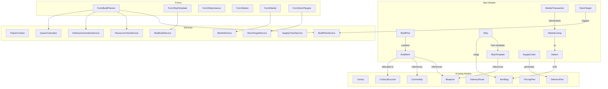
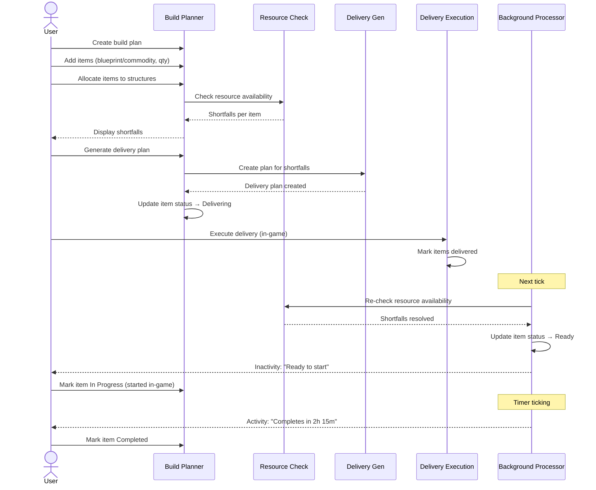
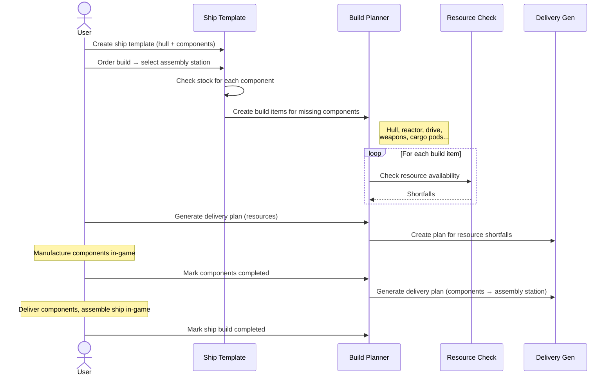
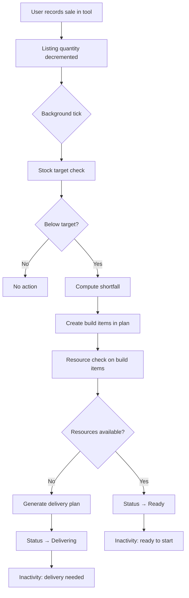
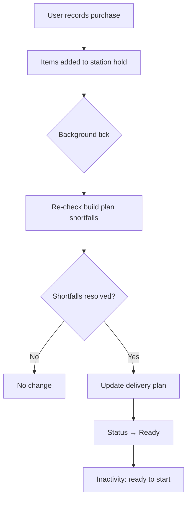
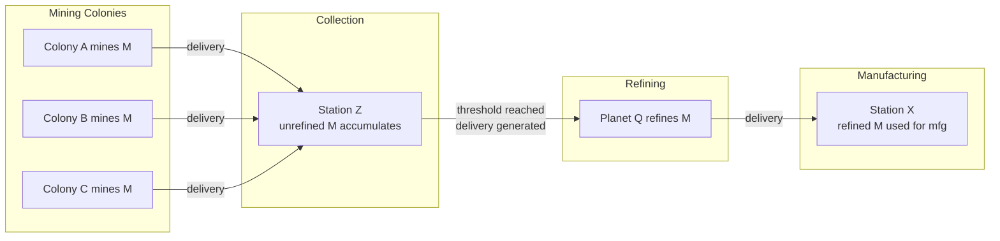
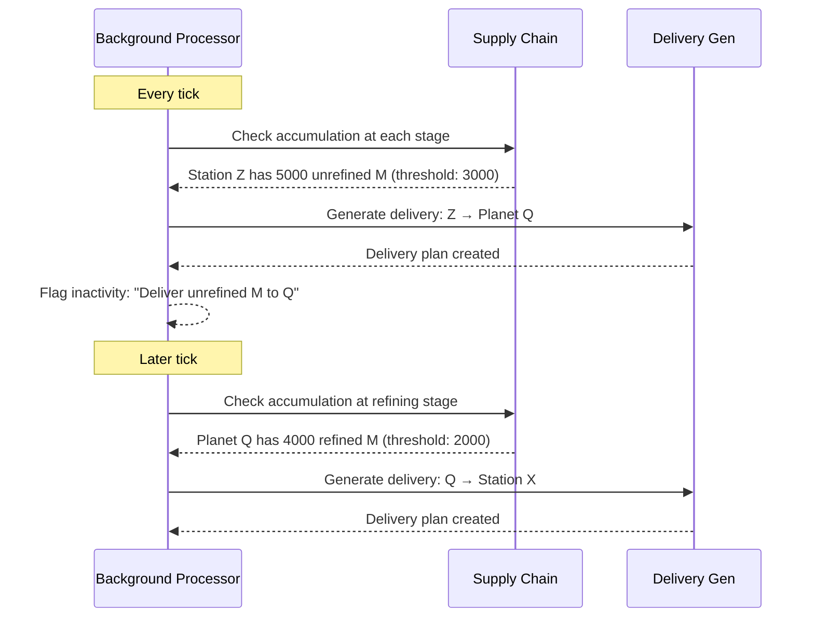
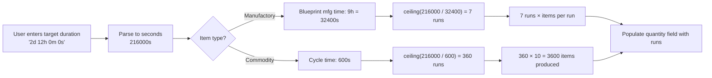
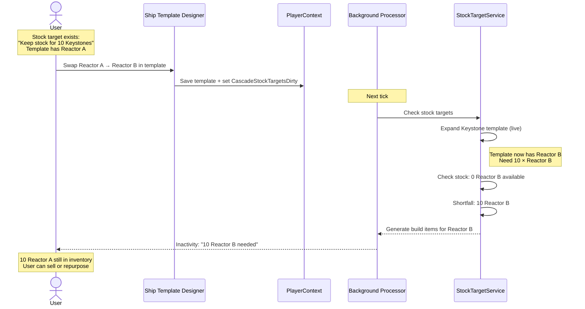

# Design Document — Empire Systems

## Overview

Empire Systems extends OE2 Empire Tracker with interconnected features for ships, stations, manufacturing planning, market tracking, supply chain management, and fill-level automation. The design prioritizes a unified data model built in Iteration 1 that supports all planned iterations without refactoring.

The architecture follows existing patterns: POCO models persisted in PlayerData.json via PlayerContext, stateless services for computation, ViewModels for UI binding, and WinForms MDI child forms.

## Architecture



## User Interaction Flows & Cascades

### Flow 1: Build Planner — Manufacturing Workflow



### Flow 2: Ship Build — Template to Assembly



### Flow 3: Market Sale — Cascade to Manufacturing



### Flow 4: Market Purchase — Resource Fulfillment



### Flow 5: Supply Chain — Mining to Manufacturing





### Flow 6: Queue Calculator



### Flow 7: Ship Template Modification — Stock Target Cascade



## Data Models

All new models follow the existing POCO pattern: public properties with defaults, Newtonsoft.Json serialization, UUID + OwnerUUID ownership, persisted as top-level arrays in PlayerRoot.

### BuildPlan

```csharp
public class BuildPlan
{
    public string UUID { get; set; }
    public string Name { get; set; } = string.Empty;
    public string OwnerUUID { get; set; } = string.Empty;
    public string Description { get; set; } = string.Empty;
    public string DeliveryPlanUUID { get; set; } = string.Empty;
    public List<BuildItem> Items { get; set; } = new List<BuildItem>();
}
```

Design decisions:
- Items are nested inside the plan (not a separate top-level array) because they have no meaning outside their plan. Simplifies CRUD — deleting a plan deletes all items automatically.
- DeliveryPlanUUID links to the generated delivery plan. Empty string means no delivery plan yet.

### BuildItem

```csharp
public enum BuildItemType
{
    Manufactory,
    Commodity,
    ShipTemplate,    // Expands into component Manufactory items
    Mining,          // Iteration 6
    Refining,        // Iteration 6
    Research         // Iteration 6
}

public enum BuildItemStatus
{
    Staged,
    Delivering,
    Ready,
    InProgress,
    Completed
}

public class BuildItem
{
    public string UUID { get; set; }

    [JsonConverter(typeof(StringEnumConverter))]
    public BuildItemType ItemType { get; set; }

    [JsonConverter(typeof(StringEnumConverter))]
    public BuildItemStatus Status { get; set; } = BuildItemStatus.Staged;

    // What to build
    public string BlueprintUUID { get; set; } = string.Empty;   // Manufactory, Research
    public string ItemName { get; set; } = string.Empty;         // Display name
    public string CommodityName { get; set; } = string.Empty;    // Commodity
    public string ShipTemplateUUID { get; set; } = string.Empty; // ShipTemplate

    // How many
    public int Quantity { get; set; } = 0;  // Always runs (mfg runs, commodity cycles, ships, etc.)

    // Where to build
    public string ColonyUUID { get; set; } = string.Empty;
    public string StructureUUID { get; set; } = string.Empty;

    // Assembly location (ShipTemplate items)
    [JsonConverter(typeof(StringEnumConverter))]
    public DestinationType AssemblyLocationType { get; set; } = DestinationType.Station;
    public string AssemblyLocationUUID { get; set; } = string.Empty;

    // Parent-child relationship (ShipTemplate → component items)
    public string ParentBuildItemUUID { get; set; } = string.Empty;

    // Metadata
    public string Recipient { get; set; } = string.Empty;
    public string Notes { get; set; } = string.Empty;
    public int SequenceInStructure { get; set; } = 0;  // For time-splitting (Iteration 6)
    public string DependsOnUUID { get; set; } = string.Empty;  // Iteration 6

    // Mining/Refining (Iteration 6)
    public string MiningResource { get; set; } = string.Empty;
    public string MiningSurveyUUID { get; set; } = string.Empty;
    public string RefiningResource { get; set; } = string.Empty;
    public string RefiningPurity { get; set; } = string.Empty;
}
```

Design decisions:
- All iteration 6 fields are present from the start with empty defaults. `DefaultValueHandling.Ignore` means they won't appear in JSON until used. No migration needed when Iteration 6 ships.
- `SequenceInStructure` supports multiple items on one structure (time-splitting). Default 0 means "only item" or "first in sequence."
- `Quantity` is always runs. The service layer computes total output using items-per-run from the blueprint (default 1, higher for munitions) or CommoditiesPerCycle for commodities. For ShipTemplate items, quantity is number of ships.
- `ShipTemplateUUID` references the template for ShipTemplate items. When expanded, child Manufactory items are created with `ParentBuildItemUUID` pointing back to the template item.
- `AssemblyLocationUUID` + `AssemblyLocationType` specify where ship components are delivered for final assembly. Only used for ShipTemplate items.
- Status is a string enum for readable JSON.

### ShipTemplate

```csharp
public class ShipTemplate
{
    public string UUID { get; set; }
    public string Name { get; set; } = string.Empty;
    public string OwnerUUID { get; set; } = string.Empty;
    public string HullBlueprintUUID { get; set; } = string.Empty;
    public List<ShipComponentSlot> Components { get; set; } = new List<ShipComponentSlot>();
}

public class ShipComponentSlot
{
    public string SlotType { get; set; } = string.Empty;  // "Reactor", "CargoPod", "FuelTank", "Weapon", etc.
    public int SlotIndex { get; set; } = 0;                // Which slot of this type (0-based)
    public string BlueprintUUID { get; set; } = string.Empty;
}
```

Design decisions:
- SlotType is a string rather than an enum because the game may add new slot types. The hull blueprint's properties define valid slot types and counts.
- SlotIndex distinguishes multiple slots of the same type (e.g. weapon slot 0, weapon slot 1).
- The template doesn't store computed stats — those are derived from the component blueprints at display time.

### Ship

```csharp
public class Ship
{
    public string UUID { get; set; }
    public string Name { get; set; } = string.Empty;
    public string OwnerUUID { get; set; } = string.Empty;
    public string TemplateUUID { get; set; } = string.Empty;  // Optional
    public string HullBlueprintUUID { get; set; } = string.Empty;
    public List<ShipComponentSlot> Components { get; set; } = new List<ShipComponentSlot>();

    // Location
    [JsonConverter(typeof(StringEnumConverter))]
    public DestinationType LocationType { get; set; } = DestinationType.Station;
    public string LocationUUID { get; set; } = string.Empty;

    // Cargo
    public ItemBag Cargo { get; set; } = new ItemBag();
    public ItemBag RawMaterialHold { get; set; } = new ItemBag();  // Mining ships only
}
```

Design decisions:
- Ship duplicates HullBlueprintUUID and Components from the template because the ship is an independent entity — the template can be modified without affecting existing ships, and ships can have components replaced after being built (everything except the hull is swappable).
- Location uses the same DestinationType enum as route stops.
- Cargo is an ItemBag, same as colony warehouse. Volume enforcement is in the service layer, not the model.
- RawMaterialHold is a separate ItemBag for unrefined resources on mining ships. Capacity comes from the hull blueprint's "Raw Material Capacity" property. Empty for non-mining ships.

### Station

```csharp
public enum StationType
{
    Outpost,
    Station,
    Starbase
}

public enum StationOwnership
{
    Government,
    PlayerOwned
}

public class Station
{
    public string UUID { get; set; }
    public string Name { get; set; } = string.Empty;

    [JsonConverter(typeof(StringEnumConverter))]
    public StationType StationType { get; set; } = Models.StationType.Station;

    [JsonConverter(typeof(StringEnumConverter))]
    public StationOwnership Ownership { get; set; } = StationOwnership.Government;

    public string OwnerUUID { get; set; } = string.Empty;  // Player whose hold this represents
    public ItemBag Hold { get; set; } = new ItemBag();
}
```

Design decisions:
- UUID is deterministic from station name using DeterministicUUID with a station-specific namespace.
- Station holds are per-player. Each player has their own Station record for the same physical station, with their own Hold contents. The station UUID + OwnerUUID together identify a unique hold.
- Government stations are shared locations but each player tracks their own inventory there.
- Hold is an ItemBag with no capacity limit.

### MarketListing

```csharp
public class MarketListing
{
    public string UUID { get; set; }
    public string OwnerUUID { get; set; } = string.Empty;
    public string StationUUID { get; set; } = string.Empty;

    // Item reference
    [JsonConverter(typeof(StringEnumConverter))]
    public ItemType.ItemTypeEnum ItemType { get; set; } = Models.ItemType.ItemTypeEnum.None;
    public string ItemReferenceID { get; set; } = string.Empty;  // Blueprint UUID or Commodity name
    public string ItemName { get; set; } = string.Empty;          // Display name

    public int Quantity { get; set; } = 0;
    public decimal PricePerUnit { get; set; } = 0m;
}
```

### MarketTransaction

```csharp
public enum TransactionType
{
    Buy,
    Sell
}

public class MarketTransaction
{
    public string UUID { get; set; }
    public string OwnerUUID { get; set; } = string.Empty;

    [JsonConverter(typeof(StringEnumConverter))]
    public TransactionType TransactionType { get; set; }

    // Item reference
    [JsonConverter(typeof(StringEnumConverter))]
    public ItemType.ItemTypeEnum ItemType { get; set; } = Models.ItemType.ItemTypeEnum.None;
    public string ItemReferenceID { get; set; } = string.Empty;
    public string ItemName { get; set; } = string.Empty;

    public int Quantity { get; set; } = 0;
    public decimal PricePerUnit { get; set; } = 0m;
    public decimal TotalPrice { get; set; } = 0m;
    public string Counterparty { get; set; } = string.Empty;
    public string StationUUID { get; set; } = string.Empty;
    public string Timestamp { get; set; } = string.Empty;  // ISO 8601 UTC
    public string Notes { get; set; } = string.Empty;
    public string ListingUUID { get; set; } = string.Empty;  // Links to the listing that was sold from
}
```

Design decisions:
- ListingUUID links a sell transaction to its source listing for automatic quantity decrement.
- ItemReferenceID is Blueprint UUID for blueprint items, commodity name for commodities. Same pattern as DeliveryItem.BaseItemTypeID.
- Timestamp is ISO 8601 UTC string, same pattern as colony import timestamps.

### StockTarget

```csharp
public enum StockTargetScope
{
    EmpireWide,
    Colony,
    Station
}

public class StockPlan
{
    public string UUID { get; set; }
    public string Name { get; set; } = string.Empty;
    public string OwnerUUID { get; set; } = string.Empty;
    public List<StockTarget> Targets { get; set; } = new List<StockTarget>();
}

public class StockTarget
{
    public string UUID { get; set; }
    public string OwnerUUID { get; set; } = string.Empty;  // Set for standalone targets
    public string StockPlanUUID { get; set; } = string.Empty;  // Set when part of a plan

    // What item (individual item OR ship template)
    [JsonConverter(typeof(StringEnumConverter))]
    public ItemType.ItemTypeEnum ItemType { get; set; } = Models.ItemType.ItemTypeEnum.None;
    public string ItemReferenceID { get; set; } = string.Empty;
    public string ItemName { get; set; } = string.Empty;
    public string ShipTemplateUUID { get; set; } = string.Empty;  // If targeting a ship template

    // Target
    public int TargetQuantity { get; set; } = 0;
    public int CriticalThreshold { get; set; } = 0;  // Red warning below this

    // Scope
    [JsonConverter(typeof(StringEnumConverter))]
    public StockTargetScope Scope { get; set; } = StockTargetScope.EmpireWide;
    public string LocationUUID { get; set; } = string.Empty;  // Colony or Station UUID when scoped
}
```

### Faction

```csharp
public class Faction
{
    public string UUID { get; set; }
    public string Name { get; set; } = string.Empty;
    public string Description { get; set; } = string.Empty;
}
```

Design decisions:
- Factions are not per-player — they're shared entities. All player profiles can reference the same faction.
- UUID is deterministic from faction name using DeterministicUUID with a faction-specific namespace. Two players who both create "The Space Pirates" get the same UUID, enabling data sharing (ship templates, pricing plans).
- No OwnerUUID. Factions are created/managed by any player and persist globally in PlayerData.

### ExternalCharacter

```csharp
public class ExternalCharacter
{
    public string UUID { get; set; }
    public string Name { get; set; } = string.Empty;
    public string FactionUUID { get; set; } = string.Empty;
}
```

Design decisions:
- Lightweight — just name and optional faction. No skills, ranks, or other profile data.
- UUID is deterministic from character name using DeterministicUUID with a character-specific namespace. Two players who both add "Captain Bob" get the same UUID, so shared data references resolve correctly.
- Used for combo box lookups. The combo data source merges PlayerProfiles + ExternalCharacters, sorted by name, with a free-text fallback.
- No OwnerUUID — external characters are shared across all managed player profiles.

### PlayerProfile Changes

```csharp
// Add to existing PlayerProfile:
public string FactionUUID { get; set; } = string.Empty;
```

### SupplyChain (Iteration 6)

```csharp
public class SupplyChain
{
    public string UUID { get; set; }
    public string Name { get; set; } = string.Empty;
    public string OwnerUUID { get; set; } = string.Empty;
    public List<SupplyChainStage> Stages { get; set; } = new List<SupplyChainStage>();
}

public enum SupplyChainStageType
{
    Mine,
    Collect,
    Refine,
    Deliver
}

public class SupplyChainStage
{
    public int Sequence { get; set; } = 0;

    [JsonConverter(typeof(StringEnumConverter))]
    public SupplyChainStageType StageType { get; set; }

    // Location
    [JsonConverter(typeof(StringEnumConverter))]
    public DestinationType LocationType { get; set; }
    public string LocationUUID { get; set; } = string.Empty;

    // Resource
    public string ResourceName { get; set; } = string.Empty;
    public string ResourcePurity { get; set; } = string.Empty;

    // Thresholds
    public int AccumulationThreshold { get; set; } = 0;  // Trigger delivery when this much accumulates
    public decimal ProductionRatePerHour { get; set; } = 0m;
}
```

### WarehouseOverflowRule

```csharp
public class WarehouseOverflowRule
{
    public string UUID { get; set; }
    public string OwnerUUID { get; set; } = string.Empty;
    public string ColonyUUID { get; set; } = string.Empty;       // Source colony
    public string ResourceName { get; set; } = string.Empty;
    public string ResourcePurity { get; set; } = string.Empty;
    public int TriggerThreshold { get; set; } = 0;               // Move when qty exceeds this

    // Destination
    [JsonConverter(typeof(StringEnumConverter))]
    public DestinationType DestinationType { get; set; } = DestinationType.Station;
    public string DestinationUUID { get; set; } = string.Empty;
}
```

Design decisions:
- One rule per resource per colony. Multiple resources at the same colony = multiple rules.
- TriggerThreshold is the quantity at which a delivery is generated to move the excess. The amount moved = current quantity - TriggerThreshold (leave TriggerThreshold behind, move the rest).
- Background processor checks warehouse levels each tick and generates deliveries when thresholds are exceeded.
- Colony warehouse capacity is tracked via the existing colony data model. A full warehouse is detectable when total item count/volume reaches the limit.

### RouteStop Changes

The existing `RouteStop` model needs a `DestinationType` discriminator:

```csharp
public enum DestinationType
{
    Colony,
    Station
}

public class RouteStop
{
    [JsonConverter(typeof(StringEnumConverter))]
    public DestinationType DestinationType { get; set; } = DestinationType.Colony;
    public string DestinationUUID { get; set; } = string.Empty;
    public int Sequence { get; set; }

    // Backward compatibility: ColonyUUID is kept for deserialization of existing data.
    // New code should use DestinationUUID. Migration sets DestinationUUID = ColonyUUID
    // and DestinationType = Colony for all existing stops.
    [JsonProperty(DefaultValueHandling = DefaultValueHandling.Ignore)]
    public string ColonyUUID { get; set; }
}
```

Design decisions:
- ColonyUUID is retained for backward compatibility. A migration copies ColonyUUID → DestinationUUID and sets DestinationType = Colony for existing data.
- New code uses DestinationUUID + DestinationType exclusively.

### DeliveryPlan Changes

```csharp
// Add to existing DeliveryPlan:
public string ShipUUID { get; set; } = string.Empty;  // Optional ship assignment (Iteration 3)
```

### DeliveryPlanStop Changes

```csharp
// DeliveryPlanStop gets the same DestinationType treatment as RouteStop:
[JsonConverter(typeof(StringEnumConverter))]
public DestinationType DestinationType { get; set; } = DestinationType.Colony;
public string DestinationUUID { get; set; } = string.Empty;

// ColonyUUID retained for backward compatibility
[JsonProperty(DefaultValueHandling = DefaultValueHandling.Ignore)]
public string ColonyUUID { get; set; }
```

### PlayerRoot Changes

```csharp
public class PlayerRoot
{
    // Existing
    public int DataVersion { get; set; }
    public string CurrentPlayerUUID { get; set; }
    public PlayerProfile[] PlayerProfile { get; set; }
    public Blueprint[] Blueprint { get; set; }
    public Survey[] Survey { get; set; }
    public Colony[] Colony { get; set; }
    public DeliveryRoute[] DeliveryRoute { get; set; }
    public DeliveryPlan[] DeliveryPlan { get; set; }
    public PricingPlan[] PricingPlan { get; set; }

    // New — all default to empty arrays for backward compatibility
    public BuildPlan[] BuildPlan { get; set; }
    public ShipTemplate[] ShipTemplate { get; set; }
    public Ship[] Ship { get; set; }
    public Station[] Station { get; set; }
    public MarketListing[] MarketListing { get; set; }
    public MarketTransaction[] MarketTransaction { get; set; }
    public StockTarget[] StockTarget { get; set; }
    public StockPlan[] StockPlan { get; set; }
    public SupplyChain[] SupplyChain { get; set; }
    public WarehouseOverflowRule[] WarehouseOverflowRule { get; set; }
    public Faction[] Faction { get; set; }
    public ExternalCharacter[] ExternalCharacter { get; set; }
}
```

All new arrays initialize to empty in the constructor. Missing arrays in JSON deserialize as null, which InitXxx methods handle with `?? new T[0]`.

## Services

### BuildPlanService (Iteration 1)

Static service in `Services/BuildPlanService.cs`.

```csharp
public static class BuildPlanService
{
    // Validate a build plan name (non-empty, non-whitespace)
    public static bool ValidatePlanName(string name);

    // Validate a build item (quantity >= 1, valid type)
    public static bool ValidateBuildItem(BuildItem item);
}
```

Thin validation layer. Most logic lives in the form and other services.

### ResourceCheckService (Iteration 1)

Static service in `Services/ResourceCheckService.cs`.

```csharp
public static class ResourceCheckService
{
    /// <summary>
    /// Computes resource shortfalls for a build item at its allocated colony.
    /// Returns a dictionary of resource name → shortfall quantity.
    /// Empty dictionary means all resources available.
    /// </summary>
    public static Dictionary<string, int> ComputeShortfalls(
        BuildItem item, Colony colony,
        Func<string, Blueprint> blueprintFinder);

    /// <summary>
    /// Computes shortfalls for all allocated items in a build plan.
    /// Returns per-item shortfall maps keyed by BuildItem UUID.
    /// </summary>
    public static Dictionary<string, Dictionary<string, int>> ComputePlanShortfalls(
        BuildPlan plan, Func<string, Colony> colonyFinder,
        Func<string, Blueprint> blueprintFinder);
}
```

Logic:
- For Manufactory items: iterate blueprint.Resources, multiply quantity × item.Quantity, subtract colony warehouse stock (Refined purity for natural resources, DeterminePurity for synthetics).
- For Commodity items: iterate commodity.ConstructionResources, multiply quantity × item.Quantity (runs), subtract warehouse stock.
- Returns only positive shortfalls (resources where need > have).

### DeliveryGenerationService (Iteration 1)

Static service in `Services/DeliveryGenerationService.cs`.

```csharp
public static class DeliveryGenerationService
{
    /// <summary>
    /// Creates or updates a delivery plan for a build plan's resource shortfalls.
    /// User provides the route to use. Returns the created/updated DeliveryPlan.
    /// </summary>
    public static DeliveryPlan GenerateDeliveryPlan(
        BuildPlan buildPlan, DeliveryRoute route,
        Dictionary<string, Dictionary<string, int>> shortfalls,
        Func<string, Colony> colonyFinder,
        PlayerContext playerContext);
}
```

Logic:
- Groups shortfalls by colony UUID.
- For each colony on the route that has shortfalls, creates/updates a DeliveryPlanStop with drop-off items for each resource shortfall.
- If buildPlan.DeliveryPlanUUID is set, finds and updates the existing plan. Otherwise creates a new one.
- Names the plan "Build: {buildPlan.Name}".
- Sets DestinationType = Colony on each stop (stations come in Iteration 4).

### QueueCalculator (Iteration 1)

Static service in `Services/QueueCalculator.cs`.

```csharp
public static class QueueCalculator
{
    /// <summary>
    /// Computes how many manufacturing runs to keep a structure busy
    /// for at least the target duration.
    /// Returns -1 if manufacturing time is unknown.
    /// </summary>
    public static int ComputeManufactoryRuns(
        Blueprint blueprint, int targetDurationSeconds);

    /// <summary>
    /// Computes how many commodity runs to keep a structure busy
    /// for at least the target duration.
    /// </summary>
    public static int ComputeCommodityRuns(int targetDurationSeconds);

    /// <summary>
    /// Returns total items produced for a given number of manufactory runs.
    /// Uses the blueprint's items-per-run property (default 1).
    /// </summary>
    public static int ManufactoryRunsToItems(Blueprint blueprint, int runs);

    /// <summary>
    /// Returns total items produced for a given number of commodity runs.
    /// </summary>
    public static int CommodityRunsToItems(int runs);
}
```

Logic:
- Manufactory: parse "Manufacture Run Time" from blueprint.Properties via EvolutionChainService.ParseTimeToSeconds. Return ceiling(targetSeconds / mfgSeconds).
- ManufactoryRunsToItems: runs × items-per-run from blueprint (munitions produce multiple per run, most produce 1).
- Commodity: ceiling(targetSeconds / CommodityCycleSeconds).
- CommodityRunsToItems: runs × CommoditiesPerCycle.

### AutoAssignService (Iteration 1)

Static service in `Services/AutoAssignService.cs`.

```csharp
public static class AutoAssignService
{
    /// <summary>
    /// Proposes structure assignments for unallocated build items,
    /// minimizing total completion time while respecting blueprint copy limits.
    /// Only considers structures at colonies on the specified delivery route.
    /// </summary>
    public static List<AssignmentProposal> ProposeAssignments(
        BuildPlan plan,
        DeliveryRoute route,
        Func<string, Colony> colonyFinder,
        Func<string, Blueprint> blueprintFinder);
}

public class AssignmentProposal
{
    public string BuildItemUUID { get; set; }
    public string ColonyUUID { get; set; }
    public string StructureUUID { get; set; }
    public int SequenceInStructure { get; set; }
    public string Reason { get; set; }  // Why this assignment was chosen
}
```

Logic:
1. Collect all idle manufactories and commodity factories at colonies on the delivery route.
2. For each unallocated Manufactory item, count how many copies of that blueprint the player owns. That's the max parallelism.
3. Distribute runs across min(available structures, blueprint copies), splitting quantity evenly. Remainder goes to the first structures.
4. If more items than structures × copies, stack on existing assignments (SequenceInStructure > 0).
5. Commodity items have no copy constraint — distribute across all available commodity factories.
6. Sort assignments to minimize the longest completion time (balance load across structures).

### ShipBuildService (Iteration 2)

Static service in `Services/ShipBuildService.cs`.

```csharp
public static class ShipBuildService
{
    /// <summary>
    /// Generates build items for a ship template — one per hull + component.
    /// Checks stock at the assembly location and only creates items for
    /// components not already available.
    /// </summary>
    public static List<BuildItem> GenerateShipBuildItems(
        ShipTemplate template,
        string assemblyLocationUUID, DestinationType assemblyLocationType,
        Func<string, Colony> colonyFinder,
        Func<string, Station> stationFinder,
        Func<string, Blueprint> blueprintFinder);

    /// <summary>
    /// Validates assembly location restrictions based on ship class.
    /// Returns null if valid, error message if invalid.
    /// </summary>
    public static string ValidateAssemblyLocation(
        int shipClass, Station station);

    /// <summary>
    /// Computes ship stats from hull + components.
    /// </summary>
    public static ShipStats ComputeStats(
        Blueprint hull, IEnumerable<ShipComponentSlot> components,
        Func<string, Blueprint> blueprintFinder);
}

public class ShipStats
{
    public decimal CargoCapacity { get; set; }
    public decimal TotalMass { get; set; }
    public decimal PowerGenerated { get; set; }
    public decimal PowerConsumed { get; set; }
}
```

### MarketService (Iteration 5)

Static service in `Services/MarketService.cs`.

```csharp
public static class MarketService
{
    /// <summary>
    /// Records a sell transaction and decrements the associated listing.
    /// Returns true if the listing was found and decremented.
    /// </summary>
    public static bool RecordSale(
        MarketTransaction transaction,
        List<MarketListing> listings);

    /// <summary>
    /// Records a buy transaction and adds items to the station hold.
    /// </summary>
    public static void RecordPurchase(
        MarketTransaction transaction,
        Func<string, Station> stationFinder);

    /// <summary>
    /// Computes profit/loss for a transaction against a pricing plan.
    /// </summary>
    public static decimal ComputeProfitLoss(
        MarketTransaction transaction, PricingPlan plan,
        Func<string, Blueprint> blueprintFinder);
}
```

### StockTargetService (Iteration 7)

Static service in `Services/StockTargetService.cs`.

```csharp
public static class StockTargetService
{
    /// <summary>
    /// Checks all stock targets and returns shortfalls.
    /// Dedicated targets sum requirements independently.
    /// Shared targets use max(quantity) for overlapping components.
    /// Ship template targets are expanded into component requirements.
    /// </summary>
    public static List<StockShortfall> CheckTargets(
        IEnumerable<StockTarget> targets,
        Func<string, Colony> colonyFinder,
        Func<string, Station> stationFinder,
        Func<string, ShipTemplate> templateFinder,
        Func<string, Blueprint> blueprintFinder,
        IEnumerable<Colony> allColonies,
        IEnumerable<Station> allStations);

    /// <summary>
    /// Generates build items to cover shortfalls, avoiding duplicates
    /// with existing build items.
    /// </summary>
    public static List<BuildItem> GenerateReplenishmentItems(
        List<StockShortfall> shortfalls,
        IEnumerable<BuildPlan> existingPlans);
}

public class StockShortfall
{
    public StockTarget Target { get; set; }
    public int CurrentQuantity { get; set; }
    public int ShortfallQuantity { get; set; }
    public bool IsCritical { get; set; }  // Below CriticalThreshold
}
```

## Cascade Processing

Market transactions, stock target checks, resource availability re-evaluation, and delivery plan updates are computationally expensive when they cascade (sale → stock target → build order → resource check → delivery plan). Running these synchronously on the UI thread would block the application.

Design decision: cascade operations run as part of the existing BackgroundProcessor system. The immediate user action (recording a sale, recording a purchase) performs only the direct mutation (decrement listing, add to station hold) and sets a dirty flag. The background processor picks up dirty flags on its next tick and runs the cascade:

1. Check stock targets against current inventory → generate build items if needed
2. Re-evaluate resource availability for all active build plans → update shortfall data
3. Update delivery plans if shortfalls have changed
4. Update build item statuses based on new resource availability

Forms subscribe to data change events and refresh when the background processor completes a cascade cycle. This keeps the UI responsive while ensuring cascades complete within one background tick (default 60 seconds, configurable via Preferences).

The dirty flag approach means cascades are batched — multiple transactions recorded in quick succession result in one cascade evaluation, not one per transaction.

### Implementation

The dirty flags live on PlayerContext as runtime-only fields (not persisted, not part of any data model):

```csharp
// Runtime cascade flags — not serialized
[JsonIgnore] public bool CascadeStockTargetsDirty { get; set; } = false;
[JsonIgnore] public bool CascadeResourceCheckDirty { get; set; } = false;
```

When a form records a market transaction, updates a station hold, or modifies build plan data, it sets the appropriate flag(s). The BackgroundProcessor checks these flags on each tick:

```csharp
// In BackgroundProcessor tick:
if (playerContext.CascadeStockTargetsDirty)
{
    playerContext.CascadeStockTargetsDirty = false;
    // Run StockTargetService.CheckTargets → generate build items if needed
    // Set CascadeResourceCheckDirty if new items were created
}
if (playerContext.CascadeResourceCheckDirty)
{
    playerContext.CascadeResourceCheckDirty = false;
    // Run ResourceCheckService on all active build plans
    // Update delivery plans, item statuses
    // Fire BuildPlanDataChanged event
}
```

The flags are simple booleans — no queue, no event log. If multiple transactions set the same flag before the next tick, only one cascade evaluation runs. The background processor clears the flag before processing to avoid missing a flag set during processing.

### Startup Cascade

On application startup, the background processor runs a full cascade evaluation unconditionally (as if all flags were dirty). This handles:
- Dirty flags lost due to app exit before the next tick
- Manual JSON edits or data imports
- Any inconsistency from a crash or unexpected shutdown

The startup cascade is the same logic as the tick cascade — check stock targets, re-evaluate resource availability, update delivery plans and statuses. It runs once during initialization before the first regular tick.

## PlayerContext Changes

### New Fields

```csharp
// Existing entities — remain as BindingList<T> until BL-069 migration
public BindingList<DeliveryRoute> DeliveryRouteList;
public BindingList<DeliveryPlan> DeliveryPlanList;
public BindingList<PricingPlan> PricingPlanList;

// New entities use List<T> — forms build their own display lists
// from filtered queries, so BindingList change notifications aren't needed.
public List<BuildPlan> BuildPlanList;
public List<ShipTemplate> ShipTemplateList;
public List<Ship> ShipList;
public List<Station> StationList;
public List<MarketListing> MarketListingList;
public List<MarketTransaction> MarketTransactionList;
public List<StockTarget> StockTargetList;
public List<StockPlan> StockPlanList;
public List<SupplyChain> SupplyChainList;
public List<WarehouseOverflowRule> WarehouseOverflowRuleList;
public List<Faction> FactionList;
public List<ExternalCharacter> ExternalCharacterList;
```

### New Init Methods

Each follows the existing pattern (null-coalesce, sort by name, create List):

```csharp
public void InitBuildPlans(PlayerRoot playerRoot)
public void InitShipTemplates(PlayerRoot playerRoot)
public void InitShips(PlayerRoot playerRoot)
public void InitStations(PlayerRoot playerRoot)
public void InitMarketListings(PlayerRoot playerRoot)
public void InitMarketTransactions(PlayerRoot playerRoot)
public void InitStockTargets(PlayerRoot playerRoot)
public void InitSupplyChains(PlayerRoot playerRoot)
public void InitFactions(PlayerRoot playerRoot)
public void InitExternalCharacters(PlayerRoot playerRoot)
```

### WriteContext Changes

Add to WriteContext after existing serialization:

```csharp
playerRoot.BuildPlan = BuildPlanList.ToArray();
playerRoot.ShipTemplate = ShipTemplateList.ToArray();
playerRoot.Ship = ShipList.ToArray();
playerRoot.Station = StationList.ToArray();
playerRoot.MarketListing = MarketListingList.ToArray();
playerRoot.MarketTransaction = MarketTransactionList.ToArray();
playerRoot.StockTarget = StockTargetList.ToArray();
playerRoot.SupplyChain = SupplyChainList.ToArray();
playerRoot.Faction = FactionList.ToArray();
playerRoot.ExternalCharacter = ExternalCharacterList.ToArray();
```

### CascadeDeletePlayer Changes

Add removal loops for all new entity types with OwnerUUID matching the deleted player. Government stations (empty OwnerUUID) are excluded.

### CleanupOrphanedData Changes

Add orphan cleanup for all new entity types, same pattern as existing.

### New Events

```csharp
public event EventHandler BuildPlanDataChanged;
public event EventHandler MarketDataChanged;
public event EventHandler StationDataChanged;
```

### New Convenience Methods

```csharp
public List<BuildPlan> GetCurrentPlayerBuildPlans()
public List<ShipTemplate> GetCurrentPlayerShipTemplates()
public List<Ship> GetCurrentPlayerShips()
public List<Station> GetCurrentPlayerStations()  // Includes government stations
public List<MarketListing> GetCurrentPlayerListings()
public List<MarketTransaction> GetCurrentPlayerTransactions()
public List<StockTarget> GetCurrentPlayerStockTargets()
public List<SupplyChain> GetCurrentPlayerSupplyChains()
```

## Migration

## UUID Strategy

Entities that represent game-world objects shared across players use deterministic UUIDs (UUID v5 via DeterministicUUID) so that two players who independently create the same entity get the same UUID. This enables data sharing — importing a ship template from another player resolves faction, character, and station references correctly.

| Entity | UUID Type | Seed |
|---|---|---|
| Station | Deterministic | Station name (station namespace) |
| Faction | Deterministic | Faction name (faction namespace) |
| ExternalCharacter | Deterministic | Character name (character namespace) |
| BuildPlan | Random | Player-specific work order |
| BuildItem | Random | Nested in plan |
| ShipTemplate | Deterministic | OwnerUUID + template name (template namespace) |
| Ship | Random | Player-owned instance |
| MarketListing | Random | Player-specific record |
| MarketTransaction | Random | Player-specific record |
| StockTarget | Random | Player-specific rule |
| SupplyChain | Random | Player-specific definition |

Each deterministic entity type uses its own UUID namespace to avoid collisions (e.g. a faction named "Alpha" and a station named "Alpha" get different UUIDs).

### Migration005_EmpireSystems

A new migration that:
1. Adds empty arrays for all new entity types if missing from PlayerRoot.
2. Migrates existing RouteStop.ColonyUUID → DestinationUUID + DestinationType.Colony for all delivery routes.
3. Migrates existing DeliveryPlanStop.ColonyUUID → DestinationUUID + DestinationType.Colony for all delivery plans.
4. Increments DataVersion.

This migration is safe to run on existing data — it only adds defaults and copies existing fields.

## Forms

### FormBuildPlanner (Iteration 1)

MDI child form. Layout:

- Left panel: ListBox of build plans for current player with Add/Delete buttons and filter text box.
- Right panel:
  - Plan details (Name, Description text boxes, Save button)
  - Build items DataGridView (Type, Item, Quantity, Colony, Structure, Status, Recipient, Notes)
  - Below the grid: Add Item panel (Type combo, Item combo with filter, Quantity, Target Duration for calculator, Recipient, Add button)
  - Resource shortfall display panel (shows per-item shortfalls when an item is selected)
  - Generate Delivery button (picks route, creates/updates delivery plan)

Wiring:
- Subscribes to CurrentPlayerChanged, ColonyDataChanged, BuildPlanDataChanged.
- Fires BuildPlanDataChanged after saves.
- Structure allocation uses a modal dialog with colony/structure picker, filter text box, idle-only toggle, and busy indicators.

### FormShipTemplate (Iteration 2)

MDI child form. Layout:

- Left panel: ListBox of templates with Add/Delete and filter.
- Right panel:
  - Template name text box
  - Hull selector (combo box filtered to Hull blueprints)
  - Slot grid: one section per slot type, showing available count from hull and installed component for each slot
  - Computed stats display (cargo capacity, mass, power)
  - "Order Build" button → creates build items in a new or existing build plan

### FormShipInstance (Iteration 2)

MDI child form. Layout:

- Left panel: ListBox of ships with filter.
- Right panel:
  - Ship name, location display
  - Component list (read-only, from installed components)
  - Cargo hold display (ItemBag contents with volume used / capacity)
  - Create from Template button

### FormStation (Iteration 4)

MDI child form. Layout:

- Left panel: ListBox of stations (government + player-owned) with filter.
- Right panel:
  - Station name, type (Outpost/Station/Starbase), ownership
  - Hold inventory grid (ItemBag contents, editable)

### FormMarket (Iteration 5)

MDI child form. Layout:

- Tab 1: Active Listings — grid of items for sale at stations with quantity and price
- Tab 2: Transaction History — grid of buy/sell transactions, filterable by item/type/counterparty/date/station
- Tab 3: Summary — running totals, profit/loss with pricing plan selector
- Record Sale button on Listings tab → creates transaction, decrements listing, triggers stock target check

### FormStockTargets (Iteration 7)

MDI child form. Layout:

- Grid of stock targets: item, target quantity, scope (empire/colony/station), current quantity, shortfall
- Add/Edit/Delete buttons
- "Check & Generate Orders" button → runs StockTargetService, creates build items

## Correctness Properties

### Property 1: Build item quantity validation
For any integer, a build item accepts it as quantity if and only if it is ≥ 1.

### Property 2: Queue calculator — manufactory
For any blueprint with a known manufacturing time and any positive target duration, the computed quantity × manufacturing time ≥ target duration.

### Property 3: Queue calculator — commodity
For any positive target duration, the computed runs × CommodityCycleSeconds ≥ target duration.

### Property 4: Resource shortfall computation
For any build item and colony, the shortfall for each resource equals max(0, required - warehouse stock).

### Property 5: Delivery plan generation covers all shortfalls
For any build plan with shortfalls, the generated delivery plan's drop-off items cover every shortfall quantity.

### Property 6: Ship class assembly validation
For any ship class and station type, ValidateAssemblyLocation returns null iff the class/type combination is permitted (2-5 any, 6 Station+Starbase, 7-8 Starbase only).

### Property 7: Stock target shortfall computation
For any stock target, the shortfall equals max(0, target - current quantity) where current quantity is scoped correctly (empire-wide sums all locations, colony/station checks one). IsCritical is true iff current quantity < CriticalThreshold.

### Property 8: Market sale decrements listing
For any sell transaction linked to a listing, the listing quantity after recording equals the listing quantity before minus the transaction quantity.

### Property 11: Market purchase adds to station hold
For any buy transaction at a station, the station hold quantity of the purchased item after recording equals the hold quantity before plus the transaction quantity.

### Property 9: Serialization round-trip
For all new entity types (BuildPlan, ShipTemplate, Ship, Station, MarketListing, MarketTransaction, StockTarget, SupplyChain), serializing then deserializing produces equivalent objects.

### Property 10: RouteStop migration preserves destinations
For any existing RouteStop with ColonyUUID, after migration DestinationUUID equals ColonyUUID and DestinationType equals Colony.

## Error Handling

| Scenario | Handling |
|---|---|
| Empty/whitespace plan name | Validation rejects save, shows message |
| Quantity < 1 | Validation rejects save, shows message |
| Blueprint missing "Manufacture Run Time" | Calculator shows "time unknown", no computation |
| Target duration unparseable | Calculator does nothing, no error |
| Colony warehouse missing for allocated item | Shortfall shows all resources as needed |
| Structure no longer exists (deleted colony) | Allocation cleared, item reverts to Staged |
| Ship class exceeds station type limit | Assembly location rejected with message |
| Listing quantity goes negative on sale | Clamped to 0, warning logged |
| Stock target references deleted colony/station | Target flagged as invalid, skipped during check |
| PlayerData missing new arrays | Init methods create empty lists, no error |
| RouteStop has ColonyUUID but no DestinationUUID | Migration copies ColonyUUID → DestinationUUID |

## Testing Strategy

### Property-Based Tests (FsCheck)

One test per correctness property (Properties 1-10 above), minimum 100 iterations each. Custom generators for BuildPlan, BuildItem, ShipTemplate, Station, MarketListing, StockTarget.

### Unit Tests

- BuildPlanService validation edge cases
- ResourceCheckService with known blueprints and warehouse contents
- QueueCalculator with known manufacturing times
- ShipBuildService assembly validation matrix (all class × station type combinations)
- MarketService sale recording and listing decrement
- StockTargetService shortfall computation with mixed scopes
- Migration005 on existing PlayerData with RouteStops
- DeliveryGenerationService with known shortfalls and routes
