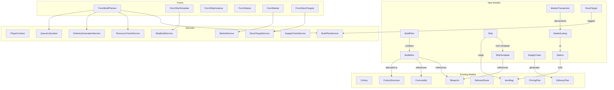

# Design Document — Empire Systems

## Overview

Empire Systems extends OE2 Empire Tracker with interconnected features for ships, stations, manufacturing planning, market tracking, supply chain management, and fill-level automation. The design prioritizes a unified data model built in Iteration 1 that supports all planned iterations without refactoring.

The architecture follows existing patterns: POCO models persisted in PlayerData.json via PlayerContext, stateless services for computation, ViewModels for UI binding, and WinForms MDI child forms.

## Architecture



## Data Models

All new models follow the existing POCO pattern: public properties with defaults, Newtonsoft.Json serialization, UUID + OwnerUUID ownership, persisted as top-level arrays in PlayerRoot.

### BuildPlan

```csharp
public class BuildPlan
{
    public string UUID { get; set; }
    public string Name { get; set; } = string.Empty;
    public string OwnerUUID { get; set; } = string.Empty;
    public string Description { get; set; } = string.Empty;
    public string DeliveryPlanUUID { get; set; } = string.Empty;
    public List<BuildItem> Items { get; set; } = new List<BuildItem>();
}
```

Design decisions:
- Items are nested inside the plan (not a separate top-level array) because they have no meaning outside their plan. Simplifies CRUD — deleting a plan deletes all items automatically.
- DeliveryPlanUUID links to the generated delivery plan. Empty string means no delivery plan yet.

### BuildItem

```csharp
public enum BuildItemType
{
    Manufactory,
    Commodity,
    Mining,      // Iteration 6
    Refining,    // Iteration 6
    Research     // Iteration 6
}

public enum BuildItemStatus
{
    Staged,
    Delivering,
    Ready,
    InProgress,
    Completed
}

public class BuildItem
{
    public string UUID { get; set; }

    [JsonConverter(typeof(StringEnumConverter))]
    public BuildItemType ItemType { get; set; }

    [JsonConverter(typeof(StringEnumConverter))]
    public BuildItemStatus Status { get; set; } = BuildItemStatus.Staged;

    // What to build
    public string BlueprintUUID { get; set; } = string.Empty;   // Manufactory, Research
    public string ItemName { get; set; } = string.Empty;         // Display name
    public string CommodityName { get; set; } = string.Empty;    // Commodity

    // How many
    public int Quantity { get; set; } = 0;  // Items for Manufactory, runs for Commodity

    // Where to build
    public string ColonyUUID { get; set; } = string.Empty;
    public string StructureUUID { get; set; } = string.Empty;

    // Metadata
    public string Recipient { get; set; } = string.Empty;
    public string Notes { get; set; } = string.Empty;
    public int SequenceInStructure { get; set; } = 0;  // For time-splitting (Iteration 6)
    public string DependsOnUUID { get; set; } = string.Empty;  // Iteration 6

    // Mining/Refining (Iteration 6)
    public string MiningResource { get; set; } = string.Empty;
    public string MiningSurveyUUID { get; set; } = string.Empty;
    public string RefiningResource { get; set; } = string.Empty;
    public string RefiningPurity { get; set; } = string.Empty;
}
```

Design decisions:
- All iteration 6 fields are present from the start with empty defaults. `DefaultValueHandling.Ignore` means they won't appear in JSON until used. No migration needed when Iteration 6 ships.
- `SequenceInStructure` supports multiple items on one structure (time-splitting). Default 0 means "only item" or "first in sequence."
- `Quantity` is items for Manufactory, runs for Commodity. The service layer computes total output for display.
- Status is a string enum for readable JSON.

### ShipTemplate

```csharp
public class ShipTemplate
{
    public string UUID { get; set; }
    public string Name { get; set; } = string.Empty;
    public string OwnerUUID { get; set; } = string.Empty;
    public string HullBlueprintUUID { get; set; } = string.Empty;
    public List<ShipComponentSlot> Components { get; set; } = new List<ShipComponentSlot>();
}

public class ShipComponentSlot
{
    public string SlotType { get; set; } = string.Empty;  // "Reactor", "CargoPod", "FuelTank", "Weapon", etc.
    public int SlotIndex { get; set; } = 0;                // Which slot of this type (0-based)
    public string BlueprintUUID { get; set; } = string.Empty;
}
```

Design decisions:
- SlotType is a string rather than an enum because the game may add new slot types. The hull blueprint's properties define valid slot types and counts.
- SlotIndex distinguishes multiple slots of the same type (e.g. weapon slot 0, weapon slot 1).
- The template doesn't store computed stats — those are derived from the component blueprints at display time.

### Ship

```csharp
public class Ship
{
    public string UUID { get; set; }
    public string Name { get; set; } = string.Empty;
    public string OwnerUUID { get; set; } = string.Empty;
    public string TemplateUUID { get; set; } = string.Empty;  // Optional
    public string HullBlueprintUUID { get; set; } = string.Empty;
    public List<ShipComponentSlot> Components { get; set; } = new List<ShipComponentSlot>();

    // Location
    [JsonConverter(typeof(StringEnumConverter))]
    public DestinationType LocationType { get; set; } = DestinationType.Station;
    public string LocationUUID { get; set; } = string.Empty;

    // Cargo
    public ItemBag Cargo { get; set; } = new ItemBag();
}
```

Design decisions:
- Ship duplicates HullBlueprintUUID and Components from the template because the ship is an independent entity — the template can be modified without affecting existing ships.
- Location uses the same DestinationType enum as route stops.
- Cargo is an ItemBag, same as colony warehouse. Volume enforcement is in the service layer, not the model.

### Station

```csharp
public enum StationType
{
    Outpost,
    Station,
    Starbase
}

public enum StationOwnership
{
    Government,
    PlayerOwned
}

public class Station
{
    public string UUID { get; set; }
    public string Name { get; set; } = string.Empty;

    [JsonConverter(typeof(StringEnumConverter))]
    public StationType StationType { get; set; } = Models.StationType.Station;

    [JsonConverter(typeof(StringEnumConverter))]
    public StationOwnership Ownership { get; set; } = StationOwnership.Government;

    public string OwnerUUID { get; set; } = string.Empty;  // Empty for government
    public ItemBag Hold { get; set; } = new ItemBag();
}
```

Design decisions:
- UUID is deterministic from station name using DeterministicUUID with a station-specific namespace.
- Government stations have empty OwnerUUID and are shared across all players.
- Hold is an ItemBag with no capacity limit (enforced by not checking — ItemBag has no limit concept).

### MarketListing

```csharp
public class MarketListing
{
    public string UUID { get; set; }
    public string OwnerUUID { get; set; } = string.Empty;
    public string StationUUID { get; set; } = string.Empty;

    // Item reference
    [JsonConverter(typeof(StringEnumConverter))]
    public ItemType.ItemTypeEnum ItemType { get; set; } = Models.ItemType.ItemTypeEnum.None;
    public string ItemReferenceID { get; set; } = string.Empty;  // Blueprint UUID or Commodity name
    public string ItemName { get; set; } = string.Empty;          // Display name

    public int Quantity { get; set; } = 0;
    public decimal PricePerUnit { get; set; } = 0m;
}
```

### MarketTransaction

```csharp
public enum TransactionType
{
    Buy,
    Sell
}

public class MarketTransaction
{
    public string UUID { get; set; }
    public string OwnerUUID { get; set; } = string.Empty;

    [JsonConverter(typeof(StringEnumConverter))]
    public TransactionType TransactionType { get; set; }

    // Item reference
    [JsonConverter(typeof(StringEnumConverter))]
    public ItemType.ItemTypeEnum ItemType { get; set; } = Models.ItemType.ItemTypeEnum.None;
    public string ItemReferenceID { get; set; } = string.Empty;
    public string ItemName { get; set; } = string.Empty;

    public int Quantity { get; set; } = 0;
    public decimal PricePerUnit { get; set; } = 0m;
    public decimal TotalPrice { get; set; } = 0m;
    public string Counterparty { get; set; } = string.Empty;
    public string StationUUID { get; set; } = string.Empty;
    public string Timestamp { get; set; } = string.Empty;  // ISO 8601 UTC
    public string Notes { get; set; } = string.Empty;
    public string ListingUUID { get; set; } = string.Empty;  // Links to the listing that was sold from
}
```

Design decisions:
- ListingUUID links a sell transaction to its source listing for automatic quantity decrement.
- ItemReferenceID is Blueprint UUID for blueprint items, commodity name for commodities. Same pattern as DeliveryItem.BaseItemTypeID.
- Timestamp is ISO 8601 UTC string, same pattern as colony import timestamps.

### StockTarget

```csharp
public enum StockTargetScope
{
    EmpireWide,
    Colony,
    Station
}

public class StockTarget
{
    public string UUID { get; set; }
    public string OwnerUUID { get; set; } = string.Empty;

    // What item
    [JsonConverter(typeof(StringEnumConverter))]
    public ItemType.ItemTypeEnum ItemType { get; set; } = Models.ItemType.ItemTypeEnum.None;
    public string ItemReferenceID { get; set; } = string.Empty;
    public string ItemName { get; set; } = string.Empty;

    // Target
    public int TargetQuantity { get; set; } = 0;

    // Scope
    [JsonConverter(typeof(StringEnumConverter))]
    public StockTargetScope Scope { get; set; } = StockTargetScope.EmpireWide;
    public string LocationUUID { get; set; } = string.Empty;  // Colony or Station UUID when scoped
}
```

### SupplyChain (Iteration 6)

```csharp
public class SupplyChain
{
    public string UUID { get; set; }
    public string Name { get; set; } = string.Empty;
    public string OwnerUUID { get; set; } = string.Empty;
    public List<SupplyChainStage> Stages { get; set; } = new List<SupplyChainStage>();
}

public enum SupplyChainStageType
{
    Mine,
    Collect,
    Refine,
    Deliver
}

public class SupplyChainStage
{
    public int Sequence { get; set; } = 0;

    [JsonConverter(typeof(StringEnumConverter))]
    public SupplyChainStageType StageType { get; set; }

    // Location
    [JsonConverter(typeof(StringEnumConverter))]
    public DestinationType LocationType { get; set; }
    public string LocationUUID { get; set; } = string.Empty;

    // Resource
    public string ResourceName { get; set; } = string.Empty;
    public string ResourcePurity { get; set; } = string.Empty;

    // Thresholds
    public int AccumulationThreshold { get; set; } = 0;  // Trigger delivery when this much accumulates
    public decimal ProductionRatePerHour { get; set; } = 0m;
}
```

### RouteStop Changes

The existing `RouteStop` model needs a `DestinationType` discriminator:

```csharp
public enum DestinationType
{
    Colony,
    Station
}

public class RouteStop
{
    [JsonConverter(typeof(StringEnumConverter))]
    public DestinationType DestinationType { get; set; } = DestinationType.Colony;
    public string DestinationUUID { get; set; } = string.Empty;
    public int Sequence { get; set; }

    // Backward compatibility: ColonyUUID is kept for deserialization of existing data.
    // New code should use DestinationUUID. Migration sets DestinationUUID = ColonyUUID
    // and DestinationType = Colony for all existing stops.
    [JsonProperty(DefaultValueHandling = DefaultValueHandling.Ignore)]
    public string ColonyUUID { get; set; }
}
```

Design decisions:
- ColonyUUID is retained for backward compatibility. A migration copies ColonyUUID → DestinationUUID and sets DestinationType = Colony for existing data.
- New code uses DestinationUUID + DestinationType exclusively.

### DeliveryPlan Changes

```csharp
// Add to existing DeliveryPlan:
public string ShipUUID { get; set; } = string.Empty;  // Optional ship assignment (Iteration 3)
```

### DeliveryPlanStop Changes

```csharp
// DeliveryPlanStop gets the same DestinationType treatment as RouteStop:
[JsonConverter(typeof(StringEnumConverter))]
public DestinationType DestinationType { get; set; } = DestinationType.Colony;
public string DestinationUUID { get; set; } = string.Empty;

// ColonyUUID retained for backward compatibility
[JsonProperty(DefaultValueHandling = DefaultValueHandling.Ignore)]
public string ColonyUUID { get; set; }
```

### PlayerRoot Changes

```csharp
public class PlayerRoot
{
    // Existing
    public int DataVersion { get; set; }
    public string CurrentPlayerUUID { get; set; }
    public PlayerProfile[] PlayerProfile { get; set; }
    public Blueprint[] Blueprint { get; set; }
    public Survey[] Survey { get; set; }
    public Colony[] Colony { get; set; }
    public DeliveryRoute[] DeliveryRoute { get; set; }
    public DeliveryPlan[] DeliveryPlan { get; set; }
    public PricingPlan[] PricingPlan { get; set; }

    // New — all default to empty arrays for backward compatibility
    public BuildPlan[] BuildPlan { get; set; }
    public ShipTemplate[] ShipTemplate { get; set; }
    public Ship[] Ship { get; set; }
    public Station[] Station { get; set; }
    public MarketListing[] MarketListing { get; set; }
    public MarketTransaction[] MarketTransaction { get; set; }
    public StockTarget[] StockTarget { get; set; }
    public SupplyChain[] SupplyChain { get; set; }
}
```

All new arrays initialize to empty in the constructor. Missing arrays in JSON deserialize as null, which InitXxx methods handle with `?? new T[0]`.

## Services

### BuildPlanService (Iteration 1)

Static service in `Services/BuildPlanService.cs`.

```csharp
public static class BuildPlanService
{
    // Validate a build plan name (non-empty, non-whitespace)
    public static bool ValidatePlanName(string name);

    // Validate a build item (quantity >= 1, valid type)
    public static bool ValidateBuildItem(BuildItem item);
}
```

Thin validation layer. Most logic lives in the form and other services.

### ResourceCheckService (Iteration 1)

Static service in `Services/ResourceCheckService.cs`.

```csharp
public static class ResourceCheckService
{
    /// <summary>
    /// Computes resource shortfalls for a build item at its allocated colony.
    /// Returns a dictionary of resource name → shortfall quantity.
    /// Empty dictionary means all resources available.
    /// </summary>
    public static Dictionary<string, int> ComputeShortfalls(
        BuildItem item, Colony colony,
        Func<string, Blueprint> blueprintFinder);

    /// <summary>
    /// Computes shortfalls for all allocated items in a build plan.
    /// Returns per-item shortfall maps keyed by BuildItem UUID.
    /// </summary>
    public static Dictionary<string, Dictionary<string, int>> ComputePlanShortfalls(
        BuildPlan plan, Func<string, Colony> colonyFinder,
        Func<string, Blueprint> blueprintFinder);
}
```

Logic:
- For Manufactory items: iterate blueprint.Resources, multiply quantity × item.Quantity, subtract colony warehouse stock (Refined purity for natural resources, DeterminePurity for synthetics).
- For Commodity items: iterate commodity.ConstructionResources, multiply quantity × item.Quantity (runs), subtract warehouse stock.
- Returns only positive shortfalls (resources where need > have).

### DeliveryGenerationService (Iteration 1)

Static service in `Services/DeliveryGenerationService.cs`.

```csharp
public static class DeliveryGenerationService
{
    /// <summary>
    /// Creates or updates a delivery plan for a build plan's resource shortfalls.
    /// User provides the route to use. Returns the created/updated DeliveryPlan.
    /// </summary>
    public static DeliveryPlan GenerateDeliveryPlan(
        BuildPlan buildPlan, DeliveryRoute route,
        Dictionary<string, Dictionary<string, int>> shortfalls,
        Func<string, Colony> colonyFinder,
        PlayerContext playerContext);
}
```

Logic:
- Groups shortfalls by colony UUID.
- For each colony on the route that has shortfalls, creates/updates a DeliveryPlanStop with drop-off items for each resource shortfall.
- If buildPlan.DeliveryPlanUUID is set, finds and updates the existing plan. Otherwise creates a new one.
- Names the plan "Build: {buildPlan.Name}".
- Sets DestinationType = Colony on each stop (stations come in Iteration 4).

### QueueCalculator (Iteration 1)

Static service in `Services/QueueCalculator.cs`.

```csharp
public static class QueueCalculator
{
    /// <summary>
    /// Computes how many items to manufacture to keep a structure busy
    /// for at least the target duration.
    /// Returns -1 if manufacturing time is unknown.
    /// </summary>
    public static int ComputeManufactoryQuantity(
        Blueprint blueprint, int targetDurationSeconds);

    /// <summary>
    /// Computes how many commodity runs to keep a structure busy
    /// for at least the target duration.
    /// </summary>
    public static int ComputeCommodityRuns(int targetDurationSeconds);

    /// <summary>
    /// Returns total items produced for a given number of commodity runs.
    /// </summary>
    public static int CommodityRunsToItems(int runs);
}
```

Logic:
- Manufactory: parse "Manufacture Run Time" from blueprint.Properties via EvolutionChainService.ParseTimeToSeconds. Return ceiling(targetSeconds / mfgSeconds).
- Commodity: ceiling(targetSeconds / CommodityCycleSeconds).
- CommodityRunsToItems: runs × CommoditiesPerCycle.

### ShipBuildService (Iteration 2)

Static service in `Services/ShipBuildService.cs`.

```csharp
public static class ShipBuildService
{
    /// <summary>
    /// Generates build items for a ship template — one per hull + component.
    /// Checks stock at the assembly location and only creates items for
    /// components not already available.
    /// </summary>
    public static List<BuildItem> GenerateShipBuildItems(
        ShipTemplate template,
        string assemblyLocationUUID, DestinationType assemblyLocationType,
        Func<string, Colony> colonyFinder,
        Func<string, Station> stationFinder,
        Func<string, Blueprint> blueprintFinder);

    /// <summary>
    /// Validates assembly location restrictions based on ship class.
    /// Returns null if valid, error message if invalid.
    /// </summary>
    public static string ValidateAssemblyLocation(
        int shipClass, Station station);

    /// <summary>
    /// Computes ship stats from hull + components.
    /// </summary>
    public static ShipStats ComputeStats(
        Blueprint hull, IEnumerable<ShipComponentSlot> components,
        Func<string, Blueprint> blueprintFinder);
}

public class ShipStats
{
    public decimal CargoCapacity { get; set; }
    public decimal TotalMass { get; set; }
    public decimal PowerGenerated { get; set; }
    public decimal PowerConsumed { get; set; }
}
```

### MarketService (Iteration 5)

Static service in `Services/MarketService.cs`.

```csharp
public static class MarketService
{
    /// <summary>
    /// Records a sell transaction and decrements the associated listing.
    /// Returns true if the listing was found and decremented.
    /// </summary>
    public static bool RecordSale(
        MarketTransaction transaction,
        BindingList<MarketListing> listings);

    /// <summary>
    /// Records a buy transaction and adds items to the station hold.
    /// </summary>
    public static void RecordPurchase(
        MarketTransaction transaction,
        Func<string, Station> stationFinder);

    /// <summary>
    /// Computes profit/loss for a transaction against a pricing plan.
    /// </summary>
    public static decimal ComputeProfitLoss(
        MarketTransaction transaction, PricingPlan plan,
        Func<string, Blueprint> blueprintFinder);
}
```

### StockTargetService (Iteration 7)

Static service in `Services/StockTargetService.cs`.

```csharp
public static class StockTargetService
{
    /// <summary>
    /// Checks all stock targets and returns shortfalls.
    /// </summary>
    public static List<StockShortfall> CheckTargets(
        IEnumerable<StockTarget> targets,
        Func<string, Colony> colonyFinder,
        Func<string, Station> stationFinder,
        IEnumerable<Colony> allColonies,
        IEnumerable<Station> allStations);

    /// <summary>
    /// Generates build items to cover shortfalls, avoiding duplicates
    /// with existing build items.
    /// </summary>
    public static List<BuildItem> GenerateReplenishmentItems(
        List<StockShortfall> shortfalls,
        IEnumerable<BuildPlan> existingPlans);
}

public class StockShortfall
{
    public StockTarget Target { get; set; }
    public int CurrentQuantity { get; set; }
    public int ShortfallQuantity { get; set; }
}
```

## PlayerContext Changes

### New Fields

```csharp
public BindingList<BuildPlan> BuildPlanList;
public BindingList<ShipTemplate> ShipTemplateList;
public BindingList<Ship> ShipList;
public BindingList<Station> StationList;
public BindingList<MarketListing> MarketListingList;
public BindingList<MarketTransaction> MarketTransactionList;
public BindingList<StockTarget> StockTargetList;
public BindingList<SupplyChain> SupplyChainList;
```

### New Init Methods

Each follows the existing pattern (null-coalesce, sort by name, create BindingList):

```csharp
public void InitBuildPlans(PlayerRoot playerRoot)
public void InitShipTemplates(PlayerRoot playerRoot)
public void InitShips(PlayerRoot playerRoot)
public void InitStations(PlayerRoot playerRoot)
public void InitMarketListings(PlayerRoot playerRoot)
public void InitMarketTransactions(PlayerRoot playerRoot)
public void InitStockTargets(PlayerRoot playerRoot)
public void InitSupplyChains(PlayerRoot playerRoot)
```

### WriteContext Changes

Add to WriteContext after existing serialization:

```csharp
playerRoot.BuildPlan = BuildPlanList.ToArray();
playerRoot.ShipTemplate = ShipTemplateList.ToArray();
playerRoot.Ship = ShipList.ToArray();
playerRoot.Station = StationList.ToArray();
playerRoot.MarketListing = MarketListingList.ToArray();
playerRoot.MarketTransaction = MarketTransactionList.ToArray();
playerRoot.StockTarget = StockTargetList.ToArray();
playerRoot.SupplyChain = SupplyChainList.ToArray();
```

### CascadeDeletePlayer Changes

Add removal loops for all new entity types with OwnerUUID matching the deleted player. Government stations (empty OwnerUUID) are excluded.

### CleanupOrphanedData Changes

Add orphan cleanup for all new entity types, same pattern as existing.

### New Events

```csharp
public event EventHandler BuildPlanDataChanged;
public event EventHandler MarketDataChanged;
public event EventHandler StationDataChanged;
```

### New Convenience Methods

```csharp
public List<BuildPlan> GetCurrentPlayerBuildPlans()
public List<ShipTemplate> GetCurrentPlayerShipTemplates()
public List<Ship> GetCurrentPlayerShips()
public List<Station> GetCurrentPlayerStations()  // Includes government stations
public List<MarketListing> GetCurrentPlayerListings()
public List<MarketTransaction> GetCurrentPlayerTransactions()
public List<StockTarget> GetCurrentPlayerStockTargets()
public List<SupplyChain> GetCurrentPlayerSupplyChains()
```

## Migration

### Migration005_EmpireSystems

A new migration that:
1. Adds empty arrays for all new entity types if missing from PlayerRoot.
2. Migrates existing RouteStop.ColonyUUID → DestinationUUID + DestinationType.Colony for all delivery routes.
3. Migrates existing DeliveryPlanStop.ColonyUUID → DestinationUUID + DestinationType.Colony for all delivery plans.
4. Increments DataVersion.

This migration is safe to run on existing data — it only adds defaults and copies existing fields.

## Forms

### FormBuildPlanner (Iteration 1)

MDI child form. Layout:

- Left panel: ListBox of build plans for current player with Add/Delete buttons and filter text box.
- Right panel:
  - Plan details (Name, Description text boxes, Save button)
  - Build items DataGridView (Type, Item, Quantity, Colony, Structure, Status, Recipient, Notes)
  - Below the grid: Add Item panel (Type combo, Item combo with filter, Quantity, Target Duration for calculator, Recipient, Add button)
  - Resource shortfall display panel (shows per-item shortfalls when an item is selected)
  - Generate Delivery button (picks route, creates/updates delivery plan)

Wiring:
- Subscribes to CurrentPlayerChanged, ColonyDataChanged, BuildPlanDataChanged.
- Fires BuildPlanDataChanged after saves.
- Structure allocation uses a modal dialog with colony/structure picker, filter text box, idle-only toggle, and busy indicators.

### FormShipTemplate (Iteration 2)

MDI child form. Layout:

- Left panel: ListBox of templates with Add/Delete and filter.
- Right panel:
  - Template name text box
  - Hull selector (combo box filtered to Hull blueprints)
  - Slot grid: one section per slot type, showing available count from hull and installed component for each slot
  - Computed stats display (cargo capacity, mass, power)
  - "Order Build" button → creates build items in a new or existing build plan

### FormShipInstance (Iteration 2)

MDI child form. Layout:

- Left panel: ListBox of ships with filter.
- Right panel:
  - Ship name, location display
  - Component list (read-only, from installed components)
  - Cargo hold display (ItemBag contents with volume used / capacity)
  - Create from Template button

### FormStation (Iteration 4)

MDI child form. Layout:

- Left panel: ListBox of stations (government + player-owned) with filter.
- Right panel:
  - Station name, type (Outpost/Station/Starbase), ownership
  - Hold inventory grid (ItemBag contents, editable)

### FormMarket (Iteration 5)

MDI child form. Layout:

- Tab 1: Active Listings — grid of items for sale at stations with quantity and price
- Tab 2: Transaction History — grid of buy/sell transactions, filterable by item/type/counterparty/date/station
- Tab 3: Summary — running totals, profit/loss with pricing plan selector
- Record Sale button on Listings tab → creates transaction, decrements listing, triggers stock target check

### FormStockTargets (Iteration 7)

MDI child form. Layout:

- Grid of stock targets: item, target quantity, scope (empire/colony/station), current quantity, shortfall
- Add/Edit/Delete buttons
- "Check & Generate Orders" button → runs StockTargetService, creates build items

## Correctness Properties

### Property 1: Build item quantity validation
For any integer, a build item accepts it as quantity if and only if it is ≥ 1.

### Property 2: Queue calculator — manufactory
For any blueprint with a known manufacturing time and any positive target duration, the computed quantity × manufacturing time ≥ target duration.

### Property 3: Queue calculator — commodity
For any positive target duration, the computed runs × CommodityCycleSeconds ≥ target duration.

### Property 4: Resource shortfall computation
For any build item and colony, the shortfall for each resource equals max(0, required - warehouse stock).

### Property 5: Delivery plan generation covers all shortfalls
For any build plan with shortfalls, the generated delivery plan's drop-off items cover every shortfall quantity.

### Property 6: Ship class assembly validation
For any ship class and station type, ValidateAssemblyLocation returns null iff the class/type combination is permitted (2-5 any, 6 Station+Starbase, 7-8 Starbase only).

### Property 7: Stock target shortfall computation
For any stock target, the shortfall equals max(0, target - current quantity) where current quantity is scoped correctly (empire-wide sums all locations, colony/station checks one).

### Property 8: Market sale decrements listing
For any sell transaction linked to a listing, the listing quantity after recording equals the listing quantity before minus the transaction quantity.

### Property 11: Market purchase adds to station hold
For any buy transaction at a station, the station hold quantity of the purchased item after recording equals the hold quantity before plus the transaction quantity.

### Property 9: Serialization round-trip
For all new entity types (BuildPlan, ShipTemplate, Ship, Station, MarketListing, MarketTransaction, StockTarget, SupplyChain), serializing then deserializing produces equivalent objects.

### Property 10: RouteStop migration preserves destinations
For any existing RouteStop with ColonyUUID, after migration DestinationUUID equals ColonyUUID and DestinationType equals Colony.

## Error Handling

| Scenario | Handling |
|---|---|
| Empty/whitespace plan name | Validation rejects save, shows message |
| Quantity < 1 | Validation rejects save, shows message |
| Blueprint missing "Manufacture Run Time" | Calculator shows "time unknown", no computation |
| Target duration unparseable | Calculator does nothing, no error |
| Colony warehouse missing for allocated item | Shortfall shows all resources as needed |
| Structure no longer exists (deleted colony) | Allocation cleared, item reverts to Staged |
| Ship class exceeds station type limit | Assembly location rejected with message |
| Listing quantity goes negative on sale | Clamped to 0, warning logged |
| Stock target references deleted colony/station | Target flagged as invalid, skipped during check |
| PlayerData missing new arrays | Init methods create empty lists, no error |
| RouteStop has ColonyUUID but no DestinationUUID | Migration copies ColonyUUID → DestinationUUID |

## Testing Strategy

### Property-Based Tests (FsCheck)

One test per correctness property (Properties 1-10 above), minimum 100 iterations each. Custom generators for BuildPlan, BuildItem, ShipTemplate, Station, MarketListing, StockTarget.

### Unit Tests

- BuildPlanService validation edge cases
- ResourceCheckService with known blueprints and warehouse contents
- QueueCalculator with known manufacturing times
- ShipBuildService assembly validation matrix (all class × station type combinations)
- MarketService sale recording and listing decrement
- StockTargetService shortfall computation with mixed scopes
- Migration005 on existing PlayerData with RouteStops
- DeliveryGenerationService with known shortfalls and routes
