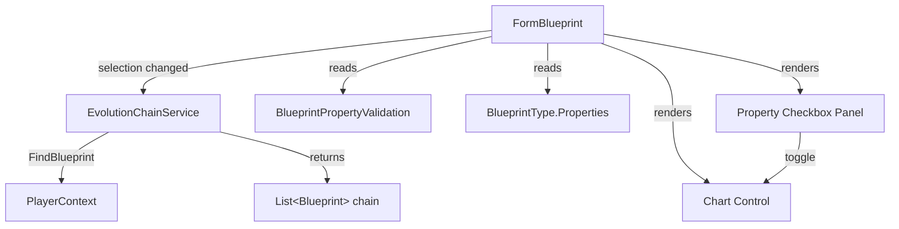

# Design Document: Evolution Graph

## Overview

The Evolution Graph feature adds a new "Evolution Graph" tab to the existing `tabDetailedData` TabControl on `FormBlueprint`. When a blueprint is selected, the system walks the `baseBlueprintUUID` chain backward to the Ev0 ancestor, collects numeric property values at each evolution level, normalizes them as percentages of the Ev0 base value, and plots them on a line chart. Checkboxes let the user toggle individual property lines on/off.

The chart is created dynamically in code-behind (not in the Designer) because it requires a reference to `System.Windows.Forms.DataVisualization` which is best handled programmatically. The tab page itself is also created in code to avoid hand-editing the Designer file for complex changes.

## Architecture

The feature follows the existing layered architecture: a pure-logic service class for chain resolution and data preparation, a thin integration layer in `FormBlueprint` for chart rendering, and the existing `BlueprintViewModel` / `PlayerContext` for data access.



### Key Design Decisions

1. **Pure service class for chain resolution** — `EvolutionChainService` is a static helper with no UI dependencies, making it independently testable. It accepts a `Func<string, Blueprint>` resolver so tests can supply fake data without needing `PlayerContext`.

2. **Chart created in code-behind** — Per steering rules, the `Chart` control from `System.Windows.Forms.DataVisualization.Charting` is instantiated in `FormBlueprint`'s constructor (or a helper method), not in the Designer. The tab page `tabPEvolutionGraph` is also created in code and added to `tabDetailedData.TabPages`.

3. **Series-per-segment rendering** — Since a single `Series` cannot mix `ChartDashStyle.Solid` and `ChartDashStyle.Dash`, each property line is split into multiple series: one per consecutive run of data points (solid) and one per gap between non-consecutive points (dashed). All segments for one property share the same color.

4. **Colorblind-friendly Wong palette** — Colors are assigned from the 8-color Wong palette in a fixed order. If there are more than 8 properties (unlikely), colors wrap around.

5. **Percentage normalization** — All values are displayed as `(value / ev0Value) * 100`. Properties with a zero Ev0 value are excluded to avoid division by zero.

## Components and Interfaces

### EvolutionChainService (new static class)

Location: `OE2EmpireTracker/Services/EvolutionChainService.cs`

```csharp
public static class EvolutionChainService
{
    /// <summary>
    /// Walks baseBlueprintUUID links backward from the given blueprint
    /// to the Ev0 ancestor. Returns the chain sorted by Evolution ascending.
    /// Terminates on missing UUID or circular reference.
    /// </summary>
    /// <param name="start">The blueprint to start from.</param>
    /// <param name="resolver">
    /// Function that resolves a UUID to a Blueprint, e.g. PlayerContext.FindBlueprint.
    /// </param>
    /// <returns>Ordered list of blueprints, Ev0 first.</returns>
    public static List<Blueprint> ResolveChain(
        Blueprint start,
        Func<string, Blueprint> resolver);
}
```

### EvolutionGraphData (new helper class / struct)

Location: `OE2EmpireTracker/Services/EvolutionChainService.cs` (same file, small helper)

```csharp
public class EvolutionGraphData
{
    /// <summary>Property name → list of (evolutionLevel, percentageValue) points.</summary>
    public Dictionary<string, List<(int Evolution, double Percent)>> Series { get; set; }

    /// <summary>True when no numeric properties changed across the chain.</summary>
    public bool NoChanges { get; set; }
}
```

A static method on `EvolutionChainService` builds this:

```csharp
/// <summary>
/// Given a chain and the BlueprintType's Properties array, filters to numeric
/// properties that changed, normalizes to percentages, and returns graph data.
/// </summary>
public static EvolutionGraphData BuildGraphData(
    IReadOnlyList<Blueprint> chain,
    string[] blueprintTypeProperties);
```

### FormBlueprint integration (modifications)

New private fields:
- `TabPage tabPEvolutionGraph` — the new tab page
- `Chart chartEvolution` — the chart control
- `FlowLayoutPanel pnlPropertyCheckboxes` — checkbox panel
- `Label lblNoChanges` — "no property changes" message

New private methods:
- `InitEvolutionGraphTab()` — called from constructor, creates the tab, chart, and checkbox panel
- `RefreshEvolutionGraph()` — called when selection changes or data changes; resolves chain, builds graph data, populates chart and checkboxes
- `ClearEvolutionGraph()` — clears chart series and checkboxes

The `RefreshEvolutionGraph()` method is called from:
- `lvwBlueprints_ItemSelectionChanged` (after `PopulateForm()`)
- `OnBlueprintDataChanged` (when the changed UUID is in the current chain)
- `ClearForm()` calls `ClearEvolutionGraph()`

### Wong Palette Constants

Defined as a `static readonly Color[]` array in `FormBlueprint` or a small helper. The base 8-color Wong palette is extended with 50% lighter tints to provide 16 distinct colorblind-friendly colors:

```csharp
private static readonly Color[] WongPalette = new Color[]
{
    // Base Wong palette (8 colors)
    ColorTranslator.FromHtml("#000000"), // black
    ColorTranslator.FromHtml("#E69F00"), // orange
    ColorTranslator.FromHtml("#56B4E9"), // sky blue
    ColorTranslator.FromHtml("#009E73"), // bluish green
    ColorTranslator.FromHtml("#F0E442"), // yellow
    ColorTranslator.FromHtml("#0072B2"), // blue
    ColorTranslator.FromHtml("#D55E00"), // vermillion
    ColorTranslator.FromHtml("#CC79A7"), // reddish purple
    // 50% lighter tints for properties 9–16
    ColorTranslator.FromHtml("#808080"), // light black (grey)
    ColorTranslator.FromHtml("#F2CF80"), // light orange
    ColorTranslator.FromHtml("#ABD9F4"), // light sky blue
    ColorTranslator.FromHtml("#80CEB9"), // light bluish green
    ColorTranslator.FromHtml("#F7F1A0"), // light yellow
    ColorTranslator.FromHtml("#80B8D8"), // light blue
    ColorTranslator.FromHtml("#EAAF80"), // light vermillion
    ColorTranslator.FromHtml("#E5BCD3"), // light reddish purple
};
```

Colors are assigned in order. The 16-color palette covers any realistic blueprint property count. If more than 16 properties exist (extremely unlikely), colors wrap around.

## Data Models

### Existing models used (no changes needed)

- **Blueprint** — `baseBlueprintUUID` (string) links to predecessor; `Evolution` (int) is the evolution level; `Properties` (PropertyBag) stores key-value property data; `BluePrintType` (string) identifies the type.
- **BlueprintType** — `Properties` (string[]) defines the set of property names for this type.
- **PropertyBag** — `getString(name, default, out value)` retrieves a property value as string; `getDouble(name, default, out value)` retrieves as double.
- **BlueprintPropertyValidation** — `GetPropertyType(propertyName)` returns `PropertyValueType` enum to determine if a property is numeric (Integer, Decimal, Time) or non-numeric (CheckBox, ComboBox, Boolean, Unknown).

### New data structures

**EvolutionGraphData** (described above) — a simple DTO holding the processed series data. Not persisted; computed on demand each time the graph refreshes.

### Property value parsing for Time type

Time properties are stored as strings like `"1d 2h 30m 15s"`. For percentage normalization, these must be converted to a numeric value (total seconds). `EvolutionChainService.BuildGraphData` will parse Time-type properties into total seconds before normalizing. The parsing logic reuses the existing `TIME_PATTERN` regex from `BlueprintPropertyValidation` to validate, then extracts d/h/m/s components.


## Correctness Properties

*A property is a characteristic or behavior that should hold true across all valid executions of a system — essentially, a formal statement about what the system should do. Properties serve as the bridge between human-readable specifications and machine-verifiable correctness guarantees.*

### Property 1: Chain resolution produces a complete, ordered ancestor list

*For any* blueprint with a chain of baseBlueprintUUID links (no missing UUIDs, no cycles), `ResolveChain` shall return a list containing every blueprint in the chain, sorted by `Evolution` ascending (Ev0 first), and the list shall include the start blueprint itself.

**Validates: Requirements 1.1, 1.2**

### Property 2: Graph data contains only numeric properties from the BlueprintType

*For any* evolution chain and BlueprintType, every property key in the `EvolutionGraphData.Series` dictionary shall (a) exist in the BlueprintType's `Properties` array and (b) have a `PropertyValueType` of Integer, Decimal, or Time as determined by `BlueprintPropertyValidation.GetPropertyType`.

**Validates: Requirements 2.1, 2.2, 2.3**

### Property 3: Unchanged properties are excluded and NoChanges flag is correct

*For any* evolution chain, if a numeric property has the same parsed value across all blueprints in the chain, it shall not appear in `EvolutionGraphData.Series`. Furthermore, if no numeric property changed across the chain, `EvolutionGraphData.NoChanges` shall be true and `Series` shall be empty.

**Validates: Requirements 2.4, 2.5**

### Property 4: Percentage normalization formula

*For any* data point in `EvolutionGraphData.Series`, the percentage value shall equal `(parsedValue / ev0ParsedValue) * 100`, where `ev0ParsedValue` is the parsed value of the same property at Evolution 0 in the chain. This implies the Ev0 data point is always 100% for all graphed properties.

**Validates: Requirements 3.1, 3.3**

### Property 5: Segment dash style matches evolution gap classification

*For any* pair of consecutive data points in a property's series, if their evolution levels differ by exactly 1 the connecting segment shall be solid (`ChartDashStyle.Solid`), and if their evolution levels differ by more than 1 the connecting segment shall be dashed (`ChartDashStyle.Dash`).

**Validates: Requirements 5.1, 5.2**

### Property 6: Distinct color assignment per property

*For any* set of up to 16 graphed properties, each property shall be assigned a distinct color from the extended Wong palette (8 base + 8 tints), and no two properties shall share the same color.

**Validates: Requirements 5.3**

## Error Handling

| Scenario | Handling |
|---|---|
| `baseBlueprintUUID` references a non-existent blueprint | Chain terminates at the last resolved blueprint. No error shown — the graph displays whatever data is available. |
| Circular reference in `baseBlueprintUUID` chain | `ResolveChain` tracks visited UUIDs in a `HashSet<string>` and stops when a duplicate is encountered. |
| Ev0 property value is zero | Property is excluded from the graph (avoids division by zero). No error message — the property simply doesn't appear. |
| Ev0 property value is missing/unparseable | Treated as zero → property excluded. |
| No numeric properties changed across chain | `EvolutionGraphData.NoChanges` is set to true. The UI shows a label "No property changes found across the evolution chain." and hides the chart. |
| Blueprint has no BlueprintType or BlueprintType has no Properties | Graph shows the "no changes" message. |
| Time property string is malformed | Parsed as 0 seconds → if at Ev0, property is excluded; otherwise the data point is plotted at 0%. |
| Selected blueprint is Ev0 with no base | Single-point chain. Graph shows flat lines at 100% for all numeric properties that have non-zero values (though these are excluded by the "no change" filter since there's only one point). Effectively shows the "no changes" message. |

## Testing Strategy

### Unit Tests

Unit tests cover specific examples and edge cases:

- **Chain resolution edge cases**: Ev0 blueprint with no base (chain of 1), broken chain (missing UUID mid-chain), circular reference detection, chain with gaps in evolution numbers.
- **Property filtering examples**: Blueprint type with mixed property types (Integer, CheckBox, ComboBox) — verify only Integer/Decimal/Time survive. All properties unchanged — verify NoChanges flag.
- **Normalization edge cases**: Zero base value exclusion, Time property parsing ("1d 2h 30m 15s" → total seconds).
- **Tab integration examples**: Tab exists at correct index, tab text is "Evolution Graph", axis labels and ranges are configured correctly.
- **Checkbox behavior**: All checked by default on populate, uncheck hides series, re-check shows series, checkbox label color matches series color.

### Property-Based Tests

Property-based tests verify universal properties across randomly generated inputs. Use **FsCheck** (NuGet package `FsCheck` + `FsCheck.NUnit`) as the property-based testing library for .NET Framework 4.8.1.

Each property test must:
- Run a minimum of 100 iterations
- Reference its design document property in a comment tag
- Use the format: `// Feature: evolution-graph, Property {number}: {property_text}`

| Property | Test Description | Generator Strategy |
|---|---|---|
| Property 1 | Generate random chains of 1–16 blueprints with valid baseBlueprintUUID links. Verify output is sorted ascending by Evolution and contains all chain members. | Generate list of Blueprint objects with sequential UUIDs and linked baseBlueprintUUID. Randomize Evolution values. |
| Property 2 | Generate random BlueprintType.Properties arrays mixing numeric and non-numeric types. Build graph data and verify all output keys are numeric and in the source array. | Use known property names from BlueprintPropertyValidation to build random Properties arrays. |
| Property 3 | Generate chains where some/all numeric properties are identical. Verify unchanged properties are excluded and NoChanges flag is correct. | Generate chains with controlled property values — some constant, some varying. |
| Property 4 | Generate chains with random numeric property values. Verify each percentage equals `(value / ev0Value) * 100`. | Generate random double values for properties across chain members. |
| Property 5 | Generate chains with gaps (non-consecutive evolution levels). Build segments and verify solid/dashed classification matches gap detection. | Generate sorted evolution level lists with random gaps. |
| Property 6 | Generate random property name lists of size 1–16. Verify all assigned colors are distinct and from the extended Wong palette. | Generate random subsets of known property names. |

### Test Configuration

- Property-based testing library: **FsCheck 2.16.x** with **FsCheck.NUnit** adapter
- Minimum iterations per property: 100 (configured via `[Property(MaxTest = 100)]` attribute)
- Test project: `OE2EmpireTracker.Tests`
- Test location: `OE2EmpireTracker.Tests/Services/EvolutionChainServiceTests.cs` (for properties 1–4) and `OE2EmpireTracker.Tests/Forms/EvolutionGraphRenderingTests.cs` (for properties 5–6)
