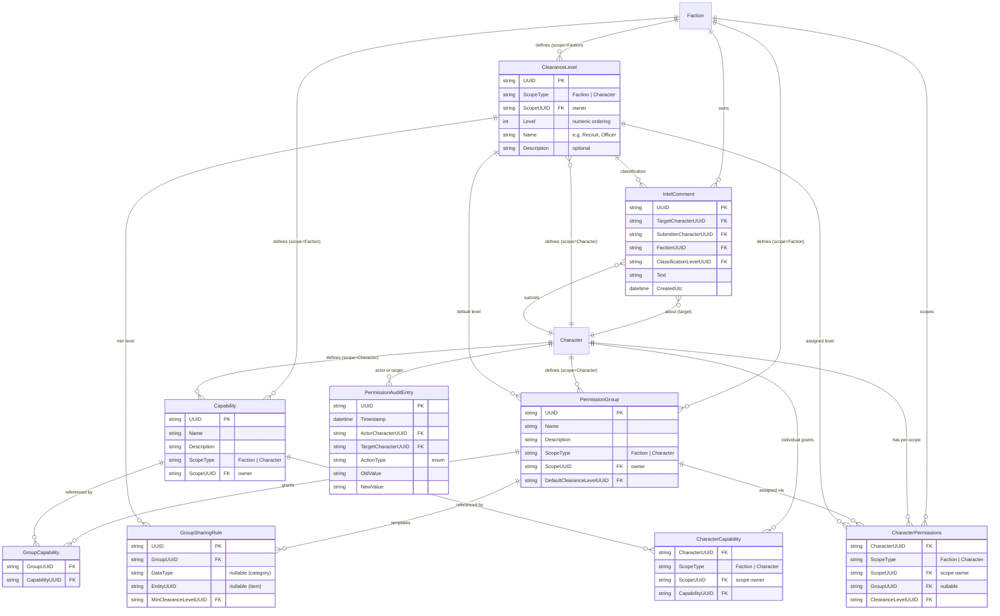

# Faction Server Expanded Permissions — Design

> **Status:** Draft — awaiting requirements iteration before design work begins.

## Overview

This spec extends the base faction server permission model (Requirement 13 of `remote-faction-service`) with concepts from DarkCrusader:

1. **Named Capabilities** — Fine-grained permission strings beyond the three-role hierarchy (includes both action permissions and server behavior opt-ins)
2. **Permission Groups** — Faction or character-scoped roles with inherited permissions and sharing templates
3. **Clearance Levels** — Numeric tiered visibility for sensitive shared data
4. **Intelligence Comments** — Classified notes on external players
5. **Permission Audit Trail** — Append-only log of all permission changes

## Relationship to Base Spec

This spec is ADDITIVE to `remote-faction-service/requirements.md` Requirement 13. The base three-role model (Owner/Leader/Character) remains the foundation. This spec adds layers on top:

```
Owner (all permissions)
  └── Faction Leader (faction management + own data)
       └── Character (read all + edit own)
            + Capabilities (named permissions — actions AND server behaviors)
            + Clearance Level (tiered data visibility)
```

## Data Model

```
Capability (gates what you can DO — operations, actions, and server behavior opt-ins)
  - UUID
  - Name (string, unique within scope)
  - Description
  - ScopeType (enum: Faction, Character)
  - ScopeUUID (FactionUUID or CharacterUUID — who owns/defined this capability)

ClearanceLevel (gates what you can SEE — tiered data visibility)
  - UUID
  - ScopeType (enum: Faction, Character)
  - ScopeUUID (FactionUUID or CharacterUUID — who owns this level definition)
  - Level (int — numeric ordering, higher = more access)
  - Name (string — display name, e.g. "Recruit", "Member", "Officer", "Command", "Leader")
  - Description (string, optional)
  Starting set on creation: 1=Recruit, 2=Member, 3=Officer, 4=Command, 5=Leader
  Owners can wipe and rebuild with any levels/names they want.

PermissionGroup
  - UUID
  - Name
  - Description
  - ScopeType (enum: Faction, Character)
  - ScopeUUID (FactionUUID or CharacterUUID — who owns this group)
  - DefaultClearanceLevelUUID → ClearanceLevel.UUID (assigned to members on join)

GroupCapability (junction: which capabilities a group grants)
  - GroupUUID → PermissionGroup.UUID
  - CapabilityUUID → Capability.UUID

GroupSharingRule (sharing template applied to group members)
  - UUID
  - GroupUUID → PermissionGroup.UUID
  - DataType (nullable — category-level rule)
  - EntityUUID (nullable — item-level rule)
  - MinClearanceLevelUUID → ClearanceLevel.UUID (minimum level to see this data)

CharacterPermissions (per character, per scope — links character to a group + clearance)
  - CharacterUUID → Character.UUID
  - ScopeType (enum: Faction, Character)
  - ScopeUUID (FactionUUID or CharacterUUID — whose group they're in)
  - GroupUUID → PermissionGroup.UUID (nullable — at most one group per scope)
  - ClearanceLevelUUID → ClearanceLevel.UUID (character's assigned clearance)

CharacterCapability (individual capability grants, outside of groups)
  - CharacterUUID → Character.UUID
  - ScopeType (enum: Faction, Character)
  - ScopeUUID (FactionUUID or CharacterUUID — who granted it)
  - CapabilityUUID → Capability.UUID

IntelComment
  - UUID
  - TargetCharacterUUID → Character.UUID (the external character this is about)
  - SubmitterCharacterUUID → Character.UUID
  - FactionUUID → Faction.UUID (which faction's intel this belongs to)
  - ClassificationLevelUUID → ClearanceLevel.UUID (minimum clearance to view)
  - Text
  - CreatedUtc

PermissionAuditEntry (append-only log)
  - UUID
  - Timestamp
  - ActorCharacterUUID → Character.UUID
  - TargetCharacterUUID → Character.UUID
  - ActionType (enum: CapabilityGranted, CapabilityRevoked, GroupAssigned, GroupRemoved, ClearanceChanged)
  - OldValue
  - NewValue
```

## Design Decisions (pending)

Awaiting requirements iteration. Key decisions needed:

1. Storage location — extend existing character/faction entities or separate permission tables?
2. API surface — new endpoints or extend existing ones?
3. Effective permission computation — computed on every request or cached?
4. Sharing template application — eager (copy rules on assignment) or lazy (resolve at query time)?

## Database Schema


