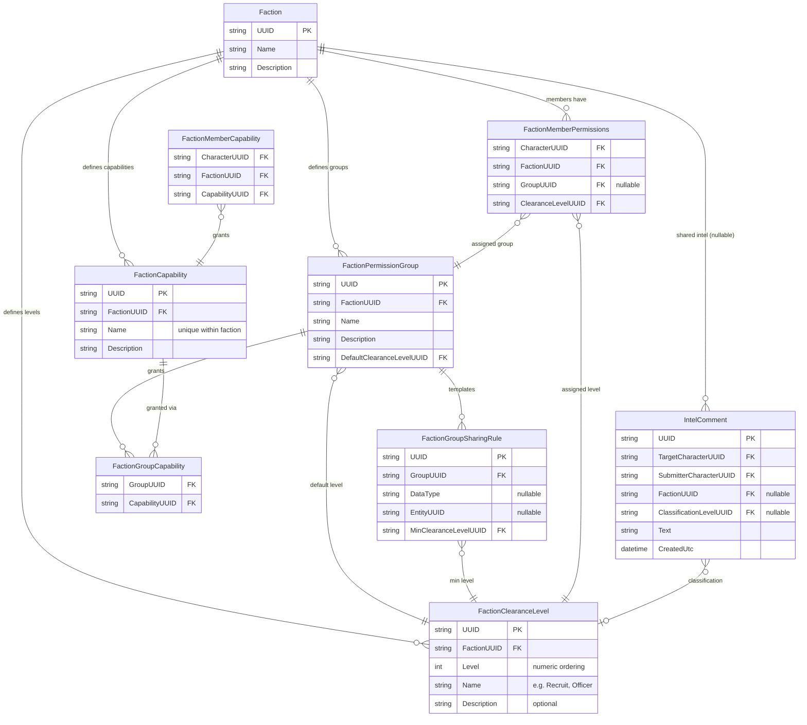
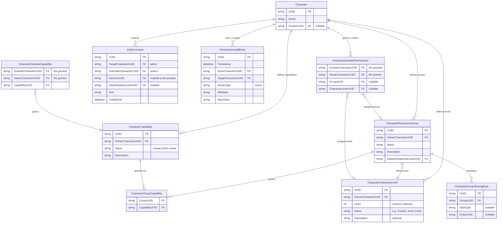

# Faction Server Expanded Permissions — Design

> **Status:** Draft — awaiting requirements iteration before design work begins.

## Overview

This spec extends the base faction server permission model (Requirement 13 of `remote-faction-service`) with concepts from DarkCrusader:

1. **Named Capabilities** — Fine-grained permission strings beyond the three-role hierarchy (includes both action permissions and server behavior opt-ins)
2. **Permission Groups** — Faction or character-scoped roles with inherited permissions and sharing templates
3. **Clearance Levels** — Numeric tiered visibility for sensitive shared data
4. **Intelligence Comments** — Classified notes on external players
5. **Permission Audit Trail** — Append-only log of all permission changes

## Relationship to Base Spec

This spec is ADDITIVE to `remote-faction-service/requirements.md` Requirement 13. The base three-role model (Owner/Leader/Character) remains the foundation. This spec adds layers on top:

```
Owner (all permissions)
  └── Faction Leader (faction management + own data)
       └── Character (read all + edit own)
            + Capabilities (named permissions — actions AND server behaviors)
            + Clearance Level (tiered data visibility)
```


## Data Visibility Flow

Data visibility is a two-layer system. The character controls what leaves their possession; the faction controls who inside the faction sees what was shared.

```
┌─────────────────────────────────────────────────────────────────┐
│ LAYER 1: Character decides WHAT to share (data owner sovereignty)│
│                                                                   │
│ CharacterPermissionGroup + CharacterGroupSharingRule:             │
│   "Share my colonies with Faction X"                             │
│   "Share my build-plans with Faction X"                          │
│   "Don't share my market transactions"                           │
│                                                                   │
│ Granularity: category-level (DataType) or entity-level (UUID)    │
│ The character is the ceiling — no one can see more than shared.  │
└──────────────────────────────┬────────────────────────────────────┘
                               │ shared data flows to faction
                               ▼
┌─────────────────────────────────────────────────────────────────┐
│ LAYER 2: Faction decides WHO sees it (clearance-based distribution)│
│                                                                   │
│ FactionPermissionGroup + FactionGroupSharingRule:                 │
│   "Officers (clearance 3+) can see shared colonies"              │
│   "Command (clearance 4+) can see shared build-plans"            │
│   "Recruits (clearance 1) see nothing beyond blueprints"         │
│                                                                   │
│ MinClearanceLevelUUID gates visibility within the faction.        │
│ The faction cannot exceed what the character shared.              │
└──────────────────────────────┬────────────────────────────────────┘
                               │ filtered by member's clearance
                               ▼
┌─────────────────────────────────────────────────────────────────┐
│ RESULT: Individual member sees intersection of:                  │
│   • What the data owner shared (Layer 1)                         │
│   • What their clearance level permits (Layer 2)                 │
└─────────────────────────────────────────────────────────────────┘
```


### Separate Tables, Different Semantics by Scope

Faction-scoped and character-scoped entities use **separate tables** — not shared tables with polymorphic scope columns. This enables proper referential integrity and eliminates nullable fields that only apply in one scope.

| Scope | Tables | Sharing Rule Semantics | MinClearanceLevelUUID |
|-------|--------|----------------------|----------------------|
| Character | `CharacterPermissionGroup` + `CharacterGroupSharingRule` | "I'm sharing this data outward" | Not present — sharing outward is unconditional to the target |
| Faction | `FactionPermissionGroup` + `FactionGroupSharingRule` | "Members at this clearance can see received data" | Required — gates who inside the faction sees it |

## Data Model

### Shared Entities

```
DataType (fixed enum — maps to storage collections and API endpoints)
  Values:
    - blueprints
    - colonies
    - surveys
    - delivery-routes
    - delivery-plans
    - build-plans
    - ships
    - ship-templates
    - stations
    - asteroids
    - market-listings
    - market-transactions
    - pricing-plans
    - stock-plans
    - stock-profiles
    - supply-chains
  Not user-extensible — adding new types requires code changes.
```


### Faction-Scoped Entities

```
FactionCapability (gates what faction members can DO)
  - UUID
  - FactionUUID → Faction.UUID
  - Name (string, unique within faction)
  - Description

FactionClearanceLevel (gates what faction members can SEE)
  - UUID
  - FactionUUID → Faction.UUID
  - Level (int — numeric ordering, higher = more access)
  - Name (string — display name, e.g. "Recruit", "Member", "Officer", "Command", "Leader")
  - Description (string, optional)
  Starting set on faction creation: 1=Recruit, 2=Member, 3=Officer, 4=Command, 5=Leader
  Faction Leaders can wipe and rebuild with any levels/names they want.

FactionPermissionGroup
  - UUID
  - FactionUUID → Faction.UUID
  - Name
  - Description
  - DefaultClearanceLevelUUID → FactionClearanceLevel.UUID (assigned to members on join)

FactionGroupCapability (junction: which capabilities a faction group grants)
  - GroupUUID → FactionPermissionGroup.UUID
  - CapabilityUUID → FactionCapability.UUID

FactionGroupSharingRule (sharing template — gates WHO in the faction sees received data)
  - UUID
  - GroupUUID → FactionPermissionGroup.UUID
  - DataType (nullable — category-level rule)
  - EntityUUID (nullable — item-level rule)
  - MinClearanceLevelUUID → FactionClearanceLevel.UUID (minimum level to see this data)

FactionMemberPermissions (per member — links character to a group + clearance within faction)
  - CharacterUUID → Character.UUID
  - FactionUUID → Faction.UUID
  - GroupUUID → FactionPermissionGroup.UUID (nullable — at most one group per faction)
  - ClearanceLevelUUID → FactionClearanceLevel.UUID (character's assigned clearance)

FactionMemberCapability (individual capability grants within faction, outside of groups)
  - CharacterUUID → Character.UUID
  - FactionUUID → Faction.UUID
  - CapabilityUUID → FactionCapability.UUID
```


### Character-Scoped Entities

```
CharacterCapability (gates what grantees can DO with the character's data)
  - UUID
  - OwnerCharacterUUID → Character.UUID (who defined this capability)
  - Name (string, unique within owner)
  - Description

CharacterClearanceLevel (tiered visibility for character's shared data)
  - UUID
  - OwnerCharacterUUID → Character.UUID (who defined this level)
  - Level (int — numeric ordering, higher = more access)
  - Name (string — display name, e.g. "Acquaintance", "Trusted", "Inner Circle")
  - Description (string, optional)
  Starting set on first use: 1=Recruit, 2=Member, 3=Officer, 4=Command, 5=Leader
  Owner can wipe and rebuild with any levels/names they want.

CharacterPermissionGroup
  - UUID
  - OwnerCharacterUUID → Character.UUID (who defined this group)
  - Name
  - Description
  - DefaultClearanceLevelUUID → CharacterClearanceLevel.UUID (assigned to grantees on join)

CharacterGroupCapability (junction: which capabilities a character group grants)
  - GroupUUID → CharacterPermissionGroup.UUID
  - CapabilityUUID → CharacterCapability.UUID

CharacterGroupSharingRule (sharing template — defines WHAT the character shares outward)
  - UUID
  - GroupUUID → CharacterPermissionGroup.UUID
  - DataType (nullable — category-level rule)
  - EntityUUID (nullable — item-level rule)
  NOTE: No MinClearanceLevelUUID — sharing outward is unconditional to the target.

CharacterGranteePermissions (per grantee — links another character to a group + clearance)
  - GranteeCharacterUUID → Character.UUID (who is receiving access)
  - OwnerCharacterUUID → Character.UUID (who is granting access)
  - GroupUUID → CharacterPermissionGroup.UUID (nullable — at most one group per granting character)
  - ClearanceLevelUUID → CharacterClearanceLevel.UUID (nullable — grantee's assigned clearance)

CharacterGranteeCapability (individual capability grants, outside of groups)
  - GranteeCharacterUUID → Character.UUID (who is receiving the capability)
  - OwnerCharacterUUID → Character.UUID (who is granting it)
  - CapabilityUUID → CharacterCapability.UUID
```


### Shared Entities (used by both scopes)

```
IntelComment
  - UUID
  - TargetCharacterUUID → Character.UUID (the external character this is about)
  - SubmitterCharacterUUID → Character.UUID (who wrote it)
  - FactionUUID → Faction.UUID (nullable — which faction can see it, null = private to submitter)
  - ClassificationLevelUUID → FactionClearanceLevel.UUID (nullable — minimum clearance to view within faction, null when private)
  - Text
  - CreatedUtc
  Notes:
    - When FactionUUID is null, only the submitter can see the comment (private note).
    - The submitter can share a private comment with their faction by setting FactionUUID.
    - The submitter can remove faction visibility by clearing FactionUUID back to null.
    - ClassificationLevelUUID references FactionClearanceLevel (faction-scoped) because
      intel comments are only visible within a faction context when shared.
    - Open Question 4 RESOLVED: Intel comments are faction-scoped when shared (visible to
      faction members with clearance), private when not shared (visible only to submitter).

PermissionAuditEntry (append-only log)
  - UUID
  - Timestamp
  - ActorCharacterUUID → Character.UUID
  - TargetCharacterUUID → Character.UUID
  - ActionType (enum: CapabilityGranted, CapabilityRevoked, GroupAssigned, GroupRemoved, ClearanceChanged)
  - OldValue
  - NewValue
```


## Design Decisions (pending)

Awaiting requirements iteration. Key decisions needed:

1. Storage location — extend existing character/faction entities or separate permission tables?
2. API surface — new endpoints or extend existing ones?
3. Effective permission computation — computed on every request or cached?
4. Sharing template application — eager (copy rules on assignment) or lazy (resolve at query time)?

## Database Schema

### Faction-Scoped Relationships

Starting from Faction — what a faction owns and how members connect to it:




### Character-Scoped Relationships

Starting from Character — what a character owns and how they grant access to others:


