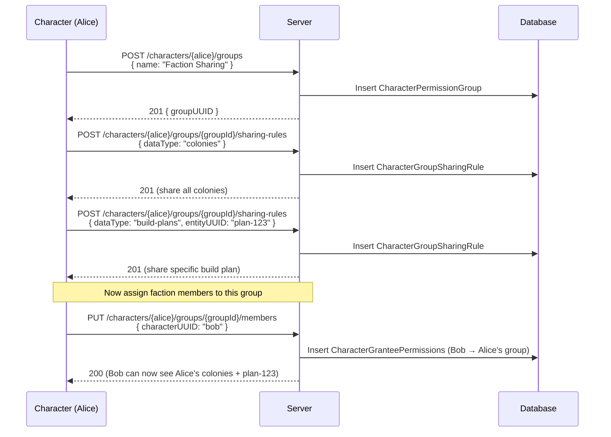
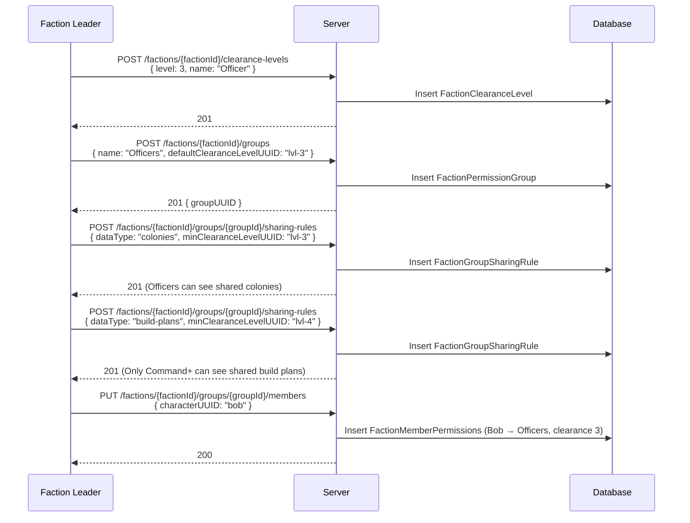
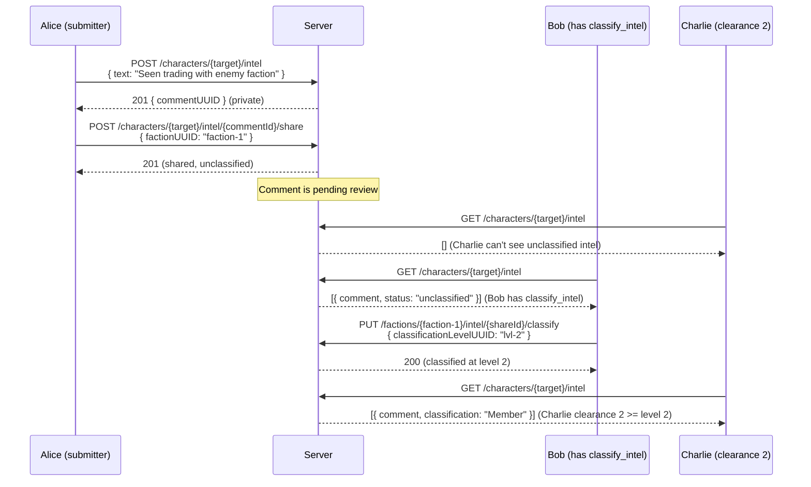
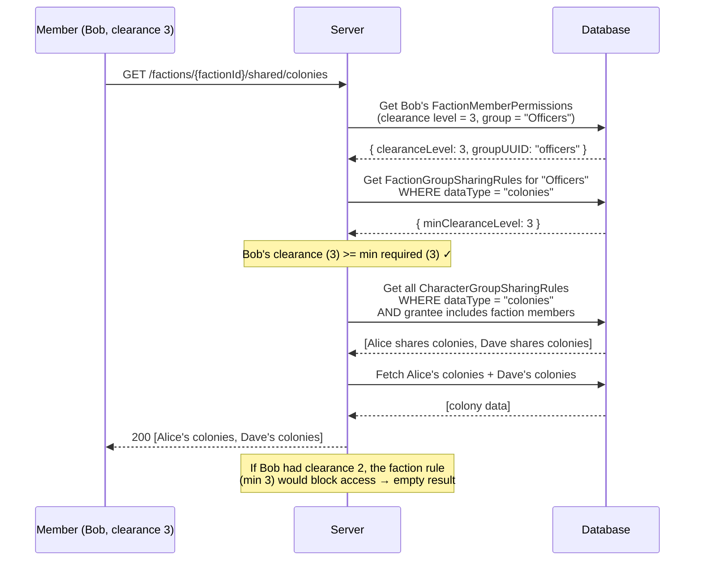
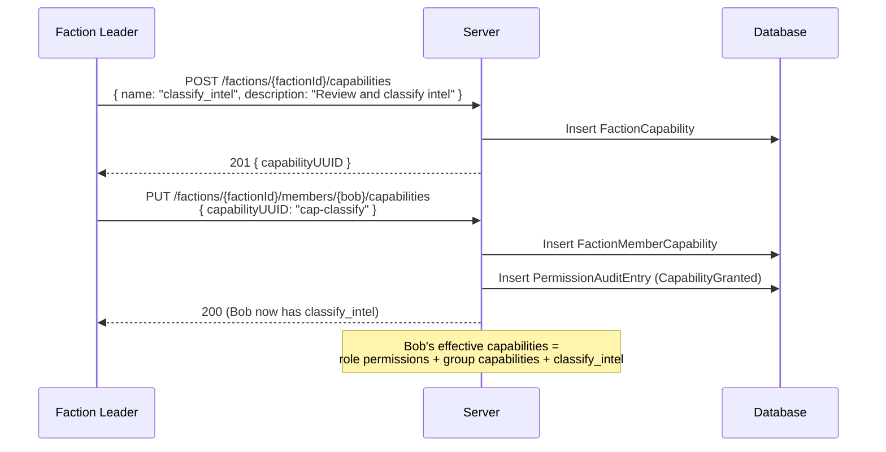
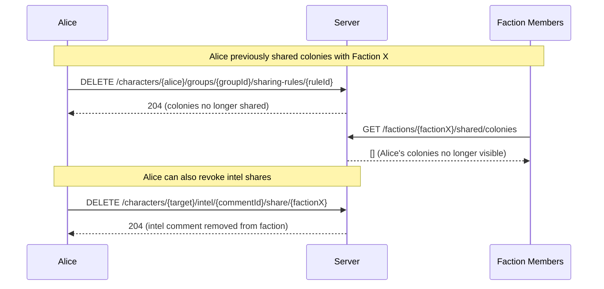
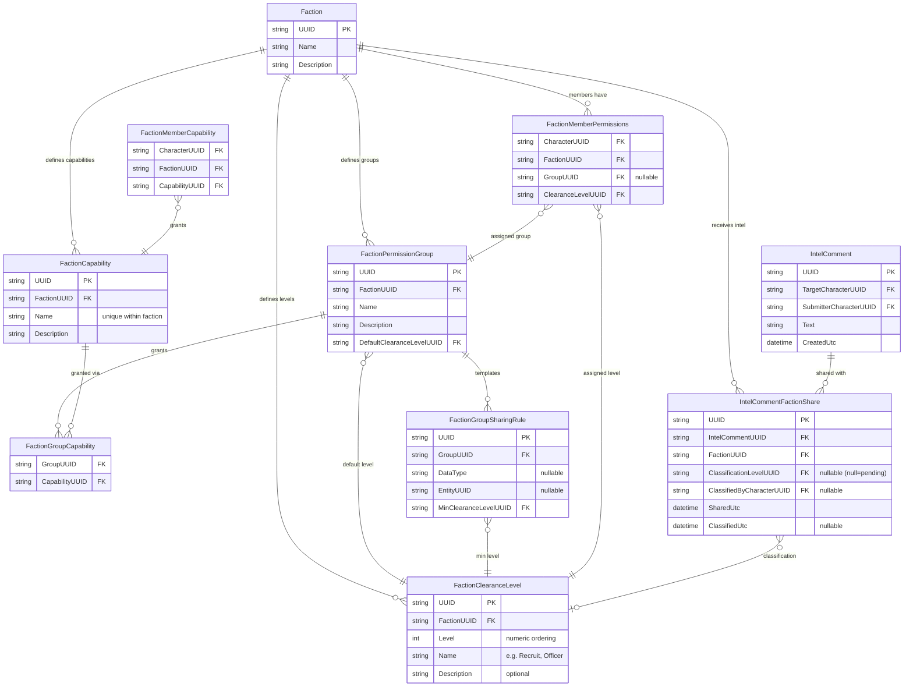
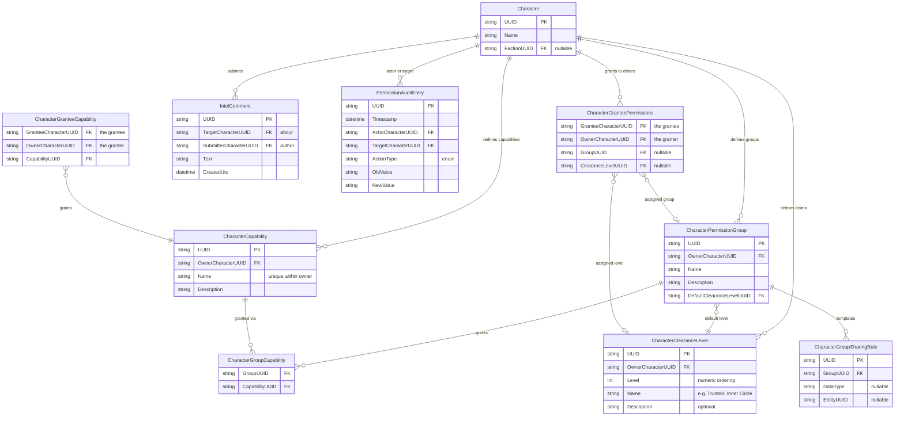

# Faction Server Expanded Permissions — Design

> **Status:** Draft — awaiting requirements iteration before design work begins.

## Overview

This spec extends the base faction server permission model (Requirement 13 of `remote-faction-service`) with concepts from DarkCrusader:

1. **Named Capabilities** — Fine-grained permission strings beyond the three-role hierarchy (includes both action permissions and server behavior opt-ins)
2. **Permission Groups** — Faction or character-scoped roles with inherited permissions and sharing templates
3. **Clearance Levels** — Numeric tiered visibility for sensitive shared data
4. **Intelligence Comments** — Classified notes on external players
5. **Permission Audit Trail** — Append-only log of all permission changes

## Relationship to Base Spec

This spec is ADDITIVE to `remote-faction-service/requirements.md` Requirement 13. The base three-role model (Owner/Leader/Character) remains the foundation. This spec adds layers on top:

```
Owner (all permissions)
  └── Faction Leader (faction management + own data)
       └── Character (read all + edit own)
            + Capabilities (named permissions — actions AND server behaviors)
            + Clearance Level (tiered data visibility)
```


## Data Visibility Flow

Data visibility is a two-layer system. The character controls what leaves their possession; the faction controls who inside the faction sees what was shared.

```
┌─────────────────────────────────────────────────────────────────┐
│ LAYER 1: Character decides WHAT to share (data owner sovereignty)│
│                                                                   │
│ CharacterPermissionGroup + CharacterGroupSharingRule:             │
│   "Share my colonies with Faction X"                             │
│   "Share my build-plans with Faction X"                          │
│   "Don't share my market transactions"                           │
│                                                                   │
│ Granularity: category-level (DataType) or entity-level (UUID)    │
│ The character is the ceiling — no one can see more than shared.  │
└──────────────────────────────┬────────────────────────────────────┘
                               │ shared data flows to faction
                               ▼
┌─────────────────────────────────────────────────────────────────┐
│ LAYER 2: Faction decides WHO sees it (clearance-based distribution)│
│                                                                   │
│ FactionPermissionGroup + FactionGroupSharingRule:                 │
│   "Officers (clearance 3+) can see shared colonies"              │
│   "Command (clearance 4+) can see shared build-plans"            │
│   "Recruits (clearance 1) see nothing beyond blueprints"         │
│                                                                   │
│ MinClearanceLevelUUID gates visibility within the faction.        │
│ The faction cannot exceed what the character shared.              │
└──────────────────────────────┬────────────────────────────────────┘
                               │ filtered by member's clearance
                               ▼
┌─────────────────────────────────────────────────────────────────┐
│ RESULT: Individual member sees intersection of:                  │
│   • What the data owner shared (Layer 1)                         │
│   • What their clearance level permits (Layer 2)                 │
└─────────────────────────────────────────────────────────────────┘
```


### Separate Tables, Different Semantics by Scope

Faction-scoped and character-scoped entities use **separate tables** — not shared tables with polymorphic scope columns. This enables proper referential integrity and eliminates nullable fields that only apply in one scope.

| Scope | Tables | Sharing Rule Semantics | MinClearanceLevelUUID |
|-------|--------|----------------------|----------------------|
| Character | `CharacterPermissionGroup` + `CharacterGroupSharingRule` | "I'm sharing this data outward" | Not present — sharing outward is unconditional to the target |
| Faction | `FactionPermissionGroup` + `FactionGroupSharingRule` | "Members at this clearance can see received data" | Required — gates who inside the faction sees it |

## Data Model

### Shared Entities

```
DataType (fixed enum — maps to storage collections and API endpoints)
  Values:
    - blueprints
    - colonies
    - surveys
    - delivery-routes
    - delivery-plans
    - build-plans
    - ships
    - ship-templates
    - stations
    - asteroids
    - market-listings
    - market-transactions
    - pricing-plans
    - stock-plans
    - stock-profiles
    - supply-chains
  Not user-extensible — adding new types requires code changes.
```


### Faction-Scoped Entities

```
FactionCapability (gates what faction members can DO)
  - UUID
  - FactionUUID → Faction.UUID
  - Name (string, unique within faction)
  - Description

FactionClearanceLevel (gates what faction members can SEE)
  - UUID
  - FactionUUID → Faction.UUID
  - Level (int — numeric ordering, higher = more access)
  - Name (string — display name, e.g. "Recruit", "Member", "Officer", "Command", "Leader")
  - Description (string, optional)
  Starting set on faction creation: 1=Recruit, 2=Member, 3=Officer, 4=Command, 5=Leader
  Faction Leaders can wipe and rebuild with any levels/names they want.

FactionPermissionGroup
  - UUID
  - FactionUUID → Faction.UUID
  - Name
  - Description
  - DefaultClearanceLevelUUID → FactionClearanceLevel.UUID (assigned to members on join)

FactionGroupCapability (junction: which capabilities a faction group grants)
  - GroupUUID → FactionPermissionGroup.UUID
  - CapabilityUUID → FactionCapability.UUID

FactionGroupSharingRule (sharing template — gates WHO in the faction sees received data)
  - UUID
  - GroupUUID → FactionPermissionGroup.UUID
  - DataType (nullable — category-level rule)
  - EntityUUID (nullable — item-level rule)
  - MinClearanceLevelUUID → FactionClearanceLevel.UUID (minimum level to see this data)

FactionMemberPermissions (per member — links character to a group + clearance within faction)
  - CharacterUUID → Character.UUID
  - FactionUUID → Faction.UUID
  - GroupUUID → FactionPermissionGroup.UUID (nullable — at most one group per faction)
  - ClearanceLevelUUID → FactionClearanceLevel.UUID (character's assigned clearance)

FactionMemberCapability (individual capability grants within faction, outside of groups)
  - CharacterUUID → Character.UUID
  - FactionUUID → Faction.UUID
  - CapabilityUUID → FactionCapability.UUID
```


### Character-Scoped Entities

```
CharacterCapability (gates what grantees can DO with the character's data)
  - UUID
  - OwnerCharacterUUID → Character.UUID (who defined this capability)
  - Name (string, unique within owner)
  - Description

CharacterClearanceLevel (tiered visibility for character's shared data)
  - UUID
  - OwnerCharacterUUID → Character.UUID (who defined this level)
  - Level (int — numeric ordering, higher = more access)
  - Name (string — display name, e.g. "Acquaintance", "Trusted", "Inner Circle")
  - Description (string, optional)
  Starting set on first use: 1=Recruit, 2=Member, 3=Officer, 4=Command, 5=Leader
  Owner can wipe and rebuild with any levels/names they want.

CharacterPermissionGroup
  - UUID
  - OwnerCharacterUUID → Character.UUID (who defined this group)
  - Name
  - Description
  - DefaultClearanceLevelUUID → CharacterClearanceLevel.UUID (assigned to grantees on join)

CharacterGroupCapability (junction: which capabilities a character group grants)
  - GroupUUID → CharacterPermissionGroup.UUID
  - CapabilityUUID → CharacterCapability.UUID

CharacterGroupSharingRule (sharing template — defines WHAT the character shares outward)
  - UUID
  - GroupUUID → CharacterPermissionGroup.UUID
  - DataType (nullable — category-level rule)
  - EntityUUID (nullable — item-level rule)
  NOTE: No MinClearanceLevelUUID — sharing outward is unconditional to the target.

CharacterGranteePermissions (per grantee — links another character to a group + clearance)
  - GranteeCharacterUUID → Character.UUID (who is receiving access)
  - OwnerCharacterUUID → Character.UUID (who is granting access)
  - GroupUUID → CharacterPermissionGroup.UUID (nullable — at most one group per granting character)
  - ClearanceLevelUUID → CharacterClearanceLevel.UUID (nullable — grantee's assigned clearance)

CharacterGranteeCapability (individual capability grants, outside of groups)
  - GranteeCharacterUUID → Character.UUID (who is receiving the capability)
  - OwnerCharacterUUID → Character.UUID (who is granting it)
  - CapabilityUUID → CharacterCapability.UUID
```


### Shared Entities (used by both scopes)

```
IntelComment
  - UUID
  - TargetCharacterUUID → Character.UUID (the external character this is about)
  - SubmitterCharacterUUID → Character.UUID (who wrote it)
  - Text
  - CreatedUtc
  Notes:
    - A comment starts private (visible only to submitter).
    - The submitter shares it with factions via IntelCommentFactionShare.
    - The comment text is immutable after creation.

IntelCommentFactionShare (junction: which factions a comment is shared with)
  - UUID
  - IntelCommentUUID → IntelComment.UUID
  - FactionUUID → Faction.UUID
  - ClassificationLevelUUID → FactionClearanceLevel.UUID (nullable — null = pending review/unclassified)
  - ClassifiedByCharacterUUID → Character.UUID (nullable — who classified it, null until reviewed)
  - SharedUtc (when the submitter shared it with this faction)
  - ClassifiedUtc (nullable — when it was classified)
  Notes:
    - When ClassificationLevelUUID is null, the comment is "pending review" — not yet visible
      to general faction members. Only members with the `classify_intel` capability can see
      unclassified comments.
    - A member with `classify_intel` reviews and assigns a classification level.
    - Once classified, the comment becomes visible to faction members whose clearance >= the level.
    - The submitter can remove a faction share (revoke visibility) at any time.
    - A comment can be shared with multiple factions independently (each with its own classification).

PermissionAuditEntry (append-only log)
  - UUID
  - Timestamp
  - ActorCharacterUUID → Character.UUID
  - TargetCharacterUUID → Character.UUID
  - ActionType (enum: CapabilityGranted, CapabilityRevoked, GroupAssigned, GroupRemoved, ClearanceChanged)
  - OldValue
  - NewValue
```


## Design Decisions

1. **Storage location** — Separate tables (already done — FactionCapability, FactionClearanceLevel, etc. are distinct from CharacterCapability, CharacterClearanceLevel, etc.). No polymorphic scope columns.

2. **API surface** — New endpoints. These are new objects that don't fit into the existing faction/character CRUD. Endpoint groups:
   - `/api/v1/factions/{uuid}/capabilities` — CRUD
   - `/api/v1/factions/{uuid}/clearance-levels` — CRUD
   - `/api/v1/factions/{uuid}/groups` — CRUD + member management
   - `/api/v1/factions/{uuid}/members/{charUUID}/clearance` — set clearance
   - `/api/v1/factions/{uuid}/members/{charUUID}/capabilities` — individual grants
   - `/api/v1/factions/{uuid}/intel/{shareId}/classify` — classify intel
   - `/api/v1/characters/{uuid}/capabilities` — CRUD
   - `/api/v1/characters/{uuid}/clearance-levels` — CRUD
   - `/api/v1/characters/{uuid}/groups` — CRUD + grantee management
   - `/api/v1/characters/{uuid}/intel` — CRUD + share/revoke
   - `/api/v1/audit/permissions` — read-only log

3. **Effective permission computation** — Cached with invalidation. The server resolves a member's effective permissions (role + group capabilities + individual capabilities + clearance) at query time by walking the group membership chain, then caches the result. Cache is invalidated when:
   - A group's capabilities or sharing rules change
   - A member's group assignment changes
   - A member's clearance level changes
   - An individual capability is granted or revoked
   - A clearance level definition is modified or deleted

4. **Sharing template application** — Lazy (resolve at query time). When determining what a faction member can see:
   - Look up their `FactionMemberPermissions` → get GroupUUID + ClearanceLevelUUID
   - Read the group's `FactionGroupSharingRules` live (not copied per-member)
   - Compare member's clearance against each rule's MinClearanceLevelUUID
   - Intersect with what characters have actually shared inward (CharacterGroupSharingRules)
   - Cache the computed visibility set; invalidate on any change to the inputs above
   
   No per-member copies of group rules are created. The group rules ARE the source of truth. This keeps the data model simple and eliminates stale-copy risks.

## Sequence Diagrams

### Character Sets Up Sharing Permissions

A character configures what data they share and with whom:



### Faction Leader Sets Up Internal Distribution

A faction leader configures who inside the faction sees what:



### Intel Comment Lifecycle

A character creates intel, shares with factions, faction reviews and classifies:



### Resolving What a Character Can See (Visibility Query)

The server determines what shared data a faction member can access:



### Granting Individual Capabilities

A faction leader grants a specific capability to a member outside of groups:



### Character Revokes Sharing

A character removes data visibility from a faction:



## Database Schema

### Faction-Scoped Relationships

Starting from Faction — what a faction owns and how members connect to it:




### Character-Scoped Relationships

Starting from Character — what a character owns and how they grant access to others:




## UI Forms

### FormPermissionManager (main entry point)

Accessed from **Manage → Permissions** menu. Tab-based layout with context switching between "My Permissions" (character-scoped) and faction-scoped (one tab per faction the character belongs to).

**Tabs:**
- **My Sharing** — character-scoped: what I share outward
- **[Faction Name]** — one tab per faction membership: faction-level permission management (Leader/Owner only see management controls; regular members see their own status)

---

### My Sharing Tab (Character-Scoped)

Manages what the character shares with others.

**Sections:**

1. **Permission Groups** (left panel — list + CRUD)
   - ListView of CharacterPermissionGroups (Name, member count)
   - New / Rename / Delete buttons
   - Selecting a group shows its details in the right panel

2. **Group Detail** (right panel — when a group is selected)
   - **Sharing Rules** grid: DataType dropdown + EntityUUID (optional, with picker) + Add/Remove
   - **Capabilities Granted** grid: list of CharacterCapabilities this group grants + Add/Remove
   - **Members** grid: list of grantees assigned to this group + Add/Remove (character picker)

3. **Clearance Levels** (bottom section)
   - Editable grid: Level (int), Name (text), Description (text)
   - Add / Remove / Reorder buttons
   - Used by CharacterGranteePermissions to assign clearance to grantees

4. **Capabilities** (collapsible section)
   - List of CharacterCapabilities defined by this character
   - New / Rename / Delete

---

### Faction Tab (Faction-Scoped)

Manages internal distribution within the faction. Visible to all members; editing restricted by role/capability.

**Sections:**

1. **Permission Groups** (left panel — list + CRUD, Leader/Owner only for editing)
   - ListView of FactionPermissionGroups (Name, member count, default clearance)
   - New / Rename / Delete buttons (Leader/Owner)
   - Selecting a group shows its details in the right panel

2. **Group Detail** (right panel)
   - **Sharing Rules** grid: DataType dropdown + EntityUUID (optional) + MinClearanceLevel dropdown + Add/Remove
   - **Capabilities Granted** grid: list of FactionCapabilities this group grants + Add/Remove
   - **Members** grid: list of faction members assigned to this group + Add/Remove (member picker)

3. **Clearance Levels** (bottom section, Leader/Owner only for editing)
   - Editable grid: Level (int), Name (text), Description (text)
   - Add / Remove / Reorder buttons
   - Members see their own assigned level (read-only)

4. **Capabilities** (collapsible section, Leader/Owner only for editing)
   - List of FactionCapabilities defined for this faction
   - New / Rename / Delete
   - Individual grant: select a member → grant/revoke specific capabilities

5. **Members Overview** (collapsible section)
   - Grid showing all faction members: Name, Group, Clearance Level, Individual Capabilities count
   - Click a member to edit their group assignment and clearance (Leader/Owner)

---

### FormIntelComments

Accessed from the **ExternalCharacter detail view** (Contacts form) or via **Manage → Intel**.

**Layout:**

1. **Target Character** selector at top (filtered combo)

2. **My Private Notes** section
   - List of IntelComments submitted by the current character where no faction share exists
   - New comment: text box + Submit button
   - Per-comment actions: Share with Faction (dropdown of factions) / Delete

3. **Faction Intel** section (one per faction the character belongs to)
   - **Pending Review** subsection (only visible if character has `classify_intel`)
     - List of unclassified IntelCommentFactionShares for this faction
     - Per-comment: text, submitter name, shared date
     - Classify button → dropdown of FactionClearanceLevels → Confirm
   - **Classified Intel** subsection
     - List of classified comments the character has clearance to see
     - Shows: text, submitter, classification level name, classified by, date
   - Filter by classification level (dropdown)

---

### FormAuditLog

Accessed from **Manage → Permissions → Audit** (or a button on the Faction tab). Owner and Faction Leaders only.

**Layout:**
- Date range filter (from/to)
- Action type filter (dropdown: All, CapabilityGranted, CapabilityRevoked, GroupAssigned, GroupRemoved, ClearanceChanged)
- Actor filter (character picker)
- Target filter (character picker)
- Results grid: Timestamp, Actor, Target, Action, Old Value, New Value
- Pagination (audit logs can be large)

---

### Integration Points with Existing Forms

| Existing Form | Addition |
|---------------|----------|
| FormContacts | "Intel" button on ExternalCharacter detail → opens FormIntelComments for that target |
| FormPreferences (Server tab) | No changes — server connection is already there |
| MainWindow | "Manage → Permissions" menu item → opens FormPermissionManager |
| MainWindow | "Manage → Intel" menu item → opens FormIntelComments (no target pre-selected) |
| MainWindow status bar | Show current clearance level in faction (if connected to server) |


## Form Mockups

### FormPermissionManager — My Sharing Tab

```
┌─────────────────────────────────────────────────────────────────────────────┐
│ Permissions                                                          [X]    │
├─────────────────────────────────────────────────────────────────────────────┤
│ [ My Sharing ] [ Galactic Empire ] [ Rebel Alliance ]                       │
├────────────────────┬────────────────────────────────────────────────────────┤
│ Permission Groups  │ Group: Faction Sharing                                 │
│                    │                                                        │
│ ┌────────────────┐ │ Sharing Rules ─────────────────────────────────────── │
│ │▶Faction Sharing│ │ ┌──────────────┬──────────────────────┬─────────┐    │
│ │  Alliance Share│ │ │ Data Type    │ Entity               │         │    │
│ │  Traders       │ │ ├──────────────┼──────────────────────┼─────────┤    │
│ │                │ │ │ colonies     │ (all)                │ [Remove]│    │
│ │                │ │ │ build-plans  │ Plan: Capital Ships  │ [Remove]│    │
│ │                │ │ │ blueprints   │ (all)                │ [Remove]│    │
│ │                │ │ └──────────────┴──────────────────────┴─────────┘    │
│ │                │ │ [Add Rule]                                            │
│ │                │ │                                                        │
│ │                │ │ Capabilities Granted ──────────────────────────────── │
│ │                │ │ ┌──────────────────────────┬─────────┐               │
│ │                │ │ │ Capability               │         │               │
│ │                │ │ ├──────────────────────────┼─────────┤               │
│ │                │ │ │ view_build_progress      │ [Remove]│               │
│ │                │ │ └──────────────────────────┴─────────┘               │
│ │                │ │ [Add Capability]                                      │
│ │                │ │                                                        │
│ │                │ │ Members ───────────────────────────────────────────── │
│ │                │ │ ┌──────────────────────────┬─────────┐               │
│ │                │ │ │ Character                │         │               │
│ │                │ │ ├──────────────────────────┼─────────┤               │
│ │                │ │ │ Bob                      │ [Remove]│               │
│ │                │ │ │ Charlie                  │ [Remove]│               │
│ │                │ │ └──────────────────────────┴─────────┘               │
│ │                │ │ [Add Member]                                          │
│ └────────────────┘ │                                                        │
│ [New] [Delete]     │                                                        │
├────────────────────┴────────────────────────────────────────────────────────┤
│ Clearance Levels                                                            │
│ ┌───────┬────────────────┬──────────────────────────────┬─────────┐        │
│ │ Level │ Name           │ Description                  │         │        │
│ ├───────┼────────────────┼──────────────────────────────┼─────────┤        │
│ │ 1     │ Acquaintance   │ Basic shared info             │ [Remove]│        │
│ │ 2     │ Trusted        │ Detailed operational data     │ [Remove]│        │
│ │ 3     │ Inner Circle   │ Full access to all shared     │ [Remove]│        │
│ └───────┴────────────────┴──────────────────────────────┴─────────┘        │
│ [Add Level]                                                                 │
├─────────────────────────────────────────────────────────────────────────────┤
│ ▶ Capabilities (3 defined)                                                  │
└─────────────────────────────────────────────────────────────────────────────┘
```

### FormPermissionManager — Faction Tab

```
┌─────────────────────────────────────────────────────────────────────────────┐
│ Permissions                                                          [X]    │
├─────────────────────────────────────────────────────────────────────────────┤
│ [ My Sharing ] [▶Galactic Empire ] [ Rebel Alliance ]                       │
├────────────────────┬────────────────────────────────────────────────────────┤
│ Permission Groups  │ Group: Officers                                        │
│                    │                                                        │
│ ┌────────────────┐ │ Sharing Rules ─────────────────────────────────────── │
│ │  Recruits      │ │ ┌──────────────┬──────────────────┬───────────┬─────┐│
│ │▶Officers       │ │ │ Data Type    │ Entity           │ Min Level │     ││
│ │  Command       │ │ ├──────────────┼──────────────────┼───────────┼─────┤│
│ │  Leadership    │ │ │ colonies     │ (all)            │ Officer   │[Rem]││
│ │                │ │ │ build-plans  │ (all)            │ Command   │[Rem]││
│ │                │ │ │ blueprints   │ (all)            │ Recruit   │[Rem]││
│ │                │ │ │ supply-chains│ (all)            │ Command   │[Rem]││
│ │                │ │ └──────────────┴──────────────────┴───────────┴─────┘│
│ │                │ │ [Add Rule]                                            │
│ │                │ │                                                        │
│ │                │ │ Capabilities Granted ──────────────────────────────── │
│ │                │ │ ┌──────────────────────────┬─────────┐               │
│ │                │ │ │ Capability               │         │               │
│ │                │ │ ├──────────────────────────┼─────────┤               │
│ │                │ │ │ manage_faction_members   │ [Remove]│               │
│ │                │ │ │ classify_intel           │ [Remove]│               │
│ │                │ │ └──────────────────────────┴─────────┘               │
│ │                │ │ [Add Capability]                                      │
│ │                │ │                                                        │
│ │                │ │ Members ───────────────────────────────────────────── │
│ │                │ │ ┌──────────────┬───────────────┬─────────┐           │
│ │                │ │ │ Character    │ Clearance     │         │           │
│ │                │ │ ├──────────────┼───────────────┼─────────┤           │
│ │                │ │ │ Bob          │ Officer (3)   │ [Remove]│           │
│ │                │ │ │ Dave         │ Officer (3)   │ [Remove]│           │
│ │                │ │ └──────────────┴───────────────┴─────────┘           │
│ │                │ │ [Add Member]                                          │
│ └────────────────┘ │                                                        │
│ [New] [Delete]     │                                                        │
├────────────────────┴────────────────────────────────────────────────────────┤
│ Clearance Levels                                                            │
│ ┌───────┬────────────────┬──────────────────────────────┬─────────┐        │
│ │ Level │ Name           │ Description                  │         │        │
│ ├───────┼────────────────┼──────────────────────────────┼─────────┤        │
│ │ 1     │ Recruit        │ New members                   │ [Remove]│        │
│ │ 2     │ Member         │ Established members           │ [Remove]│        │
│ │ 3     │ Officer        │ Trusted operational staff     │ [Remove]│        │
│ │ 4     │ Command        │ Strategic leadership          │ [Remove]│        │
│ │ 5     │ Leader         │ Full faction access            │ [Remove]│        │
│ └───────┴────────────────┴──────────────────────────────┴─────────┘        │
│ [Add Level]                                                                 │
├─────────────────────────────────────────────────────────────────────────────┤
│ ▶ Capabilities (9 defined)  ▶ Members Overview (12 members)                 │
└─────────────────────────────────────────────────────────────────────────────┘
```

### FormIntelComments

```
┌─────────────────────────────────────────────────────────────────────────────┐
│ Intelligence Comments                                                [X]    │
├─────────────────────────────────────────────────────────────────────────────┤
│ Target: [ DarkLord_42          ▼ ]                                          │
├─────────────────────────────────────────────────────────────────────────────┤
│ ┌─ My Private Notes ──────────────────────────────────────────────────────┐ │
│ │                                                                         │ │
│ │ ┌─────────────────────────────────────────────────────────────────────┐ │ │
│ │ │ 2026-05-10: Seen selling rare minerals at Outpost 7. Prices were   │ │ │
│ │ │ 20% below market. Possible dumping or stolen goods.                │ │ │
│ │ │                                    [Share ▼] [Delete]              │ │ │
│ │ └─────────────────────────────────────────────────────────────────────┘ │ │
│ │ ┌─────────────────────────────────────────────────────────────────────┐ │ │
│ │ │ 2026-05-08: Approached me about joining their faction. Declined.   │ │ │
│ │ │                                    [Share ▼] [Delete]              │ │ │
│ │ └─────────────────────────────────────────────────────────────────────┘ │ │
│ │                                                                         │ │
│ │ New: [                                                        ] [Add]   │ │
│ └─────────────────────────────────────────────────────────────────────────┘ │
│                                                                             │
│ ┌─ Galactic Empire Intel ─────────────────────────────────────────────────┐ │
│ │                                                                         │ │
│ │  ┌─ Pending Review (classify_intel) ──────────────────────────────────┐ │ │
│ │  │ 2026-05-12 by Alice: "Confirmed alliance with Shadow Syndicate"   │ │ │
│ │  │                              Classify: [ Officer (3) ▼ ] [Confirm]│ │ │
│ │  │                                                                    │ │ │
│ │  │ 2026-05-11 by Eve: "Spotted mining in Sector 7G"                  │ │ │
│ │  │                              Classify: [ Recruit (1) ▼ ] [Confirm]│ │ │
│ │  └────────────────────────────────────────────────────────────────────┘ │ │
│ │                                                                         │ │
│ │  ┌─ Classified Intel ─────────────────────────────────────────────────┐ │ │
│ │  │ Filter: [ All Levels ▼ ]                                           │ │ │
│ │  │                                                                    │ │ │
│ │  │ [Officer] 2026-05-09 by Bob (classified by Dave):                  │ │ │
│ │  │   "Known to run courier missions for enemy faction leadership"     │ │ │
│ │  │                                                                    │ │ │
│ │  │ [Recruit] 2026-05-07 by Charlie (classified by Bob):               │ │ │
│ │  │   "Trades at Station Alpha regularly, usually on Tuesdays"         │ │ │
│ │  └────────────────────────────────────────────────────────────────────┘ │ │
│ └─────────────────────────────────────────────────────────────────────────┘ │
└─────────────────────────────────────────────────────────────────────────────┘
```

### FormAuditLog

```
┌─────────────────────────────────────────────────────────────────────────────┐
│ Permission Audit Log                                                 [X]    │
├─────────────────────────────────────────────────────────────────────────────┤
│ From: [2026-05-01] To: [2026-05-14]  Action: [All            ▼]            │
│ Actor: [              ▼]  Target: [              ▼]  [Search]               │
├─────────────────────────────────────────────────────────────────────────────┤
│ ┌───────────────────┬─────────┬─────────┬───────────────────┬─────┬──────┐ │
│ │ Timestamp         │ Actor   │ Target  │ Action            │ Old │ New  │ │
│ ├───────────────────┼─────────┼─────────┼───────────────────┼─────┼──────┤ │
│ │ 2026-05-14 09:32  │ Leader  │ Bob     │ ClearanceChanged  │ 2   │ 3    │ │
│ │ 2026-05-14 09:30  │ Leader  │ Bob     │ GroupAssigned     │ —   │ Off… │ │
│ │ 2026-05-13 18:15  │ Leader  │ Eve     │ CapabilityGranted │ —   │ cla… │ │
│ │ 2026-05-13 14:02  │ Owner   │ Leader  │ CapabilityGranted │ —   │ man… │ │
│ │ 2026-05-12 11:45  │ Leader  │ Charlie │ GroupRemoved      │ Rec…│ —    │ │
│ │ 2026-05-12 11:44  │ Leader  │ Charlie │ GroupAssigned     │ —   │ Mem… │ │
│ └───────────────────┴─────────┴─────────┴───────────────────┴─────┴──────┘ │
│                                                                             │
│ Showing 1-6 of 42                              [◀ Prev] [Next ▶]           │
└─────────────────────────────────────────────────────────────────────────────┘
```
