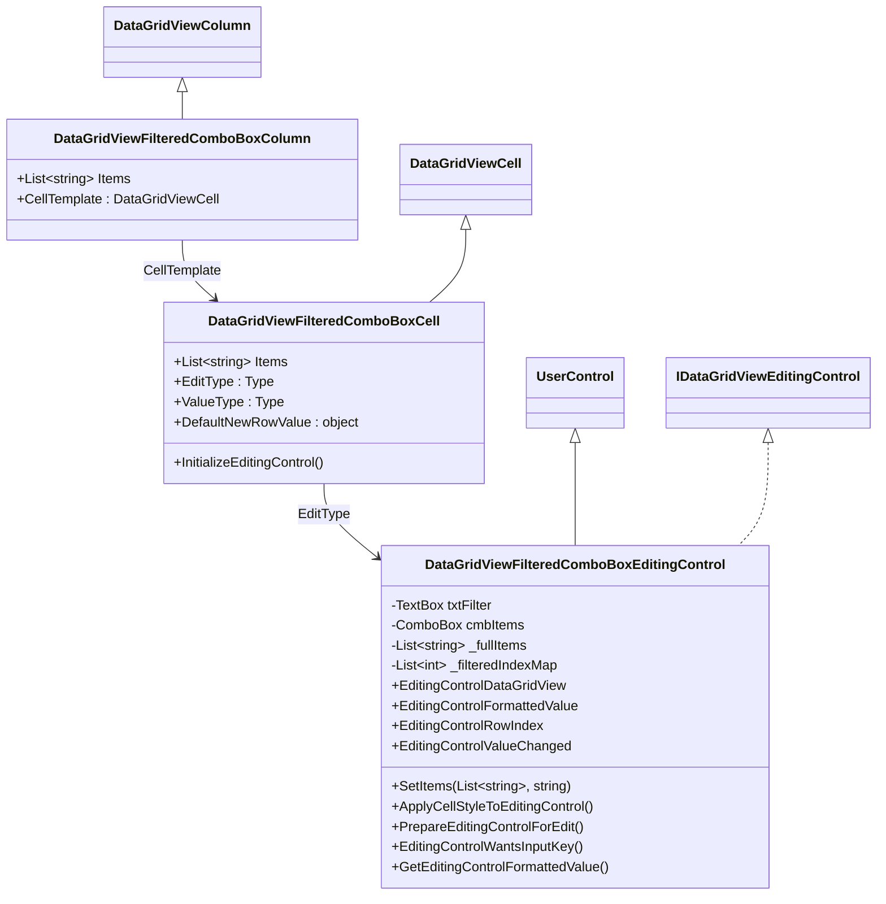
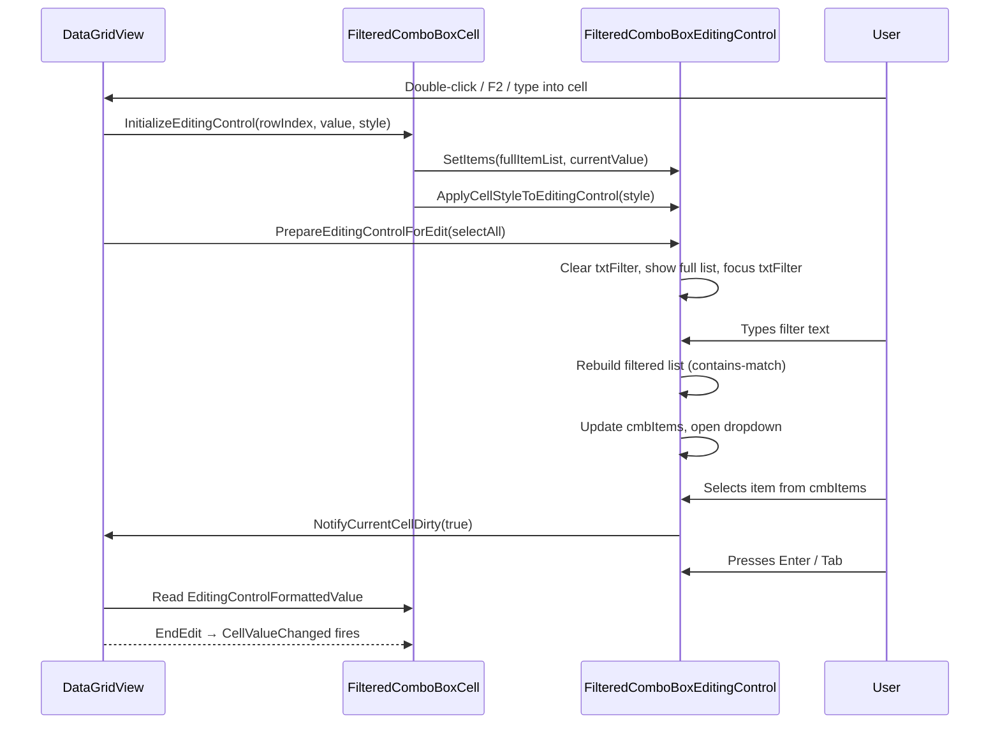
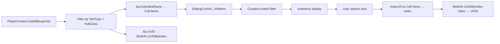

# Design Document: Filtered Combo Column

## Overview

This design describes a reusable `DataGridViewFilteredComboBoxColumn` that embeds a filter TextBox + ComboBox pair as an inline cell editor within a DataGridView. The control follows the standard DataGridView column/cell/editing-control triad pattern established by `DataGridViewValidatedTextBoxColumn` in this project.

The editing control is a `UserControl` implementing `IDataGridViewEditingControl`. When a cell enters edit mode, the user sees a TextBox (left) and ComboBox (right) arranged horizontally. Typing in the TextBox filters the ComboBox items using case-insensitive substring matching (`String.IndexOf` with `OrdinalIgnoreCase`). Items are plain strings; UUIDs are tracked in a parallel list on the row's `Tag`, following the project's established combo cell pattern.

The first consumer is `FormShipTemplate`'s component slot grid, replacing the current `DataGridViewComboBoxColumn`/`DataGridViewComboBoxCell` that has no filtering capability.

## Architecture

The control consists of three classes in `OE2EmpireTracker.Controls`, mirroring the pattern from `DataGridViewValidatedTextBoxColumn`:

```
DataGridViewFilteredComboBoxColumn : DataGridViewColumn
    └── CellTemplate: DataGridViewFilteredComboBoxCell

DataGridViewFilteredComboBoxCell : DataGridViewCell
    └── EditType: DataGridViewFilteredComboBoxEditingControl

DataGridViewFilteredComboBoxEditingControl : UserControl, IDataGridViewEditingControl
    ├── TextBox txtFilter  (left, ~35% width)
    └── ComboBox cmbItems  (right, ~65% width)
```




### Lifecycle



## Components and Interfaces

### DataGridViewFilteredComboBoxColumn

Extends `DataGridViewColumn`. Provides column-level configuration.

| Member | Type | Description |
|--------|------|-------------|
| `Items` | `List<string>` | Column-level default item list. Used when a cell has no per-cell override. |
| `CellTemplate` | `DataGridViewCell` | Must be `DataGridViewFilteredComboBoxCell`. Validated in setter. |
| Constructor | | Calls `base(new DataGridViewFilteredComboBoxCell())`. |

### DataGridViewFilteredComboBoxCell

Extends `DataGridViewCell`. Stores per-cell item list and launches the editing control.

| Member | Type | Description |
|--------|------|-------------|
| `Items` | `List<string>` | Per-cell item list. When non-null, overrides the column-level list. |
| `EditType` | `Type` | Returns `typeof(DataGridViewFilteredComboBoxEditingControl)`. |
| `ValueType` | `Type` | Returns `typeof(string)`. |
| `DefaultNewRowValue` | `object` | Returns `string.Empty`. |
| `InitializeEditingControl(...)` | `void` | Resolves the effective item list (cell-level ?? column-level), calls `SetItems()` on the editor with the current value. |
| `Clone()` | `object` | Deep-copies `Items` list to the cloned cell. |
| `Paint(...)` | `void` | Paints the cell value as text (no dropdown chrome). |

### DataGridViewFilteredComboBoxEditingControl

A `UserControl` implementing `IDataGridViewEditingControl`. Contains `txtFilter` (TextBox) and `cmbItems` (ComboBox, DropDownList style).

**Key fields:**

| Field | Type | Description |
|-------|------|-------------|
| `_fullItems` | `List<string>` | Complete unfiltered item list for the current cell. |
| `_filteredIndexMap` | `List<int>` | Maps each cmbItems index → index in `_fullItems`. Enables UUID resolution by the consuming form. |
| `_dataGridView` | `DataGridView` | The hosting grid (IDataGridViewEditingControl contract). |
| `_valueChanged` | `bool` | Dirty flag (IDataGridViewEditingControl contract). |
| `_rowIndex` | `int` | Current row (IDataGridViewEditingControl contract). |

**Key methods:**

| Method | Description |
|--------|-------------|
| `SetItems(List<string> items, string currentValue)` | Stores `_fullItems`, populates cmbItems with full list, selects `currentValue` if present. |
| `RebuildFilteredList()` | Called on `txtFilter.TextChanged`. Filters `_fullItems` using contains-match, rebuilds `cmbItems.Items` and `_filteredIndexMap`, opens dropdown. |
| `ApplyCellStyleToEditingControl(style)` | Applies Font and ForeColor to both txtFilter and cmbItems. |
| `PrepareEditingControlForEdit(selectAll)` | Clears txtFilter, shows full list, focuses txtFilter. |
| `EditingControlWantsInputKey(keys, dgvWants)` | Returns `true` for alphanumeric, arrows, Enter, Escape, Tab, Delete, Back. |
| `GetEditingControlFormattedValue(context)` | Returns `cmbItems.SelectedItem?.ToString() ?? string.Empty`. |

**IDataGridViewEditingControl properties:**

| Property | Implementation |
|----------|---------------|
| `EditingControlDataGridView` | Get/set `_dataGridView`. |
| `EditingControlFormattedValue` | Get: selected item string. Set: select matching item in cmbItems. |
| `EditingControlRowIndex` | Get/set `_rowIndex`. |
| `EditingControlValueChanged` | Get/set `_valueChanged`. |
| `EditingPanelCursor` | Returns `Cursors.IBeam`. |
| `RepositionEditingControlOnValueChange` | Returns `false`. |

### Index Correspondence for UUID Resolution

The `_filteredIndexMap` is the key mechanism for UUID resolution. When the user selects item at position `i` in the filtered ComboBox:

1. `_filteredIndexMap[i]` gives the index in `_fullItems`
2. The consuming form uses that same index to look up the UUID in the parallel `UUIDByIndex` list on the row Tag

The consuming form resolves the UUID like this:
```csharp
// In CellValueChanged handler:
string selectedName = cell.Value?.ToString();
int fullIndex = cell.Items.IndexOf(selectedName);  // index in full list
string uuid = slotInfo.UUIDByIndex[fullIndex];      // parallel UUID lookup
```

This is simpler than exposing `_filteredIndexMap` externally — the form just does `IndexOf` on the cell's `Items` list, which is the full list. The `_filteredIndexMap` is only used internally by the editing control to maintain correct dropdown behavior.

## Data Models

No new data models are introduced. The control operates on plain `List<string>` items.

### Existing Models Used

| Model | Role |
|-------|------|
| `SlotInfo` (private class in FormShipTemplate) | Stores `SlotType`, `SlotIndex`, `UUIDByIndex` on each row's `Tag`. No changes needed. |
| `Blueprint.ExtendedName` | Provides the display strings for the item lists. |

### Data Flow



### File Changes

| File | Action | Notes |
|------|--------|-------|
| `Controls/DataGridViewFilteredComboBoxColumn.cs` | Replace | Remove existing stub. New file contains Column + Cell + EditingControl classes. |
| `Controls/DataGridViewFilteredComboBoxColumn.Designer.cs` | Delete | No longer a UserControl; no Designer needed. |
| `Controls/DataGridViewFilteredComboBoxColumn.resx` | Delete | No longer a UserControl; no resx needed. |
| `Forms/ShipTemplate/FormShipTemplate.cs` | Modify | Change `PopulateSlotGrid` to use `DataGridViewFilteredComboBoxCell` instead of `DataGridViewComboBoxCell`. |
| `Forms/ShipTemplate/FormShipTemplate.Designer.cs` | Modify | Change `colComponent` from `DataGridViewComboBoxColumn` to `DataGridViewFilteredComboBoxColumn`. |


## Correctness Properties

*A property is a characteristic or behavior that should hold true across all valid executions of a system — essentially, a formal statement about what the system should do. Properties serve as the bridge between human-readable specifications and machine-verifiable correctness guarantees.*

### Property 1: Contains-match filtering returns exactly the matching items

*For any* list of strings (the full item list) and *for any* filter string, the filtered result should contain exactly those items from the full list where `item.IndexOf(filter, StringComparison.OrdinalIgnoreCase) >= 0`, and no others. When the filter is empty, the filtered list should equal the full list. The filter must be case-insensitive — filtering with "abc" and "ABC" should produce identical results.

**Validates: Requirements 3.1, 3.2, 3.3**

### Property 2: Index correspondence preserved after filtering

*For any* list of strings and *for any* filter string, each item at position `i` in the filtered list should map back to the correct index `j` in the full list such that `fullList[j] == filteredList[i]`. This ensures the consuming form can resolve the selected item's position back to the parallel UUID list via `fullList.IndexOf(selectedItem)`.

**Validates: Requirements 5.4, 7.3**

### Property 3: Selection sets EditingControlFormattedValue

*For any* non-empty list of strings loaded into the editing control, selecting any item at index `i` in the ComboBox should cause `GetEditingControlFormattedValue` to return that exact string. When no item is selected, it should return `string.Empty`.

**Validates: Requirements 4.1, 6.3**

### Property 4: Cell items override column items

*For any* column-level item list and *for any* cell-level item list (including null), the effective item list used during `InitializeEditingControl` should be the cell-level list when non-null, and the column-level list otherwise.

**Validates: Requirements 5.2, 9.3**

### Property 5: Input key claiming

*For any* key from the set {A-Z, 0-9, Left, Right, Up, Down, Enter, Escape, Tab, Delete, Back}, `EditingControlWantsInputKey` should return `true`. For modifier-only keys or keys outside this set (e.g., F1-F12), the method should defer to the grid's preference.

**Validates: Requirements 4.5**

### Property 6: Style propagation to child controls

*For any* `DataGridViewCellStyle` with a given Font and ForeColor, calling `ApplyCellStyleToEditingControl` should set both the TextBox's and ComboBox's `Font` and `ForeColor` to match the style's values.

**Validates: Requirements 6.2**

## Error Handling

| Scenario | Handling | Requirement |
|----------|----------|-------------|
| `Items` is null or empty | EditingControl shows empty ComboBox. User can press Escape to cancel. No exception thrown. | 8.1 |
| Cell value not in item list | `Paint()` renders the value as-is. `InitializeEditingControl` does not select any item in the ComboBox. No exception. | 8.2 |
| DataError on the column | Grid's `DataError` handler logs via NLog and sets `e.ThrowException = false`. This is wired by the consuming form, not the control itself. | 8.3 |
| Filter produces zero matches | ComboBox shows empty list. User can clear the filter or press Escape. No exception. | 8.1 (implied) |
| Duplicate item strings | Supported. `IndexOf` returns the first match, which corresponds to the first UUID in the parallel list. This matches the existing `DataGridViewComboBoxCell` behavior. | — |

## Testing Strategy

### Property-Based Tests (FsCheck + NUnit)

Use **FsCheck** (NuGet: `FsCheck` + `FsCheck.NUnit`) as the property-based testing library. FsCheck integrates with NUnit via the `[FsCheck.NUnit.Property]` attribute.

Each property test must:
- Run a minimum of 100 iterations (FsCheck default is 100, which satisfies this)
- Reference the design property in a comment tag
- Use the format: `// Feature: filtered-combo-column, Property {N}: {title}`

Property tests target the filtering logic and index mapping, which can be tested without a hosted DataGridView by extracting the filter logic into a testable static method or by directly manipulating the editing control's public API.

| Test | Property | What it validates |
|------|----------|-------------------|
| `ContainsMatchFiltering_ReturnsExactMatches` | Property 1 | Generate random string lists + random filter. Verify filtered output matches manual contains-match. |
| `IndexCorrespondence_PreservedAfterFiltering` | Property 2 | Generate random string lists + random filter. Verify each filtered item maps to correct full-list index. |
| `Selection_SetsFormattedValue` | Property 3 | Generate random string list, select random item, verify `GetEditingControlFormattedValue` returns it. |
| `CellItems_OverrideColumnItems` | Property 4 | Generate two random string lists. Set column items and cell items. Verify effective list is cell items. |
| `InputKeyClaiming_CorrectForExpectedKeys` | Property 5 | Generate random keys from expected set. Verify `EditingControlWantsInputKey` returns true. |
| `StylePropagation_AppliesToBothControls` | Property 6 | Generate random Font name/size and Color. Apply style. Verify both child controls match. |

### Unit Tests (NUnit)

Unit tests cover specific examples, edge cases, and structural requirements that don't benefit from randomized input.

| Test | What it validates |
|------|-------------------|
| `Column_CellTemplate_IsFilteredComboBoxCell` | Req 1.1 |
| `Cell_EditType_IsEditingControl` | Req 1.2 |
| `Cell_ValueType_IsString` | Req 1.3 |
| `Cell_DefaultNewRowValue_IsEmptyString` | Req 1.4 |
| `EditingControl_ImplementsIDataGridViewEditingControl` | Req 2.1 |
| `EditingControl_ContainsTextBoxAndComboBox` | Req 2.2 |
| `EditingControl_RepositionOnValueChange_ReturnsFalse` | Req 6.5 |
| `EditingControl_EditingPanelCursor_IsIBeam` | Req 6.6 |
| `EditingControl_EmptyItems_ShowsEmptyCombo` | Req 8.1 |
| `EditingControl_NullItems_ShowsEmptyCombo` | Req 8.1 |
| `EditingControl_NoSelection_ReturnsEmptyString` | Req 6.3 edge case |
| `PrepareEditingControlForEdit_ClearsFilterAndShowsFullList` | Req 6.4 |

### Test Organization

- Property tests: `OE2EmpireTracker.Tests/Controls/FilteredComboColumnPropertyTests.cs`
- Unit tests: `OE2EmpireTracker.Tests/Controls/FilteredComboColumnTests.cs`

### Testing the Filter Logic

To make the core filtering logic testable without requiring a full DataGridView hosting context, the `RebuildFilteredList` logic should be extractable as a static/internal method:

```csharp
internal static (List<string> filtered, List<int> indexMap) ApplyFilter(
    List<string> fullItems, string filter)
```

This method takes the full item list and filter string, returns the filtered items and their index mapping. Property tests 1 and 2 target this method directly. The editing control calls this method internally during `txtFilter.TextChanged`.
