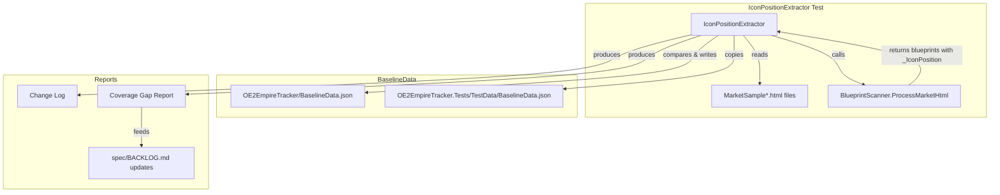

# Design Document: Icon Position Refresh

## Overview

This feature adds a repeatable `IconPositionExtractor` test utility that parses all MarketSample HTML files, extracts icon positions, compares them against BaselineData.json, and automatically updates both copies of BaselineData. It also splits the single `Flatpacks/CommodityFactory` BlueprintType into 14 per-industry entries, adds OreHopper as a new ship component type, and updates all code that references the old CommodityFactory constant.

## Architecture



The `IconPositionExtractor` is an NUnit test fixture. It reuses the existing `BlueprintScanner.ProcessMarketHtml()` to parse HTML, then extracts the `_IconPosition` property that the scanner already stores on each parsed blueprint. It compares these against `EmpireContext.blueprintTypeList` and writes updates directly to both BaselineData.json files.

## Components and Interfaces

### IconPositionExtractor (New)

**Location:** `OE2EmpireTracker.Tests/Services/IconPositionExtractorTests.cs`

```csharp
[TestFixture]
public class IconPositionExtractorTests
{
    // Main extraction + update test — run on demand
    [Test]
    public void ExtractAndUpdateIconPositions()

    // Helpers
    private List<ExtractedIcon> ExtractIconsFromAllSamples()
    private void CompareAndUpdateBaselineData(List<ExtractedIcon> extracted)
    private void WriteBothBaselineFiles(JObject baselineRoot)
    private void ProduceCoverageGapReport(List<ExtractedIcon> extracted)
}

public class ExtractedIcon
{
    public string BlueprintName { get; set; }
    public string IconPosition { get; set; }
    public string SourceFile { get; set; }
    public string ResolvedTypeId { get; set; } // null if unknown
}
```

Design decisions:
- Implemented as a test fixture, not a standalone tool — runs via vstest.console
- Reuses `BlueprintScanner.ProcessMarketHtml()` rather than duplicating HTML parsing
- Reads `_IconPosition` property that the scanner already extracts from icon CSS
- Writes BaselineData.json using Newtonsoft.Json JObject manipulation to preserve existing structure
- Logs all changes via `TestContext.WriteLine` for visibility in test output

### BlueprintTypes Constants Changes

**Location:** `OE2EmpireTracker/Constants/BlueprintTypes.cs`

```csharp
public static class BlueprintTypes
{
    // Existing constants unchanged
    public const string MiningRig = "Flatpacks/MiningRig";
    public const string Refinery = "Flatpacks/Refinery";
    public const string ResearchLaboratory = "Flatpacks/ResearchLaboratory";
    public const string Manufactory = "Flatpacks/Manufactory";

    // CommodityFactory: single constant replaced by prefix
    public const string CommodityFactoryPrefix = "Flatpacks/CommodityFactory/";

    // New type
    public const string OreHopper = "OreHopper";
}

public static class BlueprintTypeExtensions
{
    public static bool IsFlatpack(this string blueprintType) { /* existing */ }

    /// <summary>
    /// Returns true if the blueprint type is any commodity factory variant.
    /// </summary>
    public static bool IsCommodityFactory(this string blueprintType)
    {
        return !string.IsNullOrEmpty(blueprintType) &&
               blueprintType.StartsWith(BlueprintTypes.CommodityFactoryPrefix,
                   StringComparison.OrdinalIgnoreCase);
    }
}
```

Design decisions:
- `CommodityFactoryPrefix` replaces the old `CommodityFactory` constant
- `IsCommodityFactory()` extension method mirrors the existing `IsFlatpack()` pattern
- All code that did `== BlueprintTypes.CommodityFactory` switches to `.IsCommodityFactory()`

### Code Locations Requiring CommodityFactory Update

| File | Current Check | New Check |
|------|--------------|-----------|
| `ColonyParser.cs` | `bp.BluePrintType == BlueprintTypes.CommodityFactory` | `bp.BluePrintType.IsCommodityFactory()` |
| `Colony.cs` (ProcessCommodityFactory) | `flatpackBp.BluePrintType == BlueprintTypes.CommodityFactory` | `flatpackBp.BluePrintType.IsCommodityFactory()` |
| `ColonyStatusCalculator.cs` | `flatpackBp.BluePrintType == BlueprintTypes.CommodityFactory` | `flatpackBp.BluePrintType.IsCommodityFactory()` |
| `ColonyStructure.cs` (form) | checks for CommodityFactory type | `.IsCommodityFactory()` |
| `ColonyActivityCollector.cs` | CommodityFactory check | `.IsCommodityFactory()` |
| `ColonyInactivityCollector.cs` | CommodityFactory check | `.IsCommodityFactory()` |
| `DeliveryPlanViewModel.cs` | CommodityFactory check | `.IsCommodityFactory()` |

### BaselineData Changes

**Per-industry BlueprintType entries:**

The single `Flatpacks/CommodityFactory` entry is replaced by 14 entries — one per `CommodityIndustryEnum` value (excluding None). The `CommodityIndustryEnum` is the master list; all 14 entries are always created in BaselineData even if no MarketSample HTML exists for that industry yet. Entries without HTML coverage have `IconPosition: null`.

```json
{
    "Id": "Flatpacks/CommodityFactory/Agridome",
    "Name": "Agridome Flatpack",
    "Universal": true,
    "Properties": ["Manufacture Run Time", "Mass", "Cargo Volume Size", ...],
    "ResearchableProperties": [],
    "IconPosition": "-Xpx -Ypx",
    "OutputItemType": "Flatpack"
}
```

The Properties array for each variant is derived from the HTML samples where available. For variants without HTML coverage, the properties from the old single entry are used as defaults. The IconPosition is set to null for uncovered variants and filled in when a MarketSample becomes available.

**OreHopper entry:**

```json
{
    "Id": "OreHopper",
    "Name": "Ore Hopper",
    "Universal": false,
    "Properties": [],
    "ResearchableProperties": [],
    "IconPosition": "-Xpx -Ypx",
    "OutputItemType": "ShipPart"
}
```

Properties array populated from `MarketSampleOreHopper.html` extraction.

**Global blueprint records:** The existing global blueprints with `BluePrintType: "Flatpacks/CommodityFactory"` are updated to reference their per-industry type (e.g. `"Flatpacks/CommodityFactory/Agridome"`). The `Commodity Industry` property is retained for backward compatibility but becomes redundant.

## Data Models

No new data models are introduced. The existing `BlueprintType` model already has all required fields (Id, Name, Properties, IconPosition, OutputItemType). The `ExtractedIcon` class is a simple internal DTO used only within the test fixture.

## Correctness Properties

### Property 1: Icon position extraction completeness

*For any* MarketSample HTML file containing expanded blueprint listings with icon CSS, the IconPositionExtractor should extract an icon position for every expanded listing. The count of extracted icons per file should equal the count of expanded listings (those with a detail row containing an icon div).

**Validates: Requirements 1.1, 1.2**

### Property 2: IsCommodityFactory consistency

*For any* string that starts with `"Flatpacks/CommodityFactory/"`, `IsCommodityFactory()` should return true. For any string that does not start with that prefix (including null, empty, and other Flatpacks/ types), it should return false.

**Validates: Requirement 5.6**

### Property 3: FindBlueprintTypeByIcon uniqueness

*For any* BaselineData where all BlueprintType entries have distinct non-null IconPosition values, `FindBlueprintTypeByIcon(pos)` should return exactly one result for each known position and null for unknown positions.

**Validates: Requirements 3.4**

### Property 4: Coverage gap detection completeness

*For any* set of BlueprintTypes in BaselineData and any set of extracted icons, the coverage gap report should list exactly those BlueprintType Ids that appear in BaselineData but not in the extracted set.

**Validates: Requirements 9.1, 9.2**

## Error Handling

| Scenario | Handling |
|----------|----------|
| MarketSample HTML file cannot be parsed | Log warning, skip file, continue with remaining files |
| Blueprint listing has no icon div | Skip listing (unexpanded), do not include in extraction |
| Icon position matches no BlueprintType | Flag as UNKNOWN in report, include blueprint name for manual review |
| BaselineData.json cannot be written | Fail the test with descriptive error message |
| Multiple BlueprintTypes share the same IconPosition | Log warning — indicates a data integrity issue |

## Testing Strategy

### Property-Based Tests (FsCheck + NUnit)

**Test file:** `OE2EmpireTracker.Tests/Services/IconPositionExtractorPropertyTests.cs`

| Property | Test Description | Generator Strategy |
|----------|-----------------|-------------------|
| Property 2 | IsCommodityFactory consistency | Generate random strings, some with prefix, some without. Verify extension method. |
| Property 3 | FindBlueprintTypeByIcon uniqueness | Generate BlueprintType lists with distinct IconPositions. Verify lookup returns correct type. |
| Property 4 | Coverage gap detection | Generate BaselineData type sets and extracted icon sets. Verify gap = difference. |

### Unit Tests (NUnit)

**Test file:** `OE2EmpireTracker.Tests/Services/IconPositionExtractorTests.cs`

- ExtractAndUpdateIconPositions — main integration test, parses all MarketSample files, updates BaselineData
- Coverage gap report identifies types with no HTML coverage
- IsCommodityFactory returns true for per-industry types, false for others
- OreHopper type is created with correct properties from HTML

**Test file:** `OE2EmpireTracker.Tests/Constants/BlueprintTypeExtensionTests.cs` (or existing file)

- IsCommodityFactory edge cases: null, empty, exact prefix without trailing content, valid variants

### Integration Tests

**Test file:** `OE2EmpireTracker.Tests/Services/MarketBlueprintImporterTests.cs` (existing, add new tests)

- OreHopper import from MarketSampleOreHopper.html — creates blueprints with correct type
- OreHopper import idempotency — second import updates, no duplicates
- AllFlatpacks import — commodity industry listings resolve to per-industry types
- AllFlatpacks import idempotency
- Existing reactor/weapon tests continue passing with refreshed HTML
