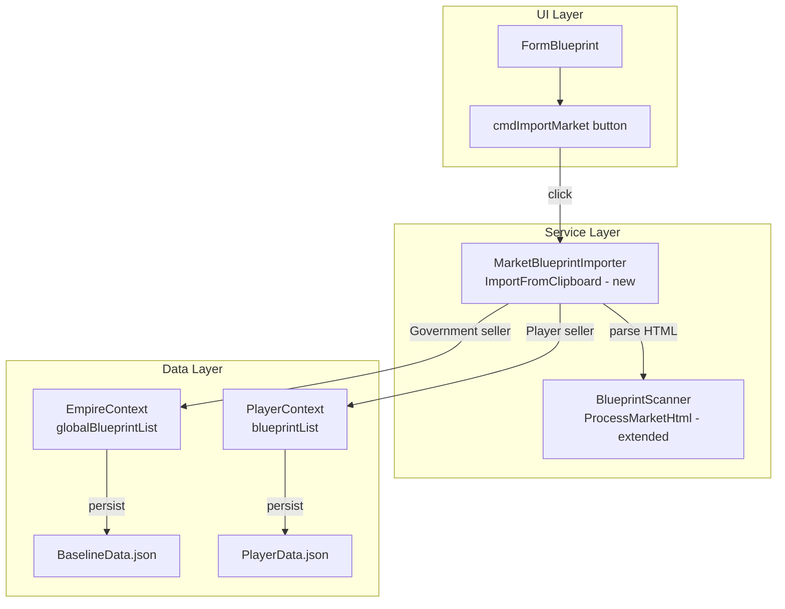

# Design Document: Mass Blueprint Importer

## Overview

This feature adds a bulk import capability to the Blueprint form that parses market listing HTML from the clipboard, extracts multiple blueprints, deduplicates against existing data, routes to the correct storage (global vs player), and creates or updates blueprint records. A results summary is displayed after import.

The existing `BlueprintScanner.ProcessMarketHtml()` already handles HTML parsing. This design adds seller name and TechLevel extraction to the parser, a new `MarketBlueprintImporter` service for the business logic, and a UI button to trigger the workflow.

## Architecture



### Design Decisions

1. **Separate service class** (`MarketBlueprintImporter`): Keeps import logic testable and independent of the form. The form only handles clipboard access and results display.

2. **Extend existing parser** rather than creating a new one: `ProcessMarketHtml` already works. Adding seller name and TechLevel extraction is minimal.

3. **Static service class**: Follows the same pattern as `ColonyActivityCollector` and `ColonyInactivityCollector`. No state needed between imports.

4. **Results as a data object**: `ImportResult` returned from the service, displayed by the form. Keeps UI concerns out of the service.

## Components and Interfaces

### Modified: `BlueprintScanner`

Extend `ProcessMarketHtml` to extract two additional fields per blueprint:

- **Seller name**: From `<span class="ui_text_light_grey">` inside the name div. Store on a new `SellerName` property or pass back alongside the blueprint.
- **TechLevel**: Parse from name parentheses using regex `^(.*)\((.*)\)$`. Only set if the parenthesized text matches a known TechLevel (Hi-Tech, Junker, MilSpec, Rugged, Service, Standard). Strip from the Name field.

Since `Blueprint` doesn't have a `SellerName` field and adding one would pollute the model, return a wrapper:

```csharp
public class MarketBlueprint
{
    public Blueprint Blueprint { get; set; }
    public string SellerName { get; set; }
}
```

Updated signature:
```csharp
public List<MarketBlueprint> ProcessMarketHtml(string htmlFragment)
```

### New: `MarketBlueprintImporter` (static class)

Location: `OE2EmpireTracker/Services/MarketBlueprintImporter.cs`

```csharp
public static class MarketBlueprintImporter
{
    public static ImportResult Import(
        List<MarketBlueprint> marketBlueprints,
        PlayerContext playerContext,
        EmpireContext empireContext);
}
```

Internal logic:
1. For each `MarketBlueprint`:
   a. Skip if unexpanded (zero properties, no BluePrintType)
   b. Determine target storage: seller == "Government" → global, else → player
   c. Skip player-routed blueprints if no current player selected
   d. Search target list for existing blueprint matching dedup key
   e. If found: update properties/resources (preserving protected fields)
   f. If not found: create new blueprint with generated UUID
   g. Log each action via NLog
2. Persist: call `writeContext()` on EmpireContext and/or PlayerContext as needed
3. Return `ImportResult` with per-blueprint details

### New: `ImportResult` data class

```csharp
public class ImportResult
{
    public List<ImportResultEntry> Entries { get; set; }
    public int CreatedCount => Entries.Count(e => e.Action == ImportAction.Created);
    public int UpdatedCount => Entries.Count(e => e.Action == ImportAction.Updated);
    public int SkippedCount => Entries.Count(e => e.Action == ImportAction.Skipped);
}

public class ImportResultEntry
{
    public string Name { get; set; }
    public int Evolution { get; set; }
    public string BluePrintType { get; set; }
    public int Class { get; set; }
    public string TechLevel { get; set; }
    public string SellerName { get; set; }
    public ImportAction Action { get; set; }
    public string UUID { get; set; }
    public string SkipReason { get; set; }
    public string Storage { get; set; } // "Global" or "Player"
}

public enum ImportAction { Created, Updated, Skipped }
```

Location: `OE2EmpireTracker/Services/MarketBlueprintImporter.cs` (same file)

### Modified: `FormBlueprint`

- Add `cmdImportMarket` button to `flpCommands` before `cmdImport`
- Click handler: read clipboard HTML, call `BlueprintScanner.ProcessMarketHtml()`, call `MarketBlueprintImporter.Import()`, display results via MessageBox
- After import: fire `PlayerContext.OnBlueprintDataChanged()` if player blueprints changed, refresh form

## Data Models

### Dedup Key

| Field | Source |
|-------|--------|
| Name | Parsed from MarketListingRowDetailDescription (direct text, excluding seller span), with TechLevel parentheses stripped |
| Evolution | Parsed from EvolutionNumber div |
| BluePrintType | Resolved from icon sprite position via BaselineData.json |
| Class | Parsed from "Class" property value |
| TechLevel | Parsed from name parentheses if matching known value, else null |

### Protected Fields (preserved on update)

| Field | Reason |
|-------|--------|
| UUID | Identity — must not change |
| OwnerUUID | Ownership — set on create, never overwritten |
| NickName | User-assigned label |
| CopyCost | Not available in market HTML |
| Manufacture Run Time | Not available in market HTML |
| Power Required | Not available for some types in market HTML |
| Description | Not available in market HTML |

### TechLevel Extraction

The name in market HTML follows the pattern: `"Blueprint Name (TechLevel)"`. Known TechLevel values from BaselineData.json:
- Hi-Tech, Junker, MilSpec, Rugged, Service, Standard

Examples:
- "AMX-SS Reactor Core (MilSpec)" → Name: "AMX-SS Reactor Core", TechLevel: "MilSpec"
- "Fighter Bomber" → Name: "Fighter Bomber", TechLevel: null
- "Navi-Comp v1.0 (Rugged)" → Name: "Navi-Comp v1.0", TechLevel: "Rugged"

## Error Handling

| Scenario | Handling |
|----------|----------|
| Clipboard has no HTML | Show message "No market HTML found on clipboard" |
| HTML parses to zero blueprints | Show message "No blueprint listings found in clipboard data" |
| All blueprints are unexpanded | Show results with all entries as Skipped |
| No current player and player-routed blueprints exist | Skip those blueprints, log warning, include in results |
| Icon position not found in BaselineData | Blueprint gets null BluePrintType, treated as unexpanded (skipped) |
| Duplicate key matches multiple existing blueprints | Update the first match, log warning about duplicates |


## HTML Parsing Dependencies

These CSS classes and patterns are used by the market HTML parser. When the game updates its UI, these may need updating:

### CSS Classes (market listing)

| Class | Purpose |
|-------|---------|
| `MarketListingRow` | Table row for a blueprint listing |
| `MarketListingRowDetail` | Table row with expanded details (sibling after listing row) |
| `MarketListingRowDetailDescription` | Div containing blueprint name + seller span |
| `MarketListingRowDetailIcon` | Div containing the blueprint type icon |
| `Market_ShipComponentProperty` | Div wrapping a property label+value pair |
| `Market_ShipComponentProperty_Label` | Div containing the property label text |
| `ui_text_blue_light` | Div containing the property value text |
| `ui_icon_base` | Div with background sprite for blueprint type icon |
| `ui_text_light_grey` | Span inside name div containing seller name |
| `EvolutionNumber` | Div containing the evolution number |
| `ScanDetailOutputResourceName_MarketListing` | Div containing resource name |
| `ScanDetailOutputResourceDetail` | Div containing resource quantity |

### Icon Position Mapping

Maintained in `BaselineData.json` under `BlueprintType[].IconPosition`. Can be updated without code changes when the game changes its sprite sheet.

### Property Label Remapping

Maintained in `BlueprintScanner.PropertyRemap`. Only meaningful remaps are kept (e.g. "Health (Hitpoints)" → "Health", "Maximum Damage Repair %" → "Maximum Damage Repair").

## Correctness Properties

### Property 1: Dedup key uniqueness

*For any* set of market blueprints and *for any* target storage list, if two parsed blueprints have the same Dedup_Key (Name + Evolution + BluePrintType + Class + TechLevel), only one record should exist in the target storage after import. The second occurrence should update the first, not create a duplicate.

**Validates: Requirements 5, 6**

### Property 2: Routing correctness

*For any* parsed blueprint, if the seller name equals "Government" (case-insensitive), the blueprint must be stored in `EmpireContext.globalBlueprintList`. If the seller name is anything else, the blueprint must be stored in `PlayerContext.blueprintList` with `OwnerUUID` set to the current player.

**Validates: Requirements 3, 7**

### Property 3: Protected field preservation

*For any* existing blueprint that is updated by the importer, the UUID, OwnerUUID, NickName, CopyCost, and any existing Manufacture Run Time, Power Required, or Description values must be unchanged after the update.

**Validates: Requirement 6**

### Property 4: Import result completeness

*For any* import operation, the total of created + updated + skipped entries in the ImportResult must equal the total number of parsed blueprints (including unexpanded ones).

**Validates: Requirements 8, 10**

### Property 5: TechLevel extraction

*For any* blueprint name ending with a parenthesized known TechLevel value, the TechLevel field must be set to that value and the parenthesized portion must be stripped from the Name. For names without a matching TechLevel suffix, TechLevel must be null and Name must be unchanged.

**Validates: Requirement 4 (indirectly), Requirement 5**

## Testing Strategy

### Unit Tests

- **MarketBlueprintImporter**: Test with hand-built `MarketBlueprint` lists covering create, update, skip, routing, and field preservation scenarios. No HTML parsing involved — tests the service logic in isolation.
- **BlueprintScanner seller extraction**: Test with HTML snippets containing Government and player seller spans.
- **BlueprintScanner TechLevel extraction**: Test with names containing each known TechLevel and names without TechLevel.

### Integration Tests

- **Full pipeline**: Load MarketSample HTML files, parse with `ProcessMarketHtml`, run through `MarketBlueprintImporter.Import`, verify correct blueprints created/updated in the right storage.
- **Deduplication**: Import the same HTML twice, verify no duplicates created on second import and all entries show as "Updated".

### Test Configuration

- All tests in `OE2EmpireTracker.Tests/Services/MarketBlueprintImporterTests.cs` and extended `BlueprintScannerTests.cs`
- Test setup: `PlayerContext.Reset()` and `EmpireContext.Reset()` in `[SetUp]`
- Build: MSBuild, Test: vstest.console (not dotnet test)
