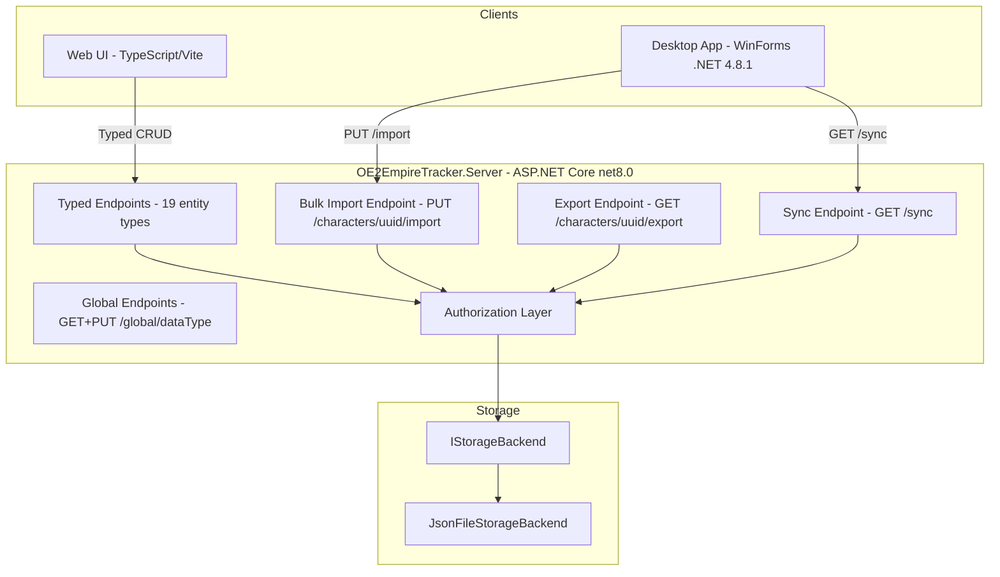

# Design Document: Remove Unvalidated Endpoints

## Overview

This design removes all unvalidated data paths from the OE2EmpireTracker server, replacing them with a validated bulk import endpoint and migrating all clients to use typed endpoints exclusively. The work spans four layers: server endpoint removal, new bulk import endpoint, web UI API migration, and desktop sync migration. After completion, the typed endpoints become the ONLY way to read/write entity data.

### Goals

- Eliminate all raw JSON CRUD routes that bypass validation
- Provide a validated bulk import endpoint for desktop sync
- Migrate web UI from raw `data.ts` calls to typed endpoint calls
- Remove raw storage methods from `IStorageBackend`
- Harden authorization on character, faction, sync, and intel endpoints

### Non-Goals

- Changing the typed endpoint validation logic (already implemented)
- Modifying global data endpoints (baseline game data)
- Changing the WebSocket push notification system
- Migrating to a different storage backend

## Architecture

### System Context



### Change Summary

| Component | Before | After |
|-----------|--------|-------|
| DataEndpoints.cs | 8 raw CRUD routes + read-all + global + sync + export | Only global, sync, export |
| IStorageBackend | Raw methods + typed methods | Typed methods only (raw removed) |
| JsonFileStorageBackend | Split/reassemble hack + typed methods | Typed methods only |
| Web UI data.ts | Raw endpoint calls | Removed (replaced by typed API modules) |
| SyncManager | PUT /data/{dataType} | PUT /import |
| RemoteFactionClient | UploadCharacterDataAsync, UploadAllCharacterDataAsync | BulkImportAsync |
| Character endpoints | No access control on reads | Full permission-system enforcement |
| Faction endpoints | No access control on sub-resources | Membership-based access control |
| Sync endpoint | Returns all factions/characters | Returns only authorized subset |
| Intel endpoints | Partial authorization | Full ownership/sharing enforcement |


## Components and Interfaces

### 1. Bulk Import Endpoint (`BulkImportEndpoints.cs`)

New endpoint class in `OE2EmpireTracker.Server/Endpoints/`.

**Route:** `PUT /api/v1/characters/{uuid}/import`

**Responsibilities:**
- Authenticate and authorize (token must own character or be Owner)
- Authorize BEFORE reading request body
- Deserialize PlayerRoot with case-sensitive JSON options
- Validate each entity in each collection using the same validation logic as typed endpoints
- Collect ALL validation errors (up to 100)
- Persist via typed storage methods on success
- Return summary response on success, error list on failure

**Key Design Decisions:**
- Case-sensitive deserialization enforces correct property casing from desktop clients
- All-or-nothing semantics: if any entity fails validation, nothing is persisted
- Error collection (not fail-fast) gives clients full diagnostic information
- Rate-limited at 5 TPS like other endpoints

```csharp
public static class BulkImportEndpoints
{
    public static void MapBulkImportEndpoints(this WebApplication app)
    {
        app.MapPut("/api/v1/characters/{uuid}/import", HandleImport)
            .RequireAuthorization("Authenticated");
    }

    private static async Task<IResult> HandleImport(
        string uuid,
        HttpContext httpContext,
        IStorageBackend storage) { ... }
}
```

### 2. Authorization Service (`AuthorizationHelper.cs`)

Shared authorization logic extracted for reuse across hardened endpoints.

**Methods:**
- `CanAccessCharacterData(HttpContext, string characterUuid, IStorageBackend)` — checks ownership, grantee permissions, sharing rules, faction sharing
- `IsFactionMember(string characterUUID, string factionUUID, IStorageBackend)` — checks FactionMemberPermissions
- `IsOwner(HttpContext)` — checks Owner claim
- `GetCallerCharacterUUID(HttpContext)` — extracts Character_UUID from token claims

**Access Evaluation Order (Requirement 14, Criterion 7):**
1. Is caller the character owner?
2. Is caller listed in CharacterGranteePermissions?
3. Is caller's faction listed in CharacterGranteePermissions (GranteeType=Faction)?
4. Has the character created a SharingRule targeting the caller's character or faction?
5. Is caller Owner?

### 3. Modified DataEndpoints.cs

After removal, DataEndpoints.cs retains only:
- `GET /api/v1/characters/{uuid}/export` — export (reimplemented via typed storage)
- `GET /api/v1/global/{dataType}` — global data read
- `PUT /api/v1/global/{dataType}` — global data write (Owner only)
- `GET /api/v1/sync` — sync (hardened with authorization filtering)

All raw CRUD routes, the read-all route, and their handler methods are deleted.

### 4. Web UI Typed API Modules

Replace `data.ts` with individual typed API modules per entity type. Each module provides typed functions that call the corresponding typed endpoint.

**Pattern (per entity type):**
```typescript
// src/api/endpoints/colonies.ts (example — already partially exists)
export const coloniesApi = {
  getAll: (charUUID: string) =>
    apiClient.get(`api/v1/characters/${charUUID}/colonies`).json<Colony[]>(),
  get: (charUUID: string, entityUUID: string) =>
    apiClient.get(`api/v1/characters/${charUUID}/colonies/${entityUUID}`).json<Colony>(),
  create: (charUUID: string, data: ColonyCreateRequest) =>
    apiClient.post(`api/v1/characters/${charUUID}/colonies`, { json: data }).json<Colony>(),
  update: (charUUID: string, entityUUID: string, data: ColonyUpdateRequest) =>
    apiClient.put(`api/v1/characters/${charUUID}/colonies/${entityUUID}`, { json: data }).json<Colony>(),
  delete: (charUUID: string, entityUUID: string) =>
    apiClient.delete(`api/v1/characters/${charUUID}/colonies/${entityUUID}`).json<void>(),
};
```

### 5. Modified SyncManager and RemoteFactionClient

**RemoteFactionClient changes:**
- Remove `UploadCharacterDataAsync(characterUUID, dataType, json)`
- Remove `UploadAllCharacterDataAsync(characterUUID, json)`
- Add `BulkImportAsync(characterUUID, playerRootJson)` → calls `PUT /api/v1/characters/{uuid}/import`

**SyncManager changes:**
- `WriteToServerAsync` calls `BulkImportAsync` instead of per-dataType upload
- `FlushOfflineQueueAsync` replays via `BulkImportAsync`
- On HTTP 400, log validation errors and queue for user review

### 6. Modified IStorageBackend

**Removed methods:**
- `GetCharacterDataAsync(string characterUUID, string dataType)`
- `GetCharacterEntityAsync(string characterUUID, string dataType, string entityUUID)`
- `UpsertCharacterDataAsync(string characterUUID, string dataType, string json)`
- `UpsertCharacterEntityAsync(string characterUUID, string dataType, string entityUUID, string json)`
- `DeleteCharacterEntityAsync(string characterUUID, string dataType, string entityUUID)`
- `PutAllCharacterDataAsync(string characterUUID, string json)`
- `GetAllCharacterDataAsync(string characterUUID)` — no longer needed since read-all endpoint is removed; export assembles from typed methods directly


## Data Models

### Bulk Import Request Body

The request body is the existing `PlayerRoot` structure from `OE2EmpireTracker.Common/Services/PlayerRoot.cs`. No new model is needed — the server deserializes directly into `PlayerRoot`.

```csharp
// Existing model — no changes needed
public class PlayerRoot
{
    public int DataVersion { get; set; }
    public string CurrentPlayerUUID { get; set; }
    public PlayerProfile[] PlayerProfile { get; set; }
    public Blueprint[] Blueprint { get; set; }
    public Survey[] Survey { get; set; }
    public Colony[] Colony { get; set; }
    public DeliveryRoute[] DeliveryRoute { get; set; }
    public DeliveryPlan[] DeliveryPlan { get; set; }
    public PricingPlan[] PricingPlan { get; set; }
    public BuildPlan[] BuildPlan { get; set; }
    public ShipTemplate[] ShipTemplate { get; set; }
    public Ship[] Ship { get; set; }
    public Station[] Station { get; set; }
    public MarketListing[] MarketListing { get; set; }
    public MarketTransaction[] MarketTransaction { get; set; }
    public StockPlan[] StockPlan { get; set; }
    public StockProfile[] StockProfile { get; set; }
    public SupplyChain[] SupplyChain { get; set; }
    public WarehouseOverflowRule[] WarehouseOverflowRule { get; set; }
    public Faction[] Faction { get; set; }
    public ExternalCharacter[] ExternalCharacter { get; set; }
    public Asteroid[] Asteroid { get; set; }
}
```

### Bulk Import Success Response

```csharp
public class BulkImportResult
{
    public Dictionary<string, int> Imported { get; set; } = new();
    public int Total { get; set; }
}
```

Example response:
```json
{
  "imported": {
    "colonies": 5,
    "blueprints": 12,
    "surveys": 3,
    "playerProfiles": 1,
    "deliveryRoutes": 2,
    "deliveryPlans": 4,
    "ships": 3,
    "shipTemplates": 2,
    "marketListings": 8,
    "marketTransactions": 15,
    "pricingPlans": 1,
    "stockPlans": 2,
    "stockProfiles": 1,
    "buildPlans": 3,
    "supplyChains": 1,
    "asteroids": 4,
    "stations": 6,
    "factions": 2,
    "externalCharacters": 7
  },
  "total": 82
}
```

### Bulk Import Error Response

```csharp
public class BulkImportErrorResponse
{
    public List<BulkImportError> Errors { get; set; } = new();
    public bool Truncated { get; set; }
}

public class BulkImportError
{
    public string EntityType { get; set; } = string.Empty;
    public string? EntityUUID { get; set; }
    public string? Field { get; set; }
    public string Error { get; set; } = string.Empty;
}
```

Example error response:
```json
{
  "errors": [
    {
      "entityType": "Colony",
      "entityUUID": "abc-123",
      "field": "PlanetName",
      "error": "PlanetName is required"
    },
    {
      "entityType": "Blueprint",
      "entityUUID": null,
      "field": null,
      "error": "Invalid JSON for entity at index 3"
    }
  ],
  "truncated": false
}
```

### Authorization Access Check Result

No new model needed — authorization returns `IResult` directly (403 or passes through).

### Sync Response (unchanged structure, filtered content)

```json
{
  "factions": [...],      // Only factions caller is a member of
  "characters": [...],    // Only characters caller has access to
  "serverTimestamp": "2024-01-01T00:00:00Z"
}
```

### JSON Serialization Configuration

| Context | Case Sensitivity | Rationale |
|---------|-----------------|-----------|
| Bulk Import Endpoint | Case-sensitive | Enforces correct format from desktop clients |
| Typed Endpoints | Case-insensitive | Backward compatibility during web UI migration |
| Read-All / Export | N/A (serialization only) | Output uses PascalCase per model annotations |


## Error Handling

### Bulk Import Error Strategy

The bulk import endpoint uses a **collect-all** error strategy rather than fail-fast:

1. **Authorization failure** → Immediate HTTP 403, body not read
2. **Body deserialization failure** (malformed top-level JSON) → HTTP 400 with `{ "error": "Invalid request body" }`
3. **Per-entity validation** → Collect errors into `BulkImportError` list, continue processing remaining entities
4. **Error cap** → Stop collecting after 100 errors, set `truncated: true`
5. **All-or-nothing persistence** → If any errors collected, return HTTP 400 with error list; nothing is persisted

### Authorization Hardening Error Responses

All hardened endpoints use consistent error responses:

| Condition | Status | Response |
|-----------|--------|----------|
| No token / expired token | 401 | Framework default |
| Token valid but no access to resource | 403 | `{ "error": "Access denied" }` |
| Resource not found (after auth passes) | 404 | `{ "error": "{ResourceType} not found" }` |

**Critical:** 403 responses NEVER include entity data, UUIDs, or counts. This prevents information leakage about what resources exist.

### Desktop Sync Error Handling

When `BulkImportAsync` returns HTTP 400:
1. SyncManager logs the full error response (entity type, UUID, field, message)
2. The failed change is queued in `OfflineQueue` with a `ValidationFailed` status
3. A `SyncValidationFailed` event is raised for UI notification
4. The user can review and fix the data before retrying

When `BulkImportAsync` returns HTTP 403:
1. SyncManager logs the access denial
2. Connection status changes to `Unauthorized`
3. No retry is attempted until re-authentication

### Web UI Error Handling

When a typed endpoint returns HTTP 400:
1. Parse the response body for `{ "error": "..." }` structure
2. Display the error message in a toast/notification near the triggering control
3. If response body is unparseable, display: "Operation failed: validation error"

When a typed endpoint returns HTTP 2xx:
1. Clear any previously displayed error for that operation
2. Update local state with the response data

### Export Endpoint Errors

The export endpoint assembles data from typed storage. If any typed storage call fails:
- Log the error with the specific entity type that failed
- Return HTTP 500 with `{ "error": "Failed to assemble character data" }`
- Do NOT return partial data (consistency over availability)


## Testing Strategy

### Unit Tests — Bulk Import Endpoint

| Test | Validates |
|------|-----------|
| Import with valid PlayerRoot succeeds (HTTP 200) | Req 2.1, 2.4, 2.9 |
| Import with missing required field returns 400 with error list | Req 2.2, 2.3, 9.1 |
| Import with wrong property casing returns 400 | Req 2.7, 2.8, 7.1, 7.2 |
| Import with wrong character UUID returns 403 | Req 6.1 |
| Import validates auth BEFORE reading body | Req 6.2 |
| Import with entity containing mismatched character UUID returns 400 | Req 6.4 |
| Import collects all errors (not fail-fast) | Req 9.2 |
| Import truncates errors at 100 | Req 9.4, 9.5 |
| Import with unrecognized collection key is ignored | Req 2.6 |
| Import with malformed entity JSON returns error at index | Req 9.3 |
| Import rate-limited at 5 TPS | Req 2.10 |

### Unit Tests — Authorization Hardening

| Test | Validates |
|------|-----------|
| GET /characters returns only accessible characters | Req 14.1 |
| GET /characters/{uuid} enforces access control | Req 14.2 |
| GET /characters/{uuid}/capabilities requires owner | Req 14.3 |
| GET /characters/{uuid}/clearance-levels requires owner | Req 14.4 |
| GET /characters/{uuid}/groups requires owner | Req 14.5 |
| GET /factions/{uuid}/capabilities requires membership | Req 15.3 |
| GET /factions/{uuid}/clearance-levels requires membership | Req 15.4 |
| GET /factions/{uuid}/groups requires membership | Req 15.5 |
| GET /factions/{uuid}/members requires membership | Req 15.6 |
| GET /factions/{uuid}/leaders is public | Req 15.7 |
| GET /sync returns only authorized factions/characters | Req 16.1, 16.2 |
| POST /intel enforces caller = URL character | Req 17.1 |
| GET /intel enforces CanAccessCharacterData | Req 17.2 |
| DELETE /intel enforces comment ownership | Req 17.3 |
| POST /intel/share enforces comment ownership | Req 17.4 |
| DELETE /intel/share enforces comment ownership | Req 17.5 |
| PUT /factions/{uuid}/intel/classify requires faction leader | Req 17.6 |

### Unit Tests — Endpoint Removal

| Test | Validates |
|------|-----------|
| PUT /data/{dataType} returns 404 | Req 1.2 |
| POST /data/{dataType} returns 404 | Req 1.3 |
| GET /data/{dataType}/{entityUuid} returns 404 | Req 1.4 |
| PUT /data/{dataType}/{entityUuid} returns 404 | Req 1.5 |
| DELETE /data/{dataType}/{entityUuid} returns 404 | Req 1.6 |
| PUT /data (bulk) returns 404 | Req 1.7 |
| GET /data (read-all) returns 404 | Req 1.10 |
| GET /export still works | Req 10.1 |
| GET /sync still works | Req 11.1 |
| GET/PUT /global/{dataType} still works | Req 11.2, 11.3 |

### Unit Tests — Storage Interface

| Test | Validates |
|------|-----------|
| IStorageBackend has no raw methods (compile-time) | Req 5.1–5.7 |
| JsonFileStorageBackend has no split/reassemble logic | Req 8.1, 8.2 |

### Integration Tests — Web UI Migration

| Test | Validates |
|------|-----------|
| No imports from data.ts in any page component | Req 3.7 |
| Each entity type has a typed API module | Req 3.6 |
| Typed API modules call correct endpoint paths | Req 3.1–3.5 |
| Error display on 400 response | Req 3.8 |
| Error cleared on success | Req 3.9 |

### Integration Tests — Desktop Sync

| Test | Validates |
|------|-----------|
| SyncManager calls PUT /import (not PUT /data) | Req 4.1 |
| RemoteFactionClient has BulkImportAsync method | Req 4.2, 4.3 |
| Validation failure queues for review | Req 4.4 |
| Serialization uses PascalCase | Req 4.5 |
| Offline queue flush uses bulk import | Req 4.6 |

### PBT Coverage

| Property | Description |
|----------|-------------|
| **Authorization Isolation** | For any two distinct character UUIDs A and B, token A cannot access B's data via any hardened endpoint (unless sharing rules grant access) |
| **Validation Completeness** | For any entity with a required field set to null/empty, bulk import rejects the entire request |
| **Error Collection Completeness** | For N entities with errors (N ≤ 100), the error response contains exactly N error entries |
| **Truncation Correctness** | `truncated` is true iff total errors > 100 |
| **Case Sensitivity** | For any entity property name that differs from canonical casing by at least one character, bulk import rejects the entity |
| **Sync Filtering** | GET /sync response never contains a faction/character the caller has no permission-system relationship with |


## Correctness Properties

### Property 1: No Unvalidated Write Path Exists

**Validates: Requirements 1, 5, 8, 12**

After implementation, there SHALL exist no code path by which a client can persist entity data to storage without that data passing through typed validation logic. Specifically:
- No route handler calls `UpsertCharacterDataAsync`, `UpsertCharacterEntityAsync`, or `PutAllCharacterDataAsync` (these methods no longer exist)
- No route handler writes raw JSON strings to entity storage files
- The only write paths are: typed endpoint handlers (via `Upsert{EntityType}Async`) and the bulk import handler (which validates then calls `Upsert{EntityType}Async`)

### Property 2: Authorization Before Body Read

**Validates: Requirements 6.2**

For ALL endpoints that accept a request body (bulk import, typed POST/PUT, global PUT), the authorization check (token ownership validation) SHALL complete before any byte of the request body is read from the stream. This prevents resource exhaustion attacks where an unauthorized client sends a large body. The existing TypedEndpointBase already follows this pattern (CanAccessCharacterData is called before ReadFromJsonAsync); the bulk import endpoint must do the same.

### Property 3: All-or-Nothing Import Semantics

**Validates: Requirements 2.3, 2.4**

For any bulk import request: either ALL entities pass validation and ALL are persisted, or NONE are persisted. There is no partial import state. Formally: `|persisted_entities| ∈ {0, |valid_entities_in_request|}`.

### Property 4: Error Response Completeness

**Validates: Requirements 9.1, 9.2, 9.4**

For any bulk import request with N validation errors where N ≤ 100: the error response contains exactly N error entries and `truncated == false`. For N > 100: the response contains exactly 100 entries and `truncated == true`.

### Property 5: Authorization Isolation (Hardened Endpoints)

**Validates: Requirements 14, 15, 16, 17**

For any authenticated request where the caller has no permission-system relationship with the target resource (not owner, not grantee, not faction member, not shared-with, not Owner role): the response status code SHALL be 403 and the response body SHALL contain no entity data, UUIDs, or counts.

### Property 6: Sync Response Filtering

**Validates: Requirements 16.1, 16.2, 16.5**

For any non-Owner caller, the sync response SHALL contain only: (a) factions where `GetFactionMemberPermissionsAsync(factionUUID, callerCharUUID)` returns non-null, and (b) characters where `CanAccessCharacterData` returns true. The response SHALL NOT contain any faction or character outside these sets.

### Property 7: Case Sensitivity Enforcement

**Validates: Requirements 7.1, 7.2**

For any entity property name P in a bulk import request where P differs from the canonical model property name by casing (e.g., "planetName" vs "PlanetName"): the property SHALL be treated as missing, and if the property is required, the entity SHALL fail validation.

### Property 8: Removed Routes Return 404 via Framework Default

**Validates: Requirements 1.8, 1.9**

For any request to a removed route (including the former read-all `GET /data`): the HTTP 404 response SHALL come from ASP.NET Core's default "no matching route" behavior. There SHALL be no explicit 404 handler registered for these paths.

### Property 9: Rate Limit Independence

**Validates: Requirements 2.10**

The bulk import endpoint's rate limit SHALL be per-token and independent. Token A exceeding its rate limit SHALL NOT affect Token B's ability to call the endpoint.

