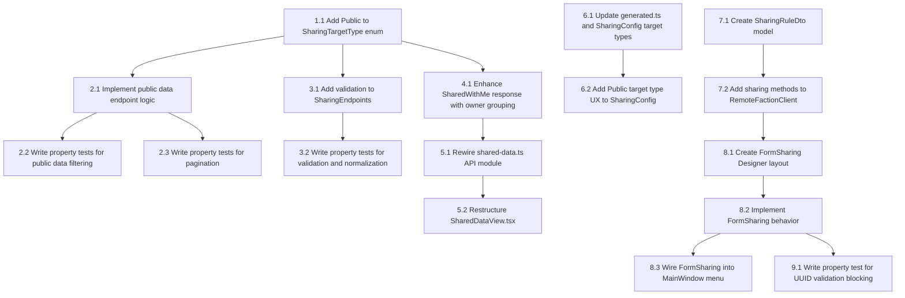

# Implementation Plan:

## Overview

This plan implements the sharing/visibility system across three apps: the ASP.NET Core server (public endpoints, validation, SharedWithMe grouping), the React web UI (SharedDataView rewire, SharingConfig Public target), and the WinForms desktop app (FormSharing CRUD). Work proceeds server-first to establish the API contract, then web UI and desktop in parallel.

## Task Dependency Graph

```json
{
  "waves": [
    { "id": "wave-1", "name": "Server Enum & Validation", "tasks": ["1.1", "3.1", "3.2"] },
    { "id": "wave-2", "name": "Server Public Endpoints", "tasks": ["2.1", "2.2", "2.3"] },
    { "id": "wave-3", "name": "Server SharedWithMe Enhancement", "tasks": ["4.1"] },
    { "id": "wave-4", "name": "Web UI Shared Data View", "tasks": ["5.1", "5.2"] },
    { "id": "wave-5", "name": "Web UI Sharing Config", "tasks": ["6.1", "6.2"] },
    { "id": "wave-6", "name": "Desktop Client & Model", "tasks": ["7.1", "7.2"] },
    { "id": "wave-7", "name": "Desktop FormSharing", "tasks": ["8.1", "8.2", "8.3"] },
    { "id": "wave-8", "name": "Desktop Property Tests", "tasks": ["9.1"] }
  ]
}
```



## Tasks

### Phase 1: Server — Enum and Validation Foundation

- [x] 1.1 Add Public value to SharingTargetType enum on server
  - Satisfies: Req 5, Criterion 2 ("SharingTargetType enum SHALL include a Public value")
  - Inputs: Server Models.cs (SharingTargetType enum definition)
  - Output: Modified Models.cs with `Public` added to enum
  - Verification: Server project compiles; existing tests pass

- [x] 3.1 Add validation logic to SharingEndpoints UpdateSharingConfig
  - Satisfies: Req 7, Criteria 1-4 ("Server SHALL return 400 for empty TargetUUID / invalid TargetType / assign OwnerCharacterUUID / generate Id")
  - Inputs: Server SharingEndpoints.cs
  - Output: Modified SharingEndpoints.cs with validation for empty TargetUUID, OwnerCharacterUUID override, and Id generation
  - Verification: getDiagnostics clean; manual API test with empty UUID returns 400

- [x] 3.2 Write property tests for sharing rule validation and normalization
  - Satisfies: Correctness Properties 3 and 4
  - Inputs: SharingEndpoints.cs validation logic
  - Output: `OE2EmpireTracker.Tests/Server/SharingValidationTests.cs`, `OE2EmpireTracker.Tests/Server/SharingNormalizationTests.cs`
  - Verification: Tests pass via vstest.console

### Phase 2: Server — Public Data Endpoints

- [x] 2.1 Implement public data endpoint logic in PublicDataEndpoints.cs
  - Satisfies: Req 1, Criteria 1-5 ("Server SHALL query sharing rules and return entities with TargetType=Public"); Req 5, Criterion 3
  - Inputs: Server PublicDataEndpoints.cs, IStorageBackend interface
  - Output: Modified PublicDataEndpoints.cs with filtering logic for blueprints, surveys, colonies; pagination with max 100
  - Verification: getDiagnostics clean; endpoint returns data when Public rules exist

- [x] 2.2 Write property tests for public data filtering
  - Satisfies: Correctness Property 1
  - Inputs: PublicDataEndpoints.cs logic
  - Output: `OE2EmpireTracker.Tests/Server/PublicDataFilteringTests.cs`
  - Verification: Tests pass via vstest.console

- [x] 2.3 Write property tests for pagination slice correctness
  - Satisfies: Correctness Property 2
  - Inputs: Pagination logic in PublicDataEndpoints.cs
  - Output: `OE2EmpireTracker.Tests/Server/PaginationTests.cs`
  - Verification: Tests pass via vstest.console

### Phase 3: Server — SharedWithMe Enhancement

- [x] 4.1 Enhance SharedWithMe endpoint to return owner-grouped response
  - Satisfies: Req 2, Criterion 3 ("display entities grouped by sharer character with sharer's name visible")
  - Inputs: Server SharingEndpoints.cs (GetSharedWithMe method)
  - Output: Modified GetSharedWithMe to return `SharedWithMeGroup[]` with ownerCharacterUUID and ownerCharacterName
  - Verification: getDiagnostics clean; endpoint returns grouped response shape

### Phase 4: Web UI — Shared Data View

- [x] 5.1 Rewire shared-data.ts API module to use /shared-with-me/{dataType}
  - Satisfies: Req 2, Criteria 1-2 ("call GET /shared-with-me/{dataType}"; "remove non-existent getSharedCharacters call")
  - Inputs: Web UI shared-data.ts (or equivalent API module)
  - Output: Modified API module calling correct endpoint; SharedWithMeGroup interface added
  - Verification: TypeScript compiles clean

- [x] 5.2 Restructure SharedDataView.tsx with data-type tabs and error/empty states
  - Satisfies: Req 2, Criteria 3-5 ("display grouped by sharer"; "empty state message"; "retryable error")
  - Inputs: SharedDataView.tsx, shared-data.ts API module
  - Output: Modified SharedDataView.tsx with tab-per-dataType layout, grouped display, empty state, RetryableError
  - Verification: TypeScript compiles clean; component renders tabs

### Phase 5: Web UI — Sharing Configuration

- [x] 6.1 Update generated.ts types and add Public to SharingConfig target types
  - Satisfies: Req 5, Criterion 4 ("Web_UI SHALL include Public as selectable target type"); Req 4, Criteria 1, 3-4
  - Inputs: generated.ts, SharingConfig.tsx
  - Output: Modified generated.ts with `'Public'` in SharingTargetType; SharingConfig TARGET_TYPES updated
  - Verification: TypeScript compiles clean

- [x] 6.2 Add Public target type UX and validation to SharingConfig
  - Satisfies: Req 4, Criteria 2, 5-6 ("validate Target UUID non-empty"; "refresh after mutation"; "error notification"); Req 5, Criterion 4; Req 6, Criterion 6
  - Inputs: SharingConfig.tsx
  - Output: Modified SharingConfig with UUID validation disabling save, Public target hiding UUID field, optimistic update after save, error notification
  - Verification: TypeScript compiles clean

### Phase 6: Desktop App — Client and Model

- [x] 7.1 Create SharingRuleDto model class
  - Satisfies: Design component 11 (Desktop DTO for sharing rules)
  - Inputs: Design document DTO definition
  - Output: `OE2EmpireTracker/Client/SharingRuleDto.cs`
  - Verification: getDiagnostics clean on new file

- [x] 7.2 Add GetSharingRulesAsync and PutSharingRulesAsync to RemoteFactionClient
  - Satisfies: Design component 9; Req 3, Criteria 2, 5 ("load rules via GET"; "call PUT with rules"); Req 6, Criterion 1
  - Inputs: RemoteFactionClient.cs, SharingRuleDto.cs
  - Output: Modified RemoteFactionClient.cs with two new async methods
  - Verification: getDiagnostics clean; solution builds

### Phase 7: Desktop App — FormSharing

- [-] 8.1 Create FormSharing Designer layout (Designer.cs + .resx)
  - Satisfies: Req 3, Criteria 1, 3 ("FormSharing form accessible from main menu"; "DataGridView with columns")
  - Inputs: Design mockup layout
  - Output: `OE2EmpireTracker/Forms/Sharing/FormSharing.cs`, `FormSharing.Designer.cs`, `FormSharing.resx`
  - Verification: getDiagnostics clean; form opens in designer

- [~] 8.2 Implement FormSharing behavior (load, save, add, delete, validation)
  - Satisfies: Req 3, Criteria 2, 4-8 ("load rules on open"; "add rule"; "save rules"; "delete rule"; "error on save"; "reload on player change"); Req 5, Criterion 5 ("Public in Target Type dropdown"); Req 6, Criterion 6 ("rule appears immediately"); Req 7, Criterion 5 ("disable save with empty UUID")
  - Inputs: FormSharing.Designer.cs, RemoteFactionClient, SharingRuleDto
  - Output: Modified FormSharing.cs with full behavior implementation
  - Verification: getDiagnostics clean; solution builds

- [~] 8.3 Wire FormSharing into MainWindow menu
  - Satisfies: Req 3, Criterion 1 ("accessible from main menu under Sharing menu item")
  - Inputs: MainWindow.cs (or MainWindow.Designer.cs menu structure)
  - Output: Modified MainWindow with "Sharing" menu item opening FormSharing
  - Verification: getDiagnostics clean; solution builds

### Phase 8: Desktop App — Property Tests

- [~] 9.1 Write property test for Target UUID validation blocking save
  - Satisfies: Correctness Property 5
  - Inputs: FormSharing validation logic
  - Output: `OE2EmpireTracker.Tests/Forms/SharingValidationTests.cs`
  - Verification: Tests pass via vstest.console


## Notes

- The server project is ASP.NET Core (separate from the WinForms desktop app which is .NET Framework 4.8.1)
- Web UI tasks assume a React/TypeScript project with an existing API client pattern
- Desktop FormSharing follows the same patterns as FormContacts and FormStockTargets (DataGridView inline editing)
- FsCheck 2.16.6 is used for property tests — no 3.x APIs
- Public rules use a sentinel TargetUUID value or conditionally hide the field; the server ignores TargetUUID for Public rules but still validates it is non-empty per Req 7.1
