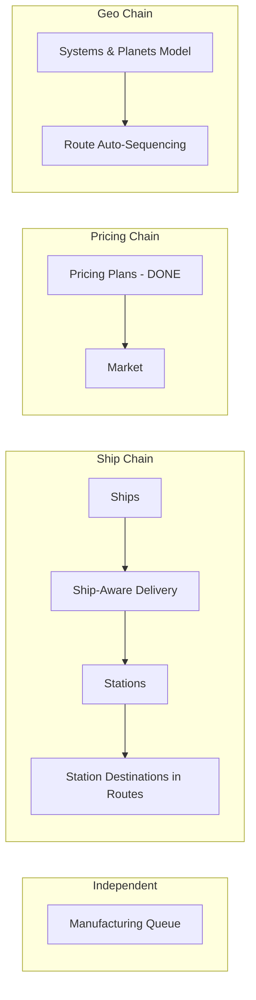

# OE2 Empire Tracker — Goals & Status

## Open Work Dependency Graph

## Specification Documents

- [Requirements README](requirements/README.md) — index of all 15 requirement files
- [Backlog](BACKLOG.md) — open features and enhancements to be worked on
- [Recommendations](Recommendations.md) — resolved issues and their outcomes
- [Completed Work Archive](COMPLETED.md) — detailed record of all completed tasks
- [Ambiguities](Ambiguities.md) — 57 resolved

## Current Status

1375 total tests, all passing. All original Recommendations (1-18) resolved. MVVM complete across all forms. NLog logging throughout. 61 features completed. Directory restructured: `Baseline/` and `Data/` replaced by `Models/`, `Services/`, `Parsers/`, `Persistence/`.

## Open Work

See [BACKLOG.md](BACKLOG.md) for the full list of open features with dependency graph and suggested build order.

### Independent (can start anytime)
- Manufacturing Queue
- Systems & Planets Model

### Dependency Chain
- Ships → Ship-Aware Delivery Execution → Stations → Station Destinations in Routes
- Pricing Plans (complete) → Market
- Systems & Planets Model → Route Auto-Sequencing

### Smaller Items
- Delivery Auto-Fill time horizon parameter (REQ-DEL-061)
- Global Blueprint enhancements (visual indicator, permissions, separate file)
- Player Transfer UI
