<!-- Extracted from .kiro/specs/empire-systems/design.md — Architecture section -->
# Architecture

## Overview

Empire Systems extends OE2 Empire Tracker with interconnected features for ships, stations, manufacturing planning, market tracking, supply chain management, and fill-level automation. The design prioritizes a unified data model built in Iteration 1 that supports all planned iterations without refactoring.

The architecture follows existing patterns: POCO models persisted in PlayerData.json via PlayerContext, stateless services for computation, ViewModels for UI binding, and WinForms MDI child forms.

## Architecture Diagram

```mermaid
graph TD
    subgraph New Models
        BP[BuildPlan]
        BI[BuildItem]
        ST[ShipTemplate]
        SH[Ship]
        STN[Station]
        ML[MarketListing]
        MT[MarketTransaction]
        SP[StockPlan]
        SPR[StockProfile]
        SC[SupplyChain]
        WOR[WarehouseOverflowRule]
        FAC[Faction]
        EC[ExternalCharacter]
        AST[Asteroid]
    end

    subgraph Existing Models
        COL[Colony]
        CS[ColonyStructure]
        BLU[Blueprint]
        COM[Commodity]
        DR[DeliveryRoute]
        DP[DeliveryPlan]
        PP[PricingPlan]
        IB[ItemBag]
    end

    subgraph Services
        PC[PlayerContext]
        BPS[BuildPlanService]
        SBS[ShipBuildService]
        RCS[ResourceCheckService]
        DGS[DeliveryGenerationService]
        MKS[MarketService]
        STS[StockTargetService]
        SCS[SupplyChainService]
        QC[QueueCalculator]
        AAS[AutoAssignService]
    end

    subgraph Forms
        FBP[FormBuildPlanner]
        FST[FormShipTemplate]
        FSH[FormShipInstance]
        FSTN[FormStation]
        FMK[FormMarket]
        FSTK[FormStockTargets]
        FCON[FormContacts]
        FAST[FormAsteroid]
        FSCH[FormSupplyChain]
    end

    BP -->|contains| BI
    BI -->|references| BLU
    BI -->|references| COM
    BI -->|allocated to| CS
    ST -->|references| BLU
    SH -->|from template| ST
    SH -->|cargo| IB
    STN -->|hold| IB
    ML -->|at| STN
    MT -->|decrements| ML
    SP -->|triggers| BPS
    SC -->|generates| DP
    SPR -->|references| SP
    WOR -->|monitors| COL
    FAC -->|groups| EC

    FBP --> BPS
    FBP --> RCS
    FBP --> DGS
    FBP --> QC
    FBP --> AAS
    FST --> SBS
    FMK --> MKS
    FSTK --> STS
    FSCH --> SCS
    FSTN --> SBS
```

## Custom Controls

- `DataGridViewFilteredComboBoxColumn` — custom DataGridView column that hosts a FilteredComboBox for in-grid filtered combo selection.
- `FilteredTextComboSet` — composite control combining a text filter TextBox with a FilteredComboBox, used for type-ahead filtering in forms.

## Layered Architecture

The system follows the established layered pattern:

1. **Models** — POCO classes with JSON serialization attributes. No business logic. Persisted as arrays in PlayerRoot.
2. **Services** — Static, stateless classes. Accept data via parameters (`Func<string, T>` finders, `IEnumerable<T>` collections). Never access singletons directly. Return results rather than mutating shared state.
3. **ViewModels** — Instance-based wrappers around model entities. Expose typed properties for UI binding. Handle computed/derived values.
4. **Forms** — WinForms MDI child forms. Subscribe to PlayerContext data-change events. Use BeginInvoke for cross-thread marshaling. Follow the left-list / right-detail pattern.