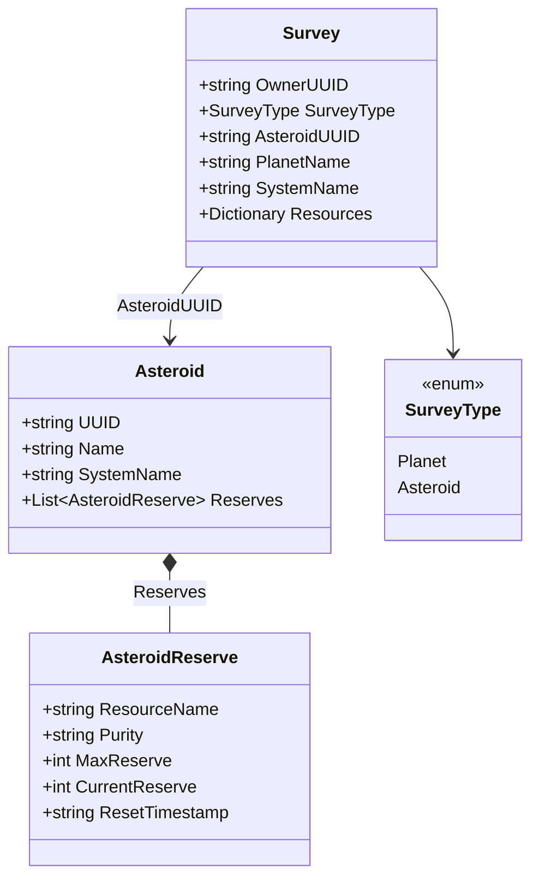

# Data Models — Asteroids

## Asteroid

```csharp
public class Asteroid
{
    public string UUID { get; set; }
    public string Name { get; set; } = string.Empty;
    public string SystemName { get; set; } = string.Empty;
    public List<AsteroidReserve> Reserves { get; set; } = new List<AsteroidReserve>();
}

public class AsteroidReserve
{
    public string ResourceName { get; set; } = string.Empty;
    public string Purity { get; set; } = string.Empty;
    public int MaxReserve { get; set; } = 0;
    public int CurrentReserve { get; set; } = 0;
    public string ResetTimestamp { get; set; } = string.Empty;
}
```

- UUID deterministic from "SystemName:AsteroidName". Reserves are shared pool across all players.

## Asteroid Surveys (Survey Model Extension)

```csharp
public enum SurveyType { Planet, Asteroid }

// Add to existing Survey class:
[JsonConverter(typeof(StringEnumConverter))]
[DefaultValue(SurveyType.Planet)]
public SurveyType SurveyType { get; set; } = SurveyType.Planet;
public string AsteroidUUID { get; set; } = string.Empty;

// Transient property — carries parsed max reserve data from parser to import helper.
// Not serialized to JSON.
[JsonIgnore]
public Dictionary<string, int> ParsedMaxReserves { get; set; }
```

- Planet and asteroid surveys share the same model. `SurveyType` defaults to Planet for backward compat.
- For asteroid surveys, `Amount` means "rate per mining cycle" (vs "rate per hour" for planet).
- When importing asteroid survey, auto-creates Asteroid entity if not found.
- `ParsedMaxReserves` is populated by `SurveyParser.ProcessHtml` when `ScanDetailOutputMaxReserve` HTML nodes are present. It carries per-resource max reserve values transiently during import — `LinkOrCreateAsteroid` reads it to populate `Asteroid.Reserves`. Not persisted to JSON.


## Class Diagram


