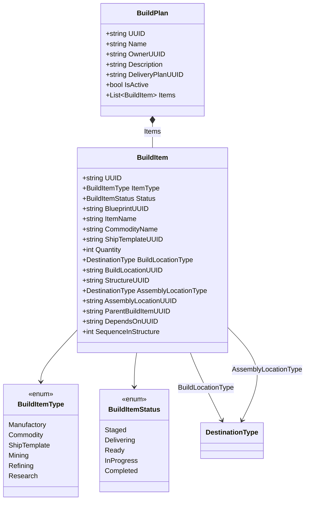

# Data Models — Build Planner

## BuildPlan

```csharp
public class BuildPlan
{
    public string UUID { get; set; }
    public string Name { get; set; } = string.Empty;
    public string OwnerUUID { get; set; } = string.Empty;
    public string Description { get; set; } = string.Empty;
    public string DeliveryPlanUUID { get; set; } = string.Empty;
    public bool IsActive { get; set; } = true;
    public List<BuildItem> Items { get; set; } = new List<BuildItem>();
}
```

- Items nested inside plan (not separate top-level array) — deleting a plan deletes all items automatically.
- DeliveryPlanUUID links to generated delivery plan. Empty = no delivery plan yet.

## BuildItem

```csharp
public enum BuildItemType
{
    Manufactory,
    Commodity,
    ShipTemplate,    // Expands into component Manufactory items
    Mining,          // Iteration 6
    Refining,        // Iteration 6
    Research         // Iteration 6
}

public enum BuildItemStatus
{
    Staged,
    Delivering,
    Ready,
    InProgress,
    Completed
}

public class BuildItem
{
    public string UUID { get; set; }

    [JsonConverter(typeof(StringEnumConverter))]
    public BuildItemType ItemType { get; set; }

    [JsonConverter(typeof(StringEnumConverter))]
    public BuildItemStatus Status { get; set; } = BuildItemStatus.Staged;

    // What to build
    public string BlueprintUUID { get; set; } = string.Empty;
    public string ItemName { get; set; } = string.Empty;
    public string CommodityName { get; set; } = string.Empty;
    public string ShipTemplateUUID { get; set; } = string.Empty;

    // How many
    public int Quantity { get; set; } = 0;  // Always runs

    // Where to build
    [JsonConverter(typeof(StringEnumConverter))]
    public DestinationType BuildLocationType { get; set; } = DestinationType.Colony;
    public string BuildLocationUUID { get; set; } = string.Empty;
    public string StructureUUID { get; set; } = string.Empty;

    // Assembly location (ShipTemplate items)
    [JsonConverter(typeof(StringEnumConverter))]
    public DestinationType AssemblyLocationType { get; set; } = DestinationType.Station;
    public string AssemblyLocationUUID { get; set; } = string.Empty;

    // Parent-child relationship
    public string ParentBuildItemUUID { get; set; } = string.Empty;

    // Metadata
    public string Recipient { get; set; } = string.Empty;
    public string Notes { get; set; } = string.Empty;
    public int SequenceInStructure { get; set; } = 0;
    public string DependsOnUUID { get; set; } = string.Empty;

    // Mining/Refining (Iteration 6)
    public string MiningResource { get; set; } = string.Empty;
    public string MiningSurveyUUID { get; set; } = string.Empty;
    public string RefiningResource { get; set; } = string.Empty;
    public string RefiningPurity { get; set; } = string.Empty;
}
```

- Iteration 6 fields present from start with empty defaults. `DefaultValueHandling.Ignore` omits from JSON until used.
- Quantity is always runs. Service layer computes total output.
- BuildLocationType future-proofs for factory ships.
- Status is string enum for readable JSON.


## Class Diagram


