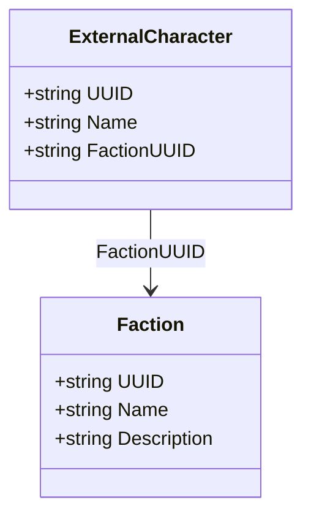

# Data Models — Contacts

## Faction & ExternalCharacter

```csharp
public class Faction
{
    public string UUID { get; set; }
    public string Name { get; set; } = string.Empty;
    public string Description { get; set; } = string.Empty;
}

public class ExternalCharacter
{
    public string UUID { get; set; }
    public string Name { get; set; } = string.Empty;
    public string FactionUUID { get; set; } = string.Empty;
}
```

- Factions are shared (no OwnerUUID). UUID deterministic from name.
- ExternalCharacters are shared. UUID deterministic from name.


## Class Diagram


