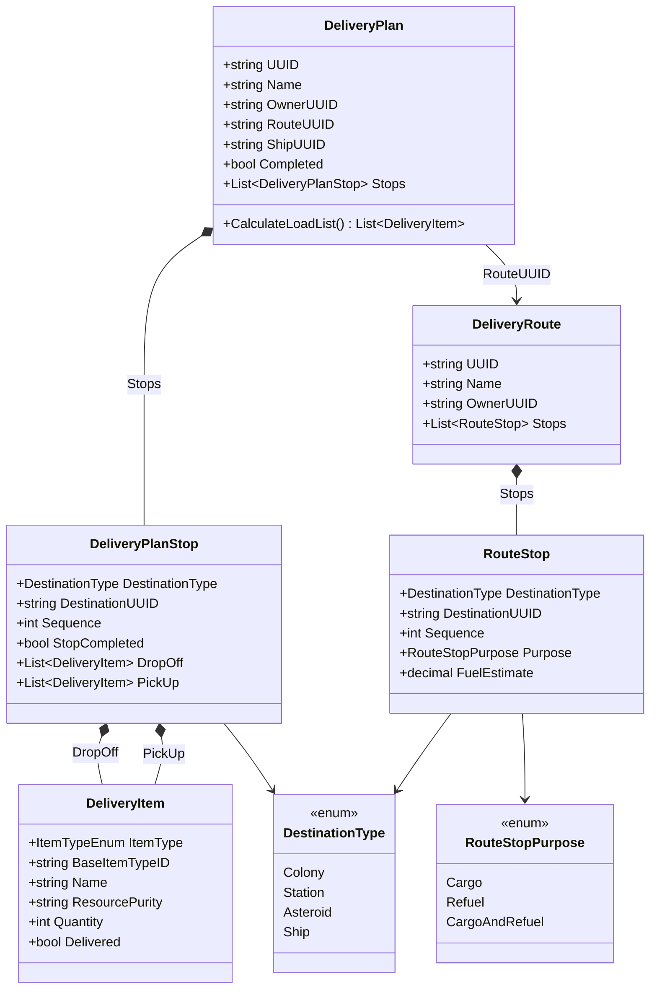

# Data Models — Delivery

## RouteStop Changes

```csharp
public enum RouteStopPurpose { Cargo, Refuel, CargoAndRefuel }

public class RouteStop
{
    [JsonConverter(typeof(StringEnumConverter))]
    public DestinationType DestinationType { get; set; } = DestinationType.Colony;
    public string DestinationUUID { get; set; } = string.Empty;
    public int Sequence { get; set; }

    [JsonConverter(typeof(StringEnumConverter))]
    [DefaultValue(RouteStopPurpose.Cargo)]
    public RouteStopPurpose Purpose { get; set; } = RouteStopPurpose.Cargo;

    public decimal FuelEstimate { get; set; } = 0m;

    [JsonProperty(DefaultValueHandling = DefaultValueHandling.Ignore)]
    public string ColonyUUID { get; set; }  // Backward compat
}
```

## DeliveryPlan & DeliveryPlanStop Changes

```csharp
// Add to DeliveryPlan:
public string ShipUUID { get; set; } = string.Empty;  // Optional ship assignment (Iteration 3)

// DeliveryPlanStop gets same DestinationType treatment:
[JsonConverter(typeof(StringEnumConverter))]
public DestinationType DestinationType { get; set; } = DestinationType.Colony;
public string DestinationUUID { get; set; } = string.Empty;
[JsonProperty(DefaultValueHandling = DefaultValueHandling.Ignore)]
public string ColonyUUID { get; set; }  // Backward compat
```


## Class Diagram


