# Data Models — Read-Only Wrappers

## Read-Only Data Wrappers

Read-only wrapper classes provide controlled access to the data model. Each mutable entity has a corresponding `ReadOnly{Entity}` class that holds a private readonly reference and exposes only getter properties. Wrappers are separate classes (no shared interfaces or base class with the mutable type), preventing consumer code from casting back to the mutable type. See `.kiro/specs/readonly-data-wrappers/` for the full spec.

### Utility Container Wrappers

- **ReadOnlyPropertyBag** — wraps PropertyBag, exposes GetDecimal, GetLong, GetBoolean, GetString, ContainsKey, Count
- **ReadOnlyItemBag** — wraps ItemBag, exposes CountByType, FindByType, FindResource, Count, ContainsKey
- **ReadOnlyLockTracking** — wraps LockTracking, exposes GetLockedQuantity, GetLocksForProcess
- **ReadOnlyCountDownTime** — wraps CountDownTime, exposes TimeRemaining, TimeRemainingString, IntervalsPassed, IsRepeating, RepeatIntervalSeconds, StartTime, EndTime

### Top-Level Entity Wrappers

- **ReadOnlyBlueprint** — wraps Blueprint (Properties as ReadOnlyPropertyBag, Resources as IReadOnlyDictionary)
- **ReadOnlyColony** — wraps Colony (Items as ReadOnlyItemBag, Structures as IReadOnlyList of ReadOnlyColonyStructure, Commodities as IReadOnlyList of ReadOnlyCommodityRequested, Locks as ReadOnlyLockTracking)
- **ReadOnlySurvey** — wraps Survey (Resources as IReadOnlyDictionary of ReadOnlySurveyResource)
- **ReadOnlyPlayerProfile** — wraps PlayerProfile (GetSkill returns ReadOnlyPlayerSkill, ranks as ReadOnlyPlayerRank)
- **ReadOnlyDeliveryRoute** — wraps DeliveryRoute (Stops as IReadOnlyList of ReadOnlyRouteStop)
- **ReadOnlyDeliveryPlan** — wraps DeliveryPlan (Stops as IReadOnlyList of ReadOnlyDeliveryPlanStop)
- **ReadOnlyBuildPlan** — wraps BuildPlan (Items as IReadOnlyList of ReadOnlyBuildItem)
- **ReadOnlyShipTemplate** — wraps ShipTemplate (Components as IReadOnlyList of ReadOnlyShipComponentSlot)
- **ReadOnlyShip** — wraps Ship (Components, Cargo as ReadOnlyItemBag, Hopper as ReadOnlyItemBag)
- **ReadOnlyStation** — wraps Station (Holds as IReadOnlyDictionary of ReadOnlyItemBag, Components, MunitionsHold as ReadOnlyItemBag)
- **ReadOnlyMarketListing** — wraps MarketListing
- **ReadOnlyMarketTransaction** — wraps MarketTransaction
- **ReadOnlyStockPlan** — wraps StockPlan (Targets as IReadOnlyList of ReadOnlyStockTarget)
- **ReadOnlyStockProfile** — wraps StockProfile (Entries as IReadOnlyList of ReadOnlyStockProfileEntry)
- **ReadOnlySupplyChain** — wraps SupplyChain (Stages as IReadOnlyList of ReadOnlySupplyChainStage)
- **ReadOnlyWarehouseOverflowRule** — wraps WarehouseOverflowRule
- **ReadOnlyFaction** — wraps Faction
- **ReadOnlyExternalCharacter** — wraps ExternalCharacter
- **ReadOnlyAsteroid** — wraps Asteroid (Reserves as IReadOnlyList of ReadOnlyAsteroidReserve)
- **ReadOnlyPricingPlan** — wraps PricingPlan (ResourcePrices as IReadOnlyDictionary)
- **ReadOnlyCommodity** — wraps Commodity
- **ReadOnlyResource** — wraps Resource

### Nested Type Wrappers

- **ReadOnlyColonyStructure** — wraps ColonyStructure (Properties/AssignedWorkers as ReadOnlyPropertyBag, timers as nullable ReadOnlyCountDownTime, Statuses as IReadOnlyDictionary of ReadOnlyColonyStructureStatus)
- **ReadOnlyColonyStructureStatus** — wraps ColonyStructureStatus
- **ReadOnlyCommodityRequested** — wraps CommodityRequested
- **ReadOnlyItem** — wraps Item (Contents as nullable ReadOnlyItemBag)
- **ReadOnlySurveyResource** — wraps SurveyResource
- **ReadOnlyPlayerRank** — wraps PlayerRank
- **ReadOnlyPlayerSkill** — wraps PlayerSkill
- **ReadOnlyRouteStop** — wraps RouteStop

### Service DTOs

- **BlueprintUpdateRequest** — DTO carrying the original ReadOnlyBlueprint snapshot and current local field values for updating an existing blueprint through BlueprintService
- **BlueprintCreateRequest** — DTO carrying field values for creating a new blueprint through BlueprintService (no Original snapshot, no UUID)
- **PlayerProfileUpdateRequest** — DTO carrying the original ReadOnlyPlayerProfile snapshot and current local field values for updating an existing profile through PlayerProfileService
- **PlayerProfileCreateRequest** — DTO carrying field values for creating a new player profile through PlayerProfileService (no Original snapshot, no UUID)
- **SkillUpdateData** — DTO carrying a single skill's state (Level, TrainingStarted, CompletionStartTime, CompletionEndTime) for profile create/update requests
- **LocalSkillData** — Local edit buffer copy of a single skill's state in the PlayerProfileViewModel, disconnected from the PlayerSkill entity
- **LocalRankData** — Local edit buffer copy of a single rank track's state in the PlayerProfileViewModel, disconnected from the PlayerRank entity
- **PricingPlanUpdateRequest** — DTO carrying the original ReadOnlyPricingPlan snapshot and current local field values for updating an existing pricing plan through PricingPlanService
- **PricingPlanCreateRequest** — DTO carrying field values for creating a new pricing plan through PricingPlanService (no Original snapshot, no UUID)
- **StockPlanUpdateRequest** — DTO carrying the original ReadOnlyStockPlan snapshot and current local field values for updating an existing stock plan through StockTargetMutationService
- **StockPlanCreateRequest** — DTO carrying field values for creating a new stock plan through StockTargetMutationService (no Original snapshot, no UUID)
- **StockProfileUpdateRequest** — DTO carrying the original ReadOnlyStockProfile snapshot and current local field values for updating an existing stock profile through StockTargetMutationService
- **StockProfileCreateRequest** — DTO carrying field values for creating a new stock profile through StockTargetMutationService (no Original snapshot, no UUID)
- **ColonyUpdateRequest** — DTO carrying the original ReadOnlyColony snapshot and current local field values for updating an existing colony through ColonyService
- **ColonyCreateRequest** — DTO carrying field values for creating a new colony through ColonyService (no Original snapshot, no UUID, no OwnerUUID)
- **ReadOnlyDeliveryPlanStop** — wraps DeliveryPlanStop (DropOff/PickUp as IReadOnlyList of ReadOnlyDeliveryItem)
- **ReadOnlyDeliveryItem** — wraps DeliveryItem
- **ReadOnlyBuildItem** — wraps BuildItem
- **ReadOnlyShipComponentSlot** — wraps ShipComponentSlot
- **ReadOnlyStockTarget** — wraps StockTarget
- **ReadOnlyStockProfileEntry** — wraps StockProfileEntry
- **ReadOnlyAsteroidReserve** — wraps AsteroidReserve
- **ReadOnlySupplyChainStage** — wraps SupplyChainStage

## Class Diagram

```mermaid
classDiagram
    class ReadOnlyBlueprint {
        +string UUID
        +ReadOnlyPropertyBag Properties
        +IReadOnlyDictionary Resources
    }
    class ReadOnlyColony {
        +string UUID
        +ReadOnlyItemBag Items
        +IReadOnlyList~ReadOnlyColonyStructure~ Structures
        +ReadOnlyLockTracking Locks
    }
    class ReadOnlyShipTemplate {
        +string UUID
        +IReadOnlyList~ReadOnlyShipComponentSlot~ Components
    }
    class ReadOnlyShip {
        +string UUID
        +IReadOnlyList~ReadOnlyShipComponentSlot~ Components
        +ReadOnlyItemBag Cargo
        +ReadOnlyItemBag Hopper
    }
    class ReadOnlyStation {
        +string UUID
        +IReadOnlyDictionary~string, ReadOnlyItemBag~ Holds
        +IReadOnlyList~ReadOnlyShipComponentSlot~ Components
        +ReadOnlyItemBag MunitionsHold
    }
    class ReadOnlyDeliveryRoute {
        +string UUID
        +IReadOnlyList~ReadOnlyRouteStop~ Stops
    }
    class ReadOnlyDeliveryPlan {
        +string UUID
        +IReadOnlyList~ReadOnlyDeliveryPlanStop~ Stops
    }
    class ReadOnlyBuildPlan {
        +string UUID
        +IReadOnlyList~ReadOnlyBuildItem~ Items
    }
    class ReadOnlyStockPlan {
        +string UUID
        +IReadOnlyList~ReadOnlyStockTarget~ Targets
    }
    class ReadOnlySupplyChain {
        +string UUID
        +IReadOnlyList~ReadOnlySupplyChainStage~ Stages
    }

    %% Utility wrappers
    class ReadOnlyPropertyBag {
        +GetDecimal(string) decimal
        +GetString(string) string
        +ContainsKey(string) bool
    }
    class ReadOnlyItemBag {
        +CountByType(ItemTypeEnum, string) int
        +FindByType(ItemTypeEnum, string) List
        +Count() int
    }
    class ReadOnlyLockTracking {
        +GetLockedQuantity(string) int
        +GetLocksForProcess(string) List
    }
    class ReadOnlyCountDownTime {
        +TimeRemaining TimeSpan
        +IsRepeating bool
    }

    %% Wrapper pattern: ReadOnly wraps Mutable
    ReadOnlyBlueprint ..> Blueprint : wraps
    ReadOnlyColony ..> Colony : wraps
    ReadOnlyShipTemplate ..> ShipTemplate : wraps
    ReadOnlyShip ..> Ship : wraps
    ReadOnlyStation ..> Station : wraps
    ReadOnlyDeliveryRoute ..> DeliveryRoute : wraps
    ReadOnlyDeliveryPlan ..> DeliveryPlan : wraps
    ReadOnlyBuildPlan ..> BuildPlan : wraps
    ReadOnlyStockPlan ..> StockPlan : wraps
    ReadOnlySupplyChain ..> SupplyChain : wraps
    ReadOnlyPropertyBag ..> PropertyBag : wraps
    ReadOnlyItemBag ..> ItemBag : wraps
    ReadOnlyLockTracking ..> LockTracking : wraps
    ReadOnlyCountDownTime ..> CountDownTime : wraps
```

