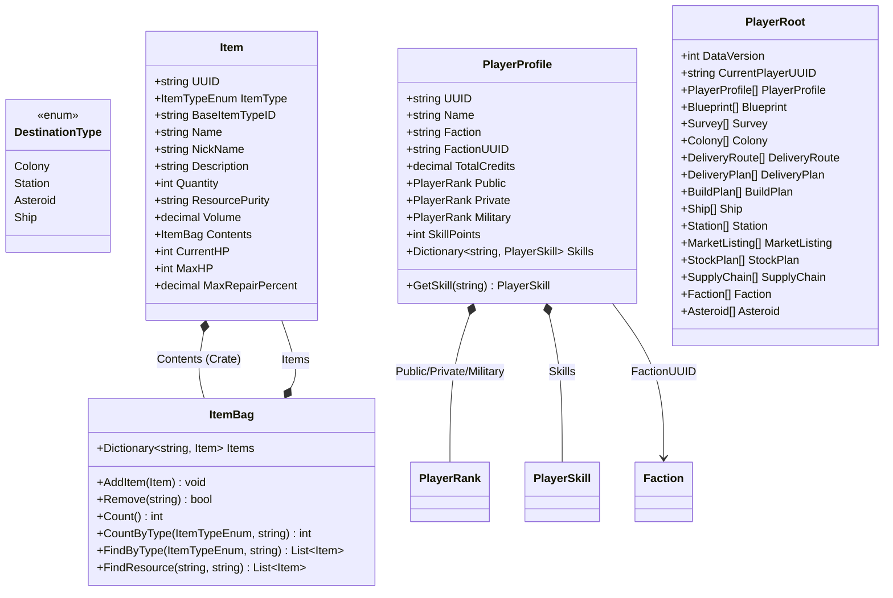

# Data Models — Shared

## Shared Enums

These enums are used across multiple models and are defined first to avoid forward references.

```csharp
public enum DestinationType
{
    Colony,
    Station,
    Asteroid,
    Ship        // Future: factory ships for manufacturing/refining/research in space
}
```

## Item Changes (Crate Support)

```csharp
// Add to existing ItemType.ItemTypeEnum:
Crate   // A container that holds other items

// Add to existing Item class:
public ItemBag Contents { get; set; }  // Non-null for Crate items, null for everything else
```

- No nesting: validation prevents adding a Crate to another Crate's Contents.
- Crates have no inherent volume/mass — purely organizational.

## Item Changes (Component Damage)

```csharp
// Add to existing Item class:
public int CurrentHP { get; set; } = 0;
public int MaxHP { get; set; } = 0;
public decimal MaxRepairPercent { get; set; } = 0m;
```

- Same three-field pattern as ShipComponentSlot. Damage transfers between inventory and ship slots.

## PlayerProfile Changes

```csharp
// Add to existing PlayerProfile:
public string FactionUUID { get; set; } = string.Empty;
```

## IsActive Pattern

Entities with `IsActive` (default `true`): BuildPlan, StockPlan, StockProfile, SupplyChain, WarehouseOverflowRule. All service methods filter to `IsActive == true`. UI shows Active/Inactive toggle. Toggling is immediate write-through.

## PlayerRoot Changes

PlayerRoot is the serialization container. PlayerContext exposes all entity lists as `IReadOnlyList<T>` properties backed by private `List<T>` fields. All mutations go through dedicated `Add{Entity}`/`Remove{Entity}` methods that maintain UUID caches inline.

```csharp
public class PlayerRoot
{
    // Existing
    public int DataVersion { get; set; }
    public string CurrentPlayerUUID { get; set; }
    public PlayerProfile[] PlayerProfile { get; set; }
    public Blueprint[] Blueprint { get; set; }
    public Survey[] Survey { get; set; }
    public Colony[] Colony { get; set; }
    public DeliveryRoute[] DeliveryRoute { get; set; }
    public DeliveryPlan[] DeliveryPlan { get; set; }
    public PricingPlan[] PricingPlan { get; set; }

    // New — all default to empty arrays
    public BuildPlan[] BuildPlan { get; set; }
    public ShipTemplate[] ShipTemplate { get; set; }
    public Ship[] Ship { get; set; }
    public Station[] Station { get; set; }
    public MarketListing[] MarketListing { get; set; }
    public MarketTransaction[] MarketTransaction { get; set; }
    public StockPlan[] StockPlan { get; set; }
    public StockProfile[] StockProfile { get; set; }
    public SupplyChain[] SupplyChain { get; set; }
    public WarehouseOverflowRule[] WarehouseOverflowRule { get; set; }
    public Faction[] Faction { get; set; }
    public ExternalCharacter[] ExternalCharacter { get; set; }
    public Asteroid[] Asteroid { get; set; }
}
```

### PlayerContext List Encapsulation

Each entity list on PlayerContext follows this pattern:

```
private List<T> _entityList;                          // private backing field
public IReadOnlyList<T> EntityList => _entityList;    // read-only public property
public void AddEntity(T item) { ... }                 // controlled mutation + inline cache update
public void RemoveEntity(T item) { ... }              // controlled mutation + inline cache update
```

All 20 PlayerContext lists and all 9 EmpireContext lists follow this pattern. See `spec/design/code-standards.md` for the full pattern specification and mutation method variants.


## Class Diagram


