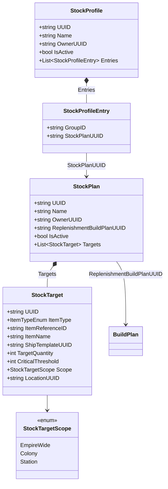

# Data Models — Stock Targets

## StockPlan & StockTarget

```csharp
public enum StockTargetScope { EmpireWide, Colony, Station }

public class StockPlan
{
    public string UUID { get; set; }
    public string Name { get; set; } = string.Empty;
    public string OwnerUUID { get; set; } = string.Empty;
    public string ReplenishmentBuildPlanUUID { get; set; } = string.Empty;
    public bool IsActive { get; set; } = true;
    public List<StockTarget> Targets { get; set; } = new List<StockTarget>();
}

public class StockTarget
{
    public string UUID { get; set; }

    [JsonConverter(typeof(StringEnumConverter))]
    public ItemType.ItemTypeEnum ItemType { get; set; } = Models.ItemType.ItemTypeEnum.None;
    public string ItemReferenceID { get; set; } = string.Empty;
    public string ItemName { get; set; } = string.Empty;
    public string ShipTemplateUUID { get; set; } = string.Empty;

    public int TargetQuantity { get; set; } = 0;
    public int CriticalThreshold { get; set; } = 0;

    [JsonConverter(typeof(StringEnumConverter))]
    public StockTargetScope Scope { get; set; } = StockTargetScope.EmpireWide;
    public string LocationUUID { get; set; } = string.Empty;
}
```

## StockProfile

```csharp
public class StockProfile
{
    public string UUID { get; set; }
    public string Name { get; set; } = string.Empty;
    public string OwnerUUID { get; set; } = string.Empty;
    public bool IsActive { get; set; } = true;
    public List<StockProfileEntry> Entries { get; set; } = new List<StockProfileEntry>();
}

public class StockProfileEntry
{
    public string GroupID { get; set; } = string.Empty;
    public string StockPlanUUID { get; set; } = string.Empty;
}
```

- Same GroupID = ORed (max). Different GroupIDs = ANDed (summed).


## Class Diagram


