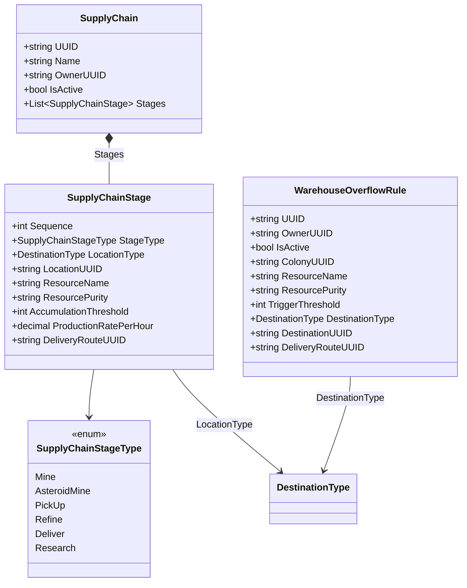

# Data Models — Supply Chains

## SupplyChain

```csharp
public class SupplyChain
{
    public string UUID { get; set; }
    public string Name { get; set; } = string.Empty;
    public string OwnerUUID { get; set; } = string.Empty;
    public bool IsActive { get; set; } = true;
    public List<SupplyChainStage> Stages { get; set; } = new List<SupplyChainStage>();
}

public enum SupplyChainStageType
{
    Mine, AsteroidMine, PickUp, Refine, Deliver, Research
}

public class SupplyChainStage
{
    public int Sequence { get; set; } = 0;

    [JsonConverter(typeof(StringEnumConverter))]
    public SupplyChainStageType StageType { get; set; }

    [JsonConverter(typeof(StringEnumConverter))]
    public DestinationType LocationType { get; set; }
    public string LocationUUID { get; set; } = string.Empty;

    public string ResourceName { get; set; } = string.Empty;
    public string ResourcePurity { get; set; } = string.Empty;

    public int AccumulationThreshold { get; set; } = 0;
    public decimal ProductionRatePerHour { get; set; } = 0m;
    public string DeliveryRouteUUID { get; set; } = string.Empty;
}
```

## WarehouseOverflowRule

```csharp
public class WarehouseOverflowRule
{
    public string UUID { get; set; }
    public string OwnerUUID { get; set; } = string.Empty;
    public bool IsActive { get; set; } = true;
    public string ColonyUUID { get; set; } = string.Empty;
    public string ResourceName { get; set; } = string.Empty;
    public string ResourcePurity { get; set; } = string.Empty;
    public int TriggerThreshold { get; set; } = 0;

    [JsonConverter(typeof(StringEnumConverter))]
    public DestinationType DestinationType { get; set; } = DestinationType.Station;
    public string DestinationUUID { get; set; } = string.Empty;
    public string DeliveryRouteUUID { get; set; } = string.Empty;
}
```


## Class Diagram


