<!-- Extracted from .kiro/specs/empire-systems/design.md, lines 3156-3430 — Data Flow Analysis & In-Memory Indexing -->
# Data Flow Analysis & In-Memory Indexing

## Existing Index Patterns

The project uses two indexing patterns established during colony form optimization:

1. **PlayerContext UUID caches** — `Dictionary<string, T>` built lazily on first lookup, invalidated on mutation. Used for `FindBlueprint`, `FindSurvey`, `FindColony`. Pattern: `lock(_listLock)` → check if null → build from list → lookup. Invalidated by `InvalidateXxxCache()` after list mutations.

2. **ItemBag secondary indexes** — `_typeIndex` (ItemType+BaseItemTypeID → items) and `_resourceIndex` (ItemType+BaseItemTypeID+Purity → items) built lazily inside `_syncRoot`, invalidated on AddItem/Remove/Clear. Enables O(1) lookup for `FindByType`, `FindResource`, `CountByType` instead of O(n) scans.

Both patterns share: lazy construction, invalidation on mutation, thread-safe access under locks, and defensive copies on read.

## Data Flow Diagrams

### Flow A: Resource Check (Iteration 1 — per background tick)

```
ResourceCheckService.ComputePlanShortfalls(plan)
  │
  ├─ for each BuildItem in plan.Items
  │    │
  │    ├─ blueprintFinder(item.BlueprintUUID)          ← PlayerContext cache: O(1)
  │    │    └─ blueprint.Resources                      ← PropertyBag: O(n) keys
  │    │
  │    ├─ resolve build location inventory:
  │    │    ├─ if Colony: colonyFinder(item.BuildLocationUUID)  ← PlayerContext cache: O(1)
  │    │    │    └─ colony.Warehouse.CountByType(resource)   ← ItemBag index: O(1)
  │    │    │    └─ colony.Warehouse.FindResource(res, pur)  ← ItemBag index: O(1)
  │    │    ├─ if Ship: shipFinder → ship.Cargo.CountByType  ← future (factory ships)
  │    │    └─ if Station: stationFinder → hold.CountByType  ← future (station mfg)
  │    │
  │    └─ commodityFinder(item.CommodityName)          ← ★ NEW: O(n) scan of CommodityList
  │         └─ commodity.ConstructionResources          ← Dictionary: O(1)
  │
  └─ return shortfalls per item
```

### Flow B: Stock Target Check (Iteration 7 — per background tick)

```
StockTargetService.CheckTargets(plans, currentPlayerUUID)
  │
  ├─ for each StockPlan
  │    ├─ for each StockTarget in plan.Targets
  │    │    │
  │    │    ├─ if ShipTemplate target:
  │    │    │    ├─ templateFinder(target.ShipTemplateUUID)  ← ★ NEW: O(n) scan
  │    │    │    └─ for each component in template:
  │    │    │         └─ blueprintFinder(comp.BlueprintUUID) ← PlayerContext cache: O(1)
  │    │    │
  │    │    ├─ if EmpireWide scope:
  │    │    │    ├─ for each colony in allColonies:          ← O(colonies)
  │    │    │    │    └─ colony.Warehouse.CountByType(item)  ← ItemBag index: O(1)
  │    │    │    └─ for each station in allStations:         ← O(stations)
  │    │    │         └─ station.Holds[playerUUID].CountByType ← O(1) dict + O(1) index
  │    │    │
  │    │    ├─ if Colony scope:
  │    │    │    └─ colonyFinder(target.LocationUUID)        ← PlayerContext cache: O(1)
  │    │    │         └─ colony.Warehouse.CountByType(item)  ← ItemBag index: O(1)
  │    │    │
  │    │    └─ if Station scope:
  │    │         └─ stationFinder(target.LocationUUID)       ← ★ NEW: O(n) scan
  │    │              └─ station.Holds[playerUUID].CountByType ← O(1) dict + O(1) index
  │    │
  │    └─ OR-pool overlapping components within this plan (max across targets)
  │
  ├─ AND/sum across plans (each plan's pooled requirements are dedicated)
  │
  └─ return shortfalls
```

### Flow C: Auto-Assign (Iteration 1 — user-triggered)

```
AutoAssignService.ProposeAssignments(plan, route)
  │
  ├─ for each stop in route.Stops:
  │    └─ resolve location by DestinationType:
  │         ├─ Colony: colonyFinder(stop.DestinationUUID)  ← PlayerContext cache: O(1)
  │         │    └─ for each structure in colony.Structures:  ← O(structures)
  │         │         └─ blueprintFinder(struct.FlatpackBPUUID) ← PlayerContext cache: O(1)
  │         ├─ Ship: shipFinder → ship structures (future)
  │         └─ Station: stationFinder → station structures (future)
  │
  ├─ for each unallocated Manufactory/Refining/Research item:
  │    └─ count blueprint copies in player's collection  ← ★ NEW: O(n) scan of BlueprintList
  │
  └─ distribute across structures (optimization loop)
```

### Flow D: Ship Build Stock Check (Iteration 2 — user-triggered)

```
ShipBuildService.GenerateShipBuildItems(template, assemblyLoc)
  │
  ├─ blueprintFinder(template.HullBlueprintUUID)        ← PlayerContext cache: O(1)
  │
  ├─ for each component in template.Components:
  │    ├─ blueprintFinder(comp.BlueprintUUID)            ← PlayerContext cache: O(1)
  │    │
  │    └─ check stock at assembly location:
  │         ├─ if Colony: colonyFinder → warehouse.CountByType  ← O(1) + O(1)
  │         └─ if Station: stationFinder → hold.CountByType     ← ★ NEW: O(n) + O(1)
  │
  └─ return build items for missing components
```

### Flow E: Market Sale Cascade (Iteration 5+7 — background tick)

```
BackgroundProcessor cascade tick:
  │
  ├─ 1. MarketService.RecordSale
  │    └─ find listing by UUID                           ← ★ NEW: O(n) scan of MarketListingList
  │
  ├─ 2. StockTargetService.CheckTargets                  ← Flow B above
  │
  ├─ 3. ResourceCheckService.ComputePlanShortfalls       ← Flow A above
  │    └─ for ALL active build plans                     ← ★ NEW: O(plans × items)
  │
  └─ 4. DeliveryGenerationService.GenerateDeliveryPlan
       └─ for each shortfall colony on route             ← O(stops × shortfalls)
```

### Flow F: Reference Counting (all iterations — on form open, selection change)

```
XxxReferenceCounter.CountReferences(uuid)
  │
  ├─ scan BuildPlanList → each plan.Items                ← ★ O(plans × items)
  ├─ scan ShipTemplateList → each template.Components    ← ★ O(templates × components)
  ├─ scan ShipList → each ship.Components                ← ★ O(ships × components)
  ├─ scan StationList → each station.Components          ← ★ O(stations × components)
  ├─ scan MarketListingList                              ← ★ O(listings)
  ├─ scan StockPlanList → each plan.Targets              ← ★ O(plans × targets)
  ├─ scan DeliveryRouteList → each route.Stops           ← O(routes × stops)
  ├─ scan DeliveryPlanList → each plan.Stops             ← O(plans × stops)
  │
  └─ return report with per-source counts
```

## Required New Indexes

Based on the data flow analysis, these lookups are on hot paths (background tick or frequent UI operations) and need O(1) indexes instead of O(n) scans.

### PlayerContext UUID Caches (same pattern as existing)

| Cache | Type | Lookup Method | Invalidation | Iteration |
|---|---|---|---|---|
| `_stationCache` | `Dictionary<string, Station>` | `FindStation(uuid)` | `InvalidateStationCache()` | 4 |
| `_shipTemplateCache` | `Dictionary<string, ShipTemplate>` | `FindShipTemplate(uuid)` | `InvalidateShipTemplateCache()` | 2 |
| `_shipCache` | `Dictionary<string, Ship>` | `FindShip(uuid)` | `InvalidateShipCache()` | 2 |
| `_buildPlanCache` | `Dictionary<string, BuildPlan>` | `FindBuildPlan(uuid)` | `InvalidateBuildPlanCache()` | 1 |
| `_asteroidCache` | `Dictionary<string, Asteroid>` | `FindAsteroid(uuid)` | `InvalidateAsteroidCache()` | 6 |
| `_factionCache` | `Dictionary<string, Faction>` | `FindFaction(uuid)` | `InvalidateFactionCache()` | 1 |
| `_marketListingCache` | `Dictionary<string, MarketListing>` | `FindMarketListing(uuid)` | `InvalidateMarketListingCache()` | 5 |

All follow the existing pattern: lazy build under `_listLock`, invalidate on list mutation.

### EmpireContext Commodity Index

| Cache | Type | Lookup Method | Invalidation | Iteration |
|---|---|---|---|---|
| `_commodityNameCache` | `Dictionary<string, Commodity>` | `FindCommodity(name)` | `InvalidateCommodityCache()` | 1 |

CommodityList is searched by name (not UUID) in ResourceCheckService for commodity build items. Currently O(n) on every resource check.

### Blueprint Copy Count Index

AutoAssignService needs to count how many copies of a specific blueprint the player owns. This is a scan of BlueprintList filtered by BluePrintType. For auto-assign across many items, this is O(items × blueprints).

| Cache | Type | Lookup Method | Invalidation | Iteration |
|---|---|---|---|---|
| `_blueprintTypeCountCache` | `Dictionary<string, int>` | `CountBlueprintsByType(blueprintType)` | `InvalidateBlueprintCache()` (piggyback) | 1 |

Key = BluePrintType, Value = count of player-owned blueprints of that type. Built alongside `_blueprintCache`.

### Station Hold Player Index

StockTargetService with EmpireWide scope iterates all stations. Per OQ-40, only the current player's hold at each station is checked (`station.Holds[currentPlayerUUID]`), which is already O(1) dictionary lookup.

| Cache | Type | Lookup Method | Invalidation | Iteration |
|---|---|---|---|---|
| Per-station: already keyed by playerUUID | `Dictionary<string, ItemBag>` | `station.Holds[playerUUID]` | N/A (already O(1)) | 4 |

Station.Holds is already a `Dictionary<string, ItemBag>` keyed by player UUID — no additional index needed. The ItemBag's internal `_typeIndex` handles item lookups within each hold.

### Build Item Indexes on BuildPlan

Reference counting and cascade processing both scan all build plans and their items. For BlueprintReferenceCounter, this means scanning every BuildItem.BlueprintUUID across all plans.

| Index | Type | Purpose | Invalidation | Iteration |
|---|---|---|---|---|
| `_blueprintBuildItemIndex` | `Dictionary<string, List<BuildItem>>` | BlueprintUUID → build items using it | Invalidate on plan save | 1 |
| `_buildLocationBuildItemIndex` | `Dictionary<string, List<BuildItem>>` | BuildLocationUUID → build items allocated there | Invalidate on plan save | 1 |

These are cross-plan indexes on PlayerContext, built lazily from all BuildPlanList items. Invalidated when any build plan is saved (via a new `InvalidateBuildItemIndexes()` method).

### Reference Counter Caching

Reference counters are called on every list population (to show the Refs column) and on every selection change (to update the Delete button). For forms with many items, this means N calls to `CountReferences`, each scanning multiple lists.

Strategy: Reference counters should pre-compute a `Dictionary<string, int>` mapping entity UUID → total reference count for the entire list in one pass, rather than computing per-item on demand. The form calls `BuildReferenceMap()` once during list population and looks up counts from the map.

```csharp
// Pattern for all reference counters:
public Dictionary<string, int> BuildReferenceMap()
{
    var map = new Dictionary<string, int>();
    // Single pass through all referencing collections
    // Increment map[referencedUUID] for each reference found
    return map;
}

// Form usage:
var refMap = counter.BuildReferenceMap();
foreach (var item in items)
{
    int refs = refMap.TryGetValue(item.UUID, out var count) ? count : 0;
    // Set Refs column
}
```

This changes reference counting from O(items × sources) to O(sources) + O(items) — one pass to build the map, one pass to populate the list.

## Index Lifecycle Summary

```mermaid
graph TD
    subgraph "PlayerContext Caches (under _listLock)"
        BC[_blueprintCache<br/>UUID → Blueprint]
        SC[_surveyCache<br/>UUID → Survey]
        CC[_colonyCache<br/>UUID → Colony]
        STC[_stationCache<br/>UUID → Station]
        SHC[_shipCache<br/>UUID → Ship]
        SHTC[_shipTemplateCache<br/>UUID → ShipTemplate]
        BPC[_buildPlanCache<br/>UUID → BuildPlan]
        AC[_asteroidCache<br/>UUID → Asteroid]
        FC[_factionCache<br/>UUID → Faction]
        MLC[_marketListingCache<br/>UUID → MarketListing]
        CMC[_commodityNameCache<br/>Name → Commodity]
        BTCC[_blueprintTypeCountCache<br/>Type → Count]
    end

    subgraph "Cross-Entity Indexes (under _listLock)"
        BBI[_blueprintBuildItemIndex<br/>BlueprintUUID → BuildItems]
        CBI[_buildLocationBuildItemIndex<br/>BuildLocationUUID → BuildItems]
    end

    subgraph "Per-Entity Indexes (under _syncRoot)"
        TI["ItemBag._typeIndex<br/>(Type,BaseID) → Items"]
        RI["ItemBag._resourceIndex<br/>(Type,BaseID,Purity) → Items"]
    end

    MUT[List Mutation] -->|invalidate| BC
    MUT -->|invalidate| SC
    MUT -->|invalidate| CC
    MUT -->|invalidate| STC
    MUT -->|invalidate| SHC
    MUT -->|invalidate| SHTC
    MUT -->|invalidate| BPC
    MUT -->|invalidate| AC
    MUT -->|invalidate| FC
    MUT -->|invalidate| MLC
    MUT -->|invalidate| CMC
    MUT -->|invalidate| BTCC
    MUT -->|invalidate| BBI
    MUT -->|invalidate| CBI

    IMUT[ItemBag Add/Remove] -->|invalidate| TI
    IMUT -->|invalidate| RI
```



All caches are lazy (built on first access after invalidation) and thread-safe (built under the appropriate lock). The invalidation cost is O(1) (set to null). The rebuild cost is O(n) on next access but amortized across many lookups.
