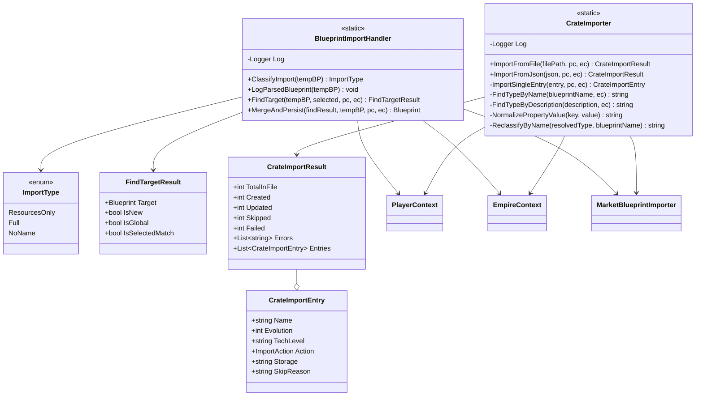

<!-- Extracted from spec/design/services.md — Blueprint domain -->
# Services — Blueprints

## BlueprintImportHandler

Static service in Services/BlueprintImportHandler.cs.

```csharp
public static class BlueprintImportHandler
{
    public static ImportType ClassifyImport(Blueprint tempBP);
    public static FindTargetResult FindTarget(Blueprint tempBP, Blueprint selected, PlayerContext pc, EmpireContext ec);
    public static Blueprint MergeAndPersist(FindTargetResult findResult, Blueprint tempBP, PlayerContext pc, EmpireContext ec);
}
```

Logic:
- ClassifyImport: ResourcesOnly (has resources but no properties/type), Full (has name), NoName (fallback).
- FindTarget: checks selected blueprint match first (Name+Evolution+Type), then dedup via MarketBlueprintImporter.FindByDedupKey. Routes Evo0→global, others→player.
- MergeAndPersist: updates existing or creates new with deterministic UUID (global) or random UUID (player), persists, fires event.

## CrateImporter

Static service in Services/CrateImporter.cs.

```csharp
public static class CrateImporter
{
    public static CrateImportResult ImportFromFile(string filePath, PlayerContext pc, EmpireContext ec);
    public static CrateImportResult ImportFromJson(string json, PlayerContext pc, EmpireContext ec);
}
```

Logic:
- Imports blueprints from a JSON file produced by the OE2 Blueprint Scraper browser console script.
- Each JSON entry contains name, evolution, techLevel, description, iconClass, properties, and resources scraped from the game UI.
- Parses each entry into a temporary Blueprint, applies property key remapping (same as BlueprintScanner), normalizes values.
- Routes via MarketBlueprintImporter.IsGlobalRoute (Evo0→global, others→player).
- Dedup via MarketBlueprintImporter.FindByDedupKey; updates existing or creates new.
- Persists once at the end (batch save), fires BlueprintDataChanged event.
- Blueprint type resolved via name-based classification (ReclassifyByName). Icon CSS class stored as `_IconClass` property for future mapping.


## Class Diagram


