# Client Services

Design documentation for the remote faction server client infrastructure (Req 11: Client Connectivity, Req 16: Data Portability).

## Overview

The `Client/` folder contains infrastructure classes for communicating with the Remote Faction Service. These classes handle HTTP connectivity, offline queuing, and synchronization.

The typed client layer (`IFactionServerTypedClient` / `FactionServerTypedClient`) in `OE2EmpireTracker.Common/Client/FactionServer/` provides a fully-typed replacement for the raw-JSON `RemoteFactionClient`. All method parameters and return types use domain model classes — no raw JSON strings in the public API surface.

## Classes

### IFactionServerTypedClient

Strongly-typed client interface for the Faction Server API. One async method per endpoint, returning typed domain objects. Located in `OE2EmpireTracker.Common/Client/FactionServer/IFactionServerTypedClient.cs`.

Implements `IDisposable`. Exposes an `IsConnected` property.

#### Methods (29 total)

**Server Administration (4 methods):**
- `CheckHealthAsync()` → `bool`
- `GetFactionsAsync()` → `ServerFaction[]`
- `GetCharactersAsync()` → `ServerCharacter[]`
- `CreateCharacterAsync(name, uuid?)` → `void`

**Sync and Export (2 methods):**
- `GetSyncSnapshotAsync()` → `SyncResponse`
- `ExportCharacterDataAsync(characterUUID)` → `PlayerRoot`

**Data Mutation (4 methods):**
- `UploadBaselineAsync(baseline)` → `void`
- `BulkImportAsync(characterUUID, data)` → `BulkImportResult`
- `GetSharingRulesAsync(characterUUID)` → `SharingRuleDto[]`
- `PutSharingRulesAsync(characterUUID, rules)` → `void`

**Per-Entity Collection GET Methods (19 methods):**
- `GetColoniesAsync(characterUUID)` → `Colony[]`
- `GetBlueprintsAsync(characterUUID)` → `Blueprint[]`
- `GetSurveysAsync(characterUUID)` → `Survey[]`
- `GetPlayerProfilesAsync(characterUUID)` → `PlayerProfile[]`
- `GetDeliveryRoutesAsync(characterUUID)` → `DeliveryRoute[]`
- `GetDeliveryPlansAsync(characterUUID)` → `DeliveryPlan[]`
- `GetShipsAsync(characterUUID)` → `Ship[]`
- `GetShipTemplatesAsync(characterUUID)` → `ShipTemplate[]`
- `GetMarketListingsAsync(characterUUID)` → `MarketListing[]`
- `GetMarketTransactionsAsync(characterUUID)` → `MarketTransaction[]`
- `GetPricingPlansAsync(characterUUID)` → `PricingPlan[]`
- `GetStockPlansAsync(characterUUID)` → `StockPlan[]`
- `GetStockProfilesAsync(characterUUID)` → `StockProfile[]`
- `GetBuildPlansAsync(characterUUID)` → `BuildPlan[]`
- `GetSupplyChainsAsync(characterUUID)` → `SupplyChain[]`
- `GetAsteroidsAsync(characterUUID)` → `Asteroid[]`
- `GetStationsAsync(characterUUID)` → `Station[]`
- `GetFactionContactsAsync(characterUUID)` → `Faction[]`
- `GetExternalCharactersAsync(characterUUID)` → `ExternalCharacter[]`

All methods accept an optional `CancellationToken` parameter.

### FactionServerTypedClient

HTTP implementation of `IFactionServerTypedClient`. Located in `OE2EmpireTracker.Common/Client/FactionServer/FactionServerTypedClient.cs`.

#### Constructor Parameters

| Parameter | Type | Description |
|---|---|---|
| `serverUrl` | `string` | Base URL (trailing slash trimmed) |
| `bearerToken` | `SecureString` | API bearer token, disposed with client |
| `trustedThumbprint` | `string` (optional) | SHA-256 cert thumbprint for pinning |
| `timeout` | `TimeSpan?` (optional) | Request timeout (default: 5 min, no min/max bounds) |

#### Key Behaviors

- **Certificate pinning:** When `trustedThumbprint` is configured, only the thumbprint is checked — standard CA validation is bypassed. Mismatch rejects immediately.
- **Rate limiting:** Semaphore-based, 60 requests/minute default. Token released after 60 seconds (sliding window approximation). `ApplyRateLimit(int)` allows dynamic adjustment from any source without bounds validation.
- **Typed exceptions:** HTTP 400 → `FactionValidationException` (parsed errors) or `FactionServerException` (fallback); HTTP 403 → `FactionAuthorizationException`; network failures → `FactionConnectionException`.
- **Serialization:** Uses Newtonsoft.Json for all serialization/deserialization. Server uses System.Text.Json with camelCase; client sends PascalCase (server is case-insensitive for deserialization). Responses parsed with `[JsonProperty("camelName")]` attributes.
- **Disposal:** Disposes SecureString (zeroed), HttpClient, and SemaphoreSlim. Safe to call multiple times.

### RemoteFactionClient

**Legacy** — HTTP client that communicates with the Remote Faction Service API using raw JSON strings. Being replaced by `IFactionServerTypedClient` for all new code. Handles:
- Bearer-token authentication on all requests
- Self-signed certificate pinning via thumbprint validation
- Connection status tracking with events
- Health checks, CRUD operations, sync snapshots, and data export

### SyncManager

Coordinates data flow between local storage and the remote server. Depends on `IFactionServerTypedClient` (migrating from `RemoteFactionClient`):
- Write-through: when local data changes, also writes to server via `BulkImportAsync`
- Offline queuing: when disconnected, queues changes for later
- Queue flushing: on reconnection, replays queued changes via bulk import
- Operating mode awareness (LocalOnly, ServerOnly, ServerAndLocal)
- Raises `SyncValidationFailed` event (via `SyncValidationFailedEventArgs`) when server returns HTTP 400
- Retry logic: exponential backoff on `FactionConnectionException`, immediate fail on `FactionAuthorizationException`, validation errors surfaced without retry

**Migration note:** SyncManager is transitioning from `RemoteFactionClient` (raw JSON) to `IFactionServerTypedClient` (typed domain objects). During transition both may coexist; new code should use the typed interface.

### OfflineQueue

Persists queued data changes to `%LOCALAPPDATA%\OE2EmpireTracker\offline-queue.json`:
- Enqueue/dequeue changes
- Persist to and load from disk
- Survives application restarts

### QueuedChange

Data class representing a single queued change:
- CharacterUUID, DataType, Json payload, QueuedUtc timestamp

### OperatingMode

Enum defining data access modes:
- `LocalOnly` — no server connection
- `ServerOnly` — all reads/writes go to server
- `ServerAndLocal` — dual-write (server primary, local backup)

### ServerConnectionSettings

Settings POCO for the remote server connection:
- ServerUrl, ProtectedBearerToken (DPAPI base64 blob), TrustedThumbprint
- Mode (OperatingMode)

### ServerContext

Singleton that holds the remote server infrastructure instances on application startup:
- Provides access to RemoteFactionClient, SyncManager, and OfflineQueue
- Initialized via `ServerContext.Initialize()` in MainWindow constructor
- No-op when OperatingMode is LocalOnly or ServerUrl is empty
- If connection fails on startup, logs warning and continues offline
- Implements IDisposable to clean up RemoteFactionClient resources

### CredentialStore

Static utility class providing DPAPI-based encryption for sensitive credentials:
- `Protect(string)` — encrypts plain text using DPAPI (CurrentUser scope), returns base64 blob
- `Unprotect(string)` — decrypts DPAPI blob to SecureString
- `SecureStringToString(SecureString)` — briefly converts SecureString to plain text for HTTP header use

Uses `System.Security.Cryptography.ProtectedData` with `DataProtectionScope.CurrentUser` so only the current Windows user can decrypt stored tokens. Addresses CodeQL alert cs/cleartext-storage-of-sensitive-information.

### ConnectionStatusChangedEventArgs

Event args for connection status change notifications:
- IsConnected flag, human-readable Message

### PushEventArgs

Event args for push events received via WebSocket (Req 18):
- EventType (Created, Updated, Deleted, TimerTick, MembershipChanged, etc.)
- EntityType (Colony, Blueprint, Character, etc.)
- EntityUUID, CharacterUUID, Timestamp

### RealtimeModeChangedEventArgs

Event args for real-time mode changes (Req 18 Fallback):
- IsRealtime flag (true = WebSocket, false = polling)

### SharingRuleDto

Data transfer object for sharing rules. Located in `OE2EmpireTracker.Common/Client/FactionServer/DTOs/SharingRuleDto.cs` (shared between WinForms and server):
- Id — unique identifier of the sharing rule
- OwnerCharacterUUID — UUID of the character who owns the shared data
- TargetUUID — UUID of the target (character or faction) the data is shared with
- TargetType — target type (Character, Faction, Public)
- DataType — data type being shared (colonies, blueprints, surveys)
- EntityUUID — UUID of the specific entity being shared

All properties use `[JsonProperty]` for Newtonsoft.Json serialization matching the server API contract.

## Class Diagram

```mermaid
classDiagram
    class IFactionServerTypedClient {
        <<interface>>
        +bool IsConnected
        +CheckHealthAsync() Task~bool~
        +GetFactionsAsync() Task~ServerFaction[]~
        +GetCharactersAsync() Task~ServerCharacter[]~
        +CreateCharacterAsync(name, uuid?) Task
        +GetSyncSnapshotAsync() Task~SyncResponse~
        +ExportCharacterDataAsync(characterUUID) Task~PlayerRoot~
        +UploadBaselineAsync(baseline) Task
        +BulkImportAsync(characterUUID, data) Task~BulkImportResult~
        +GetSharingRulesAsync(characterUUID) Task~SharingRuleDto[]~
        +PutSharingRulesAsync(characterUUID, rules) Task
        +GetColoniesAsync(characterUUID) Task~Colony[]~
        +GetBlueprintsAsync(characterUUID) Task~Blueprint[]~
        +GetSurveysAsync(characterUUID) Task~Survey[]~
        +GetPlayerProfilesAsync(characterUUID) Task~PlayerProfile[]~
        +GetDeliveryRoutesAsync(characterUUID) Task~DeliveryRoute[]~
        +GetDeliveryPlansAsync(characterUUID) Task~DeliveryPlan[]~
        +GetShipsAsync(characterUUID) Task~Ship[]~
        +GetShipTemplatesAsync(characterUUID) Task~ShipTemplate[]~
        +GetMarketListingsAsync(characterUUID) Task~MarketListing[]~
        +GetMarketTransactionsAsync(characterUUID) Task~MarketTransaction[]~
        +GetPricingPlansAsync(characterUUID) Task~PricingPlan[]~
        +GetStockPlansAsync(characterUUID) Task~StockPlan[]~
        +GetStockProfilesAsync(characterUUID) Task~StockProfile[]~
        +GetBuildPlansAsync(characterUUID) Task~BuildPlan[]~
        +GetSupplyChainsAsync(characterUUID) Task~SupplyChain[]~
        +GetAsteroidsAsync(characterUUID) Task~Asteroid[]~
        +GetStationsAsync(characterUUID) Task~Station[]~
        +GetFactionContactsAsync(characterUUID) Task~Faction[]~
        +GetExternalCharactersAsync(characterUUID) Task~ExternalCharacter[]~
        +Dispose() void
    }

    class FactionServerTypedClient {
        -string _serverUrl
        -SecureString _bearerToken
        -string _trustedThumbprint
        -TimeSpan _timeout
        -HttpClient _httpClient
        -SemaphoreSlim _rateLimiter
        -int _rateLimitRequestsPerMinute
        +bool IsConnected
        +FactionServerTypedClient(serverUrl, bearerToken, trustedThumbprint?, timeout?)
        +ApplyRateLimit(requestsPerMinute) void
        +Dispose() void
    }


    class RemoteFactionClient {
        -Logger Log
        -string _serverUrl
        -SecureString _bearerToken
        -string _trustedThumbprint
        -HttpClient _httpClient
        -ClientWebSocket _webSocket
        +bool IsConnected
        +bool IsRealtimeMode
        +int PollingIntervalSeconds
        +event ConnectionStatusChanged
        +event EventReceived
        +event RealtimeModeChanged
        +RemoteFactionClient(serverUrl, bearerToken, trustedThumbprint)
        +TryConnectAsync() Task~bool~
        +Disconnect() void
        +CheckHealthAsync() Task~bool~
        +ConnectWebSocketAsync() Task
        +DisconnectWebSocketAsync() Task
        +GetFactionsAsync() Task~string~
        +GetCharactersAsync() Task~string~
        +GetCharacterDataAsync(characterUUID, dataType) Task~string~
        +UploadCharacterDataAsync(characterUUID, dataType, json) Task
        +GetSyncSnapshotAsync() Task~string~
        +ExportCharacterDataAsync(characterUUID) Task~string~
        +Dispose() void
    }

    class SyncManager {
        -Logger Log
        -IFactionServerTypedClient _typedClient
        -OfflineQueue _offlineQueue
        +OperatingMode Mode
        +bool IsOnline
        +bool DivergenceDetected
        +int QueuedChangeCount
        +bool ServerProcessingActive
        +string LastSyncTimestamp
        +SyncManager(typedClient, offlineQueue)
        +SyncOnStartupAsync() Task
        +PullFullSyncAsync() Task
        +WriteToServerAsync(characterUUID, dataType, json) Task
        +QueueOfflineChange(characterUUID, dataType, json) void
        +HandleReconnectionAsync() Task
        +ResolveUploadLocalAsync() Task
        +ResolveDownloadServerAsync() Task
        +FlushOfflineQueueAsync() Task
    }

    class OfflineQueue {
        -Logger Log
        -string _queueFilePath
        -List~QueuedChange~ _changes
        +int Count
        +OfflineQueue()
        +OfflineQueue(queueFilePath)
        +Enqueue(change) void
        +GetAll() IReadOnlyList~QueuedChange~
        +Remove(change) void
        +Clear() void
        +Save() void
        +Load() void
    }

    class QueuedChange {
        +string CharacterUUID
        +string DataType
        +string Json
        +DateTime QueuedUtc
    }

    class ServerContext {
        -Logger Log
        -ServerContext _instance$
        +RemoteFactionClient Client
        +IFactionServerTypedClient TypedClient
        +SyncManager SyncManager
        +OfflineQueue OfflineQueue
        +OperatingMode Mode
        +ServerContext Instance$
        +Initialize()$ void
        +Reset()$ void
        +Dispose() void
    }

    class CredentialStore {
        <<static>>
        +Protect(plainText) string
        +Unprotect(protectedBase64) SecureString
        +SecureStringToString(value) string
    }

    class ServerConnectionSettings {
        +string ServerUrl
        +string ProtectedBearerToken
        +string TrustedThumbprint
        +OperatingMode Mode
    }

    class OperatingMode {
        <<enum>>
        LocalOnly
        ServerOnly
        ServerAndLocal
    }


    class ConnectionStatusChangedEventArgs {
        +bool IsConnected
        +string Message
    }

    class PushEventArgs {
        +string EventType
        +string EntityType
        +string EntityUUID
        +string CharacterUUID
        +string Timestamp
    }

    class RealtimeModeChangedEventArgs {
        +bool IsRealtime
    }

    FactionServerTypedClient ..|> IFactionServerTypedClient : implements
    FactionServerTypedClient --|> IDisposable : implements
    ServerContext --o RemoteFactionClient : holds (legacy)
    ServerContext --o IFactionServerTypedClient : holds
    ServerContext --o SyncManager : holds
    ServerContext --o OfflineQueue : holds
    ServerContext --> OperatingMode : uses
    SyncManager --> IFactionServerTypedClient : uses
    SyncManager --> OfflineQueue : uses
    SyncManager --> OperatingMode : uses
    OfflineQueue --o QueuedChange : contains
    RemoteFactionClient --> ConnectionStatusChangedEventArgs : fires
    RemoteFactionClient --> PushEventArgs : fires
    RemoteFactionClient --> RealtimeModeChangedEventArgs : fires
    ServerConnectionSettings --> OperatingMode : uses
    ServerContext ..> CredentialStore : uses
    ServerContext ..> ServerConnectionSettings : reads
    RemoteFactionClient --|> IDisposable : implements
    ServerContext --|> IDisposable : implements
```

