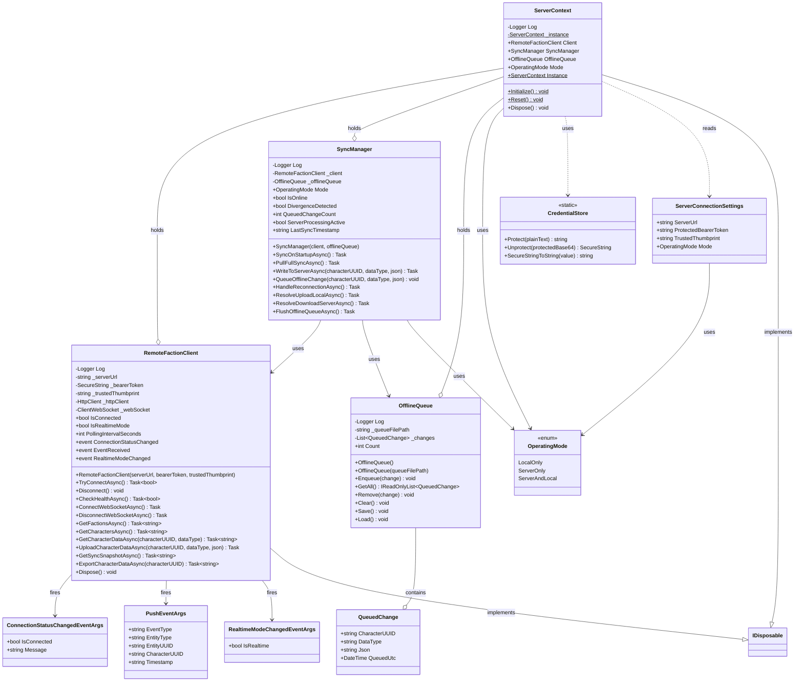

# Client Services

Design documentation for the remote faction server client infrastructure (Req 11: Client Connectivity, Req 16: Data Portability).

## Overview

The `Client/` folder contains infrastructure classes for communicating with the Remote Faction Service. These classes handle HTTP connectivity, offline queuing, and synchronization.

## Classes

### RemoteFactionClient

HTTP client that communicates with the Remote Faction Service API. Handles:
- Bearer-token authentication on all requests
- Self-signed certificate pinning via thumbprint validation
- Connection status tracking with events
- Health checks, CRUD operations, sync snapshots, and data export

### SyncManager

Coordinates data flow between local storage and the remote server:
- Write-through: when local data changes, also writes to server
- Offline queuing: when disconnected, queues changes for later
- Queue flushing: on reconnection, replays queued changes
- Operating mode awareness (LocalOnly, ServerOnly, ServerAndLocal)

### OfflineQueue

Persists queued data changes to `%LOCALAPPDATA%\OE2EmpireTracker\offline-queue.json`:
- Enqueue/dequeue changes
- Persist to and load from disk
- Survives application restarts

### QueuedChange

Data class representing a single queued change:
- CharacterUUID, DataType, Json payload, QueuedUtc timestamp

### OperatingMode

Enum defining data access modes:
- `LocalOnly` — no server connection
- `ServerOnly` — all reads/writes go to server
- `ServerAndLocal` — dual-write (server primary, local backup)

### ServerConnectionSettings

Settings POCO for the remote server connection:
- ServerUrl, ProtectedBearerToken (DPAPI base64 blob), TrustedThumbprint
- Mode (OperatingMode)

### ServerContext

Singleton that holds the remote server infrastructure instances on application startup:
- Provides access to RemoteFactionClient, SyncManager, and OfflineQueue
- Initialized via `ServerContext.Initialize()` in MainWindow constructor
- No-op when OperatingMode is LocalOnly or ServerUrl is empty
- If connection fails on startup, logs warning and continues offline
- Implements IDisposable to clean up RemoteFactionClient resources

### CredentialStore

Static utility class providing DPAPI-based encryption for sensitive credentials:
- `Protect(string)` — encrypts plain text using DPAPI (CurrentUser scope), returns base64 blob
- `Unprotect(string)` — decrypts DPAPI blob to SecureString
- `SecureStringToString(SecureString)` — briefly converts SecureString to plain text for HTTP header use

Uses `System.Security.Cryptography.ProtectedData` with `DataProtectionScope.CurrentUser` so only the current Windows user can decrypt stored tokens. Addresses CodeQL alert cs/cleartext-storage-of-sensitive-information.

### ConnectionStatusChangedEventArgs

Event args for connection status change notifications:
- IsConnected flag, human-readable Message

### PushEventArgs

Event args for push events received via WebSocket (Req 18):
- EventType (Created, Updated, Deleted, TimerTick, MembershipChanged, etc.)
- EntityType (Colony, Blueprint, Character, etc.)
- EntityUUID, CharacterUUID, Timestamp

### RealtimeModeChangedEventArgs

Event args for real-time mode changes (Req 18 Fallback):
- IsRealtime flag (true = WebSocket, false = polling)

## Class Diagram

