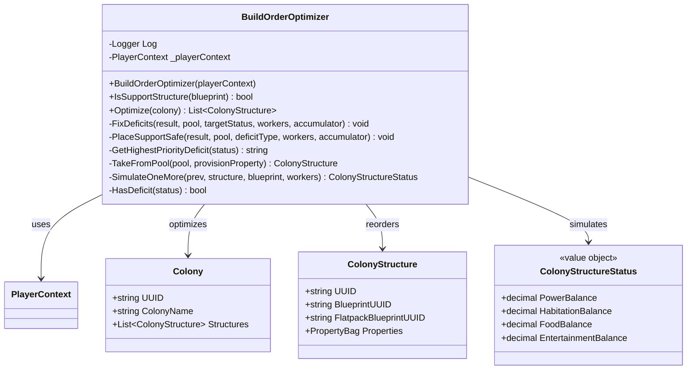

<!-- Extracted from spec/design/services.md — Colony domain -->
# Services — Colony

## BuildOrderOptimizer

Service in `Services/BuildOrderOptimizer.cs`.

Reorders colony structures so Power, Habitation, Food, and Entertainment constraints are satisfied at every build step after the first primary structure.

**Algorithm:**
1. Classify structures as Support (power/hab/food/ent providers + CC) or Primary (everything else).
2. Bootstrap: seed with CC, Reactor, Hab Block, Hydroponics Bay, Entertainment Centre.
3. For each primary: fix existing deficits, look ahead for future deficits (primary + hab + hydro), pre-place support, then place the primary.
4. Append leftover support, fixing deficits as each is added.

**Incremental simulation:** Maintains a running `ColonyStructureStatus` accumulator updated via `SimulateOneMore` (O(1)) each time a structure is appended. Look-ahead projections use `SimulateOneMore` against the accumulator without modifying it. Overall complexity: O(n) where n = output structure count.

**Key methods:**
- `Optimize(Colony colony)` → `List<ColonyStructure>` — main entry point
- `IsSupportStructure(Blueprint blueprint)` → `bool` — classification
- `FixDeficits(result, pool, targetStatus, workers, ref accumulator)` — deficit resolution loop (private)
- `PlaceSupportSafe(result, pool, deficitType, workers, ref accumulator)` — recursive support placement (private)
- `SimulateOneMore(prev, structure, blueprint, workers)` → `ColonyStructureStatus` — O(1) delta computation (private)

Satisfies: REQ-COL-095 through REQ-COL-095g

## Class Diagram

