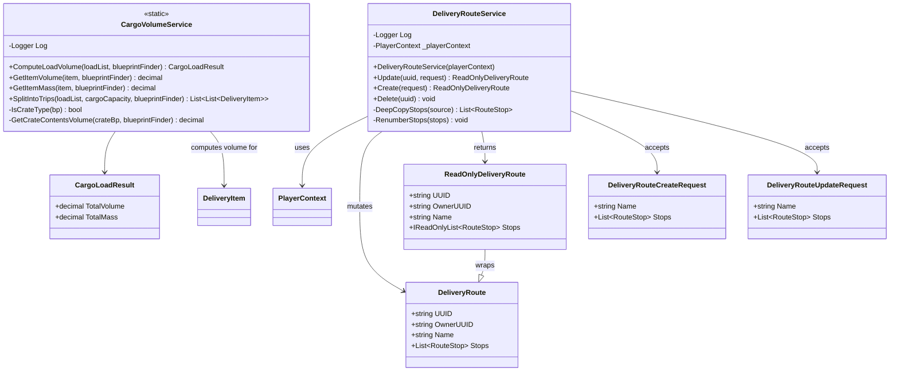

<!-- Extracted from spec/design/services.md — Delivery domain -->
# Services — Delivery

## CargoVolumeService

Static service in Services/CargoVolumeService.cs.

```csharp
public static class CargoVolumeService
{
    public static CargoLoadResult ComputeLoadVolume(
        List<DeliveryItem> loadList,
        Func<string, Blueprint> blueprintFinder);

    public static List<List<DeliveryItem>> SplitIntoTrips(
        List<DeliveryItem> loadList,
        decimal cargoCapacity,
        Func<string, Blueprint> blueprintFinder);
}
```

Logic:
- ComputeLoadVolume sums per-item volume × quantity. Volume by type: Resource=1, Commodity=10, WorkDetail=50, Blueprint/Survey=0, manufactured items=CargoVolumeSize property from blueprint.
- Crate items use the crate blueprint's own Cargo Volume Size (one-level, no nesting).
- SplitIntoTrips distributes items across trips within a cargo capacity limit. Items are assigned in order; oversized items get their own trip.

## DeliveryRouteService

Instance service in Services/DeliveryRouteService.cs. Sole mutator of DeliveryRoute entities (create, update, delete). Uses DeliveryRouteCreateRequest and DeliveryRouteUpdateRequest DTOs.

Logic:
- Update: looks up mutable entity via FindMutableDeliveryRoute, applies Name, replaces Stops list with deep copy, persists via WriteContext(), fires DeliveryDataChanged, returns ReadOnlyDeliveryRoute.
- Create: creates new DeliveryRoute with generated UUID, sets OwnerUUID from current player, populates Name and Stops from request, adds to PlayerContext, persists, fires event.
- Delete: looks up entity, removes from PlayerContext, persists, fires event. Returns silently if UUID empty or not found.

Satisfies: REQ-DEL (see .kiro/specs/bl-112-deliveryroute-readonly/requirements.md)

## Class Diagram


