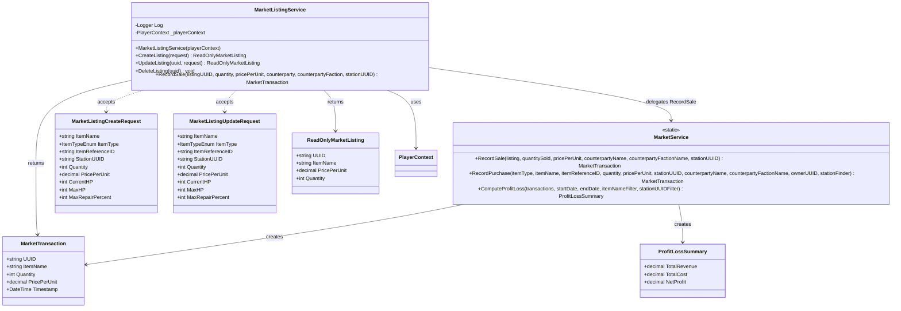

<!-- Extracted from spec/design/services.md — Market domain -->
# Services — Market

## MarketService (Iteration 5)

Static service in `Services/MarketService.cs`.

```csharp
public static class MarketService
{
    public static MarketTransaction RecordSale(
        MarketListing listing, int quantitySold, decimal pricePerUnit,
        string counterpartyName, string counterpartyFactionName, string stationUUID);
    public static MarketTransaction RecordPurchase(
        ItemType.ItemTypeEnum itemType, string itemName, string itemReferenceID,
        int quantity, decimal pricePerUnit, string stationUUID,
        string counterpartyName, string counterpartyFactionName,
        string ownerUUID, Func<string, Station> stationFinder);
    public static ProfitLossSummary ComputeProfitLoss(
        IEnumerable<MarketTransaction> transactions,
        DateTime? startDate = null, DateTime? endDate = null,
        string itemNameFilter = null, string stationUUIDFilter = null);
}
```

## MarketListingService (BL-114)

Instance service in `Services/MarketListingService.cs`. Sole mutator of MarketListing entities.
Uses MarketListingCreateRequest and MarketListingUpdateRequest DTOs for input.

```csharp
public class MarketListingService
{
    public MarketListingService(PlayerContext playerContext);
    public ReadOnlyMarketListing CreateListing(MarketListingCreateRequest request);
    public ReadOnlyMarketListing UpdateListing(string uuid, MarketListingUpdateRequest request);
    public void DeleteListing(string uuid);
    public MarketTransaction RecordSale(string listingUUID, int quantity,
        decimal pricePerUnit, string counterparty, string counterpartyFaction, string stationUUID);
}
```

## Class Diagram


