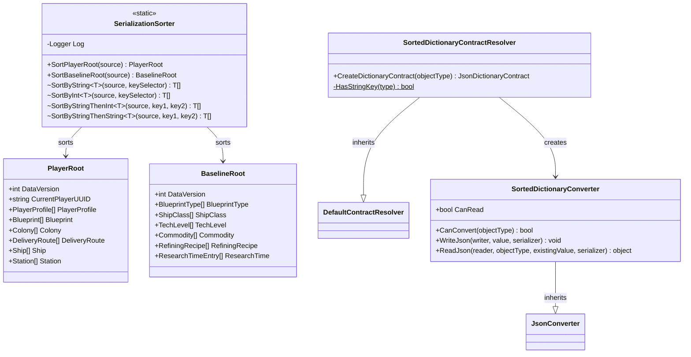

<!-- Extracted from spec/design/services.md — Serialization domain -->
# Services — Serialization

## SerializationSorter

Static helper in Services/SerializationSorter.cs.

```csharp
public static class SerializationSorter
{
    public static PlayerRoot SortPlayerRoot(PlayerRoot source);
    public static BaselineRoot SortBaselineRoot(BaselineRoot source);
    internal static T[] SortByString<T>(T[] source, Func<T, string> keySelector);
    internal static T[] SortByInt<T>(T[] source, Func<T, int> keySelector);
    internal static T[] SortByStringThenInt<T>(T[] source, Func<T, string> key1, Func<T, int> key2);
    internal static T[] SortByStringThenString<T>(T[] source, Func<T, string> key1, Func<T, string> key2);
}
```

Logic:
- SortPlayerRoot creates a new PlayerRoot with all 20 top-level arrays sorted by UUID (ordinal string), then sorts nested arrays on their respective keys (Colony.Structures by UUID, Colony.Commodities by Name, DeliveryRoute.Stops by Sequence, etc.).
- SortBaselineRoot creates a new BaselineRoot with arrays sorted by primary key (BlueprintType.Id, ShipClass.Id, TechLevel.Name, Commodity.ID, RefiningRecipe.OutputResource, ResearchTimeEntry.Evolution).
- Sort helpers return new arrays; null input returns empty array. Null keys coalesced to empty string (sort first).
- Called by WriteContext() methods before JSON serialization to produce deterministic output.

Satisfies: REQ-JSON-ORDER (see .kiro/specs/json-deterministic-order/requirements.md)

## SortedDictionaryContractResolver

Custom contract resolver in Services/SortedDictionaryContractResolver.cs.

```csharp
public class SortedDictionaryContractResolver : DefaultContractResolver
{
    protected override JsonDictionaryContract CreateDictionaryContract(Type objectType);
}
```

Logic:
- Overrides `CreateDictionaryContract` to attach a `SortedDictionaryConverter` to all `Dictionary<string, T>` types.
- The converter serializes dictionary entries with keys sorted in ascending ordinal string order (`StringComparer.Ordinal`).
- Deserialization is unaffected (`CanRead => false`).
- Registered in `JsonSettings.SerializerSettings` as the default contract resolver.
- Does not affect `ItemBag` which has its own `[JsonConverter]` attribute.

Satisfies: REQ-JSON-ORDER (see .kiro/specs/json-deterministic-order/requirements.md)


## Class Diagram


