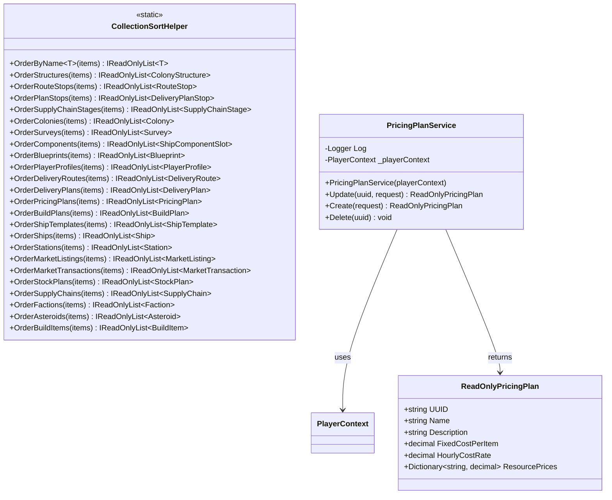

<!-- Extracted from spec/design/services.md — Shared/Cross-cutting domain -->
# Services — Shared

## CollectionSortHelper

Static helper in Services/CollectionSortHelper.cs.

```csharp
public static class CollectionSortHelper
{
    // Generic name-based sort for any INamed entity
    public static IReadOnlyList<T> OrderByName<T>(IEnumerable<T> items) where T : INamed;

    // Domain-specific sort methods — each returns a new sorted IReadOnlyList<T>
    public static IReadOnlyList<ColonyStructure> OrderStructures(IEnumerable<ColonyStructure> items);
    public static IReadOnlyList<RouteStop> OrderRouteStops(IEnumerable<RouteStop> items);
    public static IReadOnlyList<DeliveryPlanStop> OrderPlanStops(IEnumerable<DeliveryPlanStop> items);
    public static IReadOnlyList<SupplyChainStage> OrderSupplyChainStages(IEnumerable<SupplyChainStage> items);
    public static IReadOnlyList<Colony> OrderColonies(IEnumerable<Colony> items);
    public static IReadOnlyList<Survey> OrderSurveys(IEnumerable<Survey> items);
    public static IReadOnlyList<ShipComponentSlot> OrderComponents(IEnumerable<ShipComponentSlot> items);
    public static IReadOnlyList<Blueprint> OrderBlueprints(IEnumerable<Blueprint> items);
    // ... plus 20+ additional Order* methods for every domain collection
}
```

Logic:
- Pure static utility — no state, no side effects, no logger needed.
- Each method accepts an `IEnumerable<T>`, applies a domain-appropriate sort key (Name, Sequence, Timestamp, etc.), and returns a new `IReadOnlyList<T>`.
- Centralizes all collection ordering so that UI and service code never sort inline. Data model collections are unordered bags; sorting happens at consumption via this helper.
- Null-safe: null inputs return empty lists; null sort keys coalesced to empty string or zero.

Satisfies: REQ-DATA-ORDER (see .kiro/specs/data-model-ordering-invariant/requirements.md)

## PricingPlanService

Instance service in `Services/PricingPlanService.cs`. Sole mutator of PricingPlan entities (create, update, delete). Follows the same pattern as BlueprintService and PlayerProfileService from BL-108/BL-111.

```csharp
public class PricingPlanService
{
    public PricingPlanService(PlayerContext playerContext);
    public ReadOnlyPricingPlan Update(string uuid, PricingPlanUpdateRequest request);
    public ReadOnlyPricingPlan Create(PricingPlanCreateRequest request);
    public void Delete(string uuid);
}
```

Logic:
- Update: looks up mutable entity via `FindMutablePricingPlan`, applies all scalar fields and ResourcePrices, persists via `WriteContext()`, fires `PricingDataChanged`, returns `ReadOnlyPricingPlan`.
- Create: creates new PricingPlan with generated UUID, sets OwnerUUID from current player, populates fields, adds to PlayerContext, persists, fires event.
- Delete: looks up entity, removes from PlayerContext, persists, fires event. Returns silently if UUID empty or not found.

Satisfies: REQ-PRC (see .kiro/specs/bl-123-pricingplan-readonly/requirements.md)


## Class Diagram


