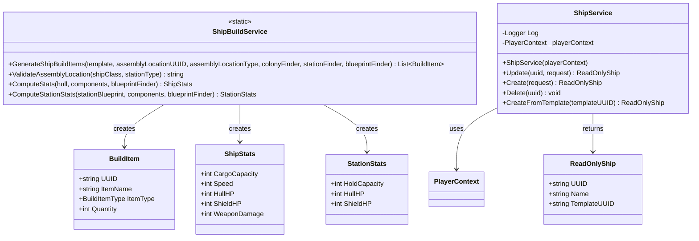

<!-- Extracted from spec/design/services.md — Ship domain -->
# Services — Ships

## ShipBuildService (Iteration 2)

Static service in `Services/ShipBuildService.cs`.

```csharp
public static class ShipBuildService
{
    public static List<BuildItem> GenerateShipBuildItems(
        ShipTemplate template,
        string assemblyLocationUUID, DestinationType assemblyLocationType,
        Func<string, Colony> colonyFinder,
        Func<string, Station> stationFinder,
        Func<string, Blueprint> blueprintFinder);

    public static string ValidateAssemblyLocation(int shipClass, StationType stationType);

    public static ShipStats ComputeStats(
        Blueprint hull, IEnumerable<ShipComponentSlot> components,
        Func<string, Blueprint> blueprintFinder);

    public static StationStats ComputeStationStats(
        Blueprint stationBlueprint, IEnumerable<ShipComponentSlot> components,
        Func<string, Blueprint> blueprintFinder);
}
```

See [data-models.md](../data-models.md) for ShipStats and StationStats class definitions.

## Class Diagram


